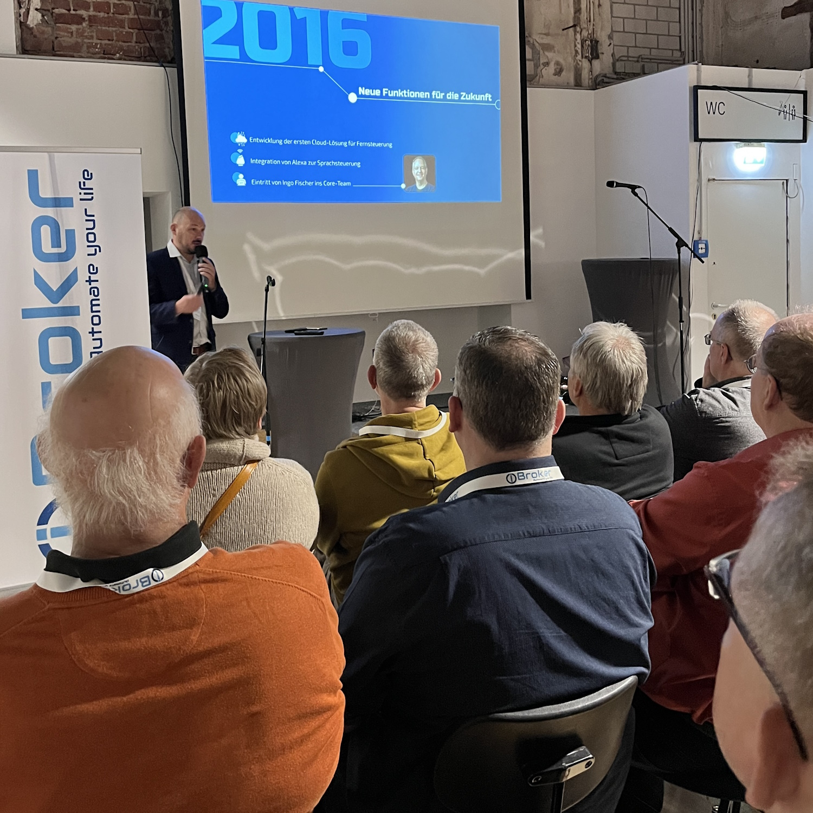
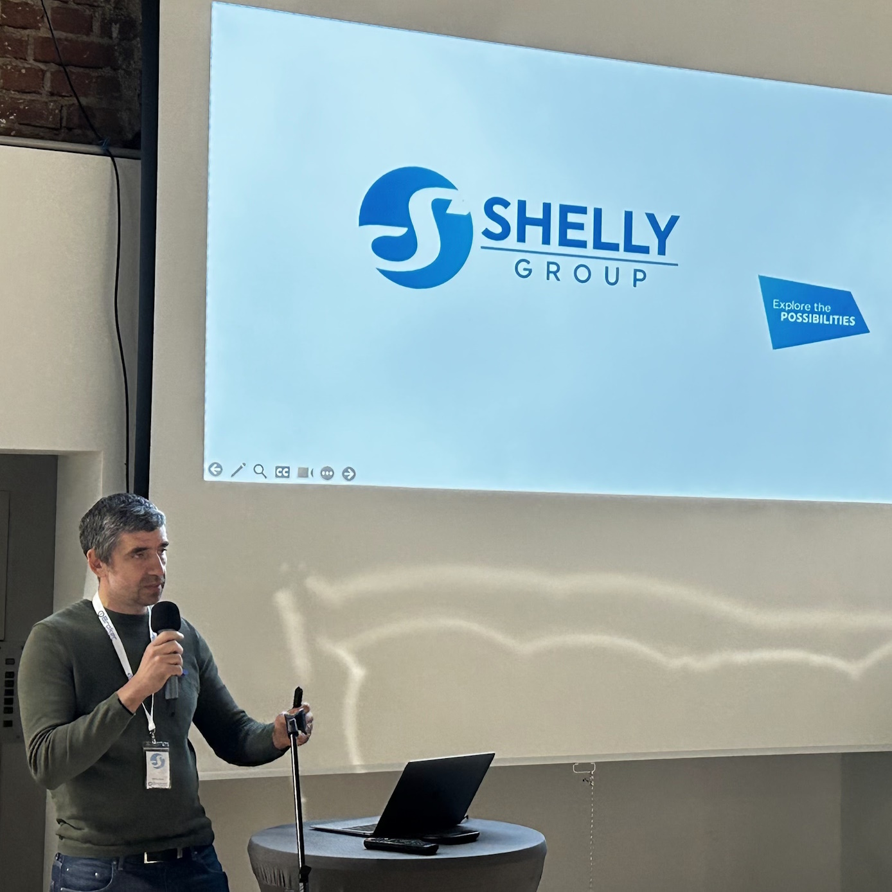
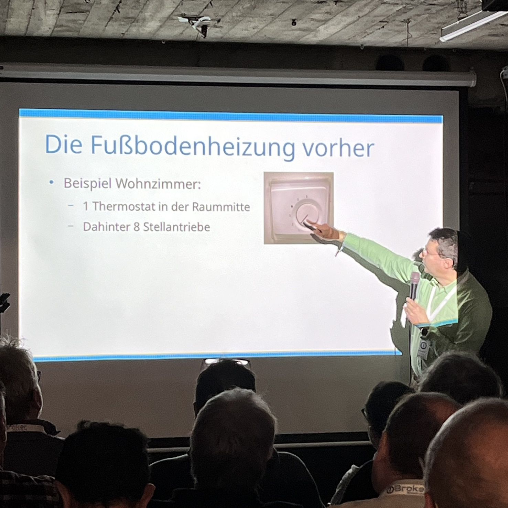
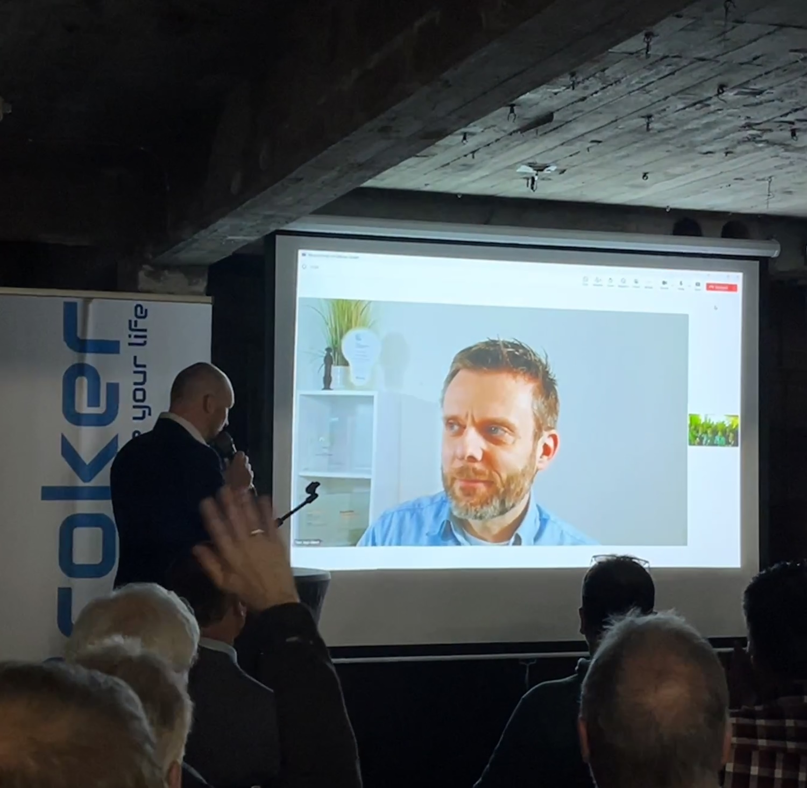
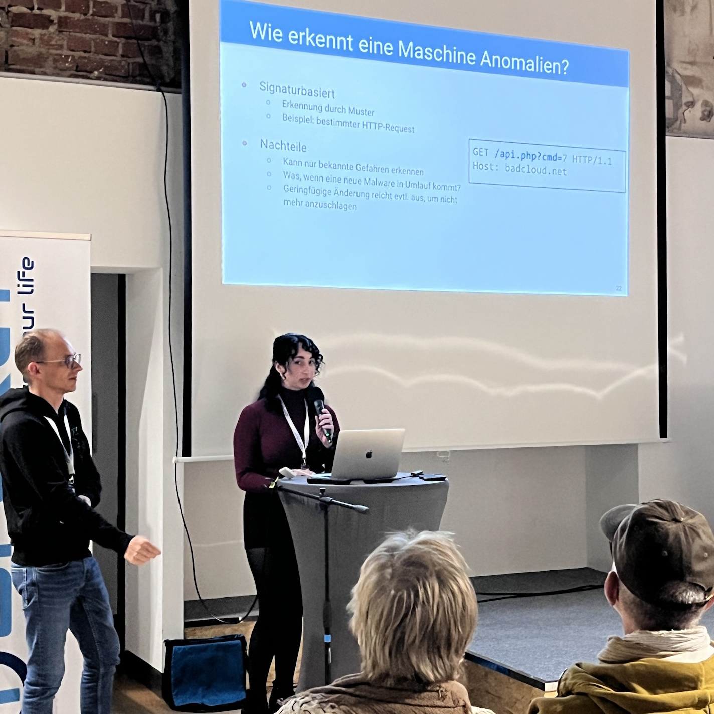
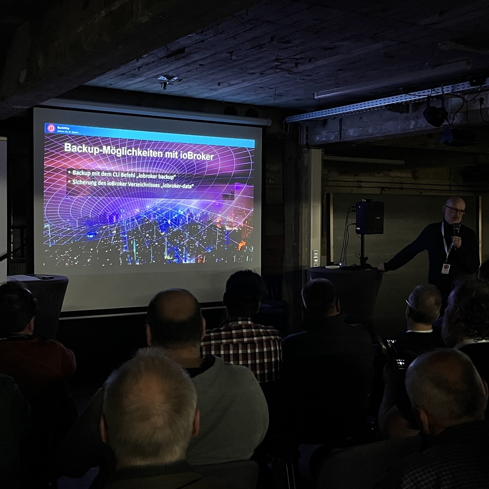
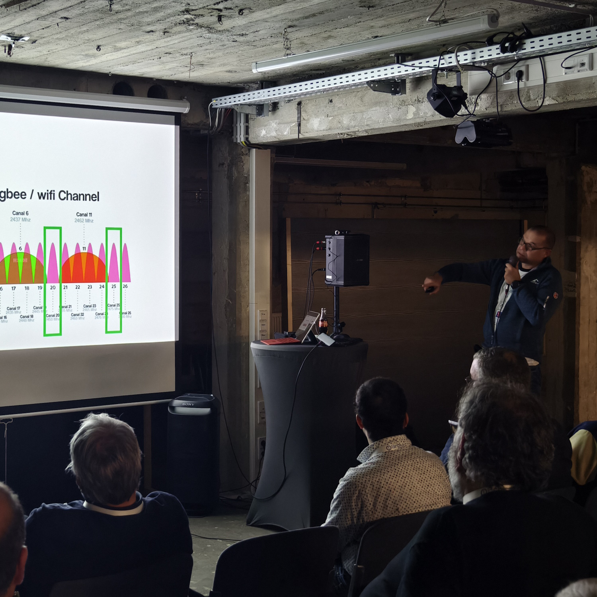
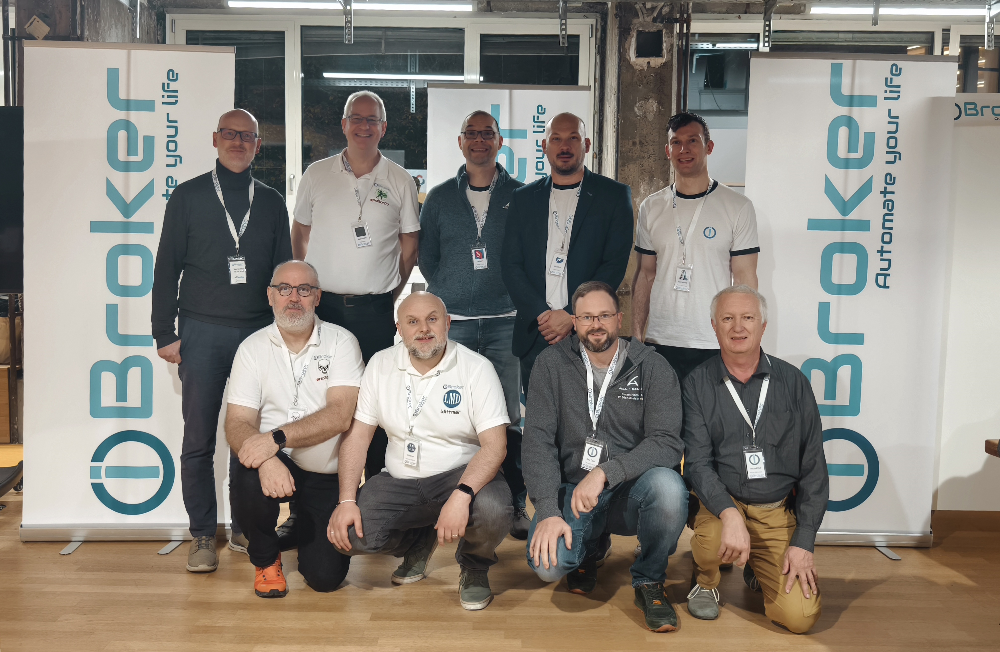

# Rückblick auf das Community-Treffen zum 10-jährigen ioBroker Jubiläum
Am 11. November 2024 war es endlich soweit: Das erste große ioBroker Community-Treffen fand in der "Gläsernen Werkstatt" in Solingen statt. Einige Monate intensiver Planung und Organisation haben sich ausgezahlt – das Event war ein voller Erfolg.

## Organisation und Dank an die Community
Dieses Treffen markierte nicht nur ein wichtiges Ereignis in der Geschichte des ioBroker-Projekts, sondern unterstrich auch die Stärke und den Enthusiasmus unserer Community. 
Als Open-Source-Projekt lebt ioBroker von der Unterstützung und dem Engagement der Nutzer – und genau das hat sich auch bei der Organisation des Treffens gezeigt.

Ein besonderer Dank gilt Ingo Fischer (apollon77), der als zentraler Organisator dieses Treffen mit Herzblut geplant hat, sowie dem gesamten Orga-Team, 
bestehend aus Arthur @arteck, Eric @Eric2905, Lissandro @ldittmar81, Moritz @foxriver76, Olga @shadowbit21 und Rafal @DutchmannNL. 
Ohne euch wäre dieses Event nicht möglich gewesen! Ebenso möchten wir uns herzlich bei Solingen Digital für die großartige Unterstützung und bei Shelly als Hauptsponsor bedanken.
Vor Kurzem hat Ingo einen ReCap mit seinen persönlichen Eindrücken im ioBroker-Forum verfasst. Wer noch mehr über das Event erfahren möchte, kann seinen Bericht hier nachlesen: [ein kleiner ReCap von Ingo](https://forum.iobroker.net/topic/78056/iobroker-10-jahres-community-treffen-ein-kleiner-recap).

## Teilnehmer, Vorträge und Highlights

Die Veranstaltung war mit rund 160 Teilnehmern gut besucht – darunter viele bekannte Namen aus der Community. 
Aufgrund der begrenzten Kapazität der Räumlichkeiten und aus Sicherheitsgründen konnte die Teilnehmerzahl nicht weiter erhöht werden. 
Dennoch war das Interesse überwältigend, und die Tickets waren schnell ausverkauft.

Von Anfang an herrschte eine offene und herzliche Atmosphäre. Viele freuten sich, endlich die Gesichter hinter den Nicknames und Projekten zu sehen, und es gab zahlreiche Gelegenheiten für persönliche Gespräche und Austausch.

Das Programm war prall gefüllt:

12 spannende Vorträge wurden auf zwei Slots verteilt. 
Besonders erfreulich war, dass auch technisch anspruchsvolle Themen ein breites Publikum fanden.

- Denis Haev (ioBroker GmbH) @Bluefox - "2013-2024: Die Geschichte von ioBroker" 
- Nils Gerken (Solingen Digital) - Begrüßung
- Mircho Mirev (Shelly Group) - "Smarthome mit Shelly und ioBroker" (Englisch)
- Andy Walter @HansJochen - "Live aus dem Maschinenraum - Heizungsregelung mit ioBroker"
- Ingo Fischer @Apollon77 - "Matter - schöne neue Smart Home Welt?"
- Christopher Beye @cbeye - "Sonnenenergie intelligent nutzen: KI-Agenten und ioBroker als Ihre Energiesparberater"
- Marc Jäger (Jaeger Wohn- & Gebäudeintelligenz) - "Next-Level Visualisierung: Die Revolution für ioBroker"
- Moritz Heusinger @foxriver76 und Alexander Müller (Haustechnik Fleck) - "ioBroker in der Haustechnik: Innovative Einsatzszenarien für den gewerblichen Bereich"
- Institut für Internetsicherheit / Westfällische Hochschule Gelsenkirchen - "KISSHome: Wer kontrolliert dein Smart Home?"
- Marcel Kunze @simatec - "(ioBroker) Backup - aber richtig!"
- Rafal Drozda @DutchmanNL - "ioBroker im professionalen Bereich- habt ihr das gewusst?"
- Arthur Rupp @arteck - "Zigbee - was funkt mir dazwischen oder "ein Überblick"
- ioBroker Core-Team - "Einblick in die ioBroker Core-Entwicklung und Fragen an das Core-Team"

Der Referent Dr. Marc Jäger konnte aus familiären Gründen kurzfristig nicht persönlich anwesend sein. 
Dank des gut organisierten Streaming-Setups konnte er seinen Vortrag jedoch live aus der Ferne halten. Die Umsetzung funktionierte reibungslos und kam bei den Teilnehmern hervorragend an.

Einige Vorträge wurden auch aus dem Erdgeschoss ins Untergeschoss übertragen.

Auch der Hauptsponsor Shelly sorgte mit einer kleinen Überraschung für Begeisterung: 
Jeder Teilnehmer konnte ein Geschenkpaket gegen eine freiwillige Spende erhalten.

Die Mischung aus fundierten Vorträgen, interaktiven Diskussionen und persönlichem Austausch machte das Treffen zu einem unvergesslichen Erlebnis für alle Beteiligten.

## Feedback und Impressionen
Das Feedback der Teilnehmer war sehr positiv. Besonders geschätzt wurde die Gelegenheit, mit den „Helden“ hinter ioBroker ins Gespräch zu kommen, Fragen zu stellen und ihre Arbeit besser kennenzulernen. Das direkte Kennenlernen zwischen Entwicklern und Nutzern war für viele ein Highlight.

Auch das Publikum zeigte sich hochmotiviert: Die Vorträge regten zu spannenden Diskussionen an, und die Q&A-Runde mit dem Core-Team war informativ und lebendig.

## Ein Blick in die Zukunft
Nach dem Erfolg dieses ersten Treffens wird es in den kommenden Wochen eine strukturierte Feedback-Umfrage unter den Teilnehmern geben. 
Wir möchten wissen, was besonders gut ankam und wo noch Potenzial für künftige Events liegt. 

Wir danken allen, die dabei waren, für ihre Begeisterung und ihr Engagement. Gemeinsam haben wir gezeigt, wie stark die ioBroker-Community ist.

Auf das nächste Treffen freuen wir uns schon jetzt – bis dahin bleibt ioBroker euer zuverlässiger Partner für Home Automation!

Euer Team der ioBroker GmbH

 
