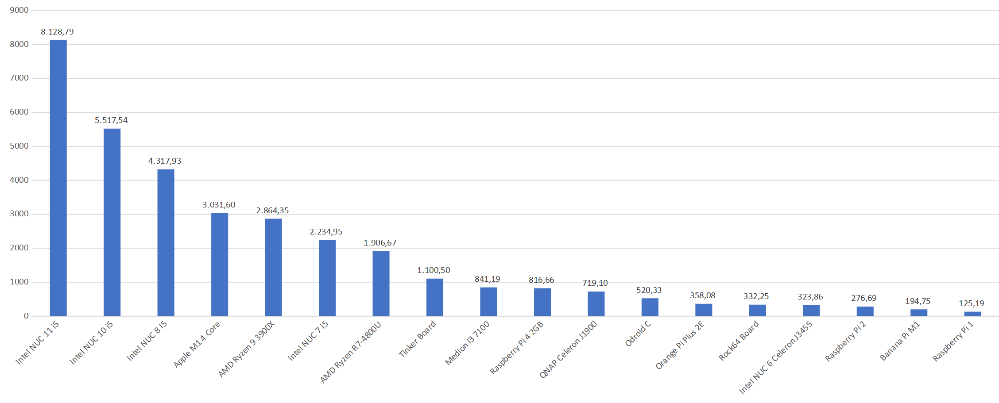

### Уважаемые пользователи ioBroker!
<!-- SOURCE: 925872 ### Уважаемые пользователи ioBroker! -->
В ответ на популярные запросы мы решили опубликовать результаты нашей встречи разработчиков здесь, в блоге. В будущем мы будем создавать как минимум одну новую запись каждый месяц. Вы можете найти исходный отчет о встрече в [здесь](https://forum.iobroker.net/topic/49502/meeting-f%C3%BCr-iobroker-core-dev-admin-15-12-21-20-30).
<!-- SOURCE: 722873 В ответ на популярные запросы мы решили опубликовать результаты нашей встречи разработчиков здесь, в блоге. В будущем мы будем создавать как минимум одну новую запись каждый месяц. Вы можете найти исходный отчет о встрече в §§LLLLL_0§§. -->

## Безопасность в сети
<!-- SOURCE: 761725 ## Безопасность в сети -->
Прежде всего, мы хотели бы прокомментировать тему Log4j - некоторые пользователи выразили опасения по поводу безопасности системы. Но вы все можете вздохнуть с облегчением, потому что брешь в безопасности в Log4j затрагивает только системы Java, а ioBroker основан на JavaScript - у обоих языков нет ничего общего, кроме первых 4 букв.
<!-- SOURCE: 535019 Прежде всего, мы хотели бы прокомментировать тему Log4j - некоторые пользователи выразили опасения по поводу безопасности системы. Но вы все можете вздохнуть с облегчением, потому что брешь в безопасности в Log4j затрагивает только системы Java, а ioBroker основан на JavaScript - у обоих языков нет ничего общего, кроме первых 4 букв. -->

Но есть одна проблема, которая затрагивает всех нас. Не только ioBroker, но и все системы по всему миру, а именно перенаправление портов. Это должно быть известно, потому что мы снова и снова предупреждаем, что вам не следует использовать переадресацию портов, чтобы иметь возможность подключиться к ioBroker или любой другой системе на ходу. С ужасом снова и снова обнаруживать, что пользователи довольно открыто используют системы в сети. Злоумышленники могут очень легко найти такие системы и взять под контроль домашнюю автоматизацию. Используйте безопасное соединение VPN, SSL и безопасные пароли, а если вы не уверены на 100%, что делать, воспользуйтесь нашим [безопасное облачное решение](https://iobroker.pro/www/). Это избавит вас от грубого пробуждения.
<!-- SOURCE: 91768 Но есть одна проблема, которая затрагивает всех нас. Не только ioBroker, но и все системы по всему миру, а именно перенаправление портов. Это должно быть известно, потому что мы снова и снова предупреждаем, что вам не следует использовать переадресацию портов, чтобы иметь возможность подключиться к ioBroker или любой другой системе на ходу. С ужасом снова и снова обнаруживать, что пользователи довольно открыто используют системы в сети. Злоумышленники могут очень легко найти такие системы и взять под контроль домашнюю автоматизацию. Используйте безопасное соединение VPN, SSL и безопасные пароли, а если вы не уверены на 100%, что делать, воспользуйтесь нашим §§LLLLL_0§§. Это избавит вас от грубого пробуждения. -->

## Статистика
<!-- SOURCE: 559944 ## Статистика -->
Число зарегистрированных ioBroker [Установки выросли по всему миру](https://www.iobroker.net/#de/statistics) увеличилось примерно до 62 000. Большинство из них находится в немецкоязычных странах, но Россия и Нидерланды также выросли. Есть еще большой потенциал для переводов, и любой, у кого есть время и энергия, может помочь. Просто перейдите на https://weblate.iobroker.net/, создайте учетную запись или войдите в Github и начните перевод.
<!-- SOURCE: 119072 Число зарегистрированных ioBroker §§LLLLL_0§§ увеличилось примерно до 62 000. Большинство из них находится в немецкоязычных странах, но Россия и Нидерланды также выросли. Есть еще большой потенциал для переводов, и любой, у кого есть время и энергия, может помочь. Просто перейдите на https://weblate.iobroker.net/, создайте учетную запись или войдите в Github и начните перевод. -->

Обновление до Node.js 14 продолжается, но большинство пользователей все еще используют версию 12.x, что не так уж плохо, потому что она будет поддерживаться в течение некоторого времени. Но если у вас версия меньше 12, она должна быть обновлена в ближайшее время, потому что новый JS Controller 4 больше не будет поддерживать старые версии.
<!-- SOURCE: 301481 Обновление до Node.js 14 продолжается, но большинство пользователей все еще используют версию 12.x, что не так уж плохо, потому что она будет поддерживаться в течение некоторого времени. Но если у вас версия меньше 12, она должна быть обновлена в ближайшее время, потому что новый JS Controller 4 больше не будет поддерживать старые версии. -->

Сейчас ioBroker предлагает 443 различных адаптера, 363 из которых доступны в стабильной ветви. Из [Список желаний](https://github.com/ioBroker/AdapterRequests) сообщества 44 находятся в разработке и скоро будут готовы. : grinning: Здесь могут принять участие все желающие, добавив новые пожелания или проголосовав за существующие. Разработчики, ищущие новую задачу, могут выбрать проект из списка.
<!-- SOURCE: 77685 Сейчас ioBroker предлагает 443 различных адаптера, 363 из которых доступны в стабильной ветви. Из §§LLLLL_0§§ сообщества 44 находятся в разработке и скоро будут готовы. : grinning: Здесь могут принять участие все желающие, добавив новые пожелания или проголосовав за существующие. Разработчики, ищущие новую задачу, могут выбрать проект из списка. -->

ioBroker также представлен в популярных социальных сетях, и количество пользователей неуклонно растет. Будет ли страница [Форум] (https://forum.iobroker.net/), [Facebook] (https://www.facebook.com/groups/440499112958264), [Discord] (https://discord.gg/vmVYqPV) или Telegram , пользователи могут обмениваться идеями повсюду. Наш [Facebook International](https://www.facebook.com/groups/iobrokerinternational) для всех англоговорящих пользователей по всему миру.
<!-- SOURCE: 836925 ioBroker также представлен в популярных социальных сетях, и количество пользователей неуклонно растет. Будет ли страница §§LLLLL_0§§ для всех англоговорящих пользователей по всему миру. -->

## Тесты
<!-- SOURCE: 759895 ## Тесты -->
Мы протестировали несколько систем с новым адаптером для тестов, и вот результаты:
<!-- SOURCE: 155262 Мы протестировали несколько систем с новым адаптером для тестов, и вот результаты: -->

<!-- SOURCE: 284651 §§IIIII_0§§ -->

Это хороший помощник для всех, кто все еще ищет подходящее оборудование для ioBroker. Для испытаний в системе моделировались обычные процессы и определялась средняя скорость. Как видите, процессоры Intel лучше всего подходят для построения очень больших систем. Однако для обычного пользователя вполне достаточно Raspberry 3 или 4.
<!-- SOURCE: 816615 Это хороший помощник для всех, кто все еще ищет подходящее оборудование для ioBroker. Для испытаний в системе моделировались обычные процессы и определялась средняя скорость. Как видите, процессоры Intel лучше всего подходят для построения очень больших систем. Однако для обычного пользователя вполне достаточно Raspberry 3 или 4. -->

## JS-Controller 4.x (предварительная версия)
<!-- SOURCE: 874670 ## JS-Controller 4.x (предварительная версия) -->
Мы впервые познакомились с новым контроллером JS, и в нем многое было улучшено. Во-первых, поддержка Node.JS 10.x будет прекращена, и пользователям следует выполнить обновление до текущей версии 14.x. Кроме того, многое было вложено в оптимизацию системы, которая во многих случаях сделает систему быстрее. Также позаботились о безопасности, потому что теперь пароли должны соответствовать определенному правилу сложности. К началу января планируется выпустить первую тестовую версию. Если вы хотите получить более подробную информацию обо всех улучшениях, вы можете прочитать [здесь](https://github.com/ioBroker/ioBroker.js-controller/blob/master/CHANGELOG.md) все об этом.
<!-- SOURCE: 315423 Мы впервые познакомились с новым контроллером JS, и в нем многое было улучшено. Во-первых, поддержка Node.JS 10.x будет прекращена, и пользователям следует выполнить обновление до текущей версии 14.x. Кроме того, многое было вложено в оптимизацию системы, которая во многих случаях сделает систему быстрее. Также позаботились о безопасности, потому что теперь пароли должны соответствовать определенному правилу сложности. К началу января планируется выпустить первую тестовую версию. Если вы хотите получить более подробную информацию обо всех улучшениях, вы можете прочитать §§LLLLL_0§§ все об этом. -->

## Адаптер администратора
<!-- SOURCE: 352628 ## Адаптер администратора -->
Адаптер администратора будет иметь несколько небольших расширений. Во-первых, начиная с версии 5.2.x с JS-Controller 4.x, вы сможете выбрать несколько репозиториев одновременно и, кроме того, лицензии (VIS, KNX, LCN, IOT) будут автоматически извлекаться из сеть в будущем.
<!-- SOURCE: 336284 Адаптер администратора будет иметь несколько небольших расширений. Во-первых, начиная с версии 5.2.x с JS-Controller 4.x, вы сможете выбрать несколько репозиториев одновременно и, кроме того, лицензии (VIS, KNX, LCN, IOT) будут автоматически извлекаться из сеть в будущем. -->

## Образ Docker
<!-- SOURCE: 15527 ## Образ Docker -->
Доступна новая версия образа Docker с Node.JS 14. Желающие могут получить дополнительную информацию в [здесь](https://hub.docker.com/r/buanet/iobroker/).
<!-- SOURCE: 755504 Доступна новая версия образа Docker с Node.JS 14. Желающие могут получить дополнительную информацию в §§LLLLL_0§§. -->

## Адаптер Shelly
<!-- SOURCE: 585145 ## Адаптер Shelly -->
Популярный [Адаптер Shelly](https://github.com/iobroker-community-adapters/ioBroker.shelly) находится в стадии доработки, и его версия 5 доступна для тестирования. Здесь требуется как минимум Node.JS 12.
<!-- SOURCE: 540247 Популярный §§LLLLL_0§§ находится в стадии доработки, и его версия 5 доступна для тестирования. Здесь требуется как минимум Node.JS 12. -->

## Новые адаптеры
<!-- SOURCE: 942453 ## Новые адаптеры -->
Опубликована стабильная версия нового [Адаптеры контроллеров Homekit](https://github.com/Apollon77/ioBroker.homekit-controller). Это дает возможность управлять устройствами с логотипом «работает с HomeKit» напрямую через ioBroker. Адаптер поддерживает устройства WLAN и Bluetooth и может полностью работать в локальной сети (то есть без облака).
<!-- SOURCE: 403152 Опубликована стабильная версия нового §§LLLLL_0§§. Это дает возможность управлять устройствами с логотипом «работает с HomeKit» напрямую через ioBroker. Адаптер поддерживает устройства WLAN и Bluetooth и может полностью работать в локальной сети (то есть без облака). -->

## Заключительные слова
<!-- SOURCE: 356298 ## Заключительные слова -->
Перед Рождеством и концом года наша команда хотела бы воспользоваться возможностью, чтобы поблагодарить вас за отличное сотрудничество в этом году! Желаем всем пользователям ioBroker счастливых праздников и счастливого Нового года! Следующее заседание намечено на 19 января. Дополнительную информацию можно найти в [здесь](https://forum.iobroker.net/topic/50325/meeting-f%C3%BCr-iobroker-core-dev-admin-19-01-22-20-30) ...
<!-- SOURCE: 350528 Перед Рождеством и концом года наша команда хотела бы воспользоваться возможностью, чтобы поблагодарить вас за отличное сотрудничество в этом году! Желаем всем пользователям ioBroker счастливых праздников и счастливого Нового года! Следующее заседание намечено на 19 января. Дополнительную информацию можно найти в §§LLLLL_0§§ ... -->