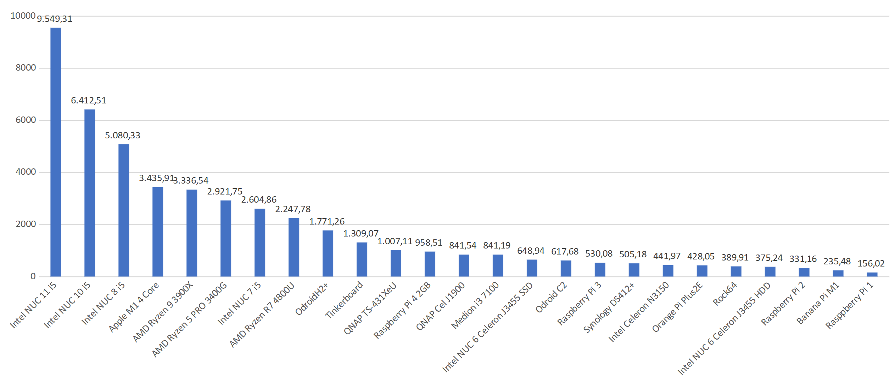

尊敬的 ioBroker 用户，应广大用户的要求，我们决定在博客上发布我们开发者会议的结果。将来，我们将每月至少创建一个新条目。
<!-- SOURCE: 932700 Liebe ioBroker Nutzer:innen, auf vielfachen Wunsch haben wir beschlossen die Ergebnisse unseres Entwickler-Meetings hier im Blog publik zu machen. Künftig werden wir jedem Monat mindestens einen neuen Eintrag erstellen. -->

会议的原始摘要可在[这里](https://forum.iobroker.net/topic/49502/meeting-f%C3%BCr-iobroker-core-dev-admin-15-12-21-20-30)中找到。
<!-- SOURCE: 722873 Die originale Zusammenfassung des Meetings findet ihr §§LLLLL_0§§. -->

＃＃ 网络安全
<!-- SOURCE: 761725 ## Sicherheit im Netz -->
首先，我们想对 Log4j 主题发表评论——一些用户表达了对系统安全性的担忧。不过大家可以松一口气了，因为 Log4j 中的漏洞只影响 Java 系统，而 ioBroker 是基于 JavaScript 的——这两种语言除了前 4 个字母外没有任何共同之处。
<!-- SOURCE: 535019 Erstmal möchten uns zum Theme Log4j äußern - einige User haben Bedenken zur Sicherheit des Systems geäußert. Ihr könnt aber alle aufatmen, denn die Sicherheitslücke bei Log4j betrifft nur Java Systeme und ioBroker basiert auf JavaScript - beide Sprachen haben nichts gemeinsam, außer die ersten 4 Buchstaben. -->

但是有一个问题会影响我们所有人。不只是 ioBroker，而是全球所有系统——即端口转发。应该知道，因为我们一再警告您不应该使用端口转发来访问 ioBroker 或任何移动中的系统。看到用户公开使用在线系统总是令人震惊。攻击者可以很容易地找到此类系统并控制家庭自动化。请使用安全的 VPN 连接、SSL 和安全密码，如果您不能 100% 确定该怎么做，请使用我们的 [安全的云解决方案](https://iobroker.pro/www/)。因此，您免于被粗鲁地唤醒。
<!-- SOURCE: 91768 Es gibt aber ein Problem, das uns alle betrifft. Nicht nur ioBroker, sondern alle Systeme weltweit - und zwar Portweiterleitungen. Es dürfte bekannt sein, denn wir warnen ja immer wieder davor, dass man keine Portweiterleitung nutzen soll, um ioBroker oder irgendwelche Systeme von unterwegs aus erreichen zu können. Mit Erschrecken muss man immer wieder feststellen, dass Anwender die Systeme ganz offen im Netz nutzen. Angreifer können solche Systeme sehr einfach finden und die Kontrolle der Hausautomatisierung übernehmen. Bitte nutzt eine gesicherte VPN Verbindung, SSL und sichere Passwörter und wenn ihr nicht 100%tig sicher seid was zu tun ist, dann benutze bitte unsere §§LLLLL_0§§. So bleibt euch ein böses Erwachen erspart. -->

＃＃ 统计数据
<!-- SOURCE: 559944 ## Statistiken -->
记录的 ioBrokers [安装量在全球范围内增长](https://www.iobroker.net/#de/statistics) 数量增加到大约 62,000 个。大多数可以在德语国家找到，但俄罗斯和荷兰也有所增加。翻译仍有很大的潜力，任何有时间和意愿的人都可以提供帮助。只需访问 https://weblate.iobroker.net/，创建一个帐户或通过 Github 登录并开始翻译。
<!-- SOURCE: 119072 Die Zahl der erfassten ioBroker §§LLLLL_0§§ auf rund 62.000 erhöht. Die meisten sind im deutschsprachigen Raum zu finden, aber auch Russland und Niederlande konnten zulegen. Bei den Übersetzungen ist noch ganz viel Potenzial und jeder der Lust und Zeit hat, kann hierbei unterstützen. Einfach auf https://weblate.iobroker.net/ gehen, einen Account erstellen oder sich per Github einloggen und mit der Übersetzung beginnen. -->

Node.js 14 的更新正在进行中，但大多数用户仍在使用 12.x 版本，这还不算太糟糕，因为它还会支持一段时间。但是如果你的版本低于 12，那么这个应该很快就会更新，因为新的 JS 控制器 4 将不再支持旧版本。
<!-- SOURCE: 301481 Das Update auf Node.js 14 schreitet voran, aber die meisten Anwender nutzen noch eine Version 12.x, was auch nicht so schlimm ist, denn diese wird auch noch einige Zeit unterstützt werden. Habt ihr aber eine Version kleiner 12, dann sollte diese demnächst aktualisiert werden, denn der neue JS-Controller 4, wird ältere Versionen nicht mehr unterstützen. -->

ioBroker 现在提供 443 种不同的适配器，其中 363 种在稳定分支中可用。从社区的[愿望清单](https://github.com/ioBroker/AdapterRequests)来看，44 个正在制作中，很快就会准备好。 :grinning: 欢迎所有仍然有愿望的人通过添加新愿望或为现有愿望投票来参与这里。然后，寻找新挑战的开发人员可以从列表中选择一个项目。
<!-- SOURCE: 77685 IoBroker bietet inzwischen 443 verschiedene Adapter, wobei 363 davon im Stable Branch verfügbar sind. Aus der §§LLLLL_0§§ der Community sind 44 in Arbeit und bestimmt bald fertig. :grinning: Alle die noch Wünsche haben, können sich hier gerne beteiligen, indem man entweder neue Wünsche hinzufügt oder für vorhandene Wünsche abstimmt. Entwickler die eine neue Herausforderung suchen, können dann ein Projekt aus der Liste aussuchen. -->

ioBroker 也出现在流行的社交媒体上，用户数量不断增加。 [论坛](https://forum.iobroker.net/)、[Facebook](https://www.facebook.com/groups/440499112958264)、[Discord](https://discord.gg/vmVYqPV) 或 Telegram ，用户可以在任何地方交流想法。新的是我们的 [Facebook International](https://www.facebook.com/groups/iobrokerinternational)页面是否适用于全球所有说英语的用户。
<!-- SOURCE: 836925 Bei den beliebten sozialen Medien ist ioBroker ebenfalls vertreten und die Anzahl der User nimmt stetig zu. Ob §§LLLLL_0§§ Seite, für alle englischsprachige Nutzer weltweit. -->

## 基准测试
<!-- SOURCE: 759895 ## Benchmarks -->
我们使用新的基准适配器测试了一些系统，结果如下：
<!-- SOURCE: 155262 Mit dem neuen Benchmark Adapter haben wir einige Systeme getestet und das sind die Ergebnisse: -->

<!-- SOURCE: 284651 §§IIIII_0§§ -->

这对于仍在为 ioBroker 寻找合适硬件的每个人来说都是一个很好的帮助。对于测试，模拟了系统中的常规过程并确定了平均速度。如您所见，英特尔处理器最适合构建超大型系统。然而，对于普通用户来说，Raspberry 3 或 4 完全足够了。
<!-- SOURCE: 816615 Das ist eine gute Hilfestellung für alle die noch eine passende Hardware für ioBroker suchen. Für die Tests wurden übliche Prozesse im System nachgestellt und die Durchnittsgeschwindigkeit ermittelt. Wie man leicht erkennen kann, sind die Intel Prozessoren am Besten geeignet, um sehr große Systeme aufzubauen. Für den normalen User ist aber ein Raspberry 3 oder 4 völlig ausreichend. -->

## JS 控制器 4.x（预览版）
<!-- SOURCE: 874670 ## JS-Controller 4.x (Vorschau) -->
我们第一次看到了新的 JS 控制器，并且在底层再次进行了很多改进。首先，Node.JS 10.x 支持将停止，用户应更新到当前的 14.x 版本。此外，在优化系统上投入了大量精力，这将在许多情况下使系统更快。安全性也得到了照顾，因为密码现在必须遵守一定的复杂性规则。计划在 1 月初发布第一个测试版本。如果您想更详细地了解所有信息和改进，[这里](https://github.com/ioBroker/ioBroker.js-controller/blob/master/CHANGELOG.md) 可以阅读所有相关信息。
<!-- SOURCE: 315423 Wir haben einen ersten Blick auf den neuen JS-Controller geworfen und da wurde wieder einiges unter der Haube verbessert. Zum Ersten wird die Unterstützung von Node.JS 10.x eingestellt, und Anwender sollten auf eine aktuelle Version 14.x updaten. Des Weiteren wurde viel in die Optimierung des Systems gesteckt, was das System im vielen Fälle schneller machen wird. Für die Sicherheit wurde auch gesorgt, denn Passwörter müssen jetzt eine bestimmte Komplexitätsregel entsprechen. Es ist geplant bis Anfang Januar die erste Testversion zu verteilen. Wer alle Informationen und Verbesserungen detaillierter haben möchte, kann §§LLLLL_0§§ alles darüber lesen. -->

## 管理适配器
<!-- SOURCE: 352628 ## Admin Adapter -->
Admin Adapter 会有一些小的扩展。首先，从 JS-Controller 4.x 版本 5.2.x 开始，您将能够同时选择多个存储库，并且将来会自动从网络中获取许可证（VIS、KNX、LCN、IOT） .
<!-- SOURCE: 336284 Beim Admin Adapter wird es ein paar kleine Erweiterungen geben. Zum Ersten wird man, ab Version 5.2.x mit JS-Controller 4.x, mehrere Repositories gleichzeitig auswählen können und außerdem werden Lizenzen (VIS, KNX, LCN, IOT) künftig automatisch aus dem Netz geholt. -->

## Docker 镜像
<!-- SOURCE: 15527 ## Docker Image -->
带有 Node.JS 14 的新版本 Docker 映像可用。有兴趣的人可以[这里](https://hub.docker.com/r/buanet/iobroker/)获得更多信息。
<!-- SOURCE: 755504 Die neue Version des Docker Images mit Node.JS 14 steht zur Verfügung. Interessierte können §§LLLLL_0§§ weitere Informationen bekommen. -->

## 雪莉适配器
<!-- SOURCE: 585145 ## Shelly Adapter -->
流行的 [Shelly 适配器](https://github.com/iobroker-community-adapters/ioBroker.shelly) 正在进一步开发中，版本 5 可用于测试。这里至少需要 Node.JS 12。
<!-- SOURCE: 540247 Der beliebte §§LLLLL_0§§ wird weiterentwickelt und steht in der Version 5 zum Testen bereit. Hier wird mindestens Node.JS 12 vorausgesetzt. -->

## 新适配器
<!-- SOURCE: 942453 ## Neue Adapter -->
新[Homekit 控制器适配器](https://github.com/Apollon77/ioBroker.homekit-controller)的稳定版本已经发布。这使得直接通过 ioBroker 控制带有“与 HomeKit 一起工作”标志的设备成为可能。该适配器支持 WLAN 和蓝牙设备，并且可以完全在本地网络中运行（即无需云）。
<!-- SOURCE: 403152 Eine Stable Version des neuen §§LLLLL_0§§ wurde veröffentlicht. Damit ist es möglich Geräte mit dem Logo "works with HomeKit" direkt über ioBroker zu steuern. Der Adapter unterstützt sowohl WLAN- als auch Bluetooth Geräte und kann komplett im lokalen Netzwerk laufen (also ohne Cloud). -->

## 结束语
<!-- SOURCE: 356298 ## Abschlussworte -->
在圣诞节和年底之前，我们的团队想借此机会对今年的合作表示感谢！祝所有ioBroker用户节日快乐，新年快乐！下一次会议将于 1 月 19 日如期举行。您可以在[这里](https://forum.iobroker.net/topic/50325/meeting-f%C3%BCr-iobroker-core-dev-admin-19-01-22-20-30)...中找到更多信息。
<!-- SOURCE: 350528 Unser Team möchte vor den Weihnachtstagen und dem Jahresende die Gelegenheit nutzen, für die tolle Zusammenarbeit in diesem Jahr zu danken! Wir wünschen allen ioBroker Nutzern wunderschöne Feiertage und einen guten Rutsch in ein erfolgreiches nächstes Jahr! Das nächste Meeting wird turnusgemäß am 19. Januar stattfinden. Weitere Infos dazu findet ihr §§LLLLL_0§§... -->