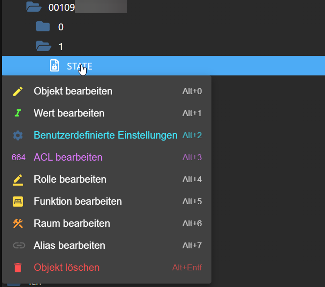
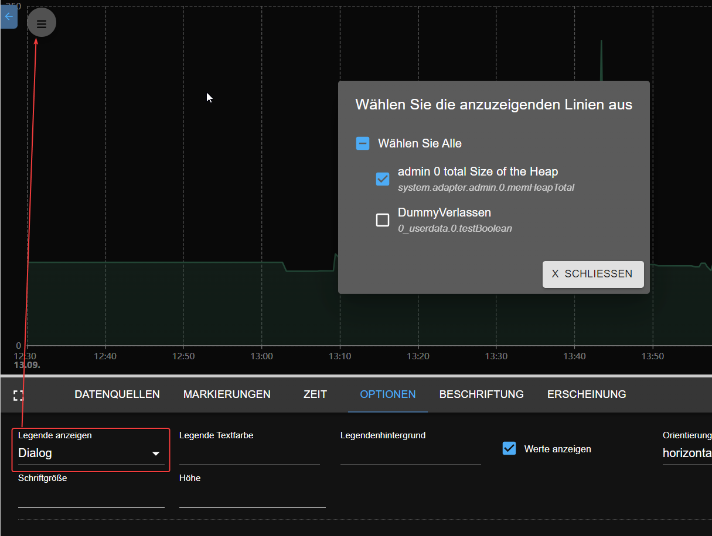

# 来自 ioBroker 的新闻（2023 年 8 月至 9 月）
<!-- SOURCE: 438668 # Neuigkeiten von ioBroker (August-September 2023) -->
在这篇博文中，我们将了解 2023 年 8 月和 9 月为 ioBroker 发布的一些新适配器和新功能。
<!-- SOURCE: 452545 In diesem Blog-Beitrag werfen wir einen Blick auf einige der neuen Adapter und neuen Funktionen, die im August und September 2023 für ioBroker veröffentlicht wurden. -->

## 护卫舰（2023 年 8 月 20 日）
<!-- SOURCE: 173807 ## Frigate (20. August 2023) -->

<!-- SOURCE: 823263  -->

[护卫舰](https://github.com/Bettman66/ioBroker.frigate) 是一款基于实时 AI 对象检测的开源 NVR。该适配器处理 Frigate 的 MQTT 消息并从中创建数据对象。
<!-- SOURCE: 312473 §§LLLLL_0§§ ist ein Open-Source-NVR, der auf Echtzeit-KI-Objekterkennung aufbaut. Dieser Adapter verarbeitet Frigates MQTT-Nachrichten und erstellt daraus Datenobjekte. -->

## 通知管理器（2023 年 8 月 21 日）
<!-- SOURCE: 287635 ## Notification Manager (21. August 2023) -->

<!-- SOURCE: 692214  -->

[通知管理器](https://github.com/foxriver76/ioBroker.notification-manager)允许您管理ioBroker通知，例如B. 将它们作为消息发送。
<!-- SOURCE: 274128 §§LLLLL_0§§ ermöglicht Ihnen das Verwalten von ioBroker-Benachrichtigungen, z. B. das Senden von ihnen als Nachrichten. -->

## ProCon.IP（2023 年 8 月 24 日）
<!-- SOURCE: 225418 ## ProCon.IP (24. August 2023) -->

<!-- SOURCE: 551005  -->

[普罗康IP](https://github.com/ylabonte/ioBroker.procon-ip) 是一个 ioBroker 适配器，为 `ProCon.IP` 游泳池控制提供基本支持。
<!-- SOURCE: 345066 §§LLLLL_0§§ ist ein ioBroker-Adapter, der grundlegende Unterstützung für die §§SSSSS_0§§ Schwimmbadsteuerung bietet. -->

## 德业IDC（2023年8月29日）
<!-- SOURCE: 8752 ## DeyeIDC (29. August 2023) -->

<!-- SOURCE: 54399  -->

[德业IDC](https://github.com/raschy/ioBroker.deyeidc) 是`Deye` 兼容逆变器的数据收集器。
<!-- SOURCE: 858223 §§LLLLL_0§§ ist ein Datensammler für §§SSSSS_0§§-kompatible Wechselrichter. -->

## ACME（2023 年 9 月 1 日）
<!-- SOURCE: 320476 ## ACME (1. September 2023) -->

<!-- SOURCE: 591710  -->

[ACME](https://github.com/iobroker-community-adapters/ioBroker.acme) 是使用 ACME 质询生成证书的适配器。
<!-- SOURCE: 528587 §§LLLLL_0§§ ist ein Adapter, der Zertifikate mit Hilfe von ACME-Herausforderungen generiert. -->

## 管理员（2023 年 9 月 1 日）
<!-- SOURCE: 494759 ## Admin (1. September 2023) -->

<!-- SOURCE: 194801 §§IIIII_0§§ -->

[行政](https://github.com/ioBroker/ioBroker.admin)适配器收到了更新，包括轻松创建别名。
<!-- SOURCE: 215128 Der §§LLLLL_0§§ Adapter erhielt Aktualisierungen, einschließlich einer einfachen Erstellung von Aliases. -->

## JavaScript（2023 年 9 月 1 日）
<!-- SOURCE: 102045 ## JavaScript (1. September 2023) -->

<!-- SOURCE: 983824 §§IIIII_0§§ -->

[JavaScript](https://github.com/ioBroker/ioBroker.javascript) 适配器现在包含一个用于使用 ChatGPT 测试 JavaScript 代码的游乐场。
<!-- SOURCE: 932743 Der §§LLLLL_0§§ Adapter enthält jetzt einen Playground zum Testen von JavaScript-Code mit ChatGPT. -->

## CEC2（2023 年 9 月 6 日）
<!-- SOURCE: 24159 ## CEC2 (6. September 2023) -->

<!-- SOURCE: 294570  -->

[CEC2](https://github.com/iobroker-community-adapters/ioBroker.cec2) 是 HDMI CEC 适配器，允许您通过 HDMI CEC 监视和控制设备。
<!-- SOURCE: 202115 §§LLLLL_0§§ ist ein Adapter für HDMI CEC, mit dem Sie Geräte über HDMI CEC überwachen und steuern können. -->

## Alexa2（2023 年 9 月 9 日）
<!-- SOURCE: 777646 ## Alexa2 (9. September 2023) -->
- (Apollon77) 更新了 Alexa2 适配器以适应亚马逊更改的推送通知系统，允许访问历史记录和交互信息。
<!-- SOURCE: 611555 - (Apollon77) Aktualisierung des Alexa2-Adapters zur Anpassung an das geänderte Push-Benachrichtigungssystem von Amazon, das Zugriff auf Historie und Interaktionsinformationen ermöglicht. -->

## Vis-2-widgets-material（2023 年 9 月 10 日）
<!-- SOURCE: 402950 ## Vis-2-widgets-material (10. September 2023) -->
- (bluefox) 门锁小部件已添加。
<!-- SOURCE: 505717 - (bluefox) Türschloss-Widget wurde hinzugefügt. -->

<!-- SOURCE: 553321   §§IIIII_0§§
  §§IIIII_1§§ -->

## Pushbullet（2023 年 9 月 10 日）
<!-- SOURCE: 508710 ## Pushbullet (10. September 2023) -->

<!-- SOURCE: 698675  -->

- (bluefox) API 已更新至版本 3。
<!-- SOURCE: 340953 - (bluefox) API wurde auf Version 3 aktualisiert. -->
- (bluefox) 添加了 JSON 配置。
<!-- SOURCE: 872655 - (bluefox) JSON-Konfiguration wurde hinzugefügt. -->

  
<!-- SOURCE: 404236   §§IIIII_0§§ -->

### JSON配置文档
<!-- SOURCE: 222205 ### JSON-Konfigurationsdokumentation -->
- (bluefox) 在 ioBroker 网站[此处](https://www.iobroker.net/#en/documentation/dev/adapterjsonconfig.md)添加了 JSON 配置文档。
<!-- SOURCE: 994968 - (bluefox) JSON-Konfigurationsdokumentation wurde der ioBroker-Website [hier](https://www.iobroker.net/#en/documentation/dev/adapterjsonconfig.md) hinzugefügt. -->

## Telegram 菜单（2023 年 9 月 11 日）
<!-- SOURCE: 541882 ## Telegram Menu (11. September 2023) -->

<!-- SOURCE: 809414  -->

使用 [电报菜单](https://github.com/MiRo1310/ioBroker.telegram-menu) 适配器轻松创建 Telegram 菜单。
<!-- SOURCE: 736250 Erstellen Sie einfach Telegram-Menüs mit dem §§LLLLL_0§§ Adapter. -->

## Vis-2（2023 年 9 月 12 日）
<!-- SOURCE: 491415 ## Vis-2 (12. September 2023) -->
- (bluefox) 水平菜单。
<!-- SOURCE: 64324 - (bluefox) Horizontales Menü. -->

  
<!-- SOURCE: 238545   §§IIIII_0§§ -->

##Echarts（2023 年 9 月 12 日）
<!-- SOURCE: 120611 ## Echarts (12. September 2023) -->
- (bluefox) 添加了将数据导出到 JSON 文件的功能。
<!-- SOURCE: 387426 - (bluefox) Möglichkeit hinzugefügt, Daten in eine JSON-Datei zu exportieren. -->

  
<!-- SOURCE: 663602   §§IIIII_0§§ -->

- (bluefox) 添加了在 X 秒不活动后恢复缩放和平移的功能。
<!-- SOURCE: 293806 - (bluefox) Möglichkeit hinzugefügt, Zoom und Pan nach X Sekunden Inaktivität wiederherzustellen. -->

  
<!-- SOURCE: 398738   §§IIIII_0§§ -->

- (bluefox) 将图例显示为对话框。
<!-- SOURCE: 919161 - (bluefox) Legende als Dialog anzeigen. -->

  
<!-- SOURCE: 103870   §§IIIII_0§§ -->

## Js-controller（2023 年 9 月 14 日）
<!-- SOURCE: 678432 ## Js-controller (14. September 2023) -->
- (foxriver76) js-controller 5 已在“稳定版”上发布。
<!-- SOURCE: 392557 - (foxriver76) js-controller 5 wurde auf `Stable` veröffentlicht. -->
- (foxriver76) 更新了安装程序以仅允许 Node.js 16.x+。
<!-- SOURCE: 88525 - (foxriver76) Installer aktualisiert, um nur Node.js 16.x+ zu erlauben. -->

## APG 信息（2023 年 9 月 16 日）
<!-- SOURCE: 119918 ## APG Info (16. September 2023) -->

<!-- SOURCE: 917421  -->

[APG信息](https://github.com/HGlab01/ioBroker.apg-info) 适配器提供奥地利电网的高峰时间和奥地利的 PHELIX-AT 日前价格。
<!-- SOURCE: 401132 Der §§LLLLL_0§§ Adapter liefert Spitzenzeiten für das österreichische Stromnetz und PHELIX-AT Day-Ahead-Preise für Österreich. -->

## TinyMQTTBroker（2023 年 9 月 16 日）
<!-- SOURCE: 140285 ## TinyMQTTBroker (16. September 2023) -->

<!-- SOURCE: 623718  -->

[TinyMQTT代理](https://github.com/HGlab01/ioBroker.tinymqttbroker) 是 ioBroker 的小型 MQTT 代理，它为以下对象提供中央 MQTT 代理实例：
<!-- SOURCE: 170354 §§LLLLL_0§§ ist ein kleiner MQTT-Broker für ioBroker, der eine zentrale MQTT-Broker-Instanz zum -->