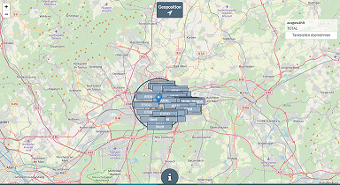

Tankerkönig
===========

| Stand der Doku |31.01.2019                 |
|----------------|----------------------------|
| Entwickler     |Pix                            |
| Kategorie      |Allgemein                           |
| Keywords       |Benzin, Tankstellen, Preis |
| Abhängigkeiten |                            |
| Lizenz         |MIT                        |

Tankerkönig
-----------

Tankerkönig ist ein Dienstleistungsunternehmen, dass auf seiner Homepage
Möglichkeiten bietet, Kraftstoffpreise in eigenen Projekten zu verwenden.
Tankerkönig stellt hierfür einen kostenfreien API zur Verfügung.

Adapter Tankerkönig
-------------------

Dieser Adapter liefert die Kraftstoffpreise für E5, E10 und Diesel; es können
bis zu 10 Tankstellen eingegeben werden. Die jeweils günstigste Tankstelle für
die drei Kraftstoffsorten wird ebenfalls in einem separaten Kanal gespeichert.

Um den Datenverkehr effizient zu gestalten, verwendet der Adapter lediglich die
Seite *prices.php* (gleichzeitiges Abfragen vieler Stationen); Umkreissuche und
Einzelabfrage einer Tankstelle werden nicht zur Verfügung gestellt.

Voraussetzungen vor Installation
--------------------------------

Gültiger API-Key; unter Angabe einer E-Mailadresse kostenfrei
[hier](https://creativecommons.tankerkoenig.de/) erhältlich.

Konfiguration
-------------

### API-Key

Eingabe der 36stelligen Zeichenkette (findet sich nach der Anmeldung in der Bestätigungsmail des Anbierters)

### Tankstellen

Bis zu 10 Tankstellen-ID können eingetragen werden. Diese 36stellige ID ist
[hier](https://creativecommons.tankerkoenig.de/TankstellenFinder/index.html)
erhältlich; um die Ausgabe übersichtlicher zu gestalten, kann ein frei wählbarer
Name vergeben werden.

#### Tankstellenfinder

  
*Anleitung unter Button "i" abrufbar*

### Werte nullen

Durch Aktivierung dieser Option (Reset) wird verhindert, dass bei
Verbindungsproblemen veraltete Werte Werte in den Datenpunkte verbleiben. Dieser
Reset kann in den Adaptereinstellungen ausgeschaltet werden, um flüssigere
History-Daten zu erhalten.

Instanz
-------

Unter Instanzen des ioBrokers finden sich die installierte Instanz des Adapters,
jedoch ohne Ampelsystem, da keine Verbindung zu anderen Geräten aufgebaut wird.

Objekte
----------

Nach erfolgreicher Konfiguration findet sich im Objektbereich der Instanzordner.
Darin angelegt für die jeweilig konfigurierten Tankstellen ein Ordner mit den
Daten. Im Ordner *cheapest* werden die Preise der aktuell günstigsten Tankstelle
angezeigt (bei Preisgleichheit Anzeige nach Reihenfolge in der
Konfigurationsliste). Der Datenpunkt *json* beinhaltet die Preise aller
festgelegten Tankstellen (zur tabellarischen Darstellung bspw. in Visualisierung
VIS).

Jeder der zehn Kanäle enthält separat für jede Kraftstoffsorte folgende
Datenpunkte:

-   3rd: Angabe Wert letzter Dezimalstelle (nur für Formatierung von "Combined" erforderlich)

-   combined: formatierter Preis (dritte Dezimalstelle als Hochzahl formatiert)
    oder ggf. Status der Tankstelle (closed/not found)

-   feed: Preis mit drei Dezimalstellen

-   short: Preis mit zwei Dezimalstellen (nicht gerundet)

-   name: Den vom User festgelegten Namen

-   status: Falls vorhanden, Angabe ob geöffnet (open) oder geschlossen (closed)

FAQ
-----------
