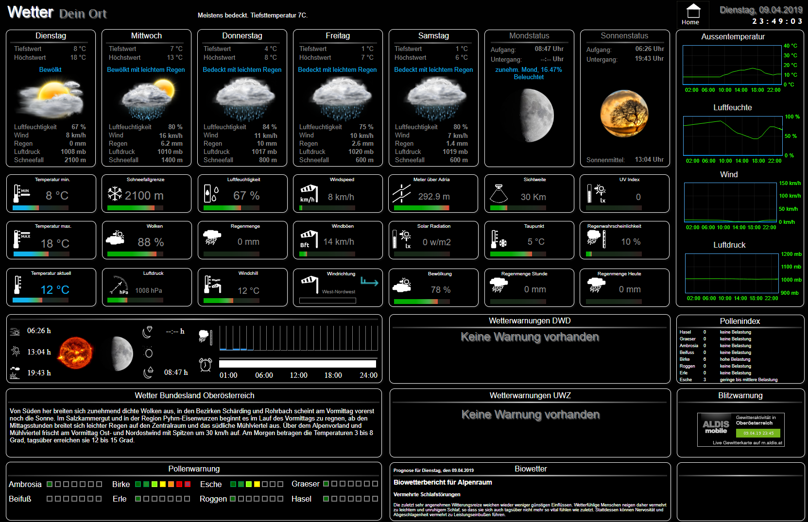
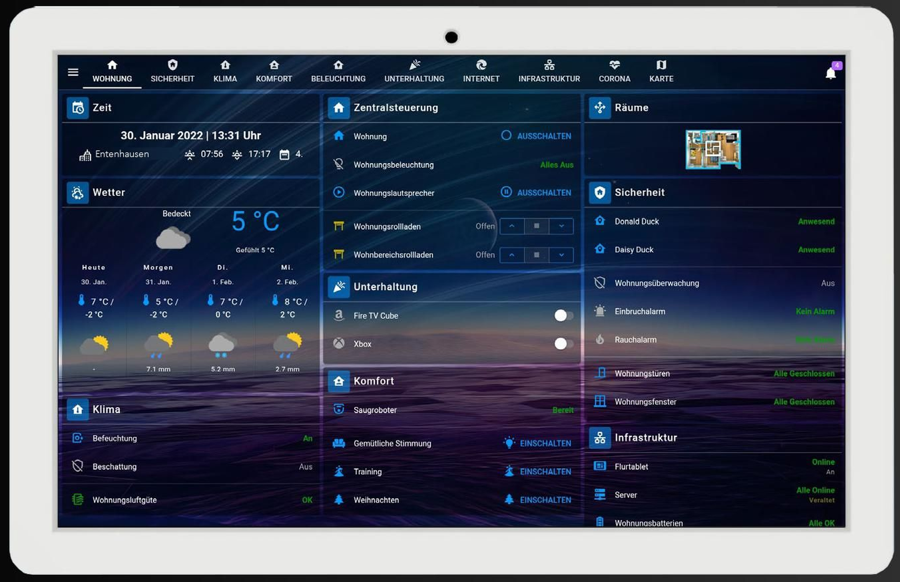
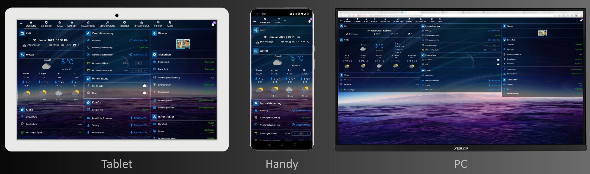
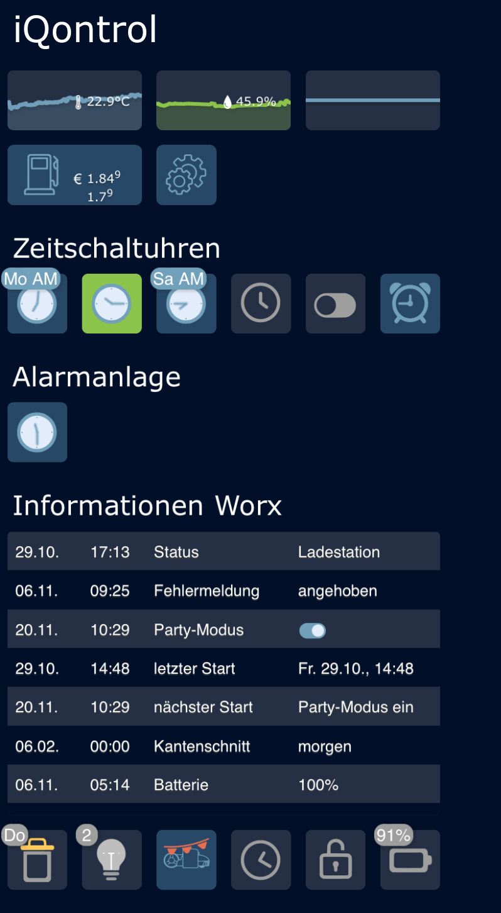
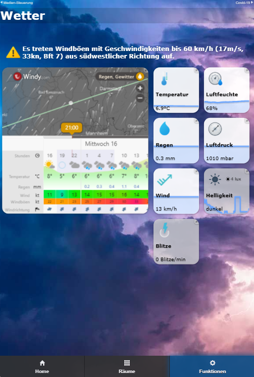
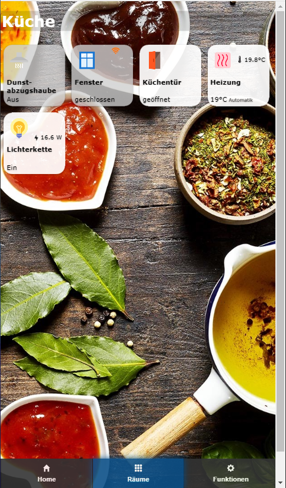
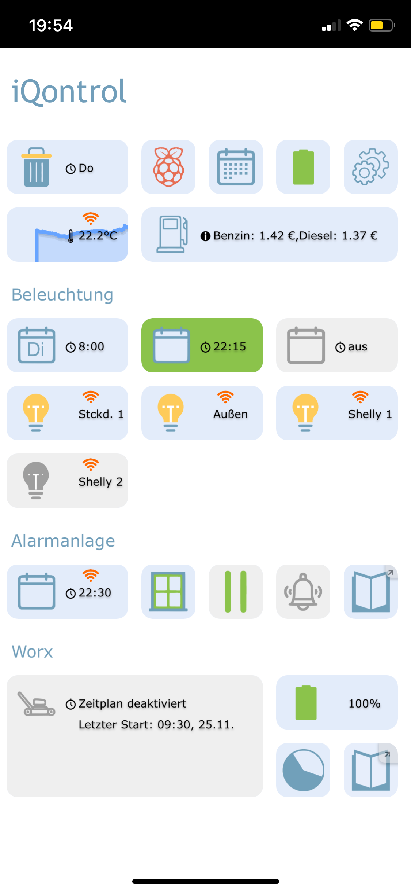
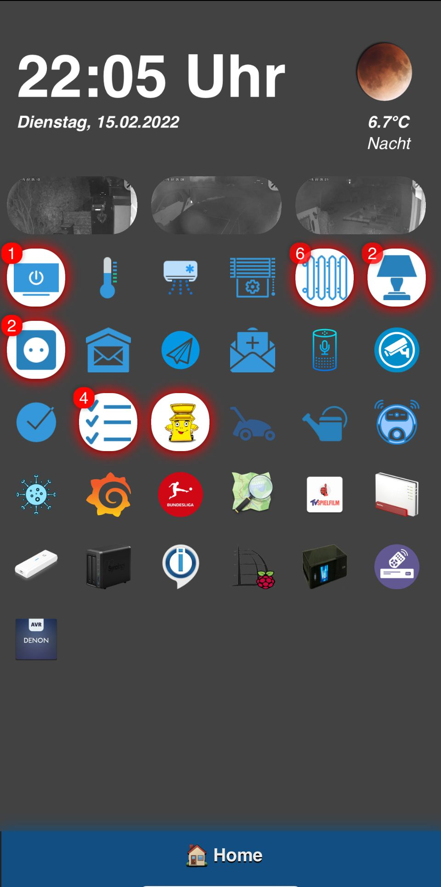
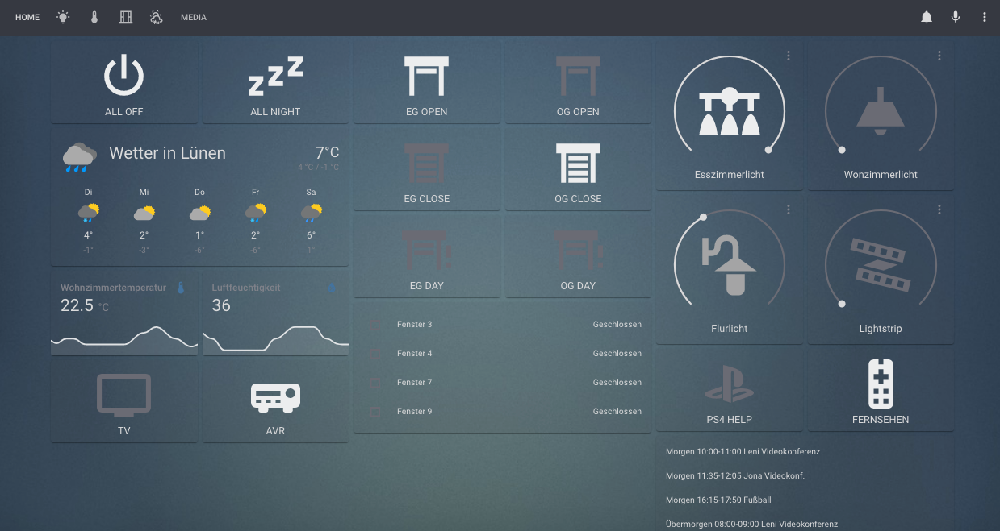

## Mach dein Leben einfacher: Smart Home

Wäre es nicht praktisch, Temperaturen, Verbrauchswerte oder Schaltzustände von Geräten verschiedenster Hersteller zentral an einem Ort abzulesen?
Müsste man nicht daran denken, Geräte bei Erreichen bestimmter Bedingungen oder Zustände ein- oder auszuschalten?

Diese Bequemlichkeit kann ein Smart Home bieten - ein intelligentes Haus.
Und es bietet auf Wunsch noch mehr: Automatisierung und die Möglichkeit, auf all diese Dinge auch aus der Ferne zuzugreifen.

### Die Lösung: ioBroker - Automate your life

**ioBroker** ist eine Softwarelösung zur Automatisierung deines Zuhauses.
Sie ermöglicht die Integration verschiedenster Smarthome-Systeme, die ohne ioBroker isoliert bleiben würden, und ermöglicht so eine übergreifende Steuerung.

**ioBroker** ist daher **die** Integrationsplattform für das Internet der Dinge (IoT) und ermöglicht die Einbindung von freien und kommerziellen Produkten
aus fast allen Lebensbereichen sowie die Integration von selbst erstellten Lösungen.

Das **ioBroker-System** ist modular aufgebaut und kann durch die Installation von einzelnen Plugins, bei uns Adaptern genannt, gemäß den individuellen Wünschen erweitert werden.

Mit weit über 600 Adaptern ermöglicht ioBroker die Integration verschiedener Plattformen, Systeme und Geräte von A wie Alexa bis Z wie Zigbee und bietet viele weitere Möglichkeiten zur Automatisierung.

#### Was sind Adapter? 

**Adapter** sind in JavaScript für Node.js geschriebene **PlugIns** (Softwaremodule, kleine Programme), die speziell für bestimmte Geräte, Gerätetypen, Geräte bestimmter Hersteller oder andere Dienste, wie beispielsweise zur Abfrage von Webseiten, entwickelt wurden.

Diese Adapter ermöglichen die Verbindung zwischen physischen Geräten (zum Beispiel steuerbare Steckdosen, Relais, Fernthermometer und ähnliche) und dem zentralen ioBroker-System. Sie sind in der Lage, die von den Geräten gemessenen Werte auszulesen und die Geräte zu steuern, was oft über WLAN im eigenen Heimnetz geschieht.

Andere Adapter sind darauf ausgelegt, Messwerte wie Temperatur, Leistung, Verbrauchswerte oder Schaltzustände grafisch in Diagrammen darzustellen.
Visualisierungsadapter bieten zudem weitere Möglichkeiten, wie das Einbinden von Bildern (etwa von Überwachungskameras), Wetterdaten und vieles mehr.

Zusätzlich gibt es Adapter, die Funktionen für mathematische Berechnungen oder logische Operationen (wie Vergleiche) anbieten.
Sie können auch zur Erstellung kleiner Programme und zur Definition der für die Automatisierung notwendigen Regeln eingesetzt werden.

Da JavaScript eine der meistgenutzten Programmiersprachen ist, existieren bereits viele fertige Module, und neue können oft mit relativ geringem Aufwand entwickelt werden.
Sollte ein Adapter fehlen, kann daher meistens schnell ein passender entwickelt werden.
Die aktive **ioBroker-Entwickler-Community** unterstützt neue Entwickler dabei jederzeit gerne.

**Tipp:**
 [Übersicht verfügbaren Adapter](https://www.iobroker.net/#de/adapters/adapters.md) 

### ioBroker verbindet unterschiedlichste Smarthome-Systeme

  

Diese Grafik veranschaulicht, wie ioBroker als zentrales System verschiedenste Smart-Home-Systeme und weitere Dienste, wie zum Beispiel Kalender,
koordiniert und miteinander verbindet.
Die in ioBroker verfügbaren Adapter ermöglichen eine Kommunikation mit zentral
verwalteten Kalendern oder herstellerspezifischen Smart-Home-Systemen, die im LAN oder WLAN angeschlossen sind.
Auf diese Weise kann die ioBroker-Software Statusinformationen abrufen oder Steuerungsaktionen ausführen.

### Anwendungsbeispiel Anwesenheitssimulation
In diesem Anwendungsbeispiel wird exemplarisch aufgezeigt, wie die beiden voneinander unabhängigen Smarthome-Systeme Philipps Hue und Homematic IP mittels ioBroker zusammengeführt werden, um eine Anwesenheitssimulation zu realisieren.

Durch die Anbindung der beiden Smarthome-Systeme an die ioBroker Software, ist ioBroker in der Lage die Zustände der Hue Lampen (ein/aus) sowie die Rollläden (hoch/runter) zu verändern. Die Erkennung der Urlaubszeit erfolgt durch die Anbindung des Kalenders in ioBroker.

Durch Nutzung der Logikbausteine (Adapter Logikprogrammierung) in ioBroker kann der Anwender nun mit wenigen Schritten dem folgenden Ablauf realisieren:

- Wenn im Kalender der Eintrag "Urlaub" eingetragen ist, werden um 18 Uhr Abends alle HUE Lampen eingeschaltet.
- Um 22:00 Uhr werden alle Rollläden geschlossen und alle Hue Lampen ausgeschaltet.
- Um 08:00 Uhr morgens werden alle Rollläden wieder hochgefahren.

Über die verfügbaren Visualisierungs-Adapter kann sich der Anwender individuelle Status und Steuerungsseiten für seine Hue Lampen und Rollläden bauen, auf die mit den mobilen Endgeräten von zu Hause oder aus dem Urlaub (z.B. mittels ioBroker Cloud Services oder VPN) zugegriffen werden kann.

## Stärken von ioBroker

### Plattformunabhängig

ioBroker kann auf fast allen Hardwareplattformen installiert werden, auf denen als **Betriebssystem Linux, OSX, Windows oder Docker** läuft. Möglich sind somit Einplatinencomputer (wie der Raspberry Pi), Server, NAS oder Server mit Virtualisierungsumgebungen (wie z.B. Proxmox, Desktopcomputer, o.ä.).

Eine einfache Installationsroutine aus einer einzigen Zeile (one-line installer) ermöglicht unter Linux und OSX eine anwenderfreundliche Installation und somit einen schnellen Einstieg in ioBroker.

### Skalierbar
Sollen im Laufe der Zeit weitere Smarthome-Systeme angebunden werden, können
diese vom Anwender jederzeit über zusätzliche Adapter im laufendem Betrieb
implementiert werden.
Auch ioBroker selbst ist skalierbar: Mehrere ioBroker-Server können zu einem
Mutihost-System verbunden werden. Dabei ist sogar die Mischung von
Betriebssystemplattformen und die Kopplung von Einplatinencomputern mit
großen Multicore-Servern möglich.

### Individuelle Programmierung von Abläufen
Mit den Logik Adaptern bietet ioBroker die Möglichkeit individuelle Abläufe und Skripte zu erstellen. 
In einem Skript kann z.B. ein Wert von einem Adapter überwacht werden (Urlaub ist im Kalender am heutigen Tag eingetragen) und eine Aktion ausgelöst werden (Schalte um 18 Uhr alle Hue Lichter ein).

In ioBroker können diese individuellen Abläufe durch Drag-and-Drop von Bausteinen (grafische Programmierung) in "Rules" oder "Blockly" realisiert werden oder in klassischer Form mit "Javascript" oder "Typescript" in Form von geschriebenem Quellcode implementiert werden. 

Weitere Erklärungen zu den Logikbausteinen sowie eine weitere Vorstellung von weiteren Logikbausteinen wie Node-Red oder der Szenen-Adapter werden in dieser Doku im Abschnitt "Logik und Automatisierung" erläutert.

## Visualisierung
Mehrere Visualisierungsadapter bieten dem Anwender die Möglichkeit Steuerungsoptionen, sowie Zustandsinformationen, grafisch zu realisieren.
Diese individuellen Visualisierungen können dann auf einem Tablet, Smartphone oder Computer dargestellt und bedient werden.

Nachfolgend werden einige Visualisierungsadapter und deren Haupteigenschaften kurz vorgestellt. 

### VIS
[Adapterseite vis](https://www.iobroker.net/#de/adapters/adapterref/iobroker.vis/README.md)

ioBroker stellt mit dem Adapter VIS (Visualisierung) ein mächtiges Tool zur Erstellung von individuellen 
Visualisierungen zur Verfügung. Aktuelle Werte von Sensoren können genauso wie 
historische Verläufe grafisch aufbereitet dargestellt werden. Live-Bilder von 
Überwachungskameras, die Implementierung einer Alarmanlage, Heizungssysteme und 
Klimatechnik - fast alles, was vorstellbar ist, kann auch umgesetzt werden. 

Mit dem Einsatz von VIS hat der Anwender bei der Realisierung maximale Gestaltungsfreiheiten. Vorgefertigte Bausteine zur 
einfachen Verwendung helfen dem Anwender dabei beim Zusammenstellen der UI. Doch nicht nur die Anzeige von 
Informationen ist möglich. Auch die Steuerung von Geräten ist über die 
Visualisierungsoberfläche schnell umgesetzt. Die Bedienung der Oberfläche kann 
dabei auf die unterschiedlichsten Endgeräte abgestimmt werden - vom Smartphone 
über das Wandtablet mit Touchfunktion bis hin zum PC - alles kann 
durch einfaches Drag-and-Drop realisiert werden. 

  

### Material UI
React und Material UI interface.

[Adapterseite Material](https://www.iobroker.net/#de/adapters/adapterref/iobroker.material/README.md)

  

### Jarvis
[Adapterseite Jarvis](https://www.iobroker.net/#de/adapters/adapterref/iobroker.jarvis/README.md)

Jarvis ist eine Material Design Visualisierung, die auf Material UI basiert. Jarvis gibt eine Struktur und Module vor, die zur Visualisierung genutzt werden, aber sehr flexibel konfiguriert werden können.

Jarvis ist responsive fähig und passt sich der Größe des Screens an und bietet ein standardisiertes Design, so dass in kurzer Zeit eine Visualisierung zusammengestellt werden kann.

Das Layout ist flexibel konfigurierbar. Das Layout kann durch beliebig viele Tabs unterteilt werden. Jeder Tab kann daraufhin entweder im Vollbildmodus angezeigt werden oder durch einzele Spalten (columns) unterteilt werden.

### iQontrol

Schnell ans Ziel - aber dennoch flexibel, das zeichnet iQontrol aus:
- Die Vis einmal erstellen und überall nutzen: Vom PC, über Tablet zum Handy, iQontrol läuft auf allen Endgeräten - entweder im Browser oder als WebApp (lässt sich auf dem Homescreen speichern und fühlt sich dann an, wie eine App)
- iQontrol passt sich dabei allen Auflösungen dynamisch an (responsive fähiges Design)
- Superschnelle Ladezeit
- Mit den Standard-Einstellungen kommt man schnell zum Ziel
- Mit den erweiterten Einstellungen und Widgets hat man hingegen hohe Flexibilität und Anpassungsmöglichkeiten (bei manchen Installationen erkennt man gar nicht mehr, dass es eigentlich iQontrol ist)

Video [iQontrol Demo Video][]

 

### Lovelace

[Adapterseite lovelace](https://www.iobroker.net/#de/adapters/adapterref/iobroker.lovelace/README.md)

Mit dem Lovelace Adapter kann die HomeAssistant UI Lovelace für ioBroker genutzt werden. Lovelace hat ein responsivefähiges Design und passt sich somit  automatisch an das Layout vom PC, Tablet oder Smartphone Bildschirm an. 

In Lovelace stehen direkt die Geräte mit ihren Eigenschaften zur Ansicht / Ansteuerung bereit, welche in ioBroker hinterlegt sind (z.B. bei einer Lampe Ein/Aus, Helligkeit, Farbtemperatur).

Der Lovelace Editor (WYSIWYG Prinzip - What you see is what you get Prinzip) ermöglicht die einfache Erstellung von modernen UIs mit wenigen Handgriffen. Für die Umsetzung von komplexere Anforderungen und Wünschen stehen custom cards und der YAML Editor zur Verfügung. Inspirationen für eine Lovelace UI können in der HomeAssistant Welt gesammelt und dann in ioBroker umgesetzt werden.

  

## Wer steckt hinter ioBroker?
ioBroker ist ein Open-Source-Projekt, welches von der ioBroker Community entwickelt wird und von [Bluefox](https://github.com/GermanBluefox) als Projektbesitzer administriert wird.

Viele Entwickler und viele weitere Helfer entwickeln in ihrer Freizeit ehrenamtlich an den zentralen ioBroker System-Komponenten, den vielen Adaptern, dem Social-Media-Support, der Dokumentation und vielem mehr.  
Mit der großen und hilfsbereiten Community hat sich bisher zu jedem Problem eine Lösung gefunden.   

ioBroker verfolgt einen dezentralen Ansatz, bei welchem jeder Adapter in einem eigenen GitHub-Repository gepflegt wird.
Hierbei trifft der jeweilige Adapter-Entwickler weitestgehend eigenständig die Entscheidungen zu seinem Adapter.
Funktionalitäterweiterungs-Wünsche oder auch fremde Feature-Erweiterungen als "pull-Request" werden hierbei natürlich berücksichtigt.

Einige Entwickler haben sich darüber hinaus in der ioBroker Adapter-Community zusammengeschlossen, um sicherzustellen das auch im Falle davon,
dass einzelner Entwickler keine Zeit mehr für Ihre Adapter haben, diese weitergepflegt werden können.

Es gibt keinen vertraglich festgelegten Support aus der Open-Source Community, aber gemeinsam haben wir bisher jedes Problem gelöst bekommen!

Richtungsentscheidungen der zentralen Komponenten und des Gesamtprojekts werden innerhalb des Core-Teams diskutiert und dann umgesetzt.

Das ioBroker Core Entwicklerteam setzt sich zusammen aus:
* [Bluefox](https://github.com/GermanBluefox)
* [Apollon77](https://github.com/Apollon77)
* [foxriver76](https://github.com/foxriver76)
* [AlCalzone](https://github.com/AlCalzone)

Eine Liste der [ioBroker Developer](https://forum.iobroker.net/groups/developer) findet ihr im ioBroker Forum.

### Lizenzen und Kosten
Sehr viele ioBroker Projekte stehen mitsamt dem Quellcode auf [GitHub](https://github.com/ioBroker) zur Verfügung.
In den allermeisten Fällen steht der Quellcode unter der MIT-Lizenz.
Manchmal werden allerdings auch Lizenzen wie GPL, CC BY-NC oder andere genutzt, welche zu berücksichtigen sind, jedoch für End-Nutzer an sich keinen großen Unterschied darstellen!
Der Entwickler eines Adapters legt für den jeweiligen Adapter die Lizenz selbst fest.

In sehr seltenen Fällen (<5 Adapter aktuell) wird eine (teils kostenpflichtige) Lizenz benötigt, um einen Adapter zu nutzen.
Für den "VIS" Adapter stellt beispielsweise die ioBroker GmbH eine kostenfreie Lizenz für die private Nutzung zur Verfügung - für eine kommerzielle Nutzung ist allerdings eine kostenpflichtige Lizenz nötig.
Ein Überblick und die Bestellung der Lizenz für diese Adapter erfolgt über diese Seite [iobrokerPreise](https://iobroker.net/www/pricing).
Die Kosten für eine kommerzielle Nutzung dieser Adapter ist dort ebenfalls aufgeführt.

### Wie finanziert sich ioBroker?
Alle zentralen Komponenten und nahezu alle weiteren Adapter sind kostenfrei erhältlich und der Quellcode der allermeisten Adapter steht auf GitHub offen zur Verfügung.

Da ein Open-Source-Projekt keine Einnahmen erzielen kann, um z.B. Server zu kaufen, bedarf es für diese Dinge eine offizielle Gesellschaftsform, die ioBroker GmbH.
Die ioBroker GmbH bietet unter anderem auch einen kommerziellen Support für die ioBroker Software oder verkauft z.B. einen ioBroker-Server. 

Die ioBroker GmbH stellt für das Community-Projekt die Infrastruktur (z.B. den Forum-Server) kostenfrei zur Verfügung und hat auch in der Vergangenheit bereits Entwicklungsleistung eingekauft, welche in die Entwicklung der Open Source Projekte (z.B. Admin) geflossen ist. 

Die ioBroker Free Cloud ist ebenfalls ein kostenfreier Dienst, der der Community durch die ioBroker GmbH zur Verfügung gestellt wird. Die Pro-Cloud und der iot-Service sind kommerzielle Angebote der ioBroker GmbH, wobei die Kosten gerade einmal die Betriebskosten decken.

## ioBroker Cloud Services – Kurzüberblick

Über einen optionalen cloudbasierten Zugriff ist für Anwender und Systemintegratoren die Remote‑Verwaltung eines lokal installierten ioBroker‑Systems 24/7 möglich.

**Legende:**  
✅ = verfügbar, 🟡 = limitiert, ❌ = nicht verfügbar, `.net` = iobroker.net, `.pro`= iobroker.pro

---

### Smart Assistenten (Sprachsteuerung mit Alexa, Google ect.)

**1. Smart Home Skill (ioBroker.assistant)**  
Geräte per Sprachbefehl steuern – z.B. „Alexa, Licht an“.

**2. Custom Skill (Custom ioBroker)**  
Eigene Befehle nutzen – z.B.„Alexa, frage ioBroker nach Temperatur“.

- `.net:` ❌
- `.pro` ohne Lizenz: 🟡 50 Befehle/Tag
- Mit Assistent- oder Fernzugriff-Lizenz: ✅ 3000 Befehle/Tag oder 35000 Befehle/Monat
  
**Hinweis:**
Ein „Befehl“ ist nicht nur ein Sprachkommando, auch Statusabfragen zählen dazu.  
Öffnest du z.B. die Alexa-App mit 100 Geräten, sendet Amazon sofort 100+ sogenannte „StatusReport“-Befehle.
Auch im geöffneten Zustand fragt die App alle paar Sekunden den Status erneut ab.
Dieses Verhalten kommt von Amazon (ab Alexa Smart Home API V3) und lässt sich nicht durch ioBroker beeinflussen.
Dadurch kann das tägliche Limit selbst ohne Sprachkommandos schnell erreicht werden.

### Fernzugriff (Remote Access)

**1. VIS anzeigen (Dashboards)**  
Zugriff auf deine Visualisierungen.

- `.net:` ✅
- `.pro` ohne Lizenz oder Assistent: ❌
- Mit Fernzugriff-Lizenz: ✅

**2. VIS bearbeiten (Editor)**
- Nur mit Fernzugriff-Lizenz (`.pro`): ✅

**3. Admin-Fernzugriff**
- Nur mit Fernzugriff-Lizenz (`.pro`): ✅

---

### Dienste & Webhooks

**IFTTT / HTTP POST / HTTP GET/PUT**  
ioBroker mit externen Diensten verbinden (z. B. Automationen, Webhooks).

- `.net`: ❌
- `.pro` ohne Lizenz: 🟡 20 Befehle/Tag
- Mit Assistent- oder Fernzugriff-Lizenz: ✅ unbegrenzt

---

### Lizenzen im Vergleich

- **Free Cloud (`.net`):** Nur VIS anzeigen
- **ohne Lizenz `.pro` :** Skills + Dienste limitiert (50 / 20 Befehle pro Tag)
- **Assistent-Lizenz (`.pro`).:** Skills & Dienste 3000 Befehle/Tag oder 35000 Befehle/Monat
- **Fernzugriff-Lizenz (`.pro`):** Alles inklusive (VIS, VIS‑Editor, Admin, Skills, Dienste)

## Community
Seit 2014 hat sich ioBroker aufgrund seiner vielen Vorzüge eine breite 
Unterstützung von tausenden Anwendern und Entwicklern gesichert. Im eigens 
eingerichteten [Forum](https://forum.iobroker.net) treffen sich Anwender und Entwickler und tauschen dort ihre 
Erfahrungen und Anregungen miteinander aus. Auf dem ioBroker [Discord](https://discord.gg/sGWE65zF) Server können Erfahrungen im Live-Chat ausgetauscht sowie Live Debug Session kurzfristig durchgeführt werden, um aktuellen Problemen auf die Schliche zu kommen. 

Linksammlung der offiziellen ioBroker Communities:
- ioBroker Forum: [Forum](https://forum.iobroker.net)
- Discord ioBroker Server: [Discord](https://discord.gg/sGWE65zF)
- Facebookgruppe "IoBroker SmartHome und IoT": [FacebookIoBrokerSmartHomeIoT](https://www.facebook.com/groups/440499112958264)
- Facebookgruppe "ioBroker and smart home international": [FacebookIoBrokerSmartHomeIoTInternational](https://www.facebook.com/groups/iobrokerinternational)

## ioBroker Statistiken
Auf [ioBrokerStatistics](https://www.iobroker.net/#de/statistics) findet ihr eine Übersichtsseite mit ein paar interessanten ioBroker Statistiken. 

[Grundlagen]: https://www.iobroker.net/#de/documentation/basics/README.md
[Adaptern]: https://www.iobroker.net/#de/adapters/adapters.md
[hier zu finden]: https://www.iobroker.net/docu/
[im Forum]: https://forum.iobroker.net/category/186/dokumentations-support
[GitHub]: https://github.com/ioBroker
[Forum]: https://forum.iobroker.net
[Telegram]: https://t.me/iobrokergermany
[Discord]: https://discord.gg/sGWE65zF
[FacebookIoBrokerSmartHomeIoT]: https://www.facebook.com/groups/440499112958264
[FacebookIoBrokerSmartHomeIoTInternational]: https://www.facebook.com/groups/iobrokerinternational
[iobrokerPreise]: https://iobroker.net/www/pricing
[Bluefox]: https://github.com/GermanBluefox
[Apollon77]: https://github.com/Apollon77
[foxriver76]: https://github.com/foxriver76
[AlCalzone]: https://github.com/AlCalzone
[ioBrokerStatistics]: https://www.iobroker.net/#de/statistics
[Adapterseite Material]: https://www.iobroker.net/#de/adapters/adapterref/iobroker.material/README.md
[Adapterseite Jarvis]: https://www.iobroker.net/#de/adapters/adapterref/iobroker.jarvis/README.md
[Adapterseite vis]: https://www.iobroker.net/#de/adapters/adapterref/iobroker.vis/README.md
[Adapterseite lovelace]:https://www.iobroker.net/#de/adapters/adapterref/iobroker.lovelace/README.md
[iQontrol Demo Video]: https://www.youtube.com/watch?v=QHgmrzMmcX4&list=PL8epyNz8pGEv6-R8dnfXm-m5aBlZFKOBG&index=1
[ioBroker Developer]: https://forum.iobroker.net/groups/developer
