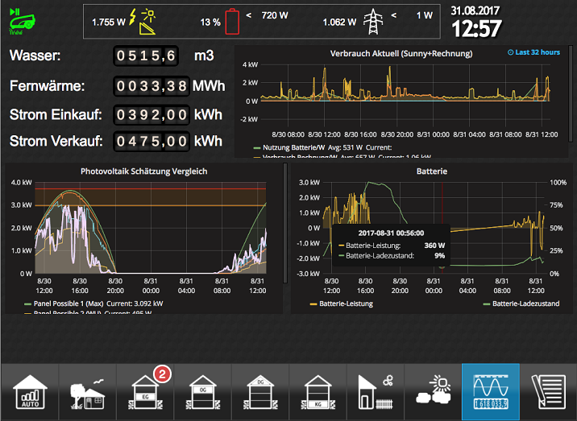

# Wilkommen

## Hinweis zur aktuellen Dokumentation

?> Die Dokumentation befindet sich im Aufbau und wird stetig erweitert.
   Daher kann es vorkommen, dass Links noch nicht funktionieren oder
   Inhalte fehlen. Wir sind für jede Hilfe bei der Erstellung neuer
   Artikel oder für Verbesserungen dankbar. Informationen dazu gibt
   es hier [im Forum][].
     
   **Bis alle Inhalte übernommen wurden, ist die alte Dokumentation noch [hier zu finden](https://www.iobroker.net/docu/).
   Sie wird sukzessive durch die neue Dokumentation ersetzt.**

   

# ioBroker - Automate your life

ioBroker ist eine Softwarelösung um verschiedene Smarthome-Systeme, die ohne
ioBroker Insellösungen bleiben würden, in einem Gesamtsystem zu integrieren.

ioBroker ist daher **die** Integrationsplattform für das Internet der Dinge.

Ein ioBroker-System ist modular aufgebaut. Eine Vielzahl von [Adaptern][] ermöglicht
die Kommunikation mit über 450 verschiedenen Plattformen von A wie Alexa bis Z
wie Z-Wave.  

Sei es die Einbindung kommerzieller Produkte aus fast allen Lebensbereichen oder
die Integration einer selbst erstellten Lösung - ioBroker macht fast alles möglich.

 

## ioBroker Beispielkonfiguration

  

Diese Grafik zeigt wie ioBroker als Middleware vereinfacht funktioniert, um verschiedene Smarthomelösungen oder weitere Dienste (z.B. Kalender) miteinander zu verbinden.
Die in ioBroker zur Verfügung stehenden Adapter können unter anderem mit zentral verwalteten Kalendern oder herstellerspezfischen Smartehomesysteme (welche im LAN oder WLAN angeschlossenen angeschlossen sind) kommunizieren. Auf diese Weise kann die ioBroker Software Statusinformationen lesen oder Daten schreiben, um Aktionen zu triggern.

Nehmen wir an, dass ein Anwender in der Wohnung bereits einige Lampen über Philipps Hue steuert sowie seine Rolläden über Homematic IP öffnen und schließen kann.

Mit dem Einsatz der ioBroker Software ist es nun möglich eine Anwesenheitssimulation zu realisieren, in welcher die Hue Lampen ein- und ausgeschaltet und die Rolläden hoch und runter gefahren werden können wenn der Anwender im Urlaub ist.

Über die Logikbausteine (Adapter Logikprogrammierung) kann der Anwender mit wenigen Schritten den folgende Ablauf realisieren:

- Wenn im Kalender der Eintrag "Urlaub" eingetragen ist, werden ab 18 Uhr Abends abwechselnd verschiedene HUE Lampen ein- und ausgeschaltet.
- Um 22:00 Uhr werden alle Rolläden geschlossen und alle Hue Lampen ausgeschaltet.
- Um 08:00 Uhr morgens werden alle Rolläden wieder hochgefahren.

Über den "Adapter User Interface" kann sich ein Anwender individuelle Status und Steuerungsseiten für seine Hue Lampen und Rolläden bauen, auf die mit den mobilen Endgeräten von zu Hause oder aus dem Urlaub (z.B. mittels ioBroker Cloud Services oder VPN) zugegriffen werden kann.

 

## Plattformübergreifend
Jeder, der sich mit Hausautomation beschäftigt, wird früher oder später
feststellen, dass einzelne Systeme häufig nicht perfekt sind. Jedes System hat
seine Stärken und Schwächen. ioBroker ist deshalb plattformübergreifend und
Parallelbetrieb mit bestehenden Lösungen ist jederzeit möglich. So können
Synergieeffekte genutzt und das Beste aus allen Welten zusammengeführt werden.

ioBroker selbst IST auf fast allen Plattformen zu Hause. ioBroker kann unter
Windows, Linux, OSX oder auch als Dockerimage installiert werden.
Vorkonfigurierte Installationsimages nehmen dabei dem Anwender die
Installationsarbeit ab.

 

## Skalierbar
Sollen im Laufe der Zeit weitere Smarthome-Systeme angebunden werden, können
diese vom Anwender jederzeit über zusätzliche Adapter bei laufendem Betrieb
implementiert werden.
Auch ioBroker selbst ist skalierbar: Mehrere ioBroker-Server können zu einem
`Mutihost`-System verbunden werden. Dabei ist sogar die Mischung von
Betriebssystemplattformen und die Kopplung von SoC-Einplatinencomputern mit
großen Multicore-Servern möglich.
Für Systeme mit höchsten Performanceanforderungen kann optional Redis, eine
besonders schnelle Datenbank, eingebunden werden.

## Programmierbar
Eine optionale Programmierung erfolgt mit JavaScript, einer seit 1995 stetig
weiter entwickelten Skriptsprache. Diese ist einfach zu erlernen, so dass neue 
Anforderungen schnell umsetzbar sind. Das macht es möglich, dass jeder zu 
ioBroker beitragen kann und auch individuelle Anforderungen umsetzbar sind.

Für Einsteiger in die Programmierung ist die Variante 'Blockly' vorhanden, die es 
ermöglicht, ohne umfangreiche Programmierkenntnisse selber per 'drag and drop' 
schnell zu Ergebnissen zu kommen. 

## Visualisierung
ioBroker stellt mit `VIS` ein mächtiges Tool zur Erstellung einer individuellen 
Visualisierung zur Verfügung. Aktuelle Werte von Sensoren können genau so wie 
historische Verläufe grafisch aufbereitet dargestellt werden. Live-Bilder von 
Überwachungskameras, die Implementierung einer Alarmanlage, Heizungssysteme und 
Klimatechnik - fast alles was vorstellbar ist, kann auch umgesetzt werden. 

*Beispiel für eine selbst erstellte VIS-Benutzeroberfläche*
  

Dabei hat der Anwender maximale Gestaltungsfreiheit. Vorgefertigte Bausteine zur 
einfachen Verwendung helfen dem Anwender dabei. Doch nicht nur die Anzeige von 
Informationen ist möglich. Auch die Steuerung von Geräten ist über die 
Visualisierungsoberfläche schnell umgesetzt. Die Bedienung der Oberfläche kann 
dabei auf die unterschiedlichsten Endgeräte abgestimmt werden - vom Smartphone 
über das Wandtablet mit Touchfunktion bis hin zum Personal Computer - alles kann 
durch einfaches Drag and Drop realisiert werden. 

Einfache vorgefertigte Bedienoberflächen können mit dem Material- oder dem 
HabPanel-Adapter schnell realisiert werden.

 

# Wer steckt hinter ioBroker?
ioBroker ist ein Open Source Projekt welches von der ioBroker Community unterstützt wird und von [Bluefox][] als Projektowner administriert wird. 

Da ein Open Source Projekt keine Einnahmen erzielen kann um z.B. Server zu kaufen bedarf es für diese Dinge eine offizielle Gesellschaftsform, die ioBroker GmbH. Die ioBroker GmbH bietet unter anderem auch einen kommerziellen Support für die ioBroker Software oder verkauft z.B. einen ioBroker-Server. 

Die ioBroker GmbH stellt für das Community-Projekt die Infrastruktur (z.B. den Forum Server) kostenfrei zur Verfügung und hat auch in der Vergangenheit bereits Entwicklungsleistung eingekauft, welche in die Entwicklung der Open Source Projekte (zB Admin5) geflossen ist. 

ioBroker Free Cloud ist ebenfalls ein kostenfreier Dienst der der Community durch die ioBroker GmbH zur Verfügung gestellt wird. Die Pro-Cloud und der iot-Service sind kommerzielle Angebote der ioBroker GmbH, wobei die Kosten gerade einmal die Betriebskosten decken.

Entscheidungen in der Adapterentwicklung werden von den jeweiligen Adapter-Entwicklern weitestgehend selbst getroffen. 
Richtungsentscheidungen werden innerhalb des Core-Teams diskutiert und dann umgesetzt.

ioBroker Core Entwickler
ioBroker Developer: https://forum.iobroker.net/groups/developer

 

# Lizenzen und Kosten
Die Struktur des ioBroker Projekts ist zweigeteilt.

Die ioBroker Software an sich ist zu großen Teilen Open Source und kostenfrei erhältlich. Dies trifft in jedem Fall auf den js-Controller und dem Installer zu. Der Quellcode der ioBroker Software liegt auf [GitHub][] 

Die einzelnen Adapter, welche von verschiedenen Entwicklern programmiert und der ioBroker Software zur Installation beigesteuert werden stehen unter verschiedene Lizenzen.  Die meisten Adapter sind ebenfalls wie die ioBroker Software für jeden Nutzer kostenfrei benutzbar. 
Der Entwickler eines Adapters legt für den jeweiligen Adapter die Lizenz selbst fest.

 
Für eine sehr kleine Anzahl an Adaptern (Anzahl < 5 ) wird auch für die private Nutzung eine kostenfreie bzw. kostenpflichte Lizenz benötigt, welche von der ioBroker GmbH ausgestellt wird. 

Ein Überblick und die Bestellung der Lizenz für diese Adapter erfolgt über diese Seite [iobrokerPreise][]. Die Kosten für eine kommerzielle Nutzung dieser Adapter ist dort ebenfalls aufgeführt.

 

Die ioBroker GmbH stellt für die Open Source Community kostenfrei die nötige Infrastruktur zur Verfügung, um z.B. Webseite, Forum, Downloads u.ä. zu ermöglichen.

Die ioBroker GmbH betreibt weiterhin den Free- und Pro-Cloud-Server und finanziert die nötige Infrastruktur für die Amazon-Skills, die von allen Usern nutzbar sind.

Weiterhin ist die ioBroker GmbH der Vertragspartner für die im Rahmen der Pro-Cloud angebotenen Assistenten- und Fernzugriffs-Lizenzen.

Darüber hinaus engagiert sich die ioBroker GmbH bei der kommerziellen Nutzung von ioBroker und entwickelt ggf. nicht kostenfrei verfügbare Closed Source Erweiterungen, um eine kommerzielle bzw. professionellere Nutzung zu ermöglichen.

 

?> ioBroker ist keine kommerzielle Software. ioBroker wird von ehrenamtlichen Helfern 
   entwickelt und gepflegt. Deshalb erfolgt der Einsatz der Software auf eigene Haftung, 
   ausgenommen dem Vorsatz einer mutwilligen Schädigung. 
   Es gibt keinen vertraglich festgelegten Support!

 

# Remotezugrif auf deine ioBroker Installation über die ioBroker Cloud 
Über einen optionalen cloudbasierten Zugriff ist für den Anwender oder auch
für Systemintegratoren die Remote-Verwaltung auf ein lokal installiertes ioBroker
-System 24/7 möglich. Die Zugriffsteuerung kann mittels Benutzer und Gruppen vom
Anwender frei konfiguriert werden.

  

 

# Community
Seit 2014 hat sich ioBroker aufgrund seiner vielen Vorzüge eine breite 
Unterstützung von tausenden Anwendern und Entwicklern gesichert. Im eigens 
eingerichteten [Forum][] treffen sich Anwender und Entwickler und tauschen dort ihre 
Erfahrungen und Anregungen miteinander aus. Auf dem ioBroker [Discord][] Server könnt ihr ebenfalls eure Erfahrungen austauschen und auch einmal eine Live Debug Session aufsetzen, um Problemen auf die Schliche zu kommen. 

Linksammlung der offiziellen ioBroker Communities:
- ioBroker Forum: [Forum][]
- Discord ioBroker Server: [Discord][]
- Facebookgruppe "IoBroker SmartHome und IoT": [FacebookIoBrokerSmartHomeIoT][]
- Facebookgruppe "ioBroker and smart home international": [FacebookIoBrokerSmartHomeIoTInternational][]

 

# ioBroker Statistiken
Auf [ioBrokerStatistics][] findet ihr eine Übersichtsseite mit ein paar interessanten ioBroker Statistiken. 

[Grundlagen]: https://www.iobroker.net/#de/documentation/basics/README.md
[Adaptern]: https://www.iobroker.net/#de/adapters/adapters.md
[hier zu finden]: https://www.iobroker.net/docu/
[im Forum]: https://forum.iobroker.net/category/186/dokumentations-support
[GitHub]: https://github.com/ioBroker
[Forum]: https://forum.iobroker.net
[Telegram]: https://t.me/iobrokergermany
[Discord]: https://discord.gg/sGWE65zF
[FacebookIoBrokerSmartHomeIoT]: https://www.facebook.com/groups/440499112958264
[FacebookIoBrokerSmartHomeIoTInternational]: https://www.facebook.com/groups/iobrokerinternational
[iobrokerPreise]: https://iobroker.net/www/pricing
[Bluefox]: https://github.com/GermanBluefox
[ioBrokerStatistics]: https://www.iobroker.net/#de/statistics
