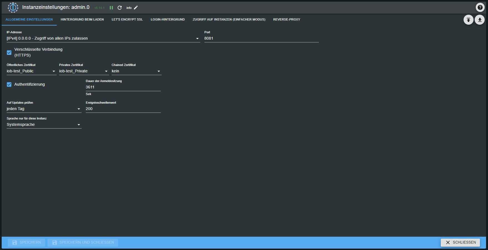
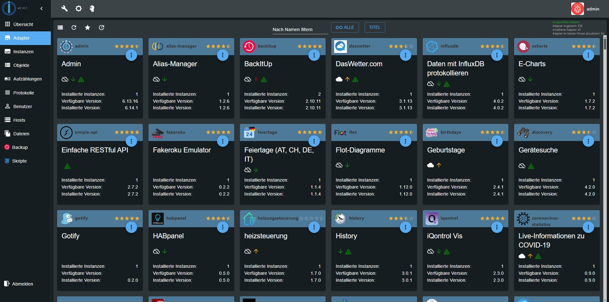

## ausführliche Beschreibung

Der Adapter admin dient der Bedienung der gesamten ioBroker-Installation. Er stellt ein Webinterface zur Verfügung. Dieses wird unter der `<IP-Adresse des Servers>:8081` aufgerufen. Dieser Adapter wird direkt bei der Installation von ioBroker angelegt.

Über das vom Adapter zur Verfügung gestellte GUI können u.a. folgenden Funktionen abgerufen werden:

*   Installation weiterer Adapter
*   Zugriff auf Objektübersicht
*   Zugriff auf die Zustandsübersicht der Objekte
*   Zugriff auf Benutzer und Gruppen Administration
*   Zugriff auf das Logfile
*   Verwaltung der Hosts

## Installation

Dieser Adapter wird direkt bei der Installation von ioBroker angelegt eine manuelle Installation ist nicht notwendig

## Konfiguration

#### IP

Hier wird die IP-Adresse unter der der Adapter erreichbar ist eingegeben. Verschiedene Ipv4 und Ipv6 Möglichkeiten stehen zur Auswahl. 
**Default ist 0.0.0.0\. Dies darf nicht verändert werden!**

#### Port

Hier wird der Port, unter der der Administrator aufgerufen werden kann eingestellt. Falls auf dem Server mehrere Webserver laufen muss dieser Port angepasst werden, damit es nicht zu Problemen wegen doppelter Portvergabe kommt.

#### Verschlüsselung

Soll das sichere Protokoll https verwendet werden ist hier ein Haken zu setzen.

#### Authentifikation

Soll eine Authentifizierung erfolgen ist hier ein Haken zu setzen.

## Bedienung

Über den Webbrowser die folgende Seite aufrufen: 

`<IP-Adresse des Servers>:8081`

## Reiter

Die Hauptseite des Administrators besteht aus mehreren Reitern. In der Grundinstallation werden die Reiter wie in der Abbildung angezeigt. Über das Bleistift-Icon rechts oben (1) können nach der Installation zusätzlicher Adapter weitere Reiter hinzugefügt werden. Dort können auch Reiter deaktiviert werden um eine besser Übersicht zu erhalten.

Ausführliche Informationen sind in den Seiten hinterlegt, die über die Überschriften verlinkt sind.

### [Adapter](/#/docs/adapterref/iobroker.admin/admin/tab-adapters.md)

Hier werden die verfügbaren und installierten Adapter angezeigt und verwaltet.

### [Instanzen](/#/docs/adapterref/iobroker.admin/admin/tab-instances.md)

Hier werden die bereits über den Reiter Adapter installierten Instanzen aufgelistet und können entsprechend konfiguriert werden.

### [Objekte](/#/docs/adapterref/iobroker.admin/admin/tab-objects.md)

Die verwalteten Objekte (z.B. die Geräte/Variablen/Programme der CCU). Hier können Objekte angelegt und gelöscht werden. 
Über die _Pfeil hoch_ und _Pfeil runter_ Knöpfe können ganze Objektstrukturen hoch- oder runtergeladen werden. 
Ein weiterer Knopf ermöglicht die Anzeige der Expertenansicht.

Werden Werte in roter Schrift angezeigt, sind sie noch nicht bestätigt (`ack = false`).

### [Zustände](/#/docs/adapterref/iobroker.admin/admin/tab-states.md)

Die aktuellen Zustände der Objekte.

### [Ereignisse](/#/docs/adapterref/iobroker.admin/admin/tab-events.md)

Eine Liste der laufenden Aktualisierung der Zustände.

### [Gruppen](/#/docs/adapterref/iobroker.admin/admin/tab-groups.md)

Hier werden die angelegten Usergruppen angelegt und die Rechte verwaltet

### [Benutzer](/#/docs/adapterref/iobroker.admin/admin/tab-users.md)

Hier können Benutzer angelegt und zu den bestehenden Gruppen hinzugefügt werden.

### [Aufzählungen](/#/docs/adapterref/iobroker.admin/admin/tab-enums.md)

Hier werden die Favoriten, Gewerke und Räume aus der Homematic-CCU aufgelistet.

### [hosts](/#/docs/adapterref/iobroker.admin/admin/tab-hosts.md)

Informationen über den Rechner, auf dem ioBroker installiert ist. 
Hier kann die aktuelle Version des js-Controllers upgedated werden. 
Liegt eine neue Version vor, erscheint die Beschriftung des Reiters in grüner Farbe.

### [Log](/#/docs/adapterref/iobroker.admin/admin/tab-log.md)

Hier wird das log angezeigt

Im Reiter Instanzen kann bei den einzelnen Instanzen der zu loggende Loglevel eingestellt werden. 
In dem Auswahlmenü wird der anzuzeigende Mindest-Loglevel ausgewählt. 
Sollte ein Error auftreten, erscheint die Beschriftung des Reiters in roter Farbe.

Nach der Installation zusätzlicher Adapter können noch weitere Reiter über das 
Bleistift-Icon oben rechts (1) aktiviert werden. Die Beschreibung dieser 
Reiter befindet sich bei dem entsprechenden Adapter.

### [Systemeinstellungen](/#/docs/adapterref/iobroker.admin/admin/tab-system.md)

In dem sich hier öffnenden Menü werden Einstellungen wie Sprache, Zeit- und Datumsformat sowie 
weitere systemweite Einstellungen getätigt. 

 

Auch die Repositorien und Sicherheitseinstellungen können hier eingestellt werden. 
Eine tiefergehende Beschreibung ist über den Link in dem Titel dieses Abschnitts zu erreichen.

## Changelog
<!--
    Placeholder for the next version (at the beginning of the line):
    ### **WORK IN PROGRESS**
-->
### **WORK IN PROGRESS**
- (@GermanBluefox) Fixed: the search in the log files and the "use the assistant without an API" dialog asked for no permission at all. Both are reachable for everyone who may use `sendTo` - the first reads the log files of a host from its disk, which hold whatever any adapter ever logged, a token or a password in a stack trace included; the second names every address at which this system offers its tooling. Reading the log over the socket (`readLogs`) has always required the `execute` right, so both require it now too, and both are attributed to the user of the GUI session that asked - a message carries no user of its own. The log search of a GUI without such a session is refused instead of answered
- (@GermanBluefox) Fixed: the AI assistant trusted the message it was asked with. A message box message carries neither a socket id nor a user, so `chat:send` could not tell who was asking - and took the endpoint, the permission mode and the confirmation of its own actions out of that same message, while every tool ran as `system.user.admin`. A page now receives the secret of a session when it subscribes for pushed answers, and the adapter records the user and the rights of that connection: the tools run under the ACLs of the user who asked, "actions allowed" requires the `execute` right - the one a command on the host needs - and a confirmation only counts for an action the assistant itself proposed in the previous turn, with exactly the arguments it proposed. Which endpoint, model and credential are used is read from `system.ai` and no longer taken from the request, so a request can neither point a stored key at another host nor name a provider the settings do not. `chat:callTool` and `chat:testConnection` - a single tool call without a confirmation step, and a request to a URL of one's choosing - need the same `execute` right. A user in a custom group that may use `sendTo` but not execute can therefore still ask the assistant, but no longer let it act. Reported by two external security researchers
- (@GermanBluefox) Fixed: the AI assistant answered with an empty bubble, and a search in the log files ended in "timeout", as soon as the request took longer than half a minute. `@iobroker/ws` answers every socket callback with "timeout" after 30 s (hard-coded), so the answer of a request that ran longer arrived in a callback that no longer existed - no error, nothing in any log, because the backend had done its job. The GUI subscribes to an instance message now, `chat:send` and `admin:searchLogs` are acknowledged immediately and the finished answer is pushed to exactly the browser tab that asked for it: ten minutes for a turn of the assistant, two for a search, which waits a minute for the files of another host alone. The same mechanism as in `ioBroker.javascript`; a frontend or a script that does not ask for the push keeps the plain request/response behaviour
- (@GermanBluefox) Added: "Maximum answer length" in the settings of the AI assistant. Anthropic requires `max_tokens` with every request and 8192 was hard-coded, so a longer answer was cut off mid-sentence. The value is clamped into the range every model accepts (1024 ... 200000), an empty field keeps the 8192, and it is only offered for Anthropic - the only provider that insists on the parameter
- (@GermanBluefox) Fixed: the news of the notification dialog ("Important messages") were always shown in English. The news come from `news.json` with all their translations, but only `title.en` and `content.en` were handed to the notification system, so a German system read "js-controller news - update required" in English between the German heading and the German description. The language of the system is used now, English stays the fallback. The notifications that are already stored keep the text they were written with, because the notification system of the js-controller holds a message as plain text, not as a translation (#3534)
- (@GermanBluefox) Fixed: the notification dialog showed "undefined" as the name of a tab, as its heading or as its description if the adapter that defines the scope has no translation for the language of the GUI. The texts were read with the current language alone - English is used as the fallback now, and the name of the category if even that is missing
- (@GermanBluefox) Fixed: Chrome offered to generate a "strong password" as soon as the key of a credential was edited, and wanted to store it in the Google password manager afterwards - an API key of Anthropic has nothing to do with the password manager of the browser. The fields carried `autocomplete="new-password"`, which is exactly the sign for Chrome that a new password is created here. The key fields of the credentials dialog and of the "create credential" dialog of the AI assistant are normal text inputs now, masked by CSS, so no password manager touches them. An eye at the end of every secret field shows what was typed or pasted - it is disabled as long as the field holds the placeholder of an already stored secret, and every credential starts masked again

### 8.0.23 (2026-10-03)
- (@GermanBluefox) Changed: the info dialog of a host on the quick access page shows what it knows instead of what the host sends. Every line has an icon in front of it - the penguin, the window, the apple or the daemon for the platform, a chip for the CPU, a clock for the time - the names start with a capital letter, and a `true` is now a "Yes". The disk is no longer two lines with two numbers but one bar that fills with the free space, `11.8 GB / 26.2 GB`, red as soon as less than a tenth is left. The time of the host was a bare timestamp like `1790980340380` because the entry was looked up under `Time` while the host calls it `time`; it is now the wall clock of the host, shifted by the time zone the host reports, so neither UTC nor the time zone of the browser is shown
- (@GermanBluefox) Changed: "adapters count" is called "Adapters in repository" now. It counts the adapters that the active repository offers - 812 of them - and was read as the number of the installed ones
- (@GermanBluefox) Fixed: ENTER in the "Write value" dialog reloaded the whole GUI now and then. Its inputs sit in a `<form>` whose `onSubmit` returned `false` - which prevents nothing in react - so the browser submitted the form, and as it has no `action`, it requested the current address anew. Chrome submits on ENTER in a one line input and on CTRL+ENTER in a text area, which is exactly when it happened. The same form is used by the value editor of the history table and by the multihost settings
- (@GermanBluefox) Added: CTRL+ENTER confirms the dialogs of the object browser, the expert mode included: "Write value" whatever the type of the state is, "Edit object", the role, the alias, the new object, the custom settings ("Save & close"), rename/copy and the import of objects. Only a few text fields reacted to the combination, the JSON editors and all other inputs did not, and nothing told about the shortcut - the confirming button of every one of these dialogs carries the hint as a tooltip now
- (@GermanBluefox) Changed: a global dependency has to be fulfilled on every host of a multihost system, but the update dialog showed a single version and crossed it out - `admin (>=8.0.0): 8.0.14` with a red cross in front of it, which reads as if 8.0.14 were older than 8.0.0. The hosts that still run a version that is too old are listed under the line now, each with the version it has, and the tooltip of the adapter row says the same instead of "Invalid version of admin. Required >=8.0.0. Current 8.0.14" (#3666)
- (@GermanBluefox) Added: an instance whose adapter is not installed on its host is marked as such. It can never start, and nothing said why - it stayed red among the ones that are merely stopped. A restored backup leaves such instances behind: the objects of the adapter come back with the backup, while the code of an adapter that has left the repository, `flot` for example, cannot be installed any more. The status indicator of the row carries an error sign now, the tile one next to the name, and both say "The adapter is not installed on host ..." on hover. Only the host itself knows what it really has, so every host that runs is asked - without the list of the instances waiting for the answer (#3626)
- (@GermanBluefox) Added: the context menu of the object browser has an entry "Edit name" (Alt+9), without the expert mode and next to "Edit function" and "Edit room". Changing the name of an object is an everyday operation, but it was only reachable through "Edit object" - which the expert mode hides. A name that is translated keeps its other languages, only the language of the GUI is written (#3640). Lives in `@iobroker/gui-components` and needs its next version
- (@GermanBluefox) Fixed: the settings page of admin showed the whole "Single sign-on" tab in English, whatever the language: none of its labels and hints had ever reached `admin/i18n`, so every one of them fell back to its English key. The five texts of the AI assistant about leaving a tab were missing in nine languages, and the hint about the filtered adapters was left in English in Chinese

### 8.0.22 (2026-10-02)
- (@GermanBluefox) Fixed: the link of an adapter that runs as a web extension lost everything behind the host. `energiefluss-erweitert` points at `.../energiefluss-erweitert/?instance=%instance%`, and the quick access offered `.../energiefluss-erweitert/` - without the page and without the instance. Such an adapter has no own port, so the origin of its link has to come from the web instance that serves it, but the whole address was built anew instead of only its origin being exchanged. The same happened to `habpanel`, whose `index.html` disappeared, and to a second link of an adapter that pointed at its documentation on a foreign host: it ended up on the own web server (#3661)
- (@GermanBluefox) Fixed: a card of the quick access belonged to whichever adapter was processed first. Every vis-2 widget adapter registers a link to the vis-2 runtime, and because the instance IDs decide the order, `vis-2` itself lost its own card to one of them, together with its name, its icon and its color. The card now belongs to the adapter that serves the page
- (@GermanBluefox) Added: the admin recognizes that it was opened through the remote access of ioBroker Cloud/Pro and moves the links onto the service. The quick access, the instance list and the tabs of the left menu pointed into the local network, which is of no use to somebody who is not in it. Which instances the service publishes is read from the configuration of the `cloud` or `iot` adapter, so nothing is guessed: the web instance is reachable at `/`, the admin at `/admin/` and lovelace at `/lovelace/`. A page the service does not publish - Node-RED or a second admin, for example - is no longer offered as a dead link but shown dimmed with a note that it only works in the local network
- (@GermanBluefox) Added: the identity provider for the single sign-on can be configured. The issuer, the client ID, an optional client secret and the scopes are set in the new "Single sign-on" tab of the admin settings, and the endpoints are read from the discovery document of the issuer, so every provider that follows the standard works. Without a complete configuration the SSO stays off and the login page does not offer it (needs `@iobroker/webserver` 3.3.0)
- (@GermanBluefox) Fixed: with authentication enabled, the GUI took seconds to come up and sometimes did not come up at all. If the access token had expired while the tab was closed, the websocket was opened with it, the server asked for a new one and then stopped listening on that connection: the token the browser fetched within milliseconds could not be announced, the browser waited for an answer that could not come until its own three second timeout, and the single-use refresh token was burnt for nothing before the whole start began again (needs `@iobroker/socket-classes` 2.6.2)
- (@GermanBluefox) Changed: `mime` was replaced by `mime-types`. `mime` 4 is ESM only, and version 3 is no longer maintained; `mime-types` uses the same database, is already part of the dependency tree through express, and three duplicated copies of it disappear from the lockfile. A JavaScript file is now served as `text/javascript` instead of the deprecated `application/javascript`

### 8.0.21 (2026-09-29)
- (@GermanBluefox) Fixed: on a grown installation, the start of the GUI ran into "Detected slow connection!" and the dialog offering a longer read timeout, on a fast local network as well. The start page read the whole object database only to count the objects and the states for its tile - 32 MB on a system with 10,000 objects - which blocked the admin process for seconds, so every other request of the start waited for it and ran into its own timeout. The counting is now done by the server, which answers with two numbers instead (needs `@iobroker/socket-classes` 2.6.0 and `@iobroker/socket-client` 5.4.0; an older backend still reads all objects, but delayed until the start is through). The whole start now transfers 2.4 MB, and the object database is no longer part of it (#3656)
- (@GermanBluefox) Fixed: the news check read all objects a second time, right after the start page had read them
- (@GermanBluefox) Fixed: the admin stayed on its logo and only came up after the page was reloaded. The start reads its own settings, the easy mode and the GUI settings one after the other, and each of them with a timeout of five seconds - which is less than a busy host needs for the first requests. Those reads no longer end the start, and whatever else goes wrong, the app is shown instead of the loader: the menu, the error message and the reconnect are more use than a logo that never goes away (#3641)
- (@GermanBluefox) Changed: the read timeout starts at 30 seconds instead of 15 (60 instead of 40 in the cloud), and it now applies to every request of the start instead of only to the repository and the installed versions
- (@GermanBluefox) Changed: the dialog about a slow connection only appears for a read the user asked for - switching the host or retrying from the dialog itself. Nothing waits for the read of the start any more, so a dialog there interrupted a start that was going perfectly well otherwise
- (@GermanBluefox) Added: the "Resource usage" card has a button that first stops the recording of CPU and RAM by the history instance, then collapses the card, which gives the system log room for 16 lines instead of 6. A collapsed card reads nothing at all until it is opened again, and it stays collapsed after a reload (needs `@iobroker/gui-components` 10.3.7)
- (@GermanBluefox) Fixed: a timeout while reading `guiSettings` at the start overwrote the stored GUI settings of the user with the defaults
- (@GermanBluefox) Fixed: the system log of the start page was left empty by "Cannot get logs: TypeError: e.pop is not a function" when the host answered with anything but its log lines

### 8.0.20 (2026-09-26)
- (@GermanBluefox) Fixed: in the credentials of the system settings, a long translation of the type - "Benutzerdefiniert" in German - ran into the ID next to it, because the column had a fixed width that the text did not fit into. The column is wider now, and a translation that is longer still is cut with an ellipsis and shown in full as a tooltip (#3642)
- (@GermanBluefox) Changed: an object of an adapter can only be deleted in the expert mode now - the delete button in the row, the entry in the context menu and the `Delete` key are gone without it. Deleting such an object can stop the adapter from working, and it is created again at its next start anyway. Objects a user creates themselves (`0_userdata.*` and `alias.*`) can still be deleted without the expert mode (#3639)
- (@GermanBluefox) Fixed: an object whose ID contains a "/" - e.g. `ocpp.0./TACW1142021G1543.1.meterValues.Power_Active_Import` - could not be opened from the object tree. The ID went into the URL unencoded, so it was read back cut off at its first slash: the dialog showed the wrong title, the history settings started at 1 January 1970, the "Chart" tab disappeared and switching the tab ended in `can't access property "ocpp.0."`. The ID now survives the round trip through the URL (#3634). Needs `@iobroker/gui-components` 10.3.5
- (@GermanBluefox) Fixed: in a multihost system, the Log tab asked its own controller whether `getLogs` understands a log level, but sent the request to the selected host. If that host still ran an older js-controller, it answered with the complete log file. The question now goes to the host whose log is shown
- (@GermanBluefox) Fixed: if a host knows the command `searchLogs` but cannot carry it out - e.g. because it writes no log file at all - the Log tab showed its error. Its files are now read the way those of an older controller are read
- (@GermanBluefox) The assistant is shown only on admin tabs, not on the config pages of other adapters.

### 8.0.18 (2026-09-23)
- (@krobipd) Fixed: the admin showed its start screen for half a minute when the host could not reach the repository server (no internet, firewall). The start no longer waits for the repository and the installed versions; only the adapters tab needs them, and it fills itself as soon as they arrive
- (@krobipd) Fixed: on a slow or busy host, the admin start ended with "Cannot get hosts: Error: timeout" and an empty menu column until the page was reloaded. The menu and the host selector now try again (after 2 s, 5 s, then every 10 s) and after a reconnect, without an alert for each failed attempt; a missing permission is still reported once
- (@krobipd) Fixed: when the instance objects could not be read, the pinned config manager entries were deleted from the menu
- (@krobipd) Changed: several instance changes in a row rebuild the menu only once, and an older rebuild can no longer overwrite a newer one
- (@GermanBluefox) Changed: in the categories, an object dragged from one room or function onto another one is moved there; it is copied only if Shift, Ctrl or Alt is held while dropping (formerly only Alt, and the object often appeared to be copied anyway). The preview at the pointer shows whether it will be moved or copied, and a hint below the members explains the keys
- (@GermanBluefox) Fixed: after an object was moved to another room or function, it was still shown in the old one until the page was reloaded
- (@GermanBluefox) Added: the "Default History" selection in the base settings shows the icons of the history adapters, in the list and in the field
- (@GermanBluefox) Added: the base settings open with the tab that was used last, unless the link names a tab

## License

The MIT License (MIT)

Copyright (c) 2014-2026 bluefox <dogafox@gmail.com>

[Full license text](LICENSE)