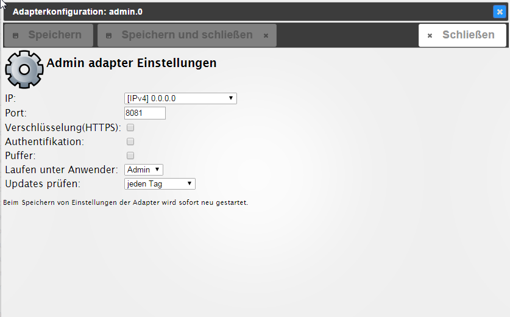
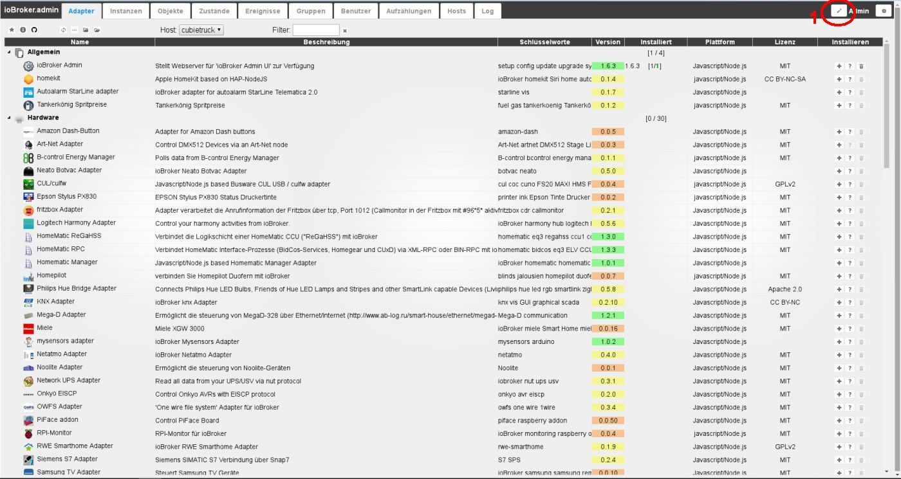
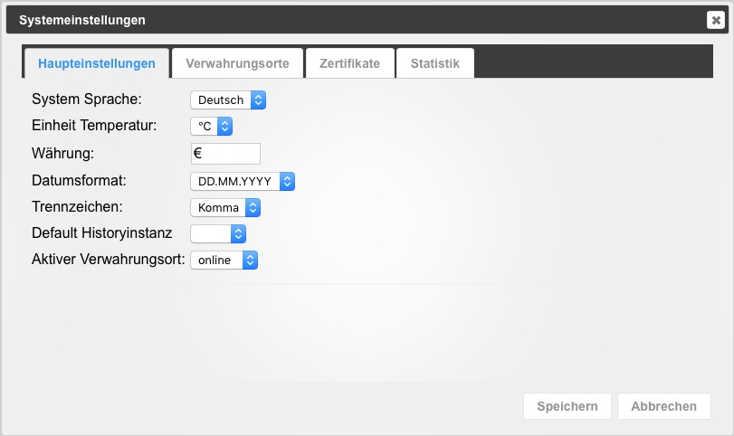

## ausführliche Beschreibung

Der Adapter admin dient der Bedienung der gesamten ioBroker-Installation. Er stellt ein Webinterface zur Verfügung. Dieses wird unter der `<IP-Adresse des Servers>:8081` aufgerufen. Dieser Adapter wird direkt bei der Installation von ioBroker angelegt.

Über das vom Adapter zur Verfügung gestellte GUI können u.a. folgenden Funktionen abgerufen werden:

*   Installation weiterer Adapter
*   Zugriff auf Objektübersicht
*   Zugriff auf die Zustandsübersicht der Objekte
*   Zugriff auf Benutzer und Gruppen Administration
*   Zugriff auf das Logfile
*   Verwaltung der Hosts

## Installation

Dieser Adapter wird direkt bei der Installation von ioBroker angelegt eine manuelle Installation ist nicht notwendig

## Konfiguration

#### IP

Hier wird die IP-Adresse unter der der Adapter erreichbar ist eingegeben. Verschiedene Ipv4 und Ipv6 Möglichkeiten stehen zur Auswahl. 
**Default ist 0.0.0.0\. Dies darf nicht verändert werden!**

#### Port

Hier wird der Port, unter der der Administrator aufgerufen werden kann eingestellt. Falls auf dem Server mehrere Webserver laufen muss dieser Port angepasst werden, damit es nicht zu Problemen wegen doppelter Portvergabe kommt.

#### Verschlüsselung

Soll das sichere Protokoll https verwendet werden ist hier ein Haken zu setzen.

#### Authentifikation

Soll eine Authentifizierung erfolgen ist hier ein Haken zu setzen.

## Bedienung

Über den Webbrowser die folgende Seite aufrufen: 

`<IP-Adresse des Servers>:8081`

## Reiter

Die Hauptseite des Administrators besteht aus mehreren Reitern. In der Grundinstallation werden die Reiter wie in der Abbildung angezeigt. Über das Bleistift-Icon rechts oben (1) können nach der Installation zusätzlicher Adapter weitere Reiter hinzugefügt werden. Dort können auch Reiter deaktiviert werden um eine besser Übersicht zu erhalten.

Ausführliche Informationen sind in den Seiten hinterlegt, die über die Überschriften verlinkt sind.

### [Adapter](admin/tab-adapters.md)

Hier werden die verfügbaren und installierten Adapter angezeigt und verwaltet.

### [Instanzen](admin/tab-instances.md)

Hier werden die bereits über den Reiter Adapter installierten Instanzen aufgelistet und können entsprechend konfiguriert werden.

### [Objekte](admin/tab-objects.md)

Die verwalteten Objekte (z.B. die Geräte/Variablen/Programme der CCU). Hier können Objekte angelegt und gelöscht werden. 
Über die _Pfeil hoch_ und _Pfeil runter_ Knöpfe können ganze Objektstrukturen hoch- oder runtergeladen werden. 
Ein weiterer Knopf ermöglicht die Anzeige der Expertenansicht.

Werden Werte in roter Schrift angezeigt, sind sie noch nicht bestätigt (`ack = false`).

### [Zustände](admin/tab-states.md)

Die aktuellen Zustände der Objekte.

### [Ereignisse](admin/tab-events.md)

Eine Liste der laufenden Aktualisierung der Zustände.

### [Gruppen](admin/tab-groups.md)

Hier werden die angelegten Usergruppen angelegt und die Rechte verwaltet

### [Benutzer](admin/tab-users.md)

Hier können Benutzer angelegt und zu den bestehenden Gruppen hinzugefügt werden.

### [Aufzählungen](admin/tab-enums.md)

Hier werden die Favoriten, Gewerke und Räume aus der Homematic-CCU aufgelistet.

### [hosts](admin/tab-hosts.md)

Informationen über den Rechner, auf dem ioBroker installiert ist. 
Hier kann die aktuelle Version des js-Controllers upgedated werden. 
Liegt eine neue Version vor, erscheint die Beschriftung des Reiters in grüner Farbe.

### [Log](admin/tab-log.md)

Hier wird das log angezeigt

Im Reiter Instanzen kann bei den einzelnen Instanzen der zu loggende Loglevel eingestellt werden. 
In dem Auswahlmenü wird der anzuzeigende Mindest-Loglevel ausgewählt. 
Sollte ein Error auftreten, erscheint die Beschriftung des Reiters in roter Farbe.

Nach der Installation zusätzlicher Adapter können noch weitere Reiter über das 
Bleistift-Icon oben rechts (1) aktiviert werden. Die Beschreibung dieser 
Reiter befindet sich bei dem entsprechenden Adapter.

### [Systemeinstellungen](admin/tab-system.md)

In dem sich hier öffnenden Menü werden Einstellungen wie Sprache, Zeit- und Datumsformat sowie 
weitere systemweite Einstellungen getätigt. 

 

Auch die Repositorien und Sicherheitseinstellungen können hier eingestellt werden. 
Eine tiefergehende Beschreibung ist über den Link in dem Titel dieses Abschnitts zu erreichen.

## Changelog

### **WORK IN PROGRESS**
* (foxriver76) fixed "Let's Encrypt" link not being clickable inside system settings
* (foxriver76) fixed false positives for "not much space left on device" warning
* (foxriver76) fixed issue with npm version determination on some installations
* (foxriver76) reset the logout timer UI if session is extended
* (rovo89) apply button color change of v6.6.1 for all buttons
* (foxriver76) correctly display materialized tabs when configured with io-package `adminUi` property
* (foxriver76) enable keyboard navigation for objects tab

### 6.6.1 (2023-07-17)
* (foxriver76) Many GUI improvements
* (bluefox) New json config component added: license agreement
* (foxriver76) also show non-stable repo warning on the hosts tab
* (foxriver76) fixed jsonConfig slider with different max/min values than 0/100
* (foxriver76) fixed jsonConfig number element arrows
* (foxriver76) fixed jsonConfig coordinates not triggering onChange and not being prefilled
* (foxriver76) fixed jsonConfig jsonEditor component
* (foxriver76) assume status as offline if status state value has been deleted (e.g., via `setState` with `expire` option)
* (foxriver76) fixed jsonConfig CheckLicense edge case error
* (foxriver76) added tooltip to ObjectBrowserValue to show that ack-flag cannot be used to control a device
* (foxriver76) fixed host name not being visible on some themes
* (foxriver76) fixed issue with jsonConfig CRON placeholder overlapping input
* (foxriver76) button color in non-expert mode will not be changed according to ack/q anymore
* (foxriver76) fixed multiple problems with jsonConfig coordinates when using `useSystemName` and separate `latitude`/`longitutde` states
* (foxriver76) when adding an icon to an object, to not show already uploaded non-existing image initially
* (foxriver76) when the session timer falls below the 2 - minute mark, show button to extend the session

### 6.6.0 (2023-07-05)
* (klein0r) New json config component added: accordion
* (bluefox) Added site name and corrected the system dialog

### 6.5.9 (2023-06-19)
* (bluefox) Added support for update of the js-controller slaves

### 6.5.8 (2023-06-12)
* (foxriver76) The log size will be parsed correctly for controller v5

## License
The MIT License (MIT)

Copyright (c) 2014-2023 bluefox <dogafox@gmail.com>