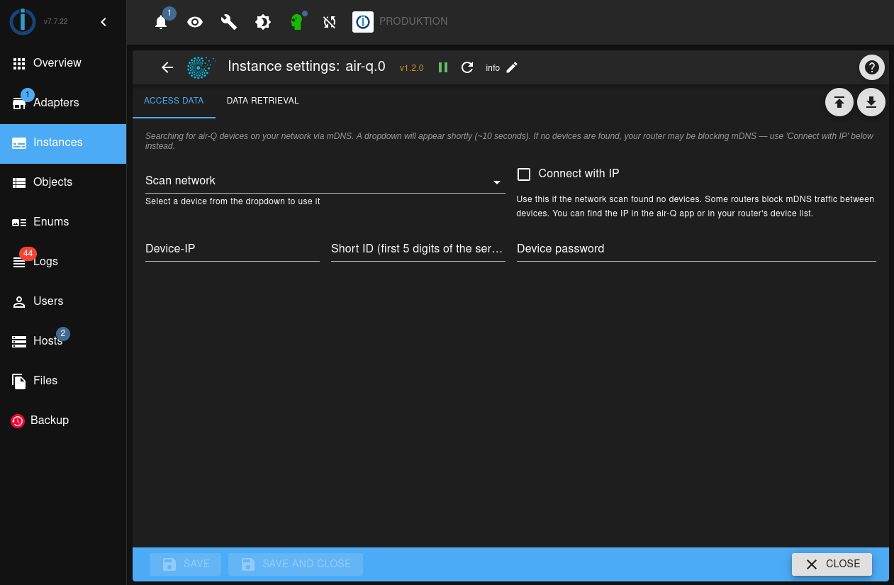

# IoBroker.air-q


**Tests:** 

## Inhalt
- [Über uns](#about)
- [Erste Schritte](#start)
- [Änderungsprotokoll](#change)
- [Lizenz](#Lizenz)

## Um<a id="about"/>
Dieser ioBroker-Adapter wird in Verbindung mit unserem [air-Q Gerät](https://www.air-q.com) verwendet. Er ruft die Werte unserer Sensoren ab und zeigt sie Ihnen in der ioBroker-Umgebung an.

</br></br>


## Erste Schritte<a id="start" />
### Installieren Sie den Adapter und fügen Sie eine Instanz hinzu.
Navigieren Sie in Ihrer Admin-Oberfläche in der Seitenleiste zu `Adapters` und suchen Sie in `Filter by name` nach `air-q`. Wählen Sie im Menü `⋮` (`Info`) des Adapters `+` (`Add instance`) aus.

Dadurch werden die Instanzeinstellungen automatisch geöffnet.

Alternativ können Sie die ioBroker-Befehlszeilenschnittstelle über die Konsole verwenden. Wechseln Sie einfach in Ihr ioBroker-Stammverzeichnis und fügen Sie den Adapter hinzu.

```
iobroker add air-q
```

Dadurch wird der Adapter installiert (falls er noch nicht installiert ist) und eine Instanz hinzugefügt. Diese Instanz muss anschließend noch konfiguriert werden, wie unten beschrieben.

Falls Sie den Adapter nur installieren möchten, ohne bereits eine Instanz zu erstellen, verwenden Sie folgenden Befehl:

```
iobroker install air-q
```

Weitere Informationen finden Sie in der ioBroker CLI-Dokumentation unter https://github.com/ioBroker/ioBroker/wiki/Console-commands.

## Konfiguration


### Ihr air-Q-Gerät finden
Der Adapter erkennt air-Q-Geräte in Ihrem lokalen Netzwerk automatisch mithilfe von mDNS (Bonjour). Wenn Sie die Instanzeinstellungen öffnen, sucht das Dropdown-Menü **Netzwerk scannen** nach Geräten (ca. 10 Sekunden) und listet alle gefundenen air-Q-Geräte nach Namen auf. Wählen Sie Ihr Gerät aus; die Kurz-ID und die IP-Adresse werden automatisch ausgefüllt.

**Wenn keine Geräte gefunden werden**, blockiert Ihr Router möglicherweise den mDNS-Verkehr zwischen Geräten (häufig bei Mesh-Netzwerken, Gastnetzwerken oder Unternehmensnetzwerken). Aktivieren Sie in diesem Fall das Kontrollkästchen **Mit IP verbinden** und geben Sie die IP-Adresse des Geräts manuell ein. Sie finden die IP-Adresse in der air-Q Smartphone-App oder in der Geräteliste Ihres Routers.

Sie können den Adapter auch über **ioBroker.discovery** konfigurieren: Führen Sie einen Netzwerkscan vom Discovery-Adapter aus durch, und air-Q-Geräte werden automatisch über DNS oder HTTP erkannt.

### Verbindungsoptionen
- **Netzwerk scannen**: Erkennt air-Q-Geräte automatisch über mDNS. Wählen Sie ein Gerät aus, um die Kurz-ID und die IP-Adresse automatisch ausfüllen zu lassen.
- **Verbindung über IP**: Stellen Sie die Verbindung direkt über die IP-Adresse des Geräts her. Verwenden Sie diese Option, wenn die mDNS-Erkennung in Ihrem Netzwerk nicht funktioniert.
- **Kurz-ID**: Die ersten 5 Zeichen der Seriennummer Ihres Geräts. Wird für die mDNS-Abfrage verwendet, wenn „Mit IP verbinden“ deaktiviert ist.
- **Gerätepasswort**: Das Passwort Ihres air-Q-Geräts.

### Optional
- **Nachtmodus des Geräts berücksichtigen**. Standard: „Ein“. Wenn auf Ihrem air-Q-Gerät der Nachtmodus aktiviert und WLAN nachts deaktiviert ist, kann der Adapter Abfrageversuche während dieser Stunden automatisch überspringen. Dadurch werden unnötige Verbindungsfehler in Ihren Protokollen vermieden. ⚠️ Wenn Sie die Nachtmoduseinstellungen Ihres Geräts ändern (Start-/Endzeit, Aktivieren/Deaktivieren), haben Sie zwei Möglichkeiten:
1. (Empfohlen): Starten Sie den Adapter neu, um die neue Konfiguration sofort zu laden.
2. (Automatisch): Warten Sie bis zu 1 Stunde, bis der Adapter die Konfiguration automatisch aktualisiert (funktioniert nur außerhalb der Nachtmoduszeiten).

- **Negative Werte abschneiden**. Standard: `aus`. Zur Kalibrierung der Basislinie können bestimmte Sensorwerte kurzzeitig negativ werden. Sie können diese Werte bedenkenlos auf 0 abschneiden.

- **Daten alle x Sekunden abfragen**. Standardwert: `10`. Sie können die Abfragehäufigkeit in Sekunden festlegen.

- **Datentyp auswählen**. Standard: „Durchschnittswerte“. In der Standardkonfiguration mittelt air-Q die Sensorwerte. Mit diesem Adapter können Sie zwischen dem Abrufen der gemittelten und der Rohdaten vom Gerät umschalten. Um verrauschte Sensorwerte abzurufen, wählen Sie im Dropdown-Menü „Echtzeitdaten“ aus.

Jetzt sind Sie bestens vorbereitet und können loslegen!

## Sensoren sind Objekte
Die Daten werden abgerufen und gemäß Ihrer Konfiguration im Objekt-Tab angezeigt, sobald das Gerät gefunden wurde. Je nach Ihrem Gerät können natürlich weitere Sensoren angezeigt werden.


***Aktuell sind alle Sensoren für den air-Q Pro enthalten. Optionale Sensoren werden in einem zukünftigen Patch hinzugefügt.***

## Changelog

### 1.2.0
* **Network discovery**: air-Q devices on the local network are now automatically discovered via mDNS. Select a device from the dropdown and the Short ID and IP are filled in automatically.
* **Admin UI modernized**: Migrated from Materialize HTML to jsonConfig (declarative JSON). Settings are now organized in two tabs: Connection and Data Retrieval.
* **ioBroker.discovery integration**: Fixed the detection file to correctly populate adapter config fields, call the discovery callback, and distinguish multiple air-Q devices. Added HTTP `/ping` fallback for networks without reverse DNS.
* **Troubleshooting guidance**: The admin UI now explains what to do when mDNS doesn't work (router blocking, how to find the device IP).

### 1.1.0
* Added support for 19 new sensors: acetaldehyde (C₂H₄O), arsine (AsH₃), bromine (Br₂), methanethiol (CH₄S), chlorine dioxide (ClO₂), carbon disulfide (CS₂), ethylene (C₂H₄), fluorine (F₂), temperature in Farenheit, hydrochloric acid (HCl), hydrogen cyanide (HCN), hydrogen fluoride (HF), hydrogen peroxide (H₂O₂), mold protection, phosphine (PH₃), refrigerant R-32, refrigerant R-454B, refrigerant R-454C, silane (SiH₄)

### 1.0.7
* Missing (e.g. warming up) sensors are skipped gracefully
* Fixed incorrect translations
* Refactor redundant methods

### 1.0.6
* The adapter can automatically respect your air-Q device's night mode configuration

### 1.0.5
* Fixed sensors dropping custom configuration after a restart
* Updated dependencies: version bump for `adapter-core`

### 1.0.4

* Updated dependencies: bumped multiple packages (`chai-as-promised`, `sinon`, `mocha`) to address vulnerabilities
* Codebase maintenance: updated `io-package.json` and added tests against Node.js 22

### 1.0.3

* Added a checkbox for showing and hiding the password in the instance configuration
* Edited the error messages to be more helpful
* Added logging information when the air-Q device is actually connected

### 1.0.2

* Added units for each sensor value
* Updates within config files

### 1.0.1

* Added sensor list update when connecting to a different air-Q in the same instance
* Fixed name display and update of device

### 1.0.0

* Include typescript files by @pr0crstntr in #6
* Created air-Q class by @pr0crstntr in #4
* Fix restart bug by @pr0crstntr in #7
* Update data poll by @pr0crstntr in #8
* Updated io-package by @pr0crstntr in #9
* Fixed save option for configuration by @pr0crstntr in #16
* Added clear intervals on unload by @pr0crstntr in #26
* Update README by @pr0crstntr in #37
* Changed role for temperature and added unit by @pr0crstntr in #38

### 0.0.1

* (Katharina K.) initial release

## License

MIT License

Copyright (c) 2024-2026 Corant GmbH

Permission is hereby granted, free of charge, to any person obtaining a copy
of this software and associated documentation files (the "Software"), to deal
in the Software without restriction, including without limitation the rights
to use, copy, modify, merge, publish, distribute, sublicense, and/or sell
copies of the Software, and to permit persons to whom the Software is
furnished to do so, subject to the following conditions:

The above copyright notice and this permission notice shall be included in all
copies or substantial portions of the Software.

THE SOFTWARE IS PROVIDED "AS IS", WITHOUT WARRANTY OF ANY KIND, EXPRESS OR
IMPLIED, INCLUDING BUT NOT LIMITED TO THE WARRANTIES OF MERCHANTABILITY,
FITNESS FOR A PARTICULAR PURPOSE AND NONINFRINGEMENT. IN NO EVENT SHALL THE
AUTHORS OR COPYRIGHT HOLDERS BE LIABLE FOR ANY CLAIM, DAMAGES OR OTHER
LIABILITY, WHETHER IN AN ACTION OF CONTRACT, TORT OR OTHERWISE, ARISING FROM,
OUT OF OR IN CONNECTION WITH THE SOFTWARE OR THE USE OR OTHER DEALINGS IN THE
SOFTWARE.