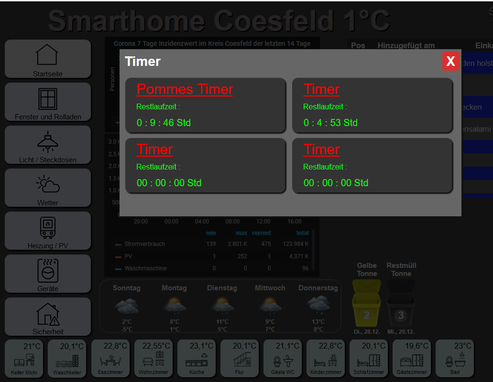

# IoBroker.alexa-timer-vis
**Tests:** 

## Alexa-timer-vis-Adapter für ioBroker
Geben Sie den Alexa-Timer zur Anzeige im Vis aus

### Dies ist ein Beispiel für mein vis

## Funktionalität
Ein Timer oder mehrere per Spracheingabe, wird über Alexa erstellt, dieser wird vom Adapter ausgewertet und in Zustände geschrieben um diese im Vis sichtbar zu machen. So haben Sie eine bessere Übersicht, wenn Sie mehrere Timer gleichzeitig aktiv haben.

* ---- Alexa2 Adapter wird benötigt ----
* Das Vis Widget ist noch nicht integriert
* Jeder Timer hat eine Taste, um ihn zu stoppen. Stoppt den Timer in Alexa und im Adapter
* Unbegrenzte Timer können mit Alexa per Sprachbefehl erstellt werden.
* Beim Start des Adapters werden 4 Ordner mit allen Zuständen erstellt.
* Zusätzliche Ordner werden erstellt, sobald ein 5. und mehr Timer über die Spracheingabe von Alexa erstellt werden.
* Es funktioniert mit deutscher Eingabe
* konfiguriert für deutsche Spracheingabe, Englisch (experimentell)

### Timer hinzufügen ( Beispiele )
* Alexa, Timer 5 Minuten
* Alexa, Pommes Timer 9 Minuten
* Alexa, stelle einen Timer auf 1 Stunde und 30 Minuten
* Alexa, stelle einen Timer auf 2 Stunden
* Alexa, Timer für 120 Minuten
* Alexa, Timer 9 Minuten Spaghetti

### Timer löschen ( Beispiele )
* Alexa, lösche alle Timer
* Alexa, Pommes-Timer löschen
* Alexa, lösche den 5-Minuten-Timer

### Wenn Sie Vorschläge haben, etwas zu verbessern oder weitere Funktionen hinzuzufügen, können Sie sich gerne an uns wenden

## Changelog
### 0.1.12 (15.02.2022)
* Delete of Timer fixed
### 0.1.11 (12.02.2022)
* Delete of Timer with same Inputvalue, fixed
* User can set the Intervall in admin
### 0.1.9 (30.1.2022)
* Bugfix
### 0.1.8 (28.01.2022)
* Bugfix
* Button added to stop the Timer
### 0.1.7 (22.06.2022)
* New State, "Input Device"
### 0.1.6 (17.01.2022)
* numbers from 1-9 are always displayed as two digits, 1 => 01
* When you update to this or a newer Version, please delete the timer folders or delete the whole adapter, otherwise errors will occur
### 0.1.5 (08.01.2022)
* New keywords added
### 0.1.4 (05.01.2022)
* States will be reset on adapter unload
* Bugfix
### 0.1.3 (02.01.2022)
* Start and EndTime added
### 0.1.2 (31.12.2021)
* Bugfix (A double created Intervall, fixed)
### 0.1.1 (29.12.2021)
* Adaptation to the English language (experimental)
* Anpassung an die Englische Sprache (experimentell)
### 0.1.0 (28.12.021)
* Fixed bug when deleting intervals and timeouts after shutdown
* Fehler beim Löschen von Intervallen und Timeouts nach dem Shutdown, behoben
### 0.0.4 (27.12.2021)
* Adaptation to various options for entering a timer
* Anpassung an verschiedener Möglichkeiten der Eingabe eines Timers
### 0.0.3 (26.12.2021)
* (Michael Roling) Bugfix
### 0.0.2 (26.12.2021)
* (Michael Roling) Bugfix
### 0.0.1 (25.12.2021)
* (Michael Roling) initial release

## License
MIT License

Copyright (c) 2021-2022 Michael Roling <michael.roling@gmx.de>

Permission is hereby granted, free of charge, to any person obtaining a copy
of this software and associated documentation files (the "Software"), to deal
in the Software without restriction, including without limitation the rights
to use, copy, modify, merge, publish, distribute, sublicense, and/or sell
copies of the Software, and to permit persons to whom the Software is
furnished to do so, subject to the following conditions:

The above copyright notice and this permission notice shall be included in all
copies or substantial portions of the Software.

THE SOFTWARE IS PROVIDED "AS IS", WITHOUT WARRANTY OF ANY KIND, EXPRESS OR
IMPLIED, INCLUDING BUT NOT LIMITED TO THE WARRANTIES OF MERCHANTABILITY,
FITNESS FOR A PARTICULAR PURPOSE AND NONINFRINGEMENT. IN NO EVENT SHALL THE
AUTHORS OR COPYRIGHT HOLDERS BE LIABLE FOR ANY CLAIM, DAMAGES OR OTHER
LIABILITY, WHETHER IN AN ACTION OF CONTRACT, TORT OR OTHERWISE, ARISING FROM,
OUT OF OR IN CONNECTION WITH THE SOFTWARE OR THE USE OR OTHER DEALINGS IN THE
SOFTWARE.