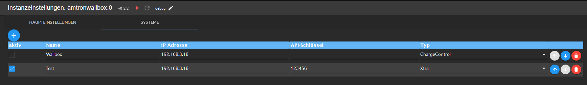

# IoBroker.amtronwallbox

**Dieser Adapter verwendet Sentry-Bibliotheken, um Ausnahmen und Codefehler automatisch an die Entwickler zu melden.** Weitere Details und Informationen zum Deaktivieren der Fehlerberichterstattung finden Sie unter [Sentry-Plugin-Dokumentation](https://github.com/ioBroker/plugin-sentry#plugin-sentry)! Sentry Reporting wird ab js-controller 3.0 verwendet.

**Wenn es Ihnen gefällt, denken Sie bitte über eine Spende nach:**

Der Adapter dient als Schnittstelle zu verschiedenen [Amtron-Wallboxen](https://www.mennekes.de/emobility/produkte/amtron-wallboxen/). Die von der Box bereitgestellten Daten werden ausgelesen und als Datenpunkt im Adapter zur Verfügung gestellt.
Die Daten werden nur lokal verarbeitet, eine Cloud-Anbindung ist nicht notwendig. Bei Wallboxen, die auch Schreibzugriff unterstützen, kann der Adapter Daten schreiben (z. B. Ladestrom).
Folgende Amtron-Wallboxen werden unterstützt:

* Amtron Xtra
* Amtron ChargeControl
* Amtron Compact

Der Adapter kann mehrere Boxen verwalten.

## Aufbau
Lediglich der Typ der Box, ihre IP-Adresse und ggf. ein API-Schlüssel müssen konfiguriert werden.

Hinweis: Da die Boxen über unterschiedliche Schnittstellen verfügen, kann es sein, dass nicht alle Schnittstellen direkt funktionieren. Bitte wenden Sie sich in diesem Fall an den Entwickler.

## Bekannte Probleme
* Bitte erstellen Sie Probleme bei [github](https://github.com/rg-engineering/ioBroker.amtronwallbox/issues), wenn Sie Fehler finden oder neue Funktionen wünschen.

## Changelog

<!--
  Placeholder for the next version (at the beginning of the line):
  ### **WORK IN PROGRESS**
-->
### 0.2.8 (2023-11-26)
* (René) role of states overworked

### 0.2.7 (2023-11-19)
* (René) dependencies updated

### 0.2.6 (2023-09-23)
* (René) bug fix for reported exceptions by sentry

### 0.2.5 (2023-08-27)
* (René) smaller bug fixes, see issue #59

### 0.2.4 (2023-07-30)
* (René) dependencies updated

### 0.2.3 (2023-06-01)
* (René) some changes to fullfill requirements to bring the adapter to latest

### 0.2.2 (2023-04-07)
* (René) dependencies updated

### 0.2.0 (2023-01-31)
* (René) see issue #1: write data to XTRA wallbox (experimentel)

### 0.1.0 (2022-12-18)
* (René) see issue #1: support of XTRA

### 0.0.3 (2022-08-18)
* (René) some bug fixes
* (René) change to cron
* (René) update of dependencies

### 0.0.1 (2022-05-19)
* (René) initial release

## License
MIT License

Copyright (c) 2022-2023 rg-engineering info@rg-engineering.eu

Permission is hereby granted, free of charge, to any person obtaining a copy
of this software and associated documentation files (the "Software"), to deal
in the Software without restriction, including without limitation the rights
to use, copy, modify, merge, publish, distribute, sublicense, and/or sell
copies of the Software, and to permit persons to whom the Software is
furnished to do so, subject to the following conditions:

The above copyright notice and this permission notice shall be included in all
copies or substantial portions of the Software.

THE SOFTWARE IS PROVIDED "AS IS", WITHOUT WARRANTY OF ANY KIND, EXPRESS OR
IMPLIED, INCLUDING BUT NOT LIMITED TO THE WARRANTIES OF MERCHANTABILITY,
FITNESS FOR A PARTICULAR PURPOSE AND NONINFRINGEMENT. IN NO EVENT SHALL THE
AUTHORS OR COPYRIGHT HOLDERS BE LIABLE FOR ANY CLAIM, DAMAGES OR OTHER
LIABILITY, WHETHER IN AN ACTION OF CONTRACT, TORT OR OTHERWISE, ARISING FROM,
OUT OF OR IN CONNECTION WITH THE SOFTWARE OR THE USE OR OTHER DEALINGS IN THE
SOFTWARE.