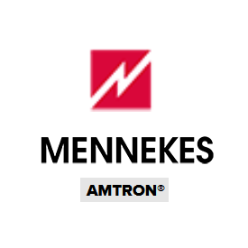
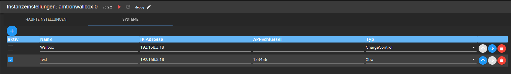

# IoBroker.amtronwallbox

**Dieser Adapter verwendet Sentry-Bibliotheken, um Ausnahmen und Codefehler automatisch an die Entwickler zu melden.** Weitere Details und Informationen zum Deaktivieren der Fehlerberichterstattung finden Sie in Abschnitt [Sentry-Plugin-Dokumentation](https://github.com/ioBroker/plugin-sentry#plugin-sentry)! Die Sentry-Berichterstattung wird ab js-controller 3.0 verwendet.

**Wenn es Ihnen gefällt, erwägen Sie bitte eine Spende:**

Der Adapter dient als Schnittstelle zu verschiedenen Geräten. Die von der Box bereitgestellten Daten werden ausgelesen und als Datenpunkt im Adapter verfügbar gemacht.
Die Daten werden ausschließlich lokal verarbeitet; eine Cloud-Verbindung ist nicht erforderlich. Bei Wallboxen, die auch Schreibzugriff unterstützen, kann der Adapter Daten (z. B. Ladestrom) schreiben.
Folgende Amtron-Wallboxen werden unterstützt:

* Amtron Xtra
* Amtron ChargeControl
* Amtron Compact

Der Adapter kann mehrere Boxen verwalten.

Falls Sie eine Wallbox besitzen, die noch nicht unterstützt wird, wenden Sie sich bitte an den Entwickler.

## Konfiguration
Lediglich der Boxentyp, die IP-Adresse und gegebenenfalls ein API-Schlüssel müssen konfiguriert werden.

Hinweis: Da die Geräte unterschiedliche Schnittstellen haben, funktionieren möglicherweise nicht alle Schnittstellen direkt. Wenden Sie sich in diesem Fall bitte an den Entwickler.

## Bekannte Probleme
* Bitte erstellen Sie Issues auf [github](https://github.com/rg-engineering/ioBroker.amtronwallbox/issues), wenn Sie Fehler finden oder neue Funktionen wünschen.

## Changelog

<!--
  Placeholder for the next version (at the beginning of the line):
  ### **WORK IN PROGRESS**
-->
### 0.3.6 (2026-03-15)
* (René) update dependencies + changes based on adapter checker

### 0.3.5 (2025-10-26)
* (René) bug fix sentry

### 0.3.4 (2025-10-21)
* (René) update dependencies + changes based on adapter checker

### 0.3.3 (2025-10-04)
* (René) update dependencies + changes based on adapter checker

### 0.3.2 (2025-06-28)
* (René) update dependencies
* (René) new testing

### 0.3.1 (2025-02-27)
* (René) changes requested by adapter checker
* (René) dependencies updated

### 0.3.0 (2024-12-17)
* (René) see issue #284: test with nodejs@22
* (René) update dependencies
* (René) migration to jsonConfig

### 0.2.16 (2024-08-24)
* (René) update dependencies
* (René) bug fixes based on adapter checker recommendation

### 0.2.15 (2024-05-28)
* (René) change of dependencies
* (René) show cron job in log after creation

### 0.2.14 (2024-01-12)
* (René) dependencies updated

### 0.2.13 (2023-12-23)
* (René) just a sentry test

### 0.2.12 (2023-12-23)
* (René) see issue #162: ignore unused data from wallbox

### 0.2.11 (2023-12-16)
* (René) type of adapter changed back to "energy"

### 0.2.9 (2023-12-16)
* (René) dependencies updated

### 0.2.8 (2023-11-26)
* (René) role of states overworked

### 0.2.7 (2023-11-19)
* (René) dependencies updated

### 0.2.6 (2023-09-23)
* (René) bug fix for reported exceptions by sentry

### 0.2.5 (2023-08-27)
* (René) smaller bug fixes, see issue #59

### 0.2.4 (2023-07-30)
* (René) dependencies updated

### 0.2.3 (2023-06-01)
* (René) some changes to fullfill requirements to bring the adapter to latest

### 0.2.2 (2023-04-07)
* (René) dependencies updated

### 0.2.0 (2023-01-31)
* (René) see issue #1: write data to XTRA wallbox (experimentel)

### 0.1.0 (2022-12-18)
* (René) see issue #1: support of XTRA

### 0.0.3 (2022-08-18)
* (René) some bug fixes
* (René) change to cron
* (René) update of dependencies

### 0.0.1 (2022-05-19)
* (René) initial release

## License
MIT License

Copyright (c) 2022-2026 René G. <info@rg-engineering.eu>

Permission is hereby granted, free of charge, to any person obtaining a copy
of this software and associated documentation files (the "Software"), to deal
in the Software without restriction, including without limitation the rights
to use, copy, modify, merge, publish, distribute, sublicense, and/or sell
copies of the Software, and to permit persons to whom the Software is
furnished to do so, subject to the following conditions:

The above copyright notice and this permission notice shall be included in all
copies or substantial portions of the Software.

THE SOFTWARE IS PROVIDED "AS IS", WITHOUT WARRANTY OF ANY KIND, EXPRESS OR
IMPLIED, INCLUDING BUT NOT LIMITED TO THE WARRANTIES OF MERCHANTABILITY,
FITNESS FOR A PARTICULAR PURPOSE AND NONINFRINGEMENT. IN NO EVENT SHALL THE
AUTHORS OR COPYRIGHT HOLDERS BE LIABLE FOR ANY CLAIM, DAMAGES OR OTHER
LIABILITY, WHETHER IN AN ACTION OF CONTRACT, TORT OR OTHERWISE, ARISING FROM,
OUT OF OR IN CONNECTION WITH THE SOFTWARE OR THE USE OR OTHER DEALINGS IN THE
SOFTWARE.