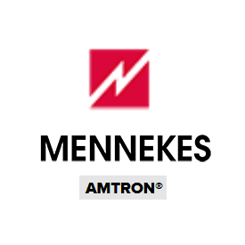
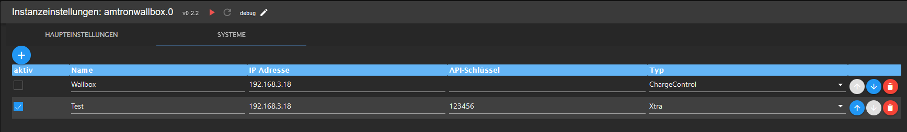

# ioBroker.amtronwallbox

**Dieser Adapter nutzt die Sentry-Bibliotheken, um Ausnahmen und Codefehler automatisch an die Entwickler zu melden.** Weitere Details und Informationen zum Deaktivieren der Fehlerberichterstattung finden Sie in [der Sentry-Plugin-Dokumentation](https://github.com/ioBroker/plugin-sentry#plugin-sentry) ! Die Sentry-Berichterstattung wird ab js-controller 3.0 verwendet.

**Wenn es Ihnen gefällt, erwägen Sie bitte eine Spende:**

Der Adapter dient als Schnittstelle zu verschiedenen [Amtron-Wallboxen](https://www.mennekes.de/emobility/produkte/amtron-wallboxen/) . Die von der Wallbox gelieferten Daten werden ausgelesen und als Datenpunkt im Adapter bereitgestellt. Die Datenverarbeitung erfolgt ausschließlich lokal; eine Cloud-Verbindung ist nicht erforderlich. Bei Wallboxen, die auch Schreibzugriff unterstützen, kann der Adapter Daten (z. B. Ladestrom) schreiben. Folgende Amtron-Wallboxen werden unterstützt:

- Amtron Xtra
- Amtron ChargeControl
- Amtron Compact

Der Adapter kann mehrere Boxen verwalten.

Falls Sie eine Wallbox besitzen, die noch nicht unterstützt wird, wenden Sie sich bitte an den Entwickler.

## Konfiguration

Lediglich der Boxentyp, die IP-Adresse und gegebenenfalls ein API-Schlüssel müssen konfiguriert werden.

Hinweis: Da die Geräte unterschiedliche Schnittstellen haben, funktionieren möglicherweise nicht alle Schnittstellen direkt. Wenden Sie sich in diesem Fall bitte an den Entwickler.

## bekannte Probleme

- Bitte erstellt Issues auf [GitHub](https://github.com/rg-engineering/ioBroker.amtronwallbox/issues) , wenn ihr Fehler findet oder neue Funktionen wünscht.

## Changelog

<!--
  Placeholder for the next version (at the beginning of the line):
  ### **WORK IN PROGRESS**
-->
### 1.0.1 (2026-07-11)
* (copilot) Adapter requires node.js >= 22 now
* (René) update dependencies + changes based on adapter checker

### 1.0.0 (2026-04-25)
* (René) see issue ##423: parser for ChargeControl overworked, compatibility with new datapoints of v5.33 of wallbox firmware
* (René) adapter rewritten in typescript

### 0.3.6 (2026-03-15)
* (René) update dependencies + changes based on adapter checker

### 0.3.5 (2025-10-26)
* (René) bug fix sentry

### 0.3.4 (2025-10-21)
* (René) update dependencies + changes based on adapter checker

[Older changelogs can be found there](https://github.com/rg-engineering/ioBroker.amtronwallbox/blob/master/CHANGELOG_OLD.md)

## License
MIT License

Copyright (c) 2022-2026 René G. <info@rg-engineering.eu>

Permission is hereby granted, free of charge, to any person obtaining a copy
of this software and associated documentation files (the "Software"), to deal
in the Software without restriction, including without limitation the rights
to use, copy, modify, merge, publish, distribute, sublicense, and/or sell
copies of the Software, and to permit persons to whom the Software is
furnished to do so, subject to the following conditions:

The above copyright notice and this permission notice shall be included in all
copies or substantial portions of the Software.

THE SOFTWARE IS PROVIDED "AS IS", WITHOUT WARRANTY OF ANY KIND, EXPRESS OR
IMPLIED, INCLUDING BUT NOT LIMITED TO THE WARRANTIES OF MERCHANTABILITY,
FITNESS FOR A PARTICULAR PURPOSE AND NONINFRINGEMENT. IN NO EVENT SHALL THE
AUTHORS OR COPYRIGHT HOLDERS BE LIABLE FOR ANY CLAIM, DAMAGES OR OTHER
LIABILITY, WHETHER IN AN ACTION OF CONTRACT, TORT OR OTHERWISE, ARISING FROM,
OUT OF OR IN CONNECTION WITH THE SOFTWARE OR THE USE OR OTHER DEALINGS IN THE
SOFTWARE.