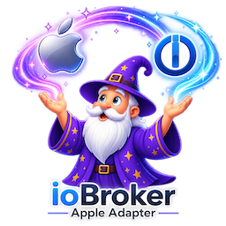

# ioBroker.apple



`iobroker.apple` Erkennt und steuert unterstützte Apple-Mediengeräte im lokalen Netzwerk. Version 0.4 ist die aktuelle Entwicklungsbasis. Sie enthält eine Apple-TV-Version und eine konservative HomePod-Vorschau für öffentliche Hardwaretests. Die Objektverträge sind für ioBroker-Automatisierungen und -Visualisierungen konzipiert, ohne Details des Apple-Protokolls preiszugeben.

## Aktueller Entwicklungsumfang

- Erkennung von Apple TVs über AirPlay, Companion Link und RAOP DNS-SD-Dienste;
- stabile Identität, abgeleitet von Protokollkennungen, niemals von einem Namen oder einer IP-Adresse;
- PIN-Kopplung von der ioBroker-Adminseite;
- Verschlüsselte, instanzbezogene, nur dem Eigentümer zugängliche Speicherung von Kopplungsberechtigungen;
- automatische Wiederverbindungsversuche nach periodischer Neuerkennung;
- Verbindungsstatus, Stromversorgung, Aktuelle Wiedergabe, Wiedergabe, App-Status und Lautstärke;
- funktionsabhängige Navigation, Wiedergabe/Pause, Aufwecken, Ruhezustand und Lautstärkeregelung;
- Startbarer Anwendungskatalog mit lesbaren Startschaltflächen pro App und einer funktionsbeschränkten `apps.openurl` Befehl für bekannte universelle oder App-Links;
- Registerkartenbasierte Administratorkonfiguration für allgemeine Einstellungen, Geräte und Apple Music;
- Auswahl der Adapterkonfiguration (Deutsch/Englisch) wird pro Instanz gespeichert;
- Klassenspezifische Tabellen für erkannte und verwaltete Geräte mit aktiver/passiver Auswahl, lokaler Entfernung und ohne doppelte Zeilen;
- separate Erkennungszähler für Apple TV, HomePod und generische AirPlay-Empfänger, einschließlich der aktuellen Erkennungsnamen und -modelle in Admin;
- eindeutig identifizierte HomePod/HomePod mini-Objekte mit automatischer temporärer Kopplung und ohne PIN oder dauerhafte HomePod-Anmeldeinformationen;
- HomePod-Verbindung, Kopplungsphase, Aktuelle Wiedergabe, Wiedergabe- und Lautstärkestatus sowie funktionsgesteuerte Transport- und beschreibbare Lautstärkeregler;
- Datenschutzkonforme HomePod-Debug-Diagnosefunktionen für Erkennung, Kopplung, Verbindung, Funktionen, Ereignisse, Befehle, Fehler, Wiedererkennung und Entladen;
- Eingeschränkte Erkennung und vollständige Bereinigung des Adapterentladevorgangs.

Die HomePod-Steuerung ist eine ungeprüfte Entwicklungsvorschau und nicht Teil der Kompatibilitätsgarantie der veröffentlichten Version 0.2. Die Steuerung einzelner generischer AirPlay-Empfänger, Audiostreaming, Multiroom, Apple Music und Alexa sind derzeit nicht enthalten.

## Offene Punkte / Nächste Schritte

Folgende Arbeiten sind zwischen der aktuellen Entwicklungsversion 0.4 und der geplanten ersten stabilen Adapterversion noch erforderlich:

- **Vollständige Apple TV-Steuerung:** Hinzufügen von funktionsabhängigen Such-/Überspringfunktionen, Cover-Anzeige, Kontoauswahl sowie Erkennung und Auswahl der Audioausgabe.
- **HomePod validieren und AirPlay-Empfängersteuerung hinzufügen:** Die HomePod-Vorschau wird mit repräsentativer HomePod- und HomePod mini-Hardware ausgeführt. Ergebnisse für Kopplung, Status, Steuerung, Wiederherstellung, Neustart und Entladung werden aufgezeichnet. Empfänger ohne zuverlässige Identitätserkennung werden nur berücksichtigt.
- **Implementieren Sie Medienquellen und Wiedergabe:** Unterstützen Sie validierte lokale Dateien, URLs, Webradio und TTS, sofern die rechtmäßige Wiedergabe und Protokollunterstützung nachgewiesen werden können. Definieren Sie Grenzwerte und Bereinigungsmechanismen für Streams, temporäre Daten und externe Tools.
- **Bewerten Sie optionale externe Medienanbieter:** Verwenden Sie separate Anbietermodule für durchsuchbare Kanal- und Inhaltskataloge. Die Wiedergabe darf nur verifizierte App-Deep-Links oder rechtmäßig verfügbare Streams verwenden, und ein Eintrag darf erst dann als abspielbar markiert werden, wenn seine konkrete Auswahl auf einem realen Zielgerät erfolgreich war.
- **Definieren Sie Gruppen und das Verhalten mehrerer Räume:** Legen Sie die Gruppenzugehörigkeit, die Ausgabeauswahl, die Synchronisierungserwartungen, den Teilausfall und die Wiederherstellung fest, bevor Sie einen öffentlichen Gruppenvertrag veröffentlichen.
- **Fertigstellung der geräteunabhängigen API:** Einfrieren des normalisierten Spielermodells, des versionierten generischen Befehlsendpunkts und der begrenzten Szenen-Engine mit dokumentierten Schemas, Fehlerbehandlung, Abbruch, Timeouts und Migrationsregeln.
- **Integrieren Sie Apple Music über offizielle APIs:** Implementieren Sie Entwickler- und Benutzerautorisierung, Zugriff auf Katalog- und personalisierte Daten, Token-Lebenszyklus, Paginierung, Caching und Wiedergabeauflösung. Apple Music-Metadaten werden nicht als direkt streambare Audioquelle behandelt.
- **Validierung der Admin 8-Oberfläche:** Vollständige visuelle Überprüfung aller Gerätetabellen der zweiten Generation in der systemweiten ioBroker-Admin-Sprache auf dem repräsentativen ioBroker-Host.
- **Vollständige Release-Validierung:** Überprüfung von Neustart, Wiederverbindung, Kompaktmodus, Entladen, Persistenz, Sicherheit und des öffentlichen Objektvertrags in der unterstützten Node.js/OS-Matrix und einer dokumentierten Realgerätematrix; anschließend Erfüllung der Anforderungen des ioBroker Adapter Checkers und der Repository-Veröffentlichung.

Die erste stabile Version ist erst dann vollständig, wenn die oben genannten Punkte implementiert, dokumentiert und durch automatisierte Tests sowie Tests mit realen Geräten belegt sind. Alexa/Echo bleibt eine mögliche zukünftige Abspielplattform und ist für die erste stabile Version nicht erforderlich.

## Anforderungen

- Node.js 22 oder neuer;
- js-controller 7.2.2 oder neuer;
- Admin 8 oder neuer; Admin 7 wird nicht mehr unterstützt, da benutzerdefinierte GUI-API-Generationen nicht abwärtskompatibel sind;
- Apple TV oder HomePod und der ioBroker-Host befinden sich im selben Multicast-fähigen lokalen Netzwerk.

## Offizielle Apple-Produktinformationen

- [Apple TV 4K](https://www.apple.com/apple-tv-4k/)
- [HomePod](https://www.apple.com/homepod/)
- [AirPlay](https://www.apple.com/airplay/)

## Einrichtung und Kopplung

1. Installieren Sie den Adapter und erstellen Sie eine Instanz.
2. Lassen Sie das Apple TV eingeschaltet und öffnen Sie den Tab **„Geräte“** in der Adapterkonfiguration.
3. Wählen Sie in der Zeile des gewünschten Apple TV die **Option „Kopplung starten“** .
4. Geben Sie die vierstellige PIN, die von Ihrem Apple TV angezeigt wird, in derselben Zeile ein und wählen Sie **„Kopplung abschließen“** . Der Vorgang kann in dieser Zeile auch abgebrochen werden.

Die PIN wird nur an die aktive Kopplungssitzung gesendet und niemals in die Adapterkonfiguration, den Objektbaum, die Protokolle oder die Anmeldeinformationsdatei geschrieben. Langfristige Anmeldeinformationen werden mit dem Installationsgeheimnis von ioBroker verschlüsselt. Anmeldeinformationen, die vom vorherigen temporären Proof-of-Concept erstellt wurden, werden absichtlich nicht importiert; jedes Gerät muss einmalig über den Adapter gekoppelt werden.

Das Erkennungsintervall ist standardmäßig auf 60 Sekunden eingestellt und kann zwischen 30 und 3600 Sekunden konfiguriert werden. Geräteadressen und Ports werden bei der Erkennung aktualisiert und nicht als Identität gespeichert.

HomePods benötigen keine manuelle PIN-Eingabe. Ein eindeutig identifizierter HomePod wird zunächst als nicht verwalteter Kandidat angezeigt. Durch die Aktivierung wird sein Netzwerkbaum erstellt und die Verbindung automatisch über eine neue, temporäre AirPlay-Kopplungssitzung hergestellt. Es werden keine HomePod-Anmeldeinformationen in der Kopplungsdatenbank gespeichert. Wiedergabetasten und beschreibbare Lautstärkeeinstellungen werden erst angezeigt, nachdem der verbundene HomePod diese Funktionen gemeldet hat.

Gekoppelte Apple TVs sind standardmäßig aktiv. Wenn ein Gerät in den passiven Modus versetzt wird, bleibt die verschlüsselte Kopplung erhalten, die Verbindung wird jedoch getrennt und der zugehörige Objektbaum gelöscht. Bei der Reaktivierung wird die Verbindung wiederhergestellt und der Objektbaum neu erstellt, sobald das Gerät erkannt wird. Auch das Vergessen eines Geräts entfernt die Kopplungsdaten und den Objektbaum vollständig.

Eindeutig identifizierte HomePods und AirPlay-Empfänger werden beim Aktivieren ebenfalls von der Liste der erkannten Geräte in die Liste der verwalteten Geräte verschoben. Im passiven Modus bleibt ihr lokaler Verwaltungseintrag erhalten, der zugehörige Baum wird jedoch entfernt. Das Löschen eines Verwaltungseintrags entfernt den Baum; ein im Netzwerk weiterhin sichtbares Gerät kehrt dann in die Liste der erkannten Geräte zurück. Die generische Aktivierung eines Empfängers erstellt lediglich einen schreibgeschützten Inventareintrag und beinhaltet keine Wiedergabe- oder Streaming-Unterstützung.

## Objektbaum

Im Folgenden werden aktive gekoppelte Apple TVs erstellt. `apple.<instance>.devices.appletv.<protocol-device-id>` Die Geräteklassenordner `appletv`, `homepod`, Und `airplayReceiver` Erkennungszahlen werden angezeigt. Aktive verwaltete generische AirPlay-Empfänger mit einer stabilen AirPlay/RAOP-Geräte-ID erhalten zusätzlich eine schreibgeschützte Geräteerkennung und eine Liste der beworbenen Dienste. Ein Apple TV-Baum enthält schreibgeschützte Informationen, den Status von AirPlay und Companion Link, Funktionen, Energiestatus, aktuelle Wiedergabe, Lautstärke und das Ergebnis des letzten Befehls. Schreibbare Navigations-, Wiedergabe-, Energie- und App-Status werden erst erstellt, nachdem das verbundene Gerät die entsprechende Funktion gemeldet hat.

Aktiv verwaltete, eindeutig identifizierte HomePods werden unten erstellt `apple.<instance>.devices.homepod.<protocol-device-id>` Ihr Baum enthält schreibgeschützte Identität, Erkennungs-, Dienst-, Verbindungs- und temporäre Kopplungsstatus, Fähigkeiten, Daten zur aktuellen Wiedergabe, Lautstärke und das Ergebnis des letzten Befehls. Unterstützte Transporttasten verwenden `ack=false` /`ack=true` Momentane Semantik. HomePod `volume.level` akzeptiert 0 bis 100 und `volume.muted` Akzeptiert einen expliziten booleschen Wert, sofern die Lautstärkeregelung verfügbar ist.

Die Schreibvorgänge der Schaltflächen sind momentane boolesche Werte. Der Adapter akzeptiert nur diese. `true` mit `ack=false`, führt den Befehl nacheinander für jedes Gerät aus, protokolliert das Ergebnis und setzt die Taste zurück auf `false` mit `ack=true` Die `apps.openurl` akzeptiert stattdessen eine absolute URL-Zeichenfolge mit `ack=false` und setzt es mit auf eine leere Zeichenkette zurück. `ack=true`. tvOS und die empfangende App bestimmen, ob diese URL den angeforderten Inhalt öffnet.

Der Basisobjektvertrag ist in [ADR 0005](/#/docs/adapterref/iobroker.apple/docs/decisions/0005-v0.1-object-contract.md) dokumentiert und wurde durch spätere Entscheidungen zur Gerätehierarchie und Anwendung ergänzt. Die Geräteaktivierung und das Administratorinventar sind in [ADR 0011](/#/docs/adapterref/iobroker.apple/docs/decisions/0011-device-enablement-and-admin-inventory.md) dokumentiert. Die ursprünglichen dynamischen Administratortabellen sind in [ADR 0012](/#/docs/adapterref/iobroker.apple/docs/decisions/0012-appletv-admin-tables.md) dokumentiert; ihre Migration auf Generation 2 und Admin-8 ist in [ADR 0017](/#/docs/adapterref/iobroker.apple/docs/decisions/0017-admin-8-gui-api-generation-2.md) definiert. Die stabile generische Empfängeridentität und ihr schreibgeschützter Statusvertrag sind in [ADR 0013](/#/docs/adapterref/iobroker.apple/docs/decisions/0013-airplay-receiver-identity-and-contract.md) dokumentiert. Der nicht verifizierte HomePod-Vorschauvertrag und die diagnostische Datenschutzgrenze sind in [ADR 0014](/#/docs/adapterref/iobroker.apple/docs/decisions/0014-homepod-transient-control-contract.md) dokumentiert. Die explizite Einführung und Aktivierung von HomePod/AirPlay-Empfängern ist in [ADR 0015](/#/docs/adapterref/iobroker.apple/docs/decisions/0015-explicit-homepod-and-receiver-management.md) dokumentiert. Die entfernte instanzlokale deutsche/englische Administratorauswahl ist in [ADR 0016](/#/docs/adapterref/iobroker.apple/docs/decisions/0016-instance-admin-language.md) dokumentiert.

## HomePod-Test

Die HomePod-Unterstützung bietet automatisierte Testabdeckung, wurde aber noch nicht mit einem echten HomePod getestet. Freiwillige sollten die Adapterfunktion aktivieren. `debug` Um die Protokollierungsstufe zu erhöhen, starten Sie die Instanz neu, warten Sie auf einen vollständigen Erkennungszyklus, testen Sie jede sichtbare Wiedergabe- und Lautstärkeregelung und anschließend einen temporären Netzwerkausfall mit einem weiteren Neustart. Ein aussagekräftiger Bericht enthält das HomePod-Modell, die HomePod-Softwareversion, die Versionen von ioBroker/Adapter/Node.js, die getesteten Operationen, die resultierenden Objektzustände und das vollständige Debug-Intervall des Adapters. Der Adapter blendet in seinen HomePod-Diagnoseprotokollen absichtlich Netzwerkadressen, Gerätenamen, TXT-Einträge, Medientitel, Anmeldeinformationen und Rohfehler des Upstream-Servers aus; Tester sollten die Protokolle dennoch vor der Veröffentlichung prüfen.

## Entwicklung

```bash
npm install
npm run check
npm run lint
npm test
npm run test:integration
```

Das Verhalten auf realen Geräten muss zudem die entsprechende Apple TV- oder Receiver-Matrix erfüllen, bevor ein Release-Anspruch geltend gemacht werden kann. Siehe den [Leitfaden für Mitwirkende](/#/docs/adapterref/iobroker.apple/CONTRIBUTING.md) , [die Architektur](/#/docs/adapterref/iobroker.apple/docs/ARCHITECTURE.md) , [die Entscheidungsdokumente](/#/docs/adapterref/iobroker.apple/docs/decisions/README.md) , [die Upstream-Bewertung](/#/docs/adapterref/iobroker.apple/docs/UPSTREAM_RESEARCH.md) und [die Hinweise von Drittanbietern](/#/docs/adapterref/iobroker.apple/THIRD_PARTY_NOTICES.md) .

Die Releases folgen der semantischen Versionierung. Die Bindungsregeln, einschließlich der strengeren Kompatibilitäts- und Migrationsrichtlinie für Versionen vor 1.0, sind in [ADR 0008](/#/docs/adapterref/iobroker.apple/docs/decisions/0008-semantic-versioning.md) dokumentiert.

## Changelog

No unreleased changes.

### 0.4.1 - 2026-10-01

- Address ioBroker latest repository review findings.
- Add public copyright contact details in README and license metadata.
- Update ioBroker testing tooling, keep the package runtime audit clean, and
  exclude `CHANGELOG_OLD.md` from npm package contents.

### 0.4.0 - 2026-09-10

- Add capability-gated Apple TV absolute volume control.
- Repair checker-relevant metadata for existing device objects during startup.
- Update Admin build dependencies from the three Dependabot PRs and keep
  `react-color` explicit for the current JSON Config color component.

### 0.3.3 - 2026-09-06

- Align ioBroker release news with published npm versions.
- Add `CHANGELOG_OLD.md` for older pre-public-release changelog entries.
- Align the release workflow topology with ioBroker latest repository checks.

### 0.3.2 - 2026-09-03

- Correct release metadata for ioBroker latest repository submission.

### 0.3.1 - 2026-09-03

- Fix Windows release test compatibility for managed-device persistence.

Older pre-public-release changelog entries are stored in
CHANGELOG_OLD.md.

## License

Copyright (c) 2026 C@ptain Ch@os <butan_akrobat1t@icloud.com>

This project is licensed under the [MIT License](https://github.com/Musashi1965/ioBroker.apple/blob/main/LICENSE). Third-party sources
and dependencies retain their licenses. Apple and related marks are trademarks
of Apple Inc. This independent project is not affiliated with, endorsed by, or
sponsored by Apple Inc.