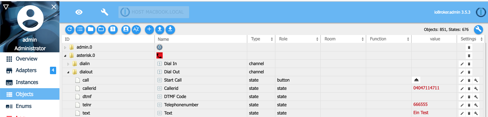

# IoBroker Asterisk VoIP-Adapter
[Deutsches Handbuch / Deutsche Anleitung](README_DE.md)

Der Asterisk-Adapter wandelt Textnachrichten in Audiodateien um und ruft dann über Asterisk per VoIP jede gewünschte Telefonnummer an und spielt die Audionachricht ab.

## Installation / Konfigurationen
Für ausgehende Anrufe muss Asterisk mit Ihrem VoIP-Anbieter wie Telekom oder Vodfone oder Ihrer FritzBox verbunden werden! Folgen Sie dazu einer dieser Installationsanleitungen.

### Linux-Pakete / ioBroker und Asterisk laufen auf demselben Server mit ffmpeg
```sh
sudo apt-get install ffmpeg
# if asterisk package is missing, follow the instructions "Install asterisk manual"
sudo apt-get install asterisk
```

### Linux-Pakete / ioBroker und Asterisk laufen auf demselben Server mit Sox
Falls Probleme mit der Transkodierung mit ffmpeg auftreten, kann Sox als Transcoder verwendet werden. Dazu müssen folgende Pakete installiert und Sox in der Adapterkonfiguration ausgewählt werden.

```sh
sudo apt-get install lame
sudo apt-get install sox
sudo apt-get install libsox-fmt-mp3
# if asterisk package is missing, follow the instructions "Install asterisk manual"
sudo apt-get install asterisk
```

### Linux-Pakete / ioBroker und Asterisk laufen auf verschiedenen Servern mit ffmpeg
```sh
# ioBroker server
sudo apt-get install ffmpeg
sudo apt install openssh-client
```

```sh
# asterisk server
# if asterisk package is missing, follow the instructions "Install asterisk manual"
sudo apt-get install asterisk
sudo apt-get install openssh-server
```

### Linux-Pakete / ioBroker und Asterisk laufen auf verschiedenen Servern mit Sox
Falls Probleme mit der Transkodierung mit ffmpeg auftreten, kann Sox als Transcoder verwendet werden. Dazu müssen folgende Pakete installiert und Sox in der Adapterkonfiguration ausgewählt werden.

```sh
sudo apt-get install lame
sudo apt-get install sox
sudo apt-get install libsox-fmt-mp3
```

```sh
# asterisk server
# if asterisk package is missing, follow the instructions "Install asterisk manual"
sudo apt-get install asterisk
sudo apt-get install openssh-server
```

### Asterix-Handbuch installieren
Wenn das Apt-Paket Asterisk fehlt, können Sie Asterisk manuell installieren:

```sh
sudo apt install git vim curl wget libnewt-dev libssl-dev libncurses5-dev subversion libsqlite3-dev build-essential libjansson-dev libxml2-dev uuid-dev

cd /usr/src/
sudo wget https://downloads.asterisk.org/pub/telephony/asterisk/old-releases/asterisk-16.30.1.tar.gz
sudo tar xvf asterisk-16*.tar.gz
cd asterisk-16*/
sudo contrib/scripts/get_mp3_source.sh
sudo contrib/scripts/install_prereq install
sudo ./configure
sudo make menuselect

# Choose following packages in the menu:
## Add-ons: chan_ooh323 & format_mp3
## Core Sound Packages: Audio packets CORE-SOUNDS-EN-*
## Music On Hold: MOH-OPSOUND-WAV bis MOH-G729
## Extra Sound: EXTRA-SOUNDS-EN-WAV bis EXTRA-SOUNDS-EN-G729
## Applications: app_macro
## Exit with "Save&Exit".

sudo make
sudo make install
sudo make progdocs # (optional documentation)
sudo make samples
sudo make config
sudo ldconfig

sudo groupadd asterisk
sudo useradd -r -d /var/lib/asterisk -g asterisk asterisk
sudo usermod -aG audio,dialout asterisk
sudo chown -R asterisk:asterisk /etc/asterisk
sudo chown -R asterisk:asterisk /var/{lib,log,spool}/asterisk
sudo chown -R asterisk:asterisk /usr/lib/asterisk

# asterisk as default user for asterisk
sudo nano /etc/default/asterisk
AST_USER="asterisk"
AST_GROUP="asterisk"

# Insert/ replae follwoing in the config file /etc/asterisk/asterisk.conf
sudo nano /etc/asterisk/asterisk.conf
runuser = asterisk ; The user to run as.
rungroup = asterisk ; The group to run as

sudo ufw allow proto tcp from any to any port 5060,5061 # (optional open Firewall, if activ)

sudo systemctl restart asterisk
sudo systemctl enable asterisk

# Check state of asterisk
sudo systemctl status asterisk
sudo asterisk -rvv
```

### Konfiguration von Asterisk
In den folgenden Dokumenten wird die Konfiguration von Asterisk detailliert beschrieben.

- Konfiguration [Asterisk über SIP mit der FritzBox](docs/SIP_FRITZBOX.md) (der einfachste Weg)
- Konfiguration [Asterisk über PJSIP mit der FritzBox](docs/PJSIP_FRITZBOX.md) (pjsip ist moderner als sip)
- Konfiguration [Asterisk über PJSIP mit Telekom als Provider](docs/PJSIP_TELEKOM.md)
- Konfiguration [Asterisk über PJSIP mit Sipgate als Provider](docs/PJSIP_SIPGATE.md)

### Konfiguration mit SSH
Wenn iobroker und Asterisk auf unterschiedlichen Servern installiert sind, benötigen Sie auf dem Asterisk-Server einen Benutzer mit Zugriff vom iobroker-Server, um sich per SSH anmelden zu können.
Der Benutzer benötigt Unix-Benutzerrechte, um Dateien schreiben zu können, die von Asterisk gelesen werden können.
Sie erstellen auf dem Asterisk-Server das Verzeichnis mit dem in der iobroker-Asterisk-Adapterkonfiguration konfigurierten Namen unter dem Namen „Pfad für temporäre Audiodateien“. Der Pfad muss für Asterisk und SSH zugänglich und autorisiert sein, da iobroker die generierte Audiodatei (Ihre Textnachricht) per SCP an den Asterisk-Server sendet und im „Pfad für temporäre Audiodateien“ speichert.
Anschließend sendet ioBroker über die AMI-API eine Nachricht an Asterisk, um die im angegebenen Pfad gespeicherte generierte Audiodatei anzurufen und abzuspielen.


## Verwenden von Asterisk
### Verwendung von Asterisk mit Objekten/Zuständen zum Hinauswählen
Am einfachsten lässt sich Asterisk über die ioBroker-Objektseite verwenden. Tragen Sie dort unter dem Parameter „Dialout“ folgende Werte ein:

- Anruf: Drücken Sie die Taste, um einen Anruf einzuleiten
- callerid: Telefonnummer, die dem Angerufenen angezeigt wird
- DTMF: Der Angerufene drückte Zahlen auf der Tastatur
- telnr: die zu wählende Nummer
- Text: der Text, der dem Angerufenen vorgespielt wird
- Sprache: Text wird in Audio in dieser Sprache umgewandelt



### Asterisk mit Objekten/Zuständen zur Einwahl verwenden
Wenn Sie Ihren SIP-Provider (z.B. Fritzbox, Sipgate, ...) und die Asterisk-Konfiguration so konfiguriert haben, dass Einwahlanrufe möglich sind, können Sie folgende Parameter einstellen

- callerid: Telefonnummer, die Asteriks angerufen hat
- DTMF: Anrufer drücken Zahlen auf der Tastatur
- Text: der Text, der dem Anrufer vorgespielt wird
- Sprache: Text wird in Audio in dieser Sprache umgewandelt


### Verwenden von Asterisk mit Javascript oder Blocky zum Hinauswählen
Jetzt können Sie den Adapter in Ihren Javascript- oder Blockprogrammen verwenden.

```sh
const number   = '040 666-7766';
const callerid = '040 123 999'; // optional, if not set anonymous call
const msg      = 'Hello, this textmessage will be converted to audio';

// call telephone nummber 040 666-7766 and play text message as audio
sendTo('asterisk.0', 'dial', { telnr: number, callerid: callerid, text:  msg},  (res) => {
      console.log(`Result: ${JSON.stringify(res)}`);
});

// call telephone nummber 040 666-7766 and play mp3 audio file
// mp3 file has to exist on asterix server
sendTo('asterisk.0', 'dial', { telnr: number, callerid: callerid, audiofile: '/tmp/audio.mp3'},  (res) => {
      console.log(`Result: ${JSON.stringify(res)}`);
});

// call telephone nummber 040 666-7766 and play gsm audio file
// gsm file has to exist on asterix server
sendTo('asterisk.0', 'dial', { telnr: number, callerid: callerid, audiofile: '/tmp/audio.gsm'},  (res) => {
      console.log(`Result: ${JSON.stringify(res)}`);
});

// create dial in message
sendTo('asterisk.0', 'dial', { text:  'Please enter PIN after hashtag.' },  (res) => {
      console.log(`Result: ${JSON.stringify(res)}`);
});

// Show entered DTMF code
on({ id: 'asterisk.0.dialin.dtmf'/*DTMF Code*/ },  (obj) => {
    const dtmf = obj.state.val;
    console.log(`DTMF: ${dtmf}`);
});

// Show entered DTMF code
on({ id: 'asterisk.0.dialout.dtmf'/*DTMF Code*/ },  (obj) => {
    const dtmf = obj.state.val;
    console.log(`DTMF: ${dtmf}`);
});

```

> Sie können die folgenden Parameter in der sendTo-Wählanweisung verwenden: > > - **language:** Sprache für die Text-to-Speech-Funktion (tts). (Erlaubte Werte: ‚DE‘, ‚EN‘, …. Standard ist die ioBroker-Systemsprache.) > - **repeat:** Wie oft soll die Audionachricht wiederholt werden (Erlaubte Werte: 1 bis n, Standard 5). > - **priority:** Wenn Sie mehrere sendTo-Wählanweisungen parallel senden, werden die Nachrichten mit der niedrigsten Priorität zuerst gesendet (Erlaubte Werte: 1 bis n, Standard 1). > - **text:** Textnachricht, die als Audio gesendet wird. > - **timeout:** Zeitüberschreitung in Millisekunden beim Warten auf den Verbindungsaufbau (Standard 60000 ms). > - **async:** Ermöglicht das Generieren mehrerer Anrufe ohne auf eine Antwort zu warten (Erlaubte Werte: false/true, Standard false). > - **audiofile:** Wenn Sie den Textparameter verwenden. Der in Audio konvertierte Text wird in einer Audiodatei gespeichert. Falls die Audiodatei vorhanden ist, wird sie überschrieben. Wenn Sie den Parameter „text“ nicht verwenden, wird die Audiodatei abgespielt.
> - **callerid:** Definiert die Kennung (Ihre Absender-Telefonnummer). Fehlt die Anrufer-ID, wird die übertragene Telefonnummer anonym übermittelt. > - **telnr:** Zu wählende Telefonnummer.

## Probleme lösen
Bei Problemen mit Asterisk kannst du versuchen, in den Logdateien unter /var/log/asterisk nach etwas zu suchen. Nach dem Start von Asterisk kannst du Asterisk mit asterisk -rvvvvvv in der Kommandozeile zum Debuggen aufrufen. Anschließend kannst du einen Aufruf von iobroker initialisieren und beobachten, was passiert.

## Changelog
### 2.0.3 (2025-03-30)

- (Stübi) Bugfixing in sendto function
- (Stübi) Add Object repeat
- (Stübi) Fixing @iobroker/adapter-dev 1.0.1 specified. 1.3.0 is required as minimum, 1.3.0 is recommended (Issue #57)
- (Stübi) Fixing dependency (Issue #58)
- (Stübi) Fixing issue with missing template directory (Issue #56 and #65)

### 2.0.2 (2025-02-01)

- (Stübi) Add Create Directory
- (Stübi) Add translation for configuration
- (Stübi) Bugfixing

### 2.0.1 (2025-01-24)

- (Stübi) Fix error by using asterisk and iobroker on the same server
- (Stübi) Add action command for send messages
- (Stübi) Add dial in command for send messages
- (Stübi) Add create butteon for create dial in file

### 2.0.0 (2025-01-24)

- (Stübi) Redesign of Asterisk
- (Stübi) Switching from Javascript to Typescript
- (Stübi) Nodes 20 and 22 are now supported
- (Stübi) js controllers in versions 6 and 7 are supported
- (Stübi) Attention: Passwords must be re-entered from this version!
- (Stübi) Language object added
- (Stübi) Revision of the reconnect if Asterisk is restarted once
- (Stübi) Fixing errors from repository checker (Issue #51)
- (Stübi) Add documentation how to install asterisk manual (Issue #33)

### 1.0.6 ((2019-02-27)

- (Stübi) Update documentation and templates
- (Stübi) Asterisk adapter can create now asterisk configuration files. You have to rename and move them afterwards to the /etc/asterisk directory
- (Stübi) a new documentation for using Sipgate as provide.
- (Stübi) Now you can call internal fritzbox numbers. You must change your extensions.ael if you install the version 1.0.4! (replace **10 => { ... }** with **\_. => { ... }**)
- (Stübi) You can install asterisk on a different server and use scp to transfer audio files from ioBroker to asterisk.
- (Stübi) You can use the service PJSIP instead of SIP now.
- (Stübi) Support js-controller compact mode
- (Stübi) Calling without extension, if you do not use the fritzbox for example (leave sip.conf username in adapter config empty)
- (Stübi) Instead of ffmpeg you can use now sox too
- (Stübi) Update with languages
- (Stübi) Add Callerid to dialin states
- (Stübi) A lot of new features. Now you can call ioBroker / Asterisk by telephone number and enter a DTMF Code.
- (Stübi) You can enter a DTMF Code if you get called by ioBroker / Asterisk
- (Stübi) Bugfixing and password will be saved encrypted and text message size can be unlimited
- (Stübi) First Version

## License

The MIT License (MIT)

Copyright (c) 2025 Thorsten Stueben <thorsten@stueben.de> / <https://github.com/schmupu>

Permission is hereby granted, free of charge, to any person obtaining a copy
of this software and associated documentation files (the "Software"), to deal
in the Software without restriction, including without limitation the rights
to use, copy, modify, merge, publish, distribute, sublicense, and/or sell
copies of the Software, and to permit persons to whom the Software is
furnished to do so, subject to the following conditions:

The above copyright notice and this permission notice shall be included in
all copies or substantial portions of the Software.

THE SOFTWARE IS PROVIDED "AS IS", WITHOUT WARRANTY OF ANY KIND, EXPRESS OR
IMPLIED, INCLUDING BUT NOT LIMITED TO THE WARRANTIES OF MERCHANTABILITY,
FITNESS FOR A PARTICULAR PURPOSE AND NONINFRINGEMENT. IN NO EVENT SHALL THE
AUTHORS OR COPYRIGHT HOLDERS BE LIABLE FOR ANY CLAIM, DAMAGES OR OTHER
LIABILITY, WHETHER IN AN ACTION OF CONTRACT, TORT OR OTHERWISE, ARISING FROM,
OUT OF OR IN CONNECTION WITH THE SOFTWARE OR THE USE OR OTHER DEALINGS IN
THE SOFTWARE.