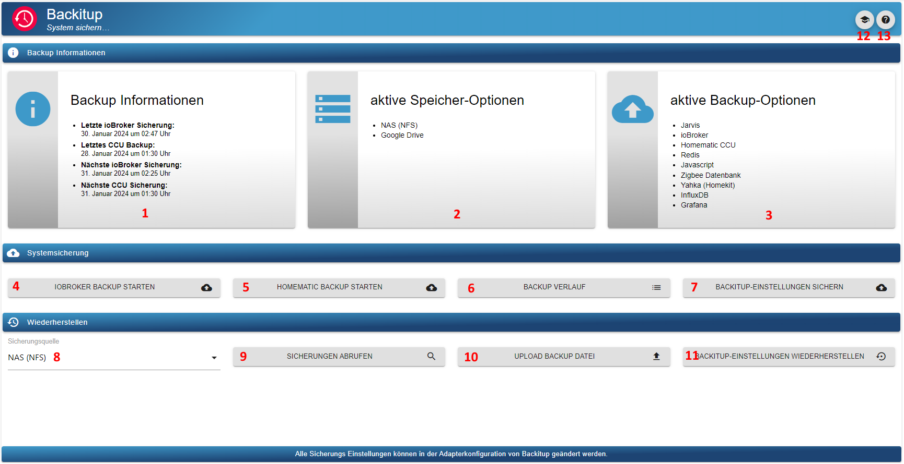
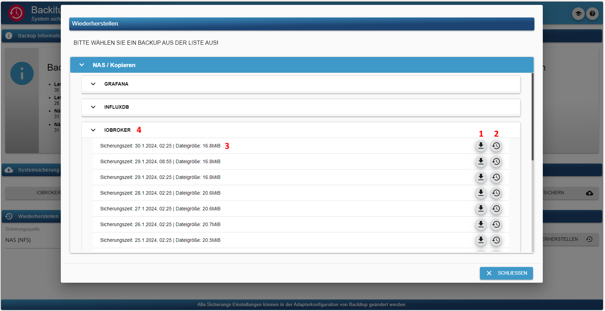
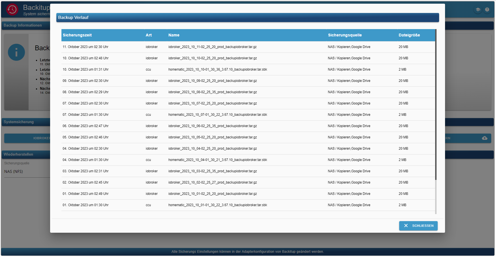
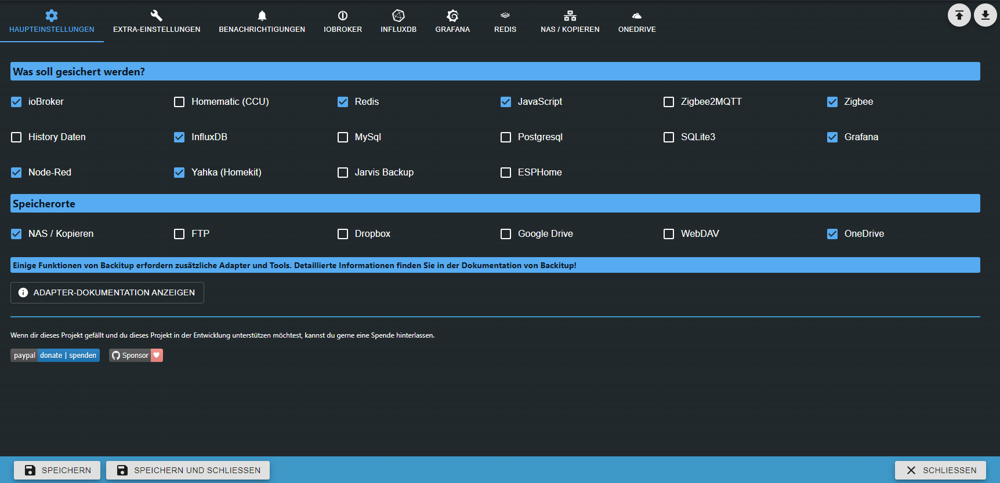
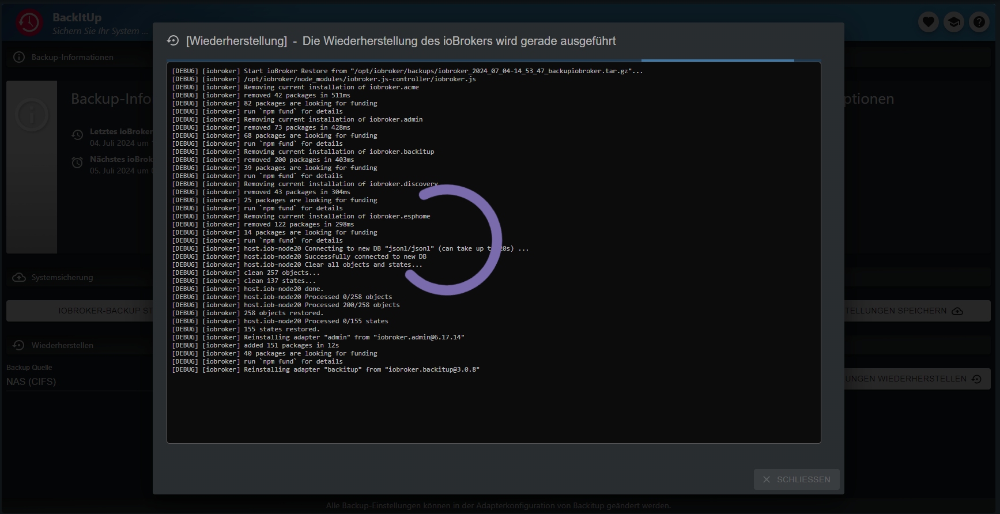
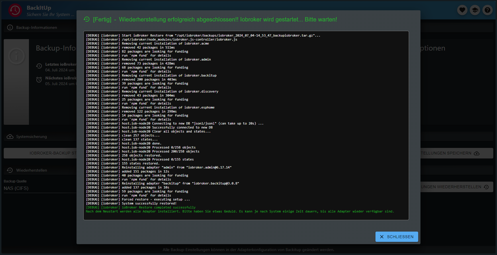

# Dokumentation und Anleitung für ioBroker.backitup


[](https://www.npmjs.com/package/iobroker.backitup)
[](https://www.npmjs.com/package/iobroker.backitup)
[](https://snyk.io/test/github/simatec/ioBroker.backitup)


[](https://github.com/simatec/ioBroker.backitup/blob/master/LICENSE)
[](https://paypal.me/mk1676)
[](https://github.com/sponsors/simatec)

**************************************************************************************************************


## Unterstütze die Adapterentwicklung
**Wenn Ihnen `ioBroker.backitup` gefällt, denken Sie bitte über eine Spende nach:**
  
[](https://paypal.me/mk1676)


**************************************************************************************************************

## Haftungsausschluss
**`ioBroker.backitup` ist ein Backup-Plugin nur für die Smart Home Software ioBroker.**

**Es steht in keiner Verbindung zu [Nero BackItUp](https://www.nero.com/deu/products/nero-backitup/?vlang=de) (ein Tool zur Datensicherung unter Windows-Systemen) und wird auch nicht von diesem unterstützt.**

**************************************************************************************************************

## Grundlegendes
`ioBroker.backitup` ist eine Backuplösung, mit der das zyklische Sichern einer ioBroker-Installation sowie einer Homematic CCU möglich ist.

Der Adapter ist für Multiplattformen geeignet und kann neben Linux-Installationen auch auf Windows und Mac Installationen verwendet werden.

Des Weiteren besteht die Möglichkeit, verschiedene optionale Backups wie z.B. SQL-Datenbanken, Influx-Datenbanken und einige Adapter- und Geräteeinstellungen zu sichern.

`ioBroker.backitup` arbeitet sehr eng mit dem js-controller zusammen und erstellt ein ioBroker Backup identisch dem CLI Befehl `iobroker backup`.

Es werden hier identisch dem Standard Backup des js-controllers alle States und Objects, sowie die Nutzerdateien wie z.B. VIS gesichert.

Auch der Restore ist vollkommen identisch dem CLI Befehl `iobroker restore <backupname>` des js-controllers.


Bei einem Restore werden alle States, Objects und Nutzerdaten von `ioBroker.backitup` wiederhergestellt.
Nach dem Restore startet euer iobroker neu und ab da übernimmt die Installation fehlender Adapter dann wieder der js-controller.

`ioBroker.backitup` hat nach dem Start des iobrokers keinerlei Einfluss auf die Wiederherstellung. Dies passiert alles im Hintergrund und übernimmt der js-controller anhand der wiederhergestellten Informationen in den States und Objects.

Im Gegensatz zu dem CLI Befehl kann aber `ioBroker.backitup` auch noch einen Restore der verschiedenen optinalen Backups durchführen.
Dies ist über die CLI nicht möglich.

_[Zurück zum Anfang](#dokumentation-und-anleitung-für-iobrokerbackitup)_

---

## Abhängigkeiten
* Für den CIFS Mount muss zwingend cifs-utils installiert sein.
    - `sudo apt install cifs-utils`

* Für den NFS Mount muss zwingend nfs-common installiert sein.
    - `sudo apt install nfs-common`

* Für die Verwendung des MySql-Backups von MySql Systemen muss mysqldump auf dem System installiert sein
    - `sudo apt install mysql-client` oder unter Debian `sudo apt install default-mysql-client`

* Für die Verwendung des MySql-Backups von MariaDB Systemen muss mysqldump auf dem System installiert sein
    - `sudo apt install mariadb-client`

* Für die Verwendung des Sqlite3-Backups muss sqlite3 auf dem System installiert sein
    - `sudo apt install sqlite3`

* Für die Verwendung des PostgreSQL-Backups muss mysqldump auf dem System installiert sein
    - [Installationsanleitung PostgreSQL](https://www.postgresql.org/download/linux/debian/)

* Für die Verwendung des InfluxDB Backups muss influxd installiert sein
    - [Installationsanleitung InfluxDB 1.x](https://docs.influxdata.com/influxdb/v1.8/introduction/install/)
    - [Installationsanleitung InfluxDB 2.x](https://docs.influxdata.com/influxdb/v2.1/install/)
    - [Installationsanleitung Influx-CLI für 2.x](https://docs.influxdata.com/influxdb/v2.1/tools/influx-cli/?t=Linux)

_[Zurück zum Anfang](#dokumentation-und-anleitung-für-iobrokerbackitup)_

---

## Benutzung und Bedienung
`ioBroker.backitup` kann in den Adapter-Instanzen konfiguriert werden. Dort stehen alle folgenden Einstellungsmöglichkeiten zur Verfügung.


Für die tägliche Arbeit und Bedienung von `ioBroker.backitup` steht im Admin-Tab ein Reiter zur Verfügung.

Ist dieser Reiter im Tab-Menü der Admin-Oberfläche aktiv, kann `ioBroker.backitup` direkt über den Reiter in der linken Tab-Leiste des ioBrokers bedient werden.


Dort stehen Informationen zu den erstellten Backups zur Verfügung, es können Backups erstellt werden und es besteht die Möglichkeit, einen Restore des Backups auszuführen.



Hier eine kurze Erklärung der Optionen im Tab Menü


| Nr. | Beschreibung                                                                                                                                                                                                        |
|-----|---------------------------------------------------------------------------------------------------------------------------------------------------------------------------------------------------------------------|
| 1.  | Informationen zum letzten und nächsten Backup.                                                                                                                                                                      |
| 2.  | Informationen, wo die Backups gespeichert werden.                                                                                                                                                                   |
| 3.  | Informationen, welche Backuptypen aktiv sind und gesichert werden.                                                                                                                                                  |
| 4.  | Ein iobroker Backup manuell starten.                                                                                                                                                                                |
| 5.  | Ein Homematic Backup manuell starten.                                                                                                                                                                               |
| 6.  | Öffnet ein neues Fenster und zeigt alle Backups aus dem Verlauf an.                                                                                                                                                 |
| 7.  | Mit diesem Button kann man die Settings von `ioBroker.backitup` sichern. Dies ist bei einem Systemwechsel ein nützliches Hilfsmittel. Die Settings werden im JSON Format ausgegeben.                                |
| 8.  | In dieser Option wählt man den Speicher, aus dem der Restore ausgeführt werden soll.                                                                                                                                |
| 9.  | Mit dem Button "Sicherungen abrufen" öffnet sich ein neues Fenster und listet alle vorhanden Backups in dem gewählten Speicher auf.                                                                                 |
| 10. | Möchte man ein Backup von einem anderen System wiederherstellen, kann die Backupdatei über diesen Button auf das System hochgeladen werden.                                                                         |
| 11. | Dieser Button dient dazu, die gespeicherten `ioBroker.backitup` Settings innerhalb des Adapter wiederherzustellen. Es ist kein Restore des ioBrokers und hier können nur Dateien im JSON Format hochgeladen werden! |
| 12. | Öffnet ein neuen Tab und zeigt die Dokumentation von `ioBroker.backitup` an.                                                                                                                                        |
| 13. | Öffnet ein neuen Tab und zeigt die Readme von `ioBroker.backitup` an.                                                                                                                                               |





Die Bedienung des Restore Tabs sieht wie folgt aus.


| Nr. | Beschreibung                                   |
|-----|------------------------------------------------|
| 1.  | Download des gewählten Backups auf den PC.     |
| 2.  | Start des Restores des gewählten Backups.      |
| 3.  | Informationen zum Backup.                      |
| 4.  | Informationen zum Backuptyp.                   |







_[Zurück zum Anfang](#dokumentation-und-anleitung-für-iobrokerbackitup)_

---

## Backuptypen
`ioBroker.backitup` bietet sehr viele Möglichkeiten, verschiedene Backuptypen zyklisch oder auf Knopfdruck durchzuführen. Jedes Backup wird standardmäßig im Verzeichnis /opt/iobroker/backups abgelegt. Optional kann ein FTP-Upload eingerichtet oder alternativ ein CIFS/NFS-Mount genutzt werden.

### ioBroker Backup
Dieses Backup entspricht dem in ioBroker enthaltenen Backup, welches man in der Konsole über den Aufruf `iobroker backup` starten kann. Nur wird es hier durch die festgelegten Einstellungen in der Adapterkonfiguration oder dem Widget OneClick-Backup durchgeführt, ohne die Konsole verwenden zu müssen.

### CCU Backup (Homematic)
Dieses Backup bietet die Möglichkeit, drei verschiedene Varianten einer Homematic Installation (CCU-Original / pivCCU / Raspberrymatic) zu sichern. Auch die Ausführung dieses Backups kann durch die festgelegten Einstellungen in der Adapterkonfiguration oder dem Widget OneClick-Backup durchgeführt werden.


Wer nicht nur eine CCU sichern will, kann die Option "Sicherung mehrerer Systeme" aktivieren und im Anschluss seine Homematic Zentralen in der Tabelle definieren.

> [!IMPORTANT]
> Ein Backup der CCU kann nur mit dem User `Admin` der CCU durchgeführt werden!

### Mysql-Backup
Dieses separat einstellbare Backup wird, sofern es aktiviert ist, bei jedem Backup ioBroker erstellt und nach Ablauf der angegebenen Vorhaltezeit auch gelöscht. FTP oder CIFS sind für dieses Backup ebenfalls gültig, sofern bei den anderen ioBroker-Backup-Typen eingestellt.


Wichig hierbei ist dass, auch wenn der Mysql-Server auf einem entfernten System läuft, die mysqldump auf dem ioBroker System laufen muss.
Für Linuxsysteme wäre der Installationsbefehl wie folgt: `sudo apt install mysql-client` oder unter Debian `sudo apt install default-mysql-client` bzw. für MariaDB Systeme `sudo apt install mariadb-client`.


Wer nicht nur eine Datenbank sichern will, kann die Option "Sicherung mehrerer Systeme" aktivieren und im Anschluss seine Datenbanken in der Tabelle definieren.

### Sqlite3-Backup
Dieses separat einstellbare Backup wird, sofern es aktiviert ist, bei jedem Backup ioBroker erstellt und nach Ablauf der angegebenen Vorhaltezeit auch gelöscht. FTP oder CIFS sind für dieses Backup ebenfalls gültig, sofern bei den anderen ioBroker-Backup-Typen eingestellt.


Auf dem Host-System muss Sqlite3 (`sudo apt install sqlite3`) installiert sein. 

### Redis-Backup
Dieses separat einstellbare Backup wird, sofern es aktiviert ist, bei jedem Backup ioBroker erstellt und nach Ablauf der angegebenen Vorhaltezeit auch gelöscht. FTP oder CIFS sind für dieses Backup ebenfalls gültig, sofern bei den anderen ioBroker-Backup-Typen eingestellt.

Zur Verwendung von Redis mit `ioBroker.backitup` sollten die Rechte für den iobroker-User angepasst werden:

```
sudo usermod -a -G redis iobroker
sudo reboot
```

Für ein Remote-Backup wird auf dem lokalen ioBroker System redis-cli benötigt.

`sudo apt install redis-tools`


Hier müsst ihr euren Host und Port des entfernten Redis Servers angeben und die Login Daten eures Systems.

Dies ist gerade für Docker User ein wichtiges Feature.

Bitte beachtet, dass ein Redis Restore für Remote Systeme nicht über die `ioBroker.backitup` GUI möglich ist, da Redis dies nicht unterstützt.
Hier muss die im tar.gz Archiv enthaltene dump.rdb händisch wiederhergestellt werden, indem das Backup-Archiv entpackt und die Datei in das Redis Verzeichnis kopiert wird, sowie die Rechte für die dump.rdb angepasst werden.

Hier ein Beispiel:
```
sudo tar -xvzf <Backupdatei>.tar.gz /var/lib/redis/
sudo chown redis:redis /var/lib/redis/dump.rdb
redis-cli shutdown nosave
```

### History Daten Backup
Dieses separat einstellbare Backup wird, sofern es aktiviert ist, bei jedem Backup ioBroker erstellt und nach Ablauf der angegebenen Vorhaltezeit auch gelöscht. FTP oder CIFS sind für dieses Backup ebenfalls gültig, sofern bei den anderen ioBroker-Backup-Typen eingestellt.

### InfluxDB-Backup
Dieses separat einstellbare Backup wird, sofern es aktiviert ist, bei jedem Backup ioBroker erstellt und nach Ablauf der angegebenen Vorhaltezeit auch gelöscht. FTP oder CIFS sind für dieses Backup ebenfalls gültig, sofern bei den anderen ioBroker-Backup-Typen eingestellt.


**Voraussetzungen für ein Remote Backup mit InfluxDB v1.x:**

Für das Remote Backup unter InfluxDB 1.x sind einige Anpassungen nötig.

**Um ein InfluxDB Backup ausführen zu können, muss InfluxDB auf dem iobroker-System installiert sein.**

**Hierbei ist es egal, ob die Datenbank lokal verwaltet wird oder auf einen anderen Server läuft.**


Wenn die InfluxDB von einem entfernten Server gesichert werden soll, müssen in der influxdb.conf auf dem entfernten Server die Remote-Rechte für den RPC-Dienst angepasst werden.

```
bind-address = "<InfluxDB-IP>:8088"
```
oder 
```
bind-address = "0.0.0.0:8088"
```

**Nach dem Änderungen in der Konfiguration muss der InfluxDB-Dienst neugestartet werden.**

Weitere Informationen zur Datensicherung der InfluxDB sind [hier](https://docs.influxdata.com/influxdb/v1.8/administration/backup_and_restore/#online-backup-and-restore-for-influxdb-oss) zu finden.


**Voraussetzungen für ein Backup mit InfluxDB v2.x:**

Um ein Backup einer InfluxDB 2.x erstellen zu können, muss Influx-CLI auf eurem System installiert sein.
Dies ist sowohl bei einem lokalen als auch bei einem Remote Backup erforderlich.

Bei einem Remote Backup muss Influx-CLI auf dem System installiert sein, auf dem auch euer ioBroker läuft.
Auf dem entfernten System, in dem eure Datenbank arbeitet, ist die Installation für ein Backup nicht erforderlich.

Hier findet Ihr die offizielle Anleitung, wie Ihr Influx-CLI auf eurem System installieren könnt.

[Installationsanleitung Influx-CLI für 2.x](https://docs.influxdata.com/influxdb/v2.1/tools/influx-cli/?t=Linux)


Wer nicht nur eine Datenbank sichern will, kann die Option "Sicherung mehrerer Systeme" aktivieren und im Anschluss seine Datenbanken in der Tabelle definieren.


> [!IMPORTANT]
> Um ein InfluxDB2 Backup zu erstellen und es auch wiederherstellen zu können, wird der Operator-Token benötigt!

### PostgreSQL-Backup
Dieses separat einstellbare Backup wird, sofern es aktiviert ist, bei jedem Backup ioBroker erstellt und nach Ablauf der angegebenen Vorhaltezeit auch gelöscht. FTP oder CIFS sind für dieses Backup ebenfalls gültig, sofern bei den anderen ioBroker-Backup-Typen eingestellt.


Wichig hierbei ist dass, auch wenn der PostgreSQL-Server auf einem entfernten System läuft, die PostgreSQL auf dem ioBroker System laufen muss.
Für Linuxsysteme gibt es [hier](https://www.postgresql.org/download/linux/debian/) eine Installationsanleitung.


Wer nicht nur eine Datenbank sichern will, kann die Option "Sicherung mehrerer Systeme" aktivieren und im Anschluss seine Datenbanken in der Tabelle definieren.

### Javascript-Backup
Dieses separat einstellbare Backup wird, sofern es aktiviert ist, bei jedem Backup ioBroker erstellt und nach Ablauf der angegebenen Vorhaltezeit auch gelöscht. FTP oder CIFS sind für dieses Backup ebenfalls gültig, sofern bei den anderen ioBroker-Backup-Typen eingestellt.


Ab `ioBroker.backitup`-Version 2.2.0 werden Skripte direkt aus den Objekten gesichert. Javascript-Backups aus älteren `ioBroker.backitup`-Version sind für einen Restore nicht kompatibel!!


Um mit `ioBroker.backitup`-Versionen < 2.2.0 Javascript Sicherungen durchführen zu können, müssen im Vorfeld in der Javascript-Adapter Konfiguration die Menüpunkte "Spiegeln von Skripten in den Dateipfad" und "Instanz, die Spiegelung macht" festgelegt werden.

`ioBroker.backitup` kann dann im Konfigurationsmenü die Einstellungen übernehmen.

### Jarvis-Backup
Dieses separat einstellbare Backup wird, sofern es aktiviert ist, bei jedem Backup ioBroker erstellt und nach Ablauf der angegebenen Vorhaltezeit auch gelöscht. FTP oder CIFS sind für dieses Backup ebenfalls gültig, sofern bei den anderen ioBroker-Backup-Typen eingestellt.


### Zigbee-Backup
Dieses separat einstellbare Backup wird, sofern es aktiviert ist, bei jedem Backup ioBroker erstellt und nach Ablauf der angegebenen Vorhaltezeit auch gelöscht. FTP oder CIFS sind für dieses Backup ebenfalls gültig, sofern bei den anderen ioBroker-Backup-Typen eingestellt.

### Zigbee2MQTT-Backup
Dieses separat einstellbare Backup wird, sofern es aktiviert ist, bei jedem Backup ioBroker erstellt und nach Ablauf der angegebenen Vorhaltezeit auch gelöscht. FTP oder CIFS sind für dieses Backup ebenfalls gültig, sofern bei den anderen ioBroker-Backup-Typen eingestellt.

Der Pfad im `ioBroker.backitup` Adapter sollte immer direkt auf den "data" Pfad von zigbee2mqtt angelegt werden.
Beispiel: `/opt/zigbee2mqtt/data` oder direkt in das Volume bei einer Docker Installation von zigbee2mqtt

Wichtig ist hier auch, dass der User "iobroker" Rechte für den data-Ordner bekommt, um die Dateien lesen und schreiben zu können.

Gruppenrechte können wie folgt gesetzt werden:

```
sudo usermod -a -G <zigbee2mqtt User> iobroker
sudo reboot
```

### Node-Red-Backup
Dieses separat einstellbare Backup wird, sofern es aktiviert ist, bei jedem Backup ioBroker erstellt und nach Ablauf der angegebenen Vorhaltezeit auch gelöscht. FTP oder CIFS sind für dieses Backup ebenfalls gültig, sofern bei den anderen ioBroker-Backup-Typen eingestellt.

### Grafana-Backup
Dieses separat einstellbare Backup wird, sofern es aktiviert ist, bei jedem Backup ioBroker erstellt und nach Ablauf der angegebenen Vorhaltezeit auch gelöscht. FTP oder CIFS sind für dieses Backup ebenfalls gültig, sofern bei den anderen ioBroker-Backup-Typen eingestellt.


> [!IMPORTANT]
> Um ein Grafana-Backup erstellen zu können, wird der Benutzername (Admin) und das Passwort von Grafana benötigt.
> Des Weiteren muss in der Grafana-Weboberfläche ein API-Key bzw. Service Token erzeugt werden, um Zugriff auf die Dashboards zu bekommen.

Bis zur Grafana Version 8.x kann der Api-Key unter ***"Configuration → API Keys bzw. Service Token"*** erstellt werden und muss die vollen Admin-Rechte besitzen.

Ab Version 9.0 wird zunächst ein Service Account unter ***"Configuration → Administration
Users and access → Service accounts"*** erstellt. Ist der Account erstellt, kann mit ***"Add service account token"*** ein Token hinzugefügt werden.


### Yahka-Backup
Dieses separat einstellbare Backup wird, sofern es aktiviert ist, bei jedem Backup ioBroker erstellt und nach Ablauf der angegebenen Vorhaltezeit auch gelöscht. FTP oder CIFS sind für dieses Backup ebenfalls gültig, sofern bei den anderen ioBroker-Backup-Typen eingestellt.


Es werden alle Systemeinstellungen und Geräteeinstellungen von Homekit gesichert.

_[Zurück zum Anfang](#dokumentation-und-anleitung-für-iobrokerbackitup)_

---

## Speicher-Optionen

### Lokal
Der Standard-Speicherort für Backups in ioBroker ist `/opt/iobroker/backups`.
Dieser ist vom System vorgegeben und kann nicht geändert werden.
Sind keine der unten aufgeführten CIFS oder NFS Mounts aktiv, landen alle Backups in dem Standardpfad und liegen Lokal auf dem Host-System.

Zusätzliche Speicheroptionen wie eine Cloud oder FTP erstellen lediglich eine Kopie des Backups auf in dem gewählten Speicherort außerhalb des Host-Systems.

### CIFS
CIFS-Mount ist unter Linux kein Problem.

Es sollte beachtet werden, dass cifs-utils installiert ist.

Die Pfadangabe sollte wie folgt aussehen (Bsp: "/Freigabename/Pfadangabe")

Optional kann man aktivieren/deaktivieren, ob die Backups vom NAS gelöscht werden sollen.

### NFS
NFS-Mount ist unter Linux kein Problem.

Es sollte beachtet werden, dass nfs-common installiert ist.


Die Pfadangabe sollte wie folgt aussehen (Bsp: "/Freigabename/Pfadangabe").

Optional kann man aktivieren/deaktivieren, ob die Backups vom NAS gelöscht werden sollen.

### FTP
FTP ist auf allen OS möglich und dient als eine Alternative zum CIFS Mount.

Die Pfadangabe unter FTP muss immer mit "/" beginnen (Bsp: "/Pfadangabe")

Optional kann man aktivieren/deaktivieren, ob die Backups vom NAS gelöscht werden sollen.
  
### Copy
Sollte kein CIFS-Mount möglich sein, besteht eine weitere Möglichkeit der Copy-Funktion.

Hier muss in den CIFS-Einstellungen die Pfadangabe eingetragen werden, wohin kopiert werden soll.

Die Angabe der IP-Adresse muss für die Copy-Funktion leer bleiben.

### Experten Mount
Im Bereich Experte besteht die Möglichkeit einen eigenen Mount-Befehl zu erstellen, welchen der Adapter dann für ein Backup und einen Restore verwendet.
Hier kann man individuell arbeiten und z.B. die fstab oder auch credentials einbinden.

> [!WARNING]
> Bitte beachtet, dass diese Option nur für Experten gedacht ist.
  
### Dropbox
Um die Sicherung in der Dropbox zu nutzen, muss man einen Access Token holen. Das kann man auf der Konfigurationsseite von `ioBroker.backitup` machen.

ioBroker greift nur auf die definierte Bereiche zu, es werden keine Tokens oder Anwenderdaten in der Cloud gespeichert.

Wer seine eigene Dropbox API App erzeugen möchte, kann dies in den Einstellungen von `ioBroker.backitup` auswählen und muss im Anschluss folgende Schritte durchführen.
 
> Hinweis: Eigene Apps haben nur noch einen "short_live" Token, welcher lediglich 4 Stunden Gültigkeit hat. Wir empfehlen, die iobroker Standard App zu verwenden.
 
Um die Sicherung in der Dropbox zu nutzen, muss ein Access Token und eine APP unter https://www.dropbox.com/developers/apps erstellt werden:
* Schritt 1: Den Button "Create App" nutzen
* Schritt 2: "Scoped access" auswählen
* Schritt 3: "App folder" auswählen
* Schritt 4: "Name your app" vergeben und "Create App" Button wählen
* Schritt 5: Im Tab-Reiter "Permissions" alle 4 Häkchen im Bereich "Files and folders" setzen
* Schritt 6: Im Tab-Reiter "Settings" die "Access token expiration" auf "No expiration" stellen
* Schritt 7: "Generated access token" Button drücken (Dieser erzeugte Token wird in den Einstellungen von `ioBroker.backitup` eingetragen)
  
In deiner Dropbox gibt es nun einen neuen Ordner mit dem Namen "Apps".
  
### Google Drive
Um die Sicherung in der Google Drive zu nutzen, muss man sich einen Access-Token holen. Das kann man auf der Konfigurationsseite machen.

ioBroker greift nur auf die definierten Bereiche zu. Den Code für oAuth kann man [hier](https://github.com/simatec/ioBroker.backitup/blob/master/docs/oAuthService.js) ansehen.


Es werden keine Tokens oder Anwenderdaten in der Cloud gespeichert.

### Onedrive
Um die Sicherung in der Onedrive zu nutzen, muss man einen Access Token holen. Das kann man auf der Konfigurationsseite von `ioBroker.backitup` machen.

ioBroker greift nur auf die definierte Bereiche zu, es werden keine Tokens oder Anwenderdaten in der Cloud gespeichert.


### WebDAV
Mit WebDAV bietet `ioBroker.backitup` die Möglichkeit, mehrere Cloud-Systeme anzusprechen, die bekannteste ist hier NextCloud.
Um eine WebDAV-Verbindung herzustellen, werden der Username und das Passwort des Cloud-Accounts benötigt.

Die Verbindung zur Cloud erfolgt über eine verschlüsselte Verbindung.


Um eine Verbindung aufbauen zu können, muss der Hostname der Cloud alle Sicherheitszertifikate erfüllen.


> Beispiel URL: "https://example.com/remote.php/dav/files/username/"


Eine Verbindung mit lokaler IP-Adresse ist nur möglich, wenn die Option "Nur signierte Zertifikate zulassen" deaktiviert ist.

_[Zurück zum Anfang](#dokumentation-und-anleitung-für-iobrokerbackitup)_

---


## Löschen alter Backups
`ioBroker.backitup` kann ältere Backups automatisch löschen. Die Anzahl der vorzuhaltenden Backups kann in der Konfiguration von `ioBroker.backitup` festgelegt werden.
Ein löschen älterer Backups erfolgt nur, wenn der Adapter ein automatisches zeitgesteuertes Backup durchführt.

> [!NOTE]
> Bei manuellen Backups werden ältere Backupdateien nicht gelöscht.

> [!IMPORTANT]
> Sollte während des Backupprozesses ein Fehler auftreten, wird aus Sicherheitsgründen ebenfalls kein Löschen älterer Backups erfolgen. 

Welche Backups gelöscht wurden und mögliche Fehler beim Löschen werden in Debuglog ausgegeben.

_[Zurück zum Anfang](#dokumentation-und-anleitung-für-iobrokerbackitup)_

---


## Multihost Unterstützung
Multihost für `ioBroker.backitup` kann mit mehreren Instanzen von `ioBroker.backitup` auf verschiedenen Hosts arbeiten.

Eine Instanz von `ioBroker.backitup` muss zur Unterstützung als Master konfiguriert werden. Alle weiteren Instanzen, die sich auf entfernten Hosts befinden, werden als Slave konfiguriert.


Das Management der automatischen Backups übernimmt der Master. Alle Slave Instanzen können im Master über das Menü ausgewählt werden.

Für die Slave Instanzen können folgende Backup-Optionen aktiviert werden:

* Redis
* Zigbee
* Jarvis
* History
* InfluxDB
* MySql
* Sqlite3
* PostgreSql
* Grafana
* Yahka
* Node-Red
* Zigbee2MQTT

Da in einer Slave Instanz die automatischen Backups durch den Master geregelt werden, sind iobroker-Backups, Javascript-Backups und CCU-Backups nicht auswählbar.


Die Speicherorte für die einzelnen Backups können auf jedem Slave frei konfiguriert werden. So kann jeder sein Dateiablagesystem unabhängig vom Master gestalten.


Bei Systemen mit begrenztem RAM kann der `ioBroker.backitup` Master die Slave Instanzen für den Backupprozess automatisch starten und im Anschluss wieder stoppen.

Diese Option ist im Menü konfigurierbar. 

_[Zurück zum Anfang](#dokumentation-und-anleitung-für-iobrokerbackitup)_

---


## Docker Unterstützung
Da im Docker-Container keine Datenbanksysteme installiert werden sollten, werden Backups sämtlicher Datenbanken nicht unterstützt und sind bei einem erkannten Docker-Container im Standard nicht auswählbar. Um externe Datenbanken trotzdem sichern zu können, sind zwei Container-Umgebungsvariablen zu setzen:

* IOB_BACKITUP_EXTDB=true
* PACKAGES

Der Inhalt der Umgebungsvariable "PACKAGES" orientiert sich dabei an den zu installierenden Paketen, die für den Zugriff auf die jeweilige Datenbank notwendig sind. Beispiele wären "mysql-client" oder "redis-tools". Weitere Einzelheiten dazu sind [hier](https://docs.buanet.de/iobroker-docker-image/docs_backitup/) zu finden.

Um `ioBroker.backitup` im Docker vollumfänglich nutzen zu können, müssen noch einige Ports gemappt werden.

* Port 8091 - Restore Webinterface
* Port 9081 - Fileserver für Download von Backups über das Webinterface von `ioBroker.backitup`
* Port 9082 - Fileserver für Uploads von Backups über das Webinterface von `ioBroker.backitup`

_[Zurück zum Anfang](#dokumentation-und-anleitung-für-iobrokerbackitup)_

---


## Verwendung
1.	Der Adapter erstellt einige Datenpunkte zur Verwendung in Vis

	* oneClick.ccu -> dient als Auslösetrigger für ein CCU-Backup (Kann in Vis durch einen Button auf true gesetzt werden)
	* oneClick.iobroker -> dient als Auslösetrigger für ein Standard-Backup (Kann in Vis durch einen Button auf true gesetzt werden)


	* history.html -> dient als History-Log welcher in Vis via CCS vom Design anpassbar ist.
    * history.json -> dient als History-Log welcher in Vis via CCS vom Design anpassbar ist.
	* history.ccuLastTime -> speichert das Erstell-Datum und die Uhrzeit des letzten CCU Backups
	* history.minimalLastTime -> speichert das Erstell-Datum und die Uhrzeit des letzten Standard Backups
    * history.ccuSuccess -> zeigt bei erfolgreichen Backup den State "true"
    * history.minimalSuccess -> zeigt bei erfolgreichen Backup den State "true"
    * history.iobrokerLastTime -> zeigt die letzte ioBroker Sicherung
    * history.ccuLastTime -> zeigt die letzte CCU Sicherung
    * info.ccuNextTime -> zeigt die nächste Ausführungszeit des CCU-Backups
    * info.iobrokerNextTime -> zeigt die nächste Ausführungszeit des ioBroker-Backups
    * info.latestBackup -> zeigt als json das letzte beim Start ermittelte Backup

2. Backup History-Log in Vis anzeigen
   - Der Backup History-Log zeigt die letzten x Backups an
   - Die Anzahl der anzuzeigenen History-Einträge kann in den Extra-Einstellungen festgelegt werden.
   - Es ist möglich, den History-Log bspw. in einem Html-Widget durch eintragen folgender Zeile in HTML darzustellen:
```
{backitup.0.history.html}
```
Syntax: {BackitupInstanz.history.html}

3. CCS-Formatierung des History-Logs:
```
   .html{
       display:block;
       width:100%;
   /*    overflow-y:scroll; */
   }
   .backup-type-iobroker
       {
           float:left;
           color:white;
           font-size:20px;
       }
   .backup-type-ccu
       {
           float:left;
           color:red;
           font-size:20px;
    }
   ```
4. OneClick-Button mit Status-Text
   - Wenn ein OneClick-Datenpunkt auf true gesetzt wird, startet das entsprechende Backup und nach einer vordefinierten Zeit wird dieser Datenpunkt wieder auf false gesetzt. Somit ist es möglich, einen Button mit Status zu erstellen. Hierzu folgende Zeile anpassen und in Vis als Knopftext eintragen:
```
{wert: backitup.0.oneClick.iobroker; wert === "true" || wert === true ? "Minimal Backup </br> wird erstellt" : "Minimal Backup </br> starten"}
```

Syntax: {wert: <BackitupInstanz>.oneClick.<Auslösetrigger>; wert === "true" || wert === true ? "Text während der Backuperstellung" : "Standard-Text"}

_[Zurück zum Anfang](#dokumentation-und-anleitung-für-iobrokerbackitup)_

---


## Benachichtigungen
 `ioBroker.backitup` unterstützt für die Benachrichtigung nach einem erfolgreichen Backup folgende Messenger.
 Zur Verwendung müssen die jeweiligen Adapter installiert und eingerichtet sein.

   * Telegram
   * Pushover
   * E-Mail 
   * Whatsapp
   * Signal
   * Matrix
   * Discord

_[Zurück zum Anfang](#dokumentation-und-anleitung-für-iobrokerbackitup)_

---


## Restore

Mit `ioBroker.backitup` ist es möglich, alle erzeugten Backup-Typen über das Konfigurationsmenü im ioBroker auch wiederherzustellen.


`ioBroker.backitup` arbeitet sehr eng mit dem js-controller zusammen und erstellt ein iobroker Backup identisch dem CLI Befehl "iobroker backup".

Es werden hier identisch dem Standard Backup des js-controllers alle States und Objects, sowie die Nutzerdateien wie z.B. VIS gesichert.

Auch der Restore ist vollkommen identisch dem CLI Befehl des js-controllers.

Bei einem Restore werden alle States, Objects und Nutzerdaten von `ioBroker.backitup` wiederhergestellt.



Nach dem Restore startet euer ioBroker neu und ab da übernimmt die Installation fehlender Adapter dann wieder der js-controller.



`ioBroker.backitup` hat nach dem Start des iobrokers keinerlei Einfluss auf die Wiederherstellung. Dies  übernimmt der js-controller im Hintergrund anhand der wiederhergestellten Informationen in den States und Objects.

Es kann aus allen Speichermedien ein Restore ausgeführt werden.


> [!NOTE]
> Grundsätzlich ist aber der sicherste Weg, den Restore lokal auszuführen.


Wer den sichersten Weg wählt und den Restore lokal ausführen möchte, muss die Backupdatei im ioBroker Backup-Ordner ablegen.
Auf Linuxsystemen befindet sich dieser Ordner unter folgenden Pfad: `/opt/iobroker/backups`

Bei den Backuptypen "ioBroker" und "redis" wird beim Restore der ioBroker gestoppt und im Anschluss automatisch wieder gestartet.


**Bei allen anderen Backuptypen wird ioBroker nicht gestoppt. Hier werden lediglich die betroffnenen Adapter kurzzeitig gestoppt.**


Wer seine Backups lieber manuell wiederherstellen möchte, sollte folgende Punkte durchführen:

***Restore eines ioBroker Backups:***
    - Das Backup muss wie gewohnt im  Verzeichnis `opt/iobroker/backups` liegen
    - Es kann über die Konsole mit Hilfe des Befehls: `iobroker restore <Backupdateiname>` wieder hergestellt werden.
    - Nach dem Restore ist ein `iobroker upload all` nötig

Eine detailierte Anleitung zum Restore mit `ioBroker.backitup` und auch zum manuellen Restore ist [hier](https://github.com/simatec/ioBroker.backitup/wiki/%5BHowTo%5D-Restore-auf-Linux-Distributionen) zu finden.

**Das CCU-Backup muss weiterhin über das Webinterface der CCU wiederhergestellt werden.**

***Restore eines Raspberrymatic / CCU Backups:***
    - *.sbk Datei via SCP in das Verzeichnis „/usr/local/tmp directory“ auf die Raspberrymatic kopieren
    - Über die Konsole als Root-User auf der Raspberrymatic einloggen
    - Den Befehl: „/bin/restoreBackup.sh /user/local/tmp/EuerBackupDateiname“ auf der Raspberrymatic ausführen.
    - Den Befehl: “reboot“ auf der Raspberrymatic ausführen, um den PI neu zu starten
    - Alternativ kann das Backup natürlich auch wie gewohnt über das Webinterface wieder hergestellt werden.

### Restore einer InfluxDB Datenbank

Bei dem Restore eine InfluxDB Sicherung ist zu beachten, dass im Vorfeld der InfluxDB Adapter gestoppt sein muss und die Datenbank nicht existieren darf. 

> [!NOTE]
> Sollte die Datenbank existieren, muss diese vor dem Restore gelöscht werden.

Der InfluxDB Adapter darf erst nach dem Restore wieder gestartet werden, da dieser immer versuchen wird, die Datenbank zu erstellen.

Des Weiteren ist für den Restore von einer InfluxDB 2.x Datenbank der Operator-Token vor dem Restore im Menü von ioBroker.backitup zu konfigurieren.

> [!NOTE]
> Ohne den richtigen Operator-Token ist kein Restore möglich.


_[Zurück zum Anfang](#dokumentation-und-anleitung-für-iobrokerbackitup)_

---


## Fehlersuche

    Um Fehler zu loggen, muss `ioBroker.backitup` in unter dem ioBroker Reiter "Instanzen" auf Log-Stufe "debug" gestellt werden.

_[Zurück zum Anfang](#dokumentation-und-anleitung-für-iobrokerbackitup)_

---


## Aufgetretene Fehler / Lösungen

Hier eine Liste der bisher aufgetretenen Probleme und deren Lösungen (sofern vorhanden).

1.	Olifall (aus dem Forum) hatte das Problem, dass nach dem Restore das Webinterface des ioBrokers nicht mehr erreichbar war. Durch folgende Schritte über die Konsole konnte er dies beheben:
    - sudo iobroker status
    - Meldung = "No connection to states 127.0.0.0:6379[redis]"
    - sudo apt install redis-server

2.	Sollte der CIFS-Mount mit IP-Adresse nicht möglich sein, sollte der Hostname des NAS verwendet werden
3.  Wenn ihr beim CIFS-Mount ein Passwort mit Sonderzeichen verwendet, haben User festgestellt, dass dann das Passwort mit Anführungszeichen in der Config hinterlegt werden muss.
4.  CIFS-Mount kann laut einigen Usern nicht mit sehr langen Passwörtern umgehen. Falls der Mount nicht klappen sollte, kürzt das Passwort etwas ein (12 Zeichen funktionieren bei mir).
5.  Sollte sich der Adapter nicht installieren lassen, prüft eure Versionen von node und nodejs. Der Adapter unterstützt Versionen < Node 8 nicht.
6.  Wenn euer ioBroker System mit dem neuen Installer Script installiert wurde, kann es vorkommen, dass ihr nicht alle Rechte für den neuen User iobroker habt. 
    Dies betrifft dann leider auch backitup, da backitup einige systemrelevante Befehle benutzt.

    Um das Problem mit fehlenden Rechten zu beheben, gibt es einen Fix für den Installerscript von ioBroker.
    Führt bitte folgende Befehle auf eurer ioBroker-Umgebung in der Konsole aus:
    ```
    iobroker stop
    iobroker fix
    sudo reboot
    ```
7.  Solltet Ihr eine Fehlermeldung beim Erstellen der Redis Datenbank bekommen, prüft bitte, ob euer User iobroker die Rechte hat und ob er in der User-Gruppe Redis vorhanden ist.
    Wenn dies nicht der Fall ist, könnt ihr das mit folgendem Befehl in der Konsole beheben.
    ```
    sudo usermod -a -G redis iobroker
    sudo reboot
    ```
    Wenn ihr eure ioBroker Installation nicht mit dem Installerscript aufgesetzt habt und euer User einen anderen Namen hat, bitte in dem Befehl "iobroker" durch euren User ersetzen.

8.  Wenn eine Fritzbox als NAS mit einer Firmware >= 7.21 verwendet wird, sollten in `ioBroker.backitup` die SMB-Einstellungen auf "3.1.1" eingestellt und die Option "noserverino" aktiviert werden.

_[Zurück zum Anfang](#dokumentation-und-anleitung-für-iobrokerbackitup)_

---

## Changelog
### **WORK IN PROGRESS**
* (Bluefox/DileSoft) json custom typescript added
* (Bluefox/simatec) Dropbox OAuth updated

### 3.1.0 (2025-03-02)
* (Bluefox) Dependencies updated
* (Bluefox) Vite added
* (simatec) jsonConfig updated
* (simatec) Fix month for history

### 3.0.37 (2025-02-28)
* (simatec) Fix CronJob

### 3.0.36 (2025-02-26)
* (simatec) Fix src-admin

### 3.0.35 (2025-02-26)
* (simatec) Fix src-admin

### 3.0.34 (2025-02-26)
* (simatec) Fix src-admin

### 3.0.33 (2025-02-25)
* (simatec) Fix cronjob
* (simatec) Fix Backup Console

### 3.0.32 (2025-02-24)
* (simatec) Error handling for GoogleDrive fix
* (simatec) globalDependencies updated
* (simatec) Dependencies updated
* (simatec) Design Fix

### 3.0.31 (2024-11-30)
* (simatec) Fix Tab Menu

### 3.0.30 (2024-11-29)
* (simatec) Fix Tab Menu

### 3.0.29 (2024-11-29)
* (simatec) Fix Tab Menu

### 3.0.28 (2024-11-27)
* (simatec) Dependencies updated
* (simatec) eslint-config added
* (bluefox) Allow to store files for up to ca 3 years
* (Marc-Berg) Grafana Docu updated

### 3.0.27 (2024-11-12)
* (simatec) dependencies updated
* (simatec) Design Fix

### 3.0.26 (2024-10-16)
* (simatec) Fix FTP Connections
* (simatec) dependencies updated
* (simatec) Issue Workflow added

### 3.0.25 (2024-09-26)
* (bluefox) Improvement of Google Drive authentication workflow
* (bluefox) Removed gulp from a build process
* (simatec) small Design Fix
* (simatec) Fix for Admin 7.1.5
* (simatec) Fix Test & Release
* (simatec) Fix ESlint errors

### 3.0.22 (2024-09-03)
* (simatec) Fix Notification Instance
* (simatec) Fix Notification Design
* (simatec) Fix Default Settings

### 3.0.21 (2024-09-01)
* (simatec) Fix Onedrive Notification
* (simatec) Fix Zigbee2MQTT Backup
* (simatec) dependencies updated

### 3.0.20 (2024-08-22)
* (simatec) Responsive Design for Tab added
* (simatec) Responsive Design for jsonConfig added
* (simatec) dependencies updated

### 3.0.19 (2024-08-15)
* (simatec) Fix CCU Backup
* (simatec) Fix InfluxDB Backup Config
* (simatec) Fix Backup-Log for Slave Instanz

### 3.0.18 (2024-08-14)
* (simatec) Package optimisation
* (simatec) Fix the warning when opening the configuration
* (simatec) dependencies updated

### 3.0.17 (2024-08-12)
* (simatec) Fix io-package for Release
* (simatec) manual-review added
* (simatec) Fix Slave Backup
* (simatec) dependencies updated

### 3.0.16 (2024-08-05)
* (bluefox) dependencies updated
* (simatec) Rename json5 Files

### 3.0.15 (2024-08-03)
* (simatec) fix dependencies

### 3.0.14 (2024-08-02)
* (simatec) dependencies updated
* (simatec) Improved log outputs

### 3.0.12 (2024-08-01)
* (simatec) Backup Log for History added
* (simatec) Added separate selection for deleting FTP backups
* (simatec) Added separate selection for deleting Onedrive backups
* (simatec) Added separate selection for deleting Webdav backups
* (simatec) Added separate selection for deleting Dropbox backups
* (simatec) Added separate selection for deleting Googledrive backups
* (simatec) Improved log outputs
* (simatec) Source code cleaned up
* (simatec) dependencies updated

### 3.0.11 (2024-07-28)
* (simatec) Design Fix
* (simatec) dependencies updated

### 3.0.10 (2024-07-22)
* (simatec) Design Fix for Dark Mode
* (bluefox) dependencies updated

### 3.0.9 (2024-07-11)
* (simatec) Tab Icons added
* (simatec) small fix
* (simatec) Docu updated

### 3.0.8 (2024-07-01)
* (Grothesk242/simatec) forceuid and forcegid added
* (simatec) dependencies updated
* (simatec) small fix

### 3.0.7 (2024-06-26)
* (simatec) Restore Information added
* (simatec) Fix Formaterrors
* (bluefox) Fixing the problems with styles
* (simatec) Fix iobroker Backup Error

### 3.0.6 (2024-06-26)
* (simatec) Restore Information added
* (simatec) Fix Formaterrors
* (bluefox) Fixing the problems with styles
* (simatec) Fix iobroker Backup Error

### 3.0.5 (2024-06-18)
* (simatec) Fix Build

### 3.0.4 (2024-06-18)
* (simatec) History Gui Fix
* (simatec) Tab GUI modified
* (bluefox) Added support for Admin 7
* (simatec) Onedrive ready for School/Business Accounts

### 3.0.3 (2024-06-10)
* (simatec) Fixed WebDav
* (simatec) Admin Notification for Backup errors added
* (simatec) Remove Sentry Config
* (simatec) Translations updated
* (simatec) Error handling optimized
* (simatec) dependencies updated

### 3.0.2 (2024-06-06)
* (simatec) Fixed Google Drive
* (simatec) Fixed Translations
* (simatec) Fixed Onedrive
* (simatec) Fixed MySql Backup
* (simatec) Fixed Translation added
* (simatec) Design Fix
* (simatec) new notifications content added

### 3.0.1 (2024-05-29)
* (simatec) Fixed umount callback
* (simatec) Fixed Backup Message
* (simatec) Translations updated
* (simatec) Fixed InfluxDB Multi Backup
* (simatec) Fixed Restore Console
* (simatec) Fixed Backup Console

### 3.0.0 (2024-05-28)
* (simatec) jsonConfig added
* (bluefox) Conversion to React
* (bluefox) Added react components
* (bluefox/simatec) Working on React GUI
* (simatec) dependencies updated
* (simatec) Fixed Yahka Backup
* (simatec) Fixed Nodered Backup
* (simatec) some bugs fixed
* (bluefox/simatec) New Restore-Interface
* (simatec) Translation updated

### 2.11.0 (2024-03-04)
* (simatec) Fixed Sqlite3 Path

### 2.10.11 (2024-02-14)
* (simatec) Design Fix
* (simatec) dependencies updated

### 2.10.10 (2024-02-04)
* (simatec) small Design Fix

### 2.10.9 (2024-02-01)
* (simatec) Fixed Translation

### 2.10.8 (2024-01-30)
* (simatec) Fixed Expert Mount
* (simatec) Docu updated
* (simatec) dependencies updated

### 2.10.7 (2024-01-29)
* (simatec) small fixes
* (simatec) small Design Fix
* (simatec) Translation updated
* (simatec) Expert Mount added

### 2.10.6 (2024-01-27)
* (simatec) Gulp deleted
* (simatec) adapter-dev added
* (simatec) Translation added
* (simatec) Customised design
* (simatec) Hover info added to the Restore tab
* (simatec) Improved mobile view
* (simatec) dependencies updated

### 2.10.5 (2024-01-22)
* (simatec) Fixed CCU Backup with selfsigned Certificates

### 2.10.4 (2024-01-21)
* (simatec) Fixed CCU Backup

### 2.10.3 (2024-01-19)
* (simatec) CCU backup switched from request to axios
* (simatec) Sentry fix

### 2.10.2 (2024-01-14)
* (simatec) Cronjob for Expert Settings added
* (simatec) Code restructured
* (simatec) Translation added

### 2.10.1 (2024-01-09)
* (simatec) small Fixes
* (simatec) Code restructured

### 2.10.0 (2024-01-06)
* (simatec) File server improved
* (simatec) Restore Tab improved
* (simatec) Design improved
* (simatec) Docu updated
* (simatec) Breaking Changes for Docker mapping ports

### 2.9.10 (2023-12-29)
* (simatec) Fixed node-red restore
* (simatec) auto install after restore for node-red added

### 2.9.9 (2023-12-29)
* (simatec) dependencies updated
* (simatec) Default storage path for history adapter added
* (simatec) Added check of the storage path from the History Adapter

### 2.9.8 (2023-12-14)
* (simatec) Sentry fix

### 2.9.7 (2023-12-12)
* (simatec) URL Update
* (simatec) Fixed redis Password

### 2.9.6 (2023-12-10)
* (simatec) Gotify Notication added
* (simatec) dependencies updated
* (simatec) Copypath check added

### 2.9.5 (2023-11-29)
* (simatec) dependencies updated
* (simatec) Fixed redis Password

### 2.9.4 (2023-11-20)
* (simatec) dependencies updated
* (simatec) Fixed CIFS Password
* (simatec) Fixed mySql Password
* (simatec) Fixed pgSql Password
* (simatec) Fixed redis Password

### 2.9.3 (2023-11-11)
* (simatec) Fixed Port for Filerserver
* (simatec) Docu updated

### 2.9.2 (2023-11-10)
* (simatec) dependencies updated
* (simatec) Design fix
* (simatec) Backup File upload added
* (simatec) Uploadserver added
* (simatec) Translation updated

### 2.9.1 (2023-11-02)
* (simatec) ignore Build directory for ESPHome added

### 2.9.0 (2023-11-01)
* (simatec) mount option "Cache Loose" added
* (simatec) ESPHome Backup added
* (simatec) dependencies updated

### 2.8.7 (2023-10-19)
* (buanet) fix restore in docker v9

### 2.8.6 (2023-10-13)
* (simatec) Fixed node-red restore
* (simatec) dependencies updated

### 2.8.5 (2023-10-13)
* (simatec) Fixed mount errors

### 2.8.4 (2023-10-11)
* (simatec) Fixed mysql Backup
* (simatec) Fixed pgsql Backup
* (simatec) Fixed InfluxDB Backup

### 2.8.3 (2023-10-10)
* (simatec) Wake on LAN Advanced Settings added
* (simatec) dependencies updated

### 2.8.2 (2023-09-28)
* (simatec) Fixed redis backup

### 2.8.1 (2023-09-12)
* (simatec) Fixed roles
* (simatec) help-links added

### 2.8.0 (2023-09-11)
* (simatec) small Sentry fixes
* (simatec) Bugfix System-Message
* (simatec) Docu & Wiki updated
* (simatec) Translation updated
* (simatec) dependencies updated
* (simatec) Fixed Webdav
* (simatec) WOL Address & Port added
* (simatec) Restore for Backitup Config added

### 2.7.0 (2023-08-14)
* (simatec) dependencies updated
* (simatec) Fixed error Messages
* (simatec) edit automatic name addition added
* (simatec) Docu & Wiki updated
* (simatec) small bug fixes
* (simatec) Translation updated
* (crycode-de) Add support for sending notifications via discord (requires ioBroker.discord >= 2.1)

### 2.6.23 (2023-05-25)
* (simatec) Fixed Influx Restore for MultiDB
* (simatec) Token renew for Onedrive added
* (simatec) Fixed PSQL Restore

### 2.6.22 (2023-05-24)
* (simatec) Fixed Influx Restore for MultiDB
* (simatec) Default Ports for InfluxDB added

### 2.6.21 (2023-05-19)
* (simatec) small Sentry fixes
* (simatec) Fixed Influx Restore
* (simatec) Fixed Onedrive Download
* (simatec) dependencies updated

### 2.6.20 (2023-05-02)
* (simatec) FTP self signed Certificates added
* (simatec) dependencies updated

### 2.6.19 (2023-04-20)
* (simatec) small fix for js-controller 5

### 2.6.18 (2023-04-19)
* (simatec) dependencies updated
* (simatec) small Sentry fixes
* (simatec) Error notifications optimized

### 2.6.17 (2023-04-13)
* (simatec) Fixed delete InfluxDB tmp dir
* (simatec) small Sentry fixes

### 2.6.16 (2023-03-30)
* (simatec) small fix for js-controller 5

### 2.6.15 (2023-03-27)
* (simatec) Node-Red Backup optimized
* (simatec) Grafana Backup optimized
* (simatec) Zigbee2mqtt Backup optimized
* (simatec) skip-verify for influxdb 2.x

### 2.6.14 (2023-03-22)
* (simatec) Bug Fix History JSON

### 2.6.13 (2023-03-22)
* (simatec) Fixed Zigbee2mqtt Restore
* (simatec) Fixed Grafana Backup
* (simatec) Backup notifications optimized
* (simatec) Error notifications optimized
* (simatec) history data optimized
* (simatec) small bug fixes

### 2.6.12 (2023-03-16)
* (simatec) Fixed Zigbee2mqtt Backup & Restore
* (simatec) Node-Red Backup optimized
* (simatec) Grafana Backup optimized
* (simatec) InfluxDB Backup optimized
* (simatec) Docu & Wiki updated

### 2.6.11 (2023-03-11)
* (simatec) Fixed Zigbee2mqtt Backup & Restore

### 2.6.10 (2023-03-10)
* (simatec) Design Fix
* (simatec) node 14 set as minimum requirement
* (simatec) cleaning status log added
* (simatec) Fixed Node-Red Backup & Restore

### 2.6.9 (2023-03-08)
* (simatec) Dropbox session upload optimized
* (simatec) Error handling optimized

### 2.6.8 (2023-03-07)
* (simatec) Fixed Dropbox session upload

### 2.6.7 (2023-03-06)
* (simatec) Dropbox session upload optimized

### 2.6.6 (2023-03-05)
* (simatec) Dropbox file upload up to 350 GB added

### 2.6.5 (2023-03-03)
* (simatec) Fixed cifs Password
* (simatec) Fixed InfluxDB-Backup

### 2.6.4 (2023-02-26)
* (simatec) Design optimized
* (simatec) Onedrive Upload Session added

### 2.6.3 (2023-02-24)
* (simatec) Fixed SQLite3 Backup
* (simatec) Fixed Matrix Message

### 2.6.2 (2023-02-23)
* (simatec) Fixed SQLite3 Backup

### 2.6.1 (2023-02-20)
* (simatec) igonore temp-files for redis added

### 2.6.0 (2023-02-16)
* (simatec) Onedrive-Api added
* (simatec) Matrix Messenger added
* (simatec) TLS for FTP added
* (simatec) Tab Extra-Settings added
* (simatec) Node-Red Backup added
* (simatec) SQLLite Backup added
* (simatec) Zigbee2MQTT Backup added
* (simatec) Local-Storage check added
* (simatec) System-Message added
* (simatec) Jarvis Backup updated
* (simatec) many small Fixes

### 2.5.12 (2023-01-19)
* (simatec) Fixed Windows ioBroker-Restore

### 2.5.11 (2023-01-18)
* (simatec) Fixed Windows ioBroker-Restore

### 2.5.10 (2023-01-03)
* (simatec) Fixed Docker Restore
* (simatec) Fixed Link Design
* (simatec) dependencies updated
* (Grothesk242) Fixed CIFS Mount

### 2.5.9 (2022-12-05)
* (simatec) dependencies dropbox-v2-api updated
* (simatec) Fixed Zigbee Restore
* (simatec) Fixed Yahka Restore
* (simatec) Fixed Javascript Restore
* (simatec) Fixed Dropbox Error Messages

### 2.5.8 (2022-12-03)
* (simatec) Fixed iobroker Backup
* (simatec) dependencies updated

### 2.5.7 (2022-11-27)
* (simatec) Axios 1.1.3 added
* (bluefox) Added ukrainian language

### 2.5.6 (2022-11-14)
* (simatec) Fixed Grafana Backup
* (simatec) Fixed Downloadserver
* (simatec) Translation updated

### 2.5.5 (2022-11-13)
* (simatec) Design Fix
* (simatec) Docker DB Support added

### 2.5.4 (2022-11-02)
* (simatec) Fixed maxBuffer for DB-Backups
* (simatec) Docu updated
* (simatec) Fixed Dropbox error messages
* (simatec) Grafana self signed Certificates added

### 2.5.3 (2022-11-01)
* (simatec) dependencies updated

### 2.5.2 (2022-10-26)
* (simatec) Bugfix Google Drive

### 2.5.1 (2022-10-26)
* (simatec) Bugfix Google Drive

### 2.5.0 (2022-10-18)
* (bluefox) Google Drive authentication was fixed
* (simatec) small Bugfix

### 2.4.16 (2022-10-04)
* (simatec) small Bugfix

### 2.4.15 (2022-10-03)
* (simatec) adapter-core updated
* (simatec) path fix

### 2.4.14 (2022-09-29)
* (simatec) small Bugfix

### 2.4.13 (2022-09-28)
* (simatec) dependencies updated
* (simatec) Fixed Grafana Backup
* (simatec) Appveyor testing removed
* (simatec) Fixed Test & Release

### 2.4.12 (2022-08-11)
* (simatec) Fixed WebDav Error Handling

### 2.4.11 (2022-08-10)
* (simatec) Filesize Check added
* (simatec) dependencies updated
* (simatec) Fixed mySql Backup
* (simatec) Fixed pgSql Backup

### 2.4.10 (2022-07-05)
* (simatec) Code cleaning
* (simatec) dependencies updated
* (simatec) Disclaimer added
* (simatec) Travis Support removed
* (simatec) Fixed backup-download with ssl

### 2.4.9 (2022-05-25)
* (simatec) German Wiki added
* (simatec) English Wiki added
* (simatec) ignore .tar.gz files for zigbee Backups

### 2.4.8 (2022-05-18)
* (simatec) Fixed restore from local Mount path

### 2.4.7 (2022-05-16)
* (simatec) dependencies updated
* (simatec) many small bugfixes
* (simatec) Fixed Sentry Error Messages
* (simatec) Default SMB Version 3.1.1

### 2.4.6 (2022-04-06)
* (simatec) https support for Download added

### 2.4.5 (2022-04-04)
* (simatec) Download-Server close added

### 2.4.4 (2022-04-02)
* (simatec) try/catch GoogleDrive added
* (Bluefox/simatec) Backup Download added

### 2.4.3 (2022-03-29)
* (simatec) Bugfixes Dropbox
* (simatec) try/catch options added
* (simatec) code verifier check for Dropbox oAuth

### 2.4.2 (2022-03-29)
* (simatec) Bugfixes Dropbox

### 2.4.1 (2022-03-29)
* (simatec) small Bugfixes
* (simatec) try/catch Dropbox Api
* (simatec) Debug Log Dropbox Api

### 2.4.0 (2022-03-28)
* (simatec) Default History path added
* (simatec) dependencies updated
* (simatec) Dropbox default APP added
* (simatec) Bugfix Info Messages
* (simatec) Info Message for Script-Backup added
* (simatec) Signal-cmb added
* (simatec) many small Bugfixes
* (simatec) Documentation updated

### 2.3.5 (2022-02-26)
* (simatec) fix Redis Config

### 2.3.4 (2022-02-26)
* (simatec) Redis Remote Backup for Docker added
* (simatec) Docu updated

### 2.3.3 (2022-02-17)
* (simatec) small GUI fixes
* (simatec) Docker restore tunning

### 2.3.2 (2022-02-13)
* (simatec) Bugfix Restore Interface for http
* (simatec) Fixed json history

### 2.3.1 (2022-02-12)
* (simatec) Bugfix Grafana
* (simatec) Bugfix Restore for Docker System
* (simatec) Restore Interface with https Support
* (simatec) use iobroker SSL Certificates for https

### 2.3.0 (2022-02-11)
* (simatec) Influxdb2 Backup added
* (simatec) Influxdb2 Restore added
* (simatec) Bugfix Grafana Backup
* (simatec) Bugfix GUI
* (simatec) Bugfix Redis Restore
* (simatec) New Restore WebIf added
* (simatec) dependencies updated
* (simatec) Bugfix start after Restore
* (simatec) redis remote Backup added
* (simatec) Error messages configurable
* (simatec) Translations added
* (simatec) Adjustments to js-controller 4

### 2.2.4 (2022-01-27)
* (simatec) Restore backup of different controller version added
* (simatec) Fixed YAHKA Backup for more Instances

### 2.2.3 (2022-01-10)
* (simatec) Bugfix Error Message
* (simatec) dependencies updated

### 2.2.2 (06.11.2021)
* (simatec) Fixed CCU option to use self-signed certificates
* (simatec) Fixed Config Menu
* (simatec) dependabot added
* (simatec) small Bugfixes

### 2.2.1 (08.10.2021)
* (simatec) CCU option to use self-signed certificates
* (simatec) small fix for Javascript Message

### 2.2.0 (06.10.2021)
* (simatec) multihost function for master/slave systems added
* (simatec) Multi CCU Backup added
* (simatec) Multi InfluxDB Backup added
* (simatec) Multi MySql Backup added
* (simatec) Multi PGSql Backup added
* (simatec) Yahka backup added
* (simatec) Yahka Restore added
* (simatec) new Restore Interface added
* (simatec) new Tab-Menu added
* (simatec) Docker Support added
* (simatec) delete option for temp-directory added
* (simatec) breaking changes!! Javascript Backup from Objects added
* (simatec) breaking changes!! Javascript Restore from Objects added
* (simatec) WebDav option to use self-signed certificates

### 2.1.17 (15.08.2021)
* (simatec) dependencies updated
* (simatec) Preparation for dark design by Admin 5

### 2.1.16 (12.08.2021)
* (simatec) dependencies updated
* (simatec) https support for ccu backup
* (simatec) sentry Bugfixes

### 2.1.15 (05.08.2021)
* (simatec) Bugfix Google Drive
* (simatec) memory optimization
* (simatec) fix Zigbee Restore
* (simatec) Grafana Protocol selection added
* (simatec) translations updated

### 2.1.14 (04.08.2021)
* (simatec) dependencies updated
* (simatec) RAM memory optimization
* (simatec) googleapis deleted
* (simatec) @googleapis/drive added

### 2.1.13 (14.06.2021)
* (simatec) ready for Grafana 8.x
* (simatec) BugFix PostgreSQL
* (simatec) dependencies updated
* (simatec) Name-Sufix for Messages added

### 2.1.12 (01.06.2021)
* (simatec) adminTab edited
* (simatec) translation changed
* (simatec) dependencies updated
* (simatec) more debug for mount added
* (simatec) Bugfix history json

### 2.1.11 (19.05.2021)
* (simatec) adminTab edited
* (simatec) translation changed

### 2.1.10 (16.05.2021)
* (simatec) Bugfix adminTab

### 2.1.9 (15.05.2021)
* (simatec) adminTab for admin 5 changed

### 2.1.8 (14.05.2021)
* (simatec) adminTab for admin 5 changed

### 2.1.7 (14.05.2021)
* (simatec) Bugfix mysql Restore
* (simatec) Bugfix pgsql Restore
* (simatec) small Bugfix
* (simatec) dependencies updated
* (simatec) node 16 support added

### 2.1.6 (01.05.2021)
* (simatec) Bugfix for js-controller 3.3.x
* (simatec) small Bugfix Dropbox Log
* (simatec) small Bugfix for History Config reading

### 2.1.5 (29.04.2021)
* (simatec) Bugfix AdminTab
* (simatec) small Bugfix

### 2.1.4 (26.04.2021)
* (simatec) Redesign Restore GUI
* (simatec) small GUI Bugfix

### 2.1.3 (22.04.2021)
* (simatec) Admin-Tab changed
* (simatec) Javascript Restore changed
* (simatec) Redesign Admin-Tab
* (simatec) Redesign Config
* (simatec) Preparation for admin 5

### 2.1.2 (13.04.2021)
* (simatec) Creation of temporary folders changed
* (simatec) Filter for redis rdb files changed
* (simatec) automatic deletion of old influx databases added
* (simatec) noserverino option for CIFS mount added
* (simatec) dependencies updated

### 2.1.1 (11.04.2021)
* (simatec) Bugfix redis
* (simatec) debug Log for Restore request added
* (simatec) Bugfix influxdb
* (simatec) ignore Filenames for javascript-Backup added

### 2.1.0 (24.03.2021)
* (simatec) Admin-Tab added
* (simatec) dependencies targz removed
* (simatec) dependencies tar-fs added
* (simatec) dependencies updated
* (simatec) small Bugfixes

### 2.0.5 (14.03.2021)
* (simatec) error handling for redis backup added
* (simatec) error handling for history backup added
* (simatec) BugFix Grafana backup

### 2.0.4 (10.03.2021)
* (simatec) Bugfix history json
* (simatec) BugFix Redis backup
* (simatec) chmod for backup directory added
* (simatec) error handling for Grafana backup added

### 2.0.3 (04.03.2021)
* (simatec) Promise for redis aof added
* (simatec) BugFix Grafana restore
* (simatec) small BugFix umount

### 2.0.2 (03.03.2021)
* (simatec) BugFix redis backup
* (simatec) aof for redis added

### 2.0.1 (23.02.2021)
* (simatec) BugFix redis backup/restore
* (simatec) dependencies node-tar added
* (simatec) BugFix Notification
* (simatec) BugFix Grafana backup

### 2.0.0 (31.01.2021)
* (simatec) BugFix detect last backup
* (simatec) WebDAV added
* (simatec) BugFix Zigbee
* (simatec) stop/start Instances on restore
* (simatec) Download Icon for Cloud Restore added
* (simatec) javscript Backup added
* (simatec) Grafana Backup added
* (simatec) Restore added for some types without restart
* (simatec) timestamp for history-json added
* (simatec) Source code rewritten
* (simatec) Restore revised
* (simatec) fixed many small bugs
* (simatec) Added warning messages
* (simatec) Fixed cloud restore

### 1.8.5 (11.01.2021)
* (simatec) Bugfix Jarvis Backup
* (simatec) Bugfix GUI

### 1.8.4 (09.01.2021)
* (simatec) Bugfix influxDB Backup
* (simatec) Bugfix influxDB Restore
* (simatec) Jarvis Backup added
* (simatec) Jarvis Restore added
* (simatec) Bugfix mysql Backup
* (simatec) Bugfix pgsql Backup
* (simatec) small Bugfixes
* (simatec) Info-Message for storage added

### 1.8.3 (22.12.2020)
* (simatec) Bugfix iobroker start after restore on Windows
* (simatec) changed webui-port for restore
* (simatec) Bugfix influxDB Restore
* (simatec) dependencies updated

### 1.8.2 (09.12.2020)
* (simatec) code cleaned
* (simatec) code for history.html object revised
* (simatec) code for history.json object revised

### 1.8.1 (07.12.2020)
* (simatec) influxDB Backup added
* (simatec) influxDB Restore added
* (simatec) Postgresql Backup added
* (simatec) Postgresql Restore added
* (simatec) translation added
* (simatec) new zigbee Restore added
* (simatec) dependencies updated
* (simatec) many small bugfixes
* (simatec) new redis Restore added
* (simatec) enable/disable option for Sentry Plugin
* (simatec) smb 3.02 support added
* (simatec) smb 3.1.1 support added

### 1.7.0 (26.10.2020)
* (simatec) small Bugfix for umount on cifs/nfs mount
* (simatec) Dev-Dependencies updated
* (simatec) Dependencies updated

### 1.6.9 (30.09.2020)
* (simatec) Timeout fix for backup process

### 1.6.8 (24.09.2020)
* (simatec) Translations update for Weblate
* (simatec) dependencies updated
* (simatec) devdependencies updated
* (weblate) translation updated

### 1.6.7 (09.09.2020)
* (simatec) Bugfix error on GoogleDrive

### 1.6.6 (08.09.2020)
* (simatec) Bugfix clean local backups
* (simatec) Bugfix mount and umount for sentry.io

### 1.6.5 (07.09.2020)
* (simatec) Bugfix GoogleDrive Rate Limit errors 
* (simatec) small fixes on zigbee backup

### 1.6.4 (04.09.2020)
* (simatec) small fixes for sentry.io
* (simatec) small fixes on zigbee backup

### 1.6.3 (01.09.2020)
* (simatec) dependencies for googleapis updated
* (simatec) dependencies for dropbox-v2-api updated
* (simatec) devdependencies updated

### 1.6.2 (31.08.2020)
* (simatec) added whatsapp-cmb support for notifications

### 1.6.1 (24.08.2020)
* (Apollon77) several fixes and optimizations

### 1.6.0 (03.08.2020)
* (Jey-Cee/simatec) adapter configuration revised

### 1.5.9 (21.07.2020)
* (simatec) small fixes on mysql backup
* (simatec) next bugfixs error handling sentry.io
* (simatec) updated dependencies

### 1.5.8 (20.05.2020)
* (simatec) small fixes on zigbee backup
* (simatec) added log for zigbee Instances
* (simatec) next bugfix error handling sentry.io

### 1.5.7 (11.05.2020)
* (simatec) bugfix error handling sentry.io
* (simatec) updated dependencies
* (simatec) added node14 support

### 1.5.6 (02.05.2020)
* (simatec) Bugfix reading restore list

### 1.5.5 (01.05.2020)
* (simatec) bugfix error handling sentry.io

### 1.5.4 (29.04.2020)
* (simatec) added osDependencies for nfs and cifs
* (simatec) Bugfixes for error handling telegram, pushover, e-mail, ftp list and create backup folder

### 1.5.3 (28.04.2020)
* (simatec) many smal Bugfixes for error handling sentry.io

### 1.5.2 (24.04.2020)
* (simatec) error handling sentry.io
* (AlCalzone) docu updated

### 1.5.1 (23.04.2020)
* (simatec) Bugfix list from nas
* (simatec) Bugfix sentry errors

### 1.5.0 (21.04.2020)
* (simatec) revised error handling
* (simatec) revised mount process
* (simatec) revised umount process
* (simatec) added log for last backup file
* (simatec) updated dependencies
* (simatec) added sentry.io support

### 1.4.5 (23.03.2020)
* (simatec) Bugfix CIFS Domain

### 1.4.4 (23.03.2020)
* (simatec) Fixed history error

### 1.4.3 (21.03.2020)
* (simatec) Fixed for autochecker

### 1.4.2 (21.03.2020)
* (simatec) Fixed start after restore
* (simatec) update dependencies

### 1.4.1 (02.03.2020)
* (simatec) json historystate with more options

### 1.4.0 (27.02.2020)
* (simatec) added next Backup Time
* (simatec) added Name Suffix for mysql Backup
* (simatec) added more Options for mysql
* (simatec) added domain support for cifs
* (simatec) added json history state

### 1.3.6 (18.12.2019)
* (simatec) Fixed historyList for compact-mode
* (simatec) Added ack for history states

### 1.3.5 (17.12.2019)
* (simatec) Fixed compact-mode for history

### 1.3.4 (15.12.2019)
* (simatec) Fixed hide passwords

### 1.3.3 (14.12.2019)
* (simatec) Fixed Webinterface for Restore
* (simatec) Fixed MySql Backup
* (simatec) Added some debug logs for Restore
* (simatec) some Bug Fix
* (simatec) Messagebox for restore list
* (simatec) hide password on log
* (simatec) Added password hiding
* (simatec) Clean Code
* (simatec) detected history path
* (simatec) Fix detected

### 1.3.2 (04.12.2019)
* (simatec) Add Webinterface for Restore
* (simatec) Bug fix

### 1.3.1 (02.12.2019)
* (bluefox) Added information about the latest backup
* (simatec) some Bug fix
* (simatec) add new translation
* (simatec) Fixed translation
* (simatec) Default backup renamed to ioBroker backup
* (simatec) delete old objects

### 1.3.0 (22.11.2019)
* (simatec) support end for the total backup
* (simatec) Added backup of a history data path
* (simatec) Added startup of all adapters after restore
* (simatec) Revision of the restoration for Redis
* (simatec) revision of log issues
* (simatec) Rebuild the start / stop processes under Unix
* (simatec) Rebuilding the start / stop processes under Windows
* (simatec) new translations
* (simatec) adjustments to the new Windows Installer
* (simatec) adjustments to the new Linux installer
* (simatec) fixed some small bugs

### 1.2.2 (20.10.2019)
* (simatec) Fixed update process

### 1.2.1 (19.10.2019)
* (simatec) Fixed CIFS password with special characters

### 1.2.0 (02.07.2019)
* (bluefox) Google Drive was added
* (simatec) Support for node 6 ended

### 1.1.4 (08.04.2019)
* (simatec) Support for SMB3
* (simatec) Backup for Zigbee Database
* (simatec) Restore for Zigbee Database

### 1.1.3 (12.03.2019)
* (simatec) Timeout for email sending
* (simatec) Timeout for pushover sending
* (simatec) Timeout for telegram sending
* (simatec) Code cleaned up

### 1.1.2 (21.02.2019)
* (simatec) exec Start for iobroker
* (simatec) Fixed umount before Restore

### 1.1.1 (12.02.2019)
* (simatec) Fixed iobroker-stop for total backup

### 1.1.0 (10.02.2019)
* (simatec) stable Release

### 1.0.9 (02.02.2019)
* (simatec) Add New umount query
* (simatec) Add Umount wait by device busy
* (simatec) Add Timeout for History settings
* (simatec) Add Notification only on error

### 1.0.8 (26.01.2019)
* (simatec) modification for new installer
* (simatec) WOL-wait time adjustable
* (simatec) Fixed History settings

### 1.0.7 (17.01.2019)
* (simatec) better start/stop Handling for backup and restore

### 1.0.6 (16.01.2019)
* (simatec) Fixed Start/Stop for new iobroker-installer

### 1.0.5 (14.01.2019)
* (simatec) Fixed compact mode
* (simatec) Fixed total backup
* (simatec) better history handling for html
* (simatec) better history handling
* (simatec) error Message for telegram
* (simatec) error Message for E-Mail
* (simatec) error Message for pushover

### 1.0.4 (08.01.2019)
* (simatec) support for compact mode

### 1.0.3 (06.01.2019)
* (simatec) Bugfix

### 1.0.2 (05.01.2019)
* (simatec) Fixed start/stop for new iobroker-Installer

### 1.0.1 (30.12.2018)
* (simatec) Fixed delete old Files
* (simatec) Add a wake on LAN for CIFS and NFS

### 1.0.0 (24.12.2018)
* (simatec) Stable Release

### 0.4.4 (19.12.2018)
* (simatec) Fixed cifs-mount User

### 0.4.3 (17.12.2018)
* (simatec) Add device ID for pushover

### 0.4.2 (10.12.2018)
* (simatec) Fixed mount / umount
* (simatec) Fixed Readme

### 0.4.1 (07.12.2018)
* (simatec) Added boolean for backup Success
* (simatec) Added Selection menu SMB type (CIFS)
* (simatec) Added Checkbox for mount as root (sudo)

### 0.4.0 (04.12.2018)
* (simatec) Added Pushover Notification

### 0.3.9 (03.12.2018)
* (simatec) Fixed cifs/nfs mount and umount

### 0.3.8 (08.11.2018)
* (simatec) Fixed notifications format
* (simatec) Fixed Telegram User

### 0.3.7 (07.11.2018)
* (simatec) Added e-mail notification
* (simatec) Create backup directory on first boot
* (simatec) many small changes
* (peoples) Fixed Telegram SilentNotice
* (peoples) Added Possibility to select a Telegram Receiver
* (peoples) Added Possibility to select a Telegram Notification length
* (peoples) Some Translations

### 0.3.6 (16.10.2018)
* (simatec) Fixed Dropbox Backup
* (simatec) Fixed Restore path for ownDir
* (simatec) Fixed FTP and NAS path
* (simatec) Fixed Access Token for dropbox

### 0.3.5 (03.10.2018)
* (simatec) Fixed Translation
* (simatec) Fixed Filename Suffix for Restore
* (peoples) Bugfix Title for Backup deletion

### 0.3.4 (01.10.2018)
* (simatec) Fixed Restart after total-backup

### 0.3.3 (27.09.2018)
* (simatec) Fixed Backup-Directory for dropbox
* (simatec) Fixed Restart after total-backup
* (simatec) Fixed error Log on cifs

### 0.3.2 (25.09.2018)
* (simatec) Fixed Filename for ccu backup

### 0.3.1 (25.09.2018)
* (simatec) Fixed FTP Directory
* (simatec) delete old Files

### 0.3.0 (24.09.2018)
* (bluefox/simatec) Add Multiplatform (Windows/Linux/Mac)
* (bluefox/simatec) ioBroker.backitup switched to Javascript
* (bluefox/simatec) shell support removed
* (bluefox/simatec) Deleting old backups up to the last X backups added
* (bluefox/simatec) restore feature added (beta)
* (bluefox/simatec) Restore added via NAS/FTP/Local/Dropbox (Beta)
* (simatec) NFS support added
* (bluefox) Dropbox Support added
* (bluefox) Fixed History
* (peoples) Added silent mode for telegram
* (simatec) Redis/mysql added with standard backup
* (simatec) translations added
* (simatec) Docs adapted

### 0.2.7 (29.07.2018)
* (simatec) Fixed Delete old Files

### 0.2.6 (27.07.2018)
* (bluefox) Configurable redis path was added
* (simatec) Translations Script
* (simatec) Fixed FTP Upload

### 0.2.5 (26.07.2018)
* (simatec) Check for dependencies
* (simatec) Delete older files if the number of files is greater than X
* (simatec) Check for Backup Dir
* (simatec) Translations added

### 0.2.4 (23.07.2018)
 * (peoples) Some Bugfixes
 * (peoples) Added translations in words.js

### 0.2.3 (19.07.2018)
 * (bluefox) The backup buttons in the configuration dialog were added
 * (bluefox) Show bash output text
 * (peoples) Bug Fix Mysql-Login Error

### 0.2.2 (17.07.2018)
 * (peoples/simatec/bluefox) Bug Fix Code

### 0.2.1 (15.07.2018)
 * (peoples/simatec) Bug Fix

### 0.2.0 (14.07.2018)
 * (blufox) Code formatting

### 0.1.8 (11.07.2018)
 * (darkiop) MySQL-Sicherung um Host- und Portabfrage erweitert
 * (peoples) Versendende Telegram-Instanz wählbar
 * (peoples) Telegram-Nachrichten angepasst an Verbindungstyp
 * (peoples) History-Log angepasst an Verbindungstyp
 * (simatec) Komprimierung der MySQL-Datenbank-Sicherung eingebaut
 * (simatec) Anpassung der Konfigoberfläche an Telegram-Instanz Auswahl

### 0.1.7 (05.07.2018)
 * (peoples) Datenpunkte in io-package definiert

### 0.1.6 (04.07.2018)
 * (simatec/peoples) Beta Version

### 0.1.5 (03.07.2018)
 * (peoples) Log Einträge neu formatiert

### 0.1.4 (02.07.2018)
 * (simatec/peoples) diverse Anpassungen

### 0.1.3 (01.07.2018)
 * (simatec/peoples) Sprachen hinzugefügt

### 0.1.2 (30.06.2018)
 * (simatec/peoples) Erste Beta-Version

### 0.1.0 (25.06.2018)
 * (simatec/peoples) Erste Git-Adapter-Version

## License

The MIT License (MIT)

Copyright (c) 2018-2025 simatec

Permission is hereby granted, free of charge, to any person obtaining a copy
of this software and associated documentation files (the "Software"), to deal
in the Software without restriction, including without limitation the rights
to use, copy, modify, merge, publish, distribute, sublicense, and/or sell
copies of the Software, and to permit persons to whom the Software is
furnished to do so, subject to the following conditions:

The above copyright notice and this permission notice shall be included in
all copies or substantial portions of the Software.

THE SOFTWARE IS PROVIDED "AS IS", WITHOUT WARRANTY OF ANY KIND, EXPRESS OR
IMPLIED, INCLUDING BUT NOT LIMITED TO THE WARRANTIES OF MERCHANTABILITY,
FITNESS FOR A PARTICULAR PURPOSE AND NONINFRINGEMENT. IN NO EVENT SHALL THE
AUTHORS OR COPYRIGHT HOLDERS BE LIABLE FOR ANY CLAIM, DAMAGES OR OTHER
LIABILITY, WHETHER IN AN ACTION OF CONTRACT, TORT OR OTHERWISE, ARISING FROM,
OUT OF OR IN CONNECTION WITH THE SOFTWARE OR THE USE OR OTHER DEALINGS IN
THE SOFTWARE.