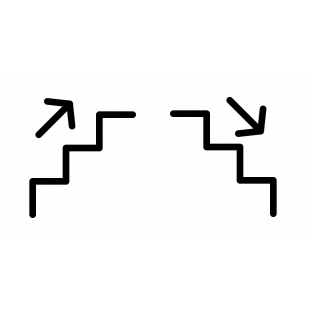

# ioBroker.bidirectional-counter

## bidirektionaler Zähleradapter für ioBroker

Im Gegensatz dazu steht die Trennung von Verbrauch (positive Veränderungen) und Lieferung (negative Veränderungen).

Mit diesem Zähler können Sie jeden numerischen Status in der benutzerdefinierten Konfiguration auswählen. Der Adapter erstellt intern drei Status: „Verbraucht“, „Geliefert“ und „Gesamt“. Der Status „Verbraucht“ wird zugewiesen, wenn eine positive Änderung des abonnierten Status festgestellt wird. Der Status „Geliefert“ wird zugewiesen, wenn eine negative Änderung des abonnierten Status festgestellt wird. Der Status „Gesamt“ wird in jedem Fall zugewiesen.

Dieser Adapter ist beispielsweise nützlich, um einen Energiezähler mit einem bestimmten Energiewert eines externen Geräts zu emulieren. Shelly setzt beispielsweise die Energie eines Kanals nach einem Neustart auf null zurück. Der Adapter ignoriert den Wert null und speichert ihn zur Verwendung in anderen Adaptern/Skripten. Der Zählerstand erhöht sich vom gespeicherten Wert, sobald sich der Energiestand von Shelly das nächste Mal erhöht.

## Changelog
<!--
	Placeholder for the next version (at the beginning of the line):
	### **WORK IN PROGRESS**
-->
### **WORK IN PROGRESS**
- (copilot) Adapter requires node.js >= 22 now

### 2.5.15 (2026-04-05)
* (BenAhrdt) building desc for id

### 2.5.14 (2026-04-05)
* (BenAhrdt) building icon and color for inactive counters in dM card

### 2.5.13 (2026-04-05)
* (BenAhrdt) change design of identifier and sort alphabetically

### 2.5.12 (2026-04-04)
* (BenAhrdt) improve id and transform back id

### 2.5.11 (2026-04-04)
* (BenAhrdt) sort display in card

### 2.5.10 (2026-04-04)
* (BenAhrdt) build id removed and building sourcestates improved

### 2.5.9 (2026-04-04)
* (BenAhrdt) add deviceManager

### 2.5.8 (2026-02-28)
* (BenAhrdt) bugfix 2.0 dependencies

### 2.5.7 (2026-02-28)
* (BenAhrdt) bugfix dependencies

### 2.5.6 (2026-02-28)
* (BenAhrdt) update dependencies

### 2.5.5 (2026-02-10)
* (BenAhrdt) implements max difference value

### 2.5.4 (2025-11-10)
* (BenAhrdt) set raw common.writable = false

### 2.5.3 (2025-11-10)
* (BenAhrdt) adding raw value for every counted value

### 2.5.2 (2025-11-06)
* (BenAhrdt) logging fallback optional as warning

### 2.5.1 (2025-11-05)
* (BenAhrdt) New Calculation in case of fallback to zero and go back to some value.
             Remember the last Value for counting the difference

### 2.5.0 (2025-10-19)
* (BenAhrdt) update Authentication NPM
* (BenAhrdt) update lint to 2.1.0
* (BenAhrdt) update testing removeing defDependencies
* (BenAhrdt) update dependencie core
* (BenAhrdt) update dependencie to node >= 20
* (BenAhrdt) update testing to 24.x

### 2.4.0 (2025-02-22)
* (BenAhrdt) update admin and js-controller dependencies

### 2.3.0 (2024-12-05)
* (BenAhrdt) update eslint

### 2.2.1 (2024-11-26)
* (BenAhrdt) changed schema and responsive tags

### 2.2.0 (2024-08-13)
* (BenAhrdt) Update Dependencies: "js-controller": ">=5.0.19"
  Check your System before installing new Version

### 2.1.4 (2024-08-09)
* (BenAhrdt) changes for check and service Bot

### 2.1.3 (2023-11-14)
* (BenAhrdt) debuglogging for changed values added

### 2.1.2 (2023-11-12)
* (BenAhrdt) translation for uk added
* (BenAhrdt) insert check vor node version >= 16

### 2.1.1 (2023-11-02)
* (BenAhrdt) correction in jsonconfig schema

### 2.1.0 (2023-04-06)
* (BenAhrdt) updated to new releasescript

[Older changelogs can be found there](https://github.com/BenAhrdt/ioBroker.bidirectional-counter/blob/main/CHANGELOG_OLD.md)

## License
MIT License

Copyright (c) 2025-2026 BenAhrdt <bsahrdt@gmail.com>

Permission is hereby granted, free of charge, to any person obtaining a copy
of this software and associated documentation files (the "Software"), to deal
in the Software without restriction, including without limitation the rights
to use, copy, modify, merge, publish, distribute, sublicense, and/or sell
copies of the Software, and to permit persons to whom the Software is
furnished to do so, subject to the following conditions:

The above copyright notice and this permission notice shall be included in all
copies or substantial portions of the Software.

THE SOFTWARE IS PROVIDED "AS IS", WITHOUT WARRANTY OF ANY KIND, EXPRESS OR
IMPLIED, INCLUDING BUT NOT LIMITED TO THE WARRANTIES OF MERCHANTABILITY,
FITNESS FOR A PARTICULAR PURPOSE AND NONINFRINGEMENT. IN NO EVENT SHALL THE
AUTHORS OR COPYRIGHT HOLDERS BE LIABLE FOR ANY CLAIM, DAMAGES OR OTHER
LIABILITY, WHETHER IN AN ACTION OF CONTRACT, TORT OR OTHERWISE, ARISING FROM,
OUT OF OR IN CONNECTION WITH THE SOFTWARE OR THE USE OR OTHER DEALINGS IN THE
SOFTWARE.