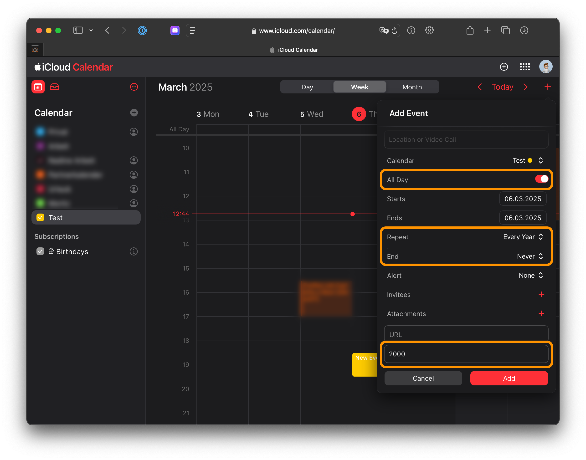

# ioBroker.birthdays

## iCal

Du kannst eine iCal-Datei (HTTP-URL oder Pfad zu einer lokalen Datei) nutzen, welche alle Geburtstage enthält. Der Adapter sucht nach allen Terminen in dieser Datei.

_Lokale Dateien werden seit Adapter-Version 2.0.0 unterstützt_

Deine Termine

1. müssen das Geburtsjahr in der Beschreibung enthalten (z.B. 1987)
2. sind ganztäging
3. stehen auf "jährlich wiederholen"

Es ist NICHT zwingend erforderlich die iCal-Option zu nutzen. Du kannst auch andere Quellen für Geburtstage nutzen. _Falls Du mehrere Optionen nutzt, werden die Informationen zusammengeführt._

### Google-Kalender

Gehe zum [Google Kalender](http://calendar.google.com/) und erstelle einen neuen Kalender. In diesen trägst Du dann neue Termine ein, welche den Kriterien (siehe oben) entsprechen. Danach kann die private Kalender-URL im Adapter verwendet werden um die Termine zu nutzen.

### Synology Calendar

### Apple iCloud Clendar

