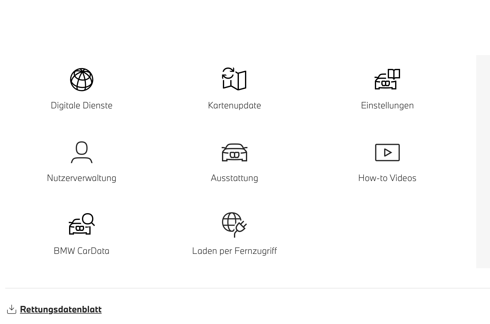
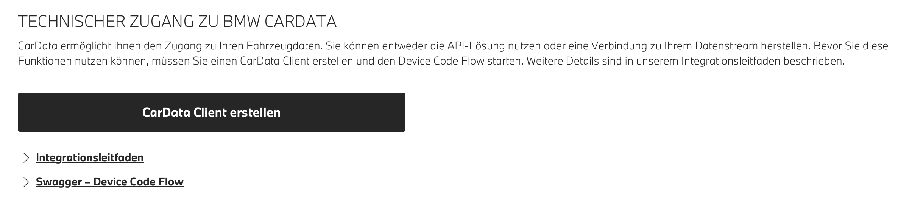
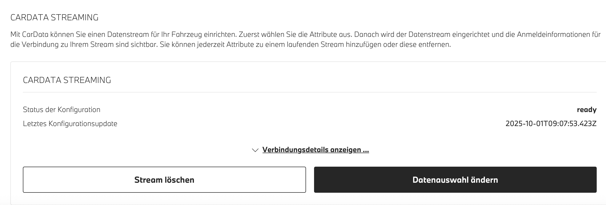

# ioBroker.bmw

## Versionen

## BMW-Adapter für ioBroker

Dieser Adapter integriert BMW-Fahrzeuge in ioBroker mithilfe der neuen BMW CarData API mit OAuth2-Authentifizierung und Echtzeit-MQTT-Streaming. Er ermöglicht die umfassende Überwachung von Fahrzeugdaten für alle mit Ihrem BMW-Konto verknüpften BMW-Modelle.

## Posten

Dieser Adapter verwendet Sentry-Bibliotheken, um Ausnahmen und Codefehler automatisch an die Entwickler zu melden. Weitere Informationen und Hinweise zum Deaktivieren der Fehlerberichterstattung finden Sie in der [Dokumentation des Sentry-Plugins](https://github.com/ioBroker/plugin-sentry#plugin-sentry) !

## Datenaktualisierung während des Ladevorgangs

Während des Ladevorgangs kann es vorkommen, dass der Akkustand nicht per Stream aktualisiert wird, da sich das Fahrzeug im Schlaf-/Standby-Modus befindet. Beim Einschalten des Fahrzeugs werden die Daten aktualisiert. Sie können eine Aktualisierung über die API auslösen.`bmw.0.vin.remote.fetchViaAPI`

## Datenpunktbeschreibung

Eine detaillierte Beschreibung der Datenpunkte finden Sie hier: [telematic.json](https://github.com/TA2k/ioBroker.bmw/blob/master/telematic.json)

## Einrichtungsanleitung

### 1. BMW ConnectedDrive Portal einrichten

1. Besuchen Sie das BMW ConnectedDrive Portal: **<https://www.bmw.de/de-de/mybmw/vehicle-overview>** oder <https://www.mini.de/de-de/mymini/vehicle-overview>
2. Navigieren Sie zum Bereich **BMW CarData** (dort sehen Sie verschiedene Servicekategorien).

3. Klicken Sie auf die Schaltfläche **„CarData-Client erstellen“** .
4. Kopieren Sie die Client-ID.
5. Warten Sie 30 Sekunden
6. Klicken Sie auf CarData API
7. Warten Sie 30 Sekunden
8. Klicken Sie auf CarData Streaming

## **WICHTIG** : Klicken Sie auf einen Dienst und warten Sie 30 Sekunden, falls eine Fehlermeldung erscheint. Klicken Sie dann erneut. Klicken Sie nicht auf „Gerät Authentifizieren“. Geben Sie die Client-ID in den iobroker-Einstellungen ein. Falls dies nicht funktioniert, versuchen Sie es mit Kleinbuchstaben.

### 2. CarData-Streaming-Konfiguration

**SIE MÜSSEN CARDATA STREAMING KONFIGURIERN UND ALLE 244 DATENPUNKTE AUSWÄHLEN**

Nachdem Sie Ihre Client-ID erstellt haben, konfigurieren Sie das Streaming:

1. Suchen Sie im Abschnitt CarData nach **„CARDATA STREAMING“.**
2. Der Konfigurationsstatus sollte als **„bereit“** angezeigt werden.
3. Beachten Sie den Zeitstempel **„Letztes Konfigurationsupdate“** .

4. Klicken Sie auf die Schaltfläche **„Datenauswahl ändern“** .
5. **Wählen Sie ALLE Kategorien aus** (Fahrzeugstatus, Ladevorgang, Fahrtdaten usw.).
6. **Überprüfen Sie alle 244 einzelnen Datenpunkte manuell.**
7. Oder geben Sie dies in der Google Developer Console ein und drücken Sie F12.`document.querySelectorAll('label.chakra-checkbox:not([data-checked])').forEach(l => l.click());`
8. Speichern Sie Ihre Konfiguration, indem Sie gegebenenfalls auf **„Stream löschen“** klicken, um sie zurückzusetzen, und konfigurieren Sie sie anschließend neu.

**Ohne die Auswahl aller Datenpunkte liefert MQTT-Streaming keine vollständigen Daten!**

### 3. Adapterkonfiguration

1. Geben Sie Ihre **Client-ID** in den Adaptereinstellungen ein.
2. Wählen Sie Ihre **Fahrzeugmarke** (BMW, Mini, Toyota Supra)
3. **Aktualisierungsintervall** festlegen (mindestens 10 Minuten aufgrund des API-Kontingents)
4. Konfigurieren Sie bei Bedarf **die Liste der zu ignorierenden Fahrgestellnummern.**

### 4. Authentifizierungsprozess

1. Schalten Sie den Adapter ein.
2. Überprüfen Sie die Protokolle auf die OAuth2-Autorisierungs-URL.
3. Besuchen Sie die URL und melden Sie sich mit Ihrem BMW-Konto an.
4. Autorisieren Sie die Anwendung
5. Der Adapter wird nach der Autorisierung automatisch fortgesetzt.

## Datenstruktur

Fahrzeugdaten sind organisiert unter`bmw.0.VIN.*` Wo`VIN` steht für Ihre Fahrzeugidentifikationsnummer:

### Hauptordnerstruktur

- **`bmw.0.VIN.api.*`** - API-Daten (regelmäßige Aktualisierungen)
  - Die Daten wurden über die BMW CarData REST API via .remote abgerufen.
  - Nutzt das API-Kontingent (50 Aufrufe pro 24 Stunden).

- **`bmw.0.VIN.stream.*`** - Streamdaten (Echtzeit-MQTT)
  - Daten, die über Echtzeit-MQTT-Streaming oder remote.fetchViaAPI empfangen werden.
  - Sofortige Aktualisierungen bei Änderungen der Fahrzeugdaten
  - Beinhaltet alle 244 konfigurierten Datenpunkte

### Verfügbare API-Endpunkte (konfigurierbar)

Sie können diese Endpunkte in den Adaptereinstellungen aktivieren/deaktivieren (BMW CarData API v1):

- `bmw.0.VIN.api.basicData.*` - Fahrzeuginformationen, Modell, Marke, Baureihe ✅ **(Standard: Aktiviert)**
- `bmw.0.VIN.api.chargingHistory.*` - Ladevorgänge und Verlauf ✅ **(Standard: Aktiviert)**
- `bmw.0.VIN.api.image.*` - Fahrzeugbild dient nur zu Darstellungszwecken
- `bmw.0.VIN.api.locationBasedChargingSettings.*` - Standortspezifische Ladepräferenzen und -einstellungen
- `bmw.0.VIN.api.smartMaintenanceTyreDiagnosis.*` - Intelligentes Reifenwartungssystem und Reifendiagnose

### Metadaten

- `bmw.0.VIN.lastStreamViaAPIUpdate` - Zeitstempel der letzten Datenaktualisierung (API)
- `bmw.0.VIN.lastStreamUpdate` - Zeitstempel der letzten Aktualisierung des MQTT-Streams

## Echtzeit-Updates

Der Adapter empfängt Echtzeit-Updates per MQTT-Streaming, wenn:

- Das Auto befindet sich nicht im Schlaf-/Standby-Modus.
- Fahrzeugstatusänderungen (Türen, Fenster, Lichter)
- Aktualisierungen zum Ladestatus
- Standortänderungen während der Fahrt
- Klimaanlagenaktivierung
- Servicebenachrichtigungen

## Fernbefehle

**Verfügbare Fernbedienungen:**

Die BMW CarData API ist schreibgeschützt, daher bietet dieser Adapter keine Fahrzeugsteuerungsfunktionen. Für Fernsteuerungsfunktionen verwenden Sie bitte:

**Offizielle BMW Lösungen:**

- **MyBMW Mobile App** – Volle Fernbedienungsfunktionalität
- **BMW ConnectedDrive Portal** – Webbasierte Fahrzeugverwaltung
- **BMW Alexa Skill** – Sprachsteuerungsintegration mit Amazon Alexa für Befehle wie:
  - „Alexa, bitte BMW, mein Auto zu verriegeln.“
  - "Alexa, bitte BMW, die Klimaanlage einzuschalten."
  - "Alexa, bitte BMW, meine Lichter blinken zu lassen."

**In diesem Adapter verfügbare Fernbedienungen:**

- `fetchViaAPI` - Aktuelle Telematikdaten über die Container-API abrufen
- `basicData` - Fahrzeuggrundinformationen aktualisieren (Modell, Marke, Baureihe)
- `chargingHistory` - Ladevorgänge der letzten 30 Tage abrufen
- `image` - Aktuelles Fahrzeugbild abrufen
- `locationBasedChargingSettings` - Standortbasierte Ladepräferenzen abrufen
- `smartMaintenanceTyreDiagnosis` - Reifendiagnosedaten abrufen

_Hinweis: Dies sind ausschließlich Datenabrufbefehle – Fahrzeugsteuerungsbefehle werden von der BMW CarData API nicht unterstützt._

## Fehlerbehebung

### Authentifizierungsprobleme (400 Bad Request)

Falls Authentifizierungsfehler auftreten:

1. Überprüfen Sie, ob die CarData-API für Ihre Client-ID aktiviert ist.
2. Stellen Sie sicher, dass CarData Streaming aktiviert ist.
3. Prüfen Sie, ob alle 244 Datenpunkte ausgewählt sind.
4. Erwägen Sie, Ihre Client-ID neu zu generieren.

### Keine MQTT-Daten

Falls Sie keine Echtzeit-Updates erhalten:

1. Überprüfen Sie, ob CarData Streaming abonniert und aktiv ist.
2. Stellen Sie sicher, dass alle Datendeskriptoren (244 Punkte) ausgewählt sind.
3. Prüfen Sie, ob Ihr Fahrzeug CarData-Streaming unterstützt.
4. Starten Sie den Adapter nach Änderungen der Deskriptorkonfiguration neu.

### API-Kontingent überschritten

Der Adapter verwaltet das Limit von 50 API-Aufrufen pro 24 Stunden automatisch:

- **Deaktivieren Sie unnötige API-Endpunkte** in den Adaptereinstellungen, um die Kontingentnutzung zu reduzieren.
- Erhöhen Sie das Aktualisierungsintervall, wenn Sie häufig an Ihre Kontingentgrenzen stoßen.
- MQTT-Streaming wird nicht auf das API-Kontingent angerechnet und liefert Echtzeitdaten.
- Jeder aktivierte API-Endpunkt verwendet einen Kontingentaufruf pro Aktualisierungsintervall

### Fehlende Daten im API-Ordner

Wenn Sie die erwarteten Daten nicht sehen in`VIN.api.*` :

1. Prüfen Sie, ob der entsprechende Endpunkt in den Adaptereinstellungen aktiviert ist.
2. Prüfen Sie, ob Sie Ihr API-Kontingent überschritten haben (Adapterprotokolle prüfen).
3. Einige Endpunkte sind möglicherweise nicht für alle Fahrzeugtypen verfügbar.
4. Prüfen Sie die Adapterprotokolle auf spezifische Endpunktfehler (404, 403 usw.).

### Datenquellen verstehen

- **`VIN.api.*`** - Wird regelmäßig basierend auf dem Intervall und den aktivierten Endpunkten aktualisiert
- **`VIN.stream.*`** - Aktualisierung in Echtzeit via MQTT bei Änderungen der Fahrzeugdaten
- **`VIN.lastUpdate`** - Zeitstempel der letzten Datenaktualisierung (API oder MQTT)
- **`VIN.lastStreamUpdate`** - Zeitstempel der letzten Aktualisierung des MQTT-Streams

## Quelle

Dieser Adapter ist verfügbar unter: <https://github.com/TA2k/ioBroker.bmw>

## Changelog

<!--
  Placeholder for the next version (at the beginning of the line):
  ### **WORK IN PROGRESS**
-->

### **WORK IN PROGRESS**

- (hombach) fixed repochecker error
- (hombach) fixed translations
- (hombach) updated dependencies

### 5.0.2 (2026-08-11)

- (TA2k) added a staged telematic container fallback on CU-403: full catalogue (294) -> without endpoint-bound keys (290) -> all streaming-capable keys plus extras (252) -> curated reduced set (75), keeping as much coverage as BMW accepts instead of failing
- (TA2k) expanded the reduced/fallback container to a curated 75-key set covering EV charging/HV battery, range/mileage/fuel, location, doors, windows, tyres, service and status for both EV and combustion vehicles
- (TA2k) log the active container's state, version and name for diagnostics
- (TA2k) auto-upgrade an outdated reduced container via a version marker in the container purpose, while never deleting a working full container

### 5.0.1 (2026-08-10)

- (TA2k) fixed CU-103 "token-scope is not CarData" by requesting the cardata:api:read scope explicitly in the device code flow
- (TA2k) fixed MQTT streaming: use the token gcid as username and topic prefix (matching BMW's broker ACL), fixing the "Unspecified error" subscribe failure
- (TA2k) fixed container cleanup deleting with an undefined containerId (CU-121)
- (TA2k) removed the CarData Streaming Username setting - the gcid is now taken automatically from the token
- (TA2k) added an option to create a reduced telematic container (workaround for CU-403 on container creation)
- (hombach) updated adapter-core
- (hombach) fixed adapterchecker errors: downgraded @types/node to ^22, added Sentry notice to README, added @iobroker/adapter-dev
- (hombach) replaced native setInterval/setTimeout with adapter-managed equivalents in main.js
- (hombach) moved all jsonConfig.json inline translations to i18n files
- (hombach) updated dependencies

### 5.0.0 (2026-05-17)

- (copilot) BREAKING: Adapter requires node.js >= 22 now
- (hombach) fixed axios vulnerability
- (hombach) removed node 20 tests
- (hombach) added CHANGELOG_OLD.md
- (hombach) updated dependencies

### 4.3.5 (2026-04-11)

- (hombach) fix repo checker warnings
- (hombach) fix vulnerability
- (hombach) update dependencies
- (hombach) remove old admin files

### 4.3.4 (2026-02-28)

- enhance docu and logging
- (hombach) fix vulnerability
- (hombach) update dependencies

### 4.3.3 (2026-01-02)

- (hombach) year 2026 changes
- (hombach) update dependencies

### Old Changes see [CHANGELOG OLD](https://github.com/TA2k/ioBroker.bmw/blob/master/CHANGELOG_OLD.md)

## License

MIT License

Copyright (c) 2021-2026 TA2k <tombox2020@gmail.com>

Permission is hereby granted, free of charge, to any person obtaining a copy
of this software and associated documentation files (the "Software"), to deal
in the Software without restriction, including without limitation the rights
to use, copy, modify, merge, publish, distribute, sublicense, and/or sell
copies of the Software, and to permit persons to whom the Software is
furnished to do so, subject to the following conditions:

The above copyright notice and this permission notice shall be included in all
copies or substantial portions of the Software.

THE SOFTWARE IS PROVIDED "AS IS", WITHOUT WARRANTY OF ANY KIND, EXPRESS OR
IMPLIED, INCLUDING BUT NOT LIMITED TO THE WARRANTIES OF MERCHANTABILITY,
FITNESS FOR A PARTICULAR PURPOSE AND NONINFRINGEMENT. IN NO EVENT SHALL THE
AUTHORS OR COPYRIGHT HOLDERS BE LIABLE FOR ANY CLAIM, DAMAGES OR OTHER
LIABILITY, WHETHER IN AN ACTION OF CONTRACT, TORT OR OTHERWISE, ARISING FROM,
OUT OF OR IN CONNECTION WITH THE SOFTWARE OR THE USE OR OTHER DEALINGS IN THE
SOFTWARE.