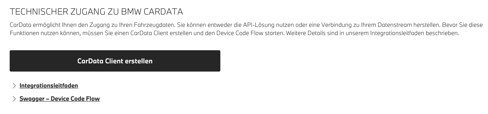

# IoBroker.bmw
## Versionen
# BMW Adapter für ioBroker
Dieser Adapter integriert BMW-Fahrzeuge in ioBroker mithilfe der neuen BMW CarData API mit OAuth2-Authentifizierung und Echtzeit-MQTT-Streaming. Er bietet eine umfassende Fahrzeugdatenüberwachung für alle mit Ihrem BMW-Konto verknüpften BMW-Modelle.

## Datenaktualisierung während des Ladevorgangs
Während des Ladevorgangs kann es vorkommen, dass der Batteriestand nicht per Stream aktualisiert wird, da sich das Fahrzeug im Standby-Modus befindet. Beim Einschalten des Fahrzeugs werden die Daten aktualisiert. Sie können ein Update über die API `bmw.0.vin.remote.fetchViaAPI` auslösen.

## Einrichtungsanweisungen
### 1. Einrichtung des BMW ConnectedDrive Portals
1. Besuchen Sie das BMW ConnectedDrive Portal: **https://www.bmw.de/de-de/mybmw/vehicle-overview**
2. Navigieren Sie zum Bereich **BMW CarData** (Sie sehen verschiedene Servicekategorien)

3. Klicken Sie auf die Schaltfläche **"CarData Client erstellen"**
4. Kopieren Sie die Client-ID
5. Warten Sie 30 Sekunden
6. Klicken Sie auf CarData API
7. Warten Sie 30 Sekunden
8. Klicken Sie auf CarData Streaming

# **KRITISCH**: Klicken Sie auf einen Dienst und warten Sie 30 Sekunden. Wenn eine Fehlermeldung angezeigt wird, klicken Sie dann erneut. Drücken Sie nicht auf "Gerät Authentifizieren/Devict authentication". Geben Sie die Client-ID in den iobroker-Einstellungen ein.
### 2. CarData Streaming-Konfiguration
**SIE MÜSSEN CARDATA STREAMING KONFIGURIEREN UND ALLE 244 DATENPUNKTE AUSWÄHLEN**

Konfigurieren Sie das Streaming, nachdem Sie Ihre Client-ID erstellt haben:

1. Suchen Sie im Bereich CarData nach **"CARDATA STREAMING"**
2. Sie sollten den Konfigurationsstatus als **"bereit"** sehen.
3. Beachten Sie den Zeitstempel „Letztes Konfigurationsupdate“**

4. Klicken Sie auf die Schaltfläche **"Datenauswahl ändern"**
5. **Wählen Sie ALLE Kategorien aus** (Fahrzeugstatus, Aufladen, Reisedaten usw.)
6. **Überprüfen Sie manuell ALLE 244 einzelnen Datenpunkte**
7. Oder geben Sie dies in der Google Developer Console ein und drücken Sie F12 `document.querySelectorAll('label.chakra-checkbox:not([data-checked])').forEach(l => l.click());`
8. Speichern Sie Ihre Konfiguration, indem Sie bei Bedarf auf **"Stream löschen"** klicken, und konfigurieren Sie sie dann neu

**Ohne die Auswahl aller Datenpunkte liefert das MQTT-Streaming keine vollständigen Daten!**

### 3. Adapterkonfiguration
1. Geben Sie Ihre **Client-ID** in den Adaptereinstellungen ein
2. Geben Sie Ihren **CarData Streaming-Benutzernamen** ein (zu finden im BMW-Portal unter CarData > Streaming-Bereich)
3. Wählen Sie Ihre Fahrzeug-**Marke** (BMW, Mini, Toyota Supra)
4. **Aktualisierungsintervall** festlegen (mindestens 10 Minuten aufgrund des API-Kontingents)
5. Konfigurieren Sie bei Bedarf die **VIN-Ignorierliste**

### 4. Authentifizierungsprozess
1. Starten Sie den Adapter
2. Überprüfen Sie die Protokolle auf die OAuth2-Autorisierungs-URL
3. Besuchen Sie die URL und melden Sie sich mit Ihrem BMW-Konto an
4. Autorisieren Sie die Anwendung
5. Der Adapter wird nach der Autorisierung automatisch fortgesetzt

## Datenstruktur
Fahrzeugdaten sind unter `bmw.0.VIN.*` organisiert, wobei `VIN` Ihre Fahrzeugidentifikationsnummer darstellt:

### Hauptordnerstruktur
- **`bmw.0.VIN.api.*`** – API-Daten (regelmäßige Updates)
- Daten werden über die BMW CarData REST API über .remote abgerufen.
- Verwendet API-Kontingent (50 Aufrufe pro 24 Stunden)

- **`bmw.0.VIN.stream.*`** – Stream-Daten (Echtzeit-MQTT)
- Datenempfang über Echtzeit-MQTT-Streaming oder remote.fetchViaAPI
- Sofortige Updates bei Änderungen der Fahrzeugdaten
- Enthält alle 244 konfigurierten Datenpunkte

### Verfügbare API-Endpunkte (konfigurierbar)
Sie können diese Endpunkte in den Adaptereinstellungen aktivieren/deaktivieren (BMW CarData API v1):

- `bmw.0.VIN.api.basicData.*` - Fahrzeuginformationen, Modell, Marke, Serie ✅ **(Standard: Aktiviert)**
- `bmw.0.VIN.api.chargingHistory.*` – Ladevorgänge und -verlauf ✅ **(Standard: Aktiviert)**
- `bmw.0.VIN.api.image.*` - Fahrzeugbild für Anzeigezwecke
- `bmw.0.VIN.api.locationBasedChargingSettings.*` – Standortspezifische Ladepräferenzen und -einstellungen
- `bmw.0.VIN.api.smartMaintenanceTyreDiagnosis.*` - Intelligentes Wartungssystem für Reifenzustand und -diagnose

### Metadaten
- `bmw.0.VIN.lastStreamViaAPIUpdate` - Zeitstempel der letzten Datenaktualisierung (API)
- `bmw.0.VIN.lastStreamUpdate` – Zeitstempel des letzten MQTT-Stream-Updates

## Echtzeit-Updates
Der Adapter empfängt Echtzeit-Updates über MQTT-Streaming, wenn:

- Das Auto ist nicht im Ruhe-/Standby-Modus
- Fahrzeugstatusänderungen (Türen, Fenster, Lichter)
- Ladestatus-Updates
- Standortänderungen während der Fahrt
- Aktivierung der Klimaanlage
- Servicebenachrichtigungen

## Remote-Befehle
**Verfügbare Fernbedienungen:**

Die BMW CarData API ist schreibgeschützt, daher bietet dieser Adapter keine Fahrzeugsteuerungsfunktion. Für die Fernsteuerung verwenden Sie:

**Offizielle BMW-Lösungen:**

- **MyBMW Mobile App** – Vollständige Fernbedienungsfunktionalität
- **BMW ConnectedDrive Portal** – Webbasiertes Fahrzeugmanagement
- **BMW Alexa Skill** – Sprachsteuerungsintegration mit Amazon Alexa für Befehle wie:
- „Alexa, sag BMW, mein Auto abzuschließen“
- „Alexa, sag BMW, dass er die Klimaanlage starten soll“
- „Alexa, sag BMW, dass meine Lichter blinken sollen.“

**In diesem Adapter verfügbare Fernbedienungen:**

- `fetchViaAPI` - Holen Sie sich die neuesten Telematikdaten über die Container-API
- `basicData` - Fahrzeuggrundinformationen aktualisieren (Modell, Marke, Serie)
- `chargingHistory` - Ladevorgänge der letzten 30 Tage abrufen
- `image` - Aktuelles Fahrzeugbild abrufen
- `locationBasedChargingSettings` - Standortbasierte Ladeeinstellungen abrufen
- `smartMaintenanceTyreDiagnosis` - Reifendiagnosedaten abrufen

_Hinweis: Dies sind nur Befehle zum Abrufen von Daten. Die BMW CarData API unterstützt keine Befehle zur Fahrzeugsteuerung._

## Fehlerbehebung
### Authentifizierungsprobleme (400 Ungültige Anfrage)
Wenn Authentifizierungsfehler auftreten:

1. Überprüfen Sie, ob die CarData-API für Ihre Client-ID aktiviert ist
2. Stellen Sie sicher, dass CarData Streaming aktiviert ist
3. Überprüfen Sie, ob alle 244 Datenpunkte ausgewählt sind
4. Erwägen Sie die Neugenerierung Ihrer Client-ID

### Keine MQTT-Daten
Wenn Sie keine Echtzeit-Updates erhalten:

1. Überprüfen Sie, ob CarData Streaming abonniert und aktiv ist
2. Stellen Sie sicher, dass alle Datendeskriptoren (244 Punkte) ausgewählt sind
3. Prüfen Sie, ob Ihr Fahrzeug CarData-Streaming unterstützt
4. Starten Sie den Adapter nach Änderungen der Deskriptorkonfiguration neu

### API-Kontingent überschritten
Der Adapter verwaltet das Limit von 50 API-Aufrufen pro 24 Stunden automatisch:

- **Deaktivieren Sie unnötige API-Endpunkte** in den Adaptereinstellungen, um die Kontingentnutzung zu reduzieren
- Erhöhen Sie das Aktualisierungsintervall, wenn Sie häufig an die Kontingentgrenzen stoßen
- MQTT-Streaming wird nicht auf das API-Kontingent angerechnet und liefert Echtzeitdaten
- Jeder aktivierte API-Endpunkt verwendet einen Kontingentaufruf pro Aktualisierungsintervall

### Fehlende Daten im API-Ordner
Wenn Sie in `VIN.api.*` nicht die erwarteten Daten sehen:

1. Überprüfen Sie, ob der entsprechende Endpunkt in den Adaptereinstellungen aktiviert ist
2. Stellen Sie sicher, dass Sie das API-Kontingent nicht überschritten haben (überprüfen Sie die Adapterprotokolle).
3. Einige Endpunkte sind möglicherweise nicht für alle Fahrzeugtypen verfügbar
4. Überprüfen Sie die Adapterprotokolle auf bestimmte Endpunktfehler (404, 403 usw.).

### Datenquellen verstehen
- **`VIN.api.*`** – Wird regelmäßig basierend auf Intervall und aktivierten Endpunkten aktualisiert
- **`VIN.stream.*`** – Wird in Echtzeit über MQTT aktualisiert, wenn sich Fahrzeugdaten ändern
- **`VIN.lastUpdate`** – Zeitstempel der letzten Datenaktualisierung (API oder MQTT)
- **`VIN.lastStreamUpdate`** – Zeitstempel des letzten MQTT-Stream-Updates

## Quelle
Dieser Adapter ist erhältlich unter: [https://github.com/TA2k/ioBroker.bmw](https://github.com/TA2k/ioBroker.bmw)

## Changelog

### 4.2.0 (2025-10-04)

- improve token refresh
- fix image fetching

### 4.1.1 (2025-10-03)

- Add API fetching via Container and move other apis to manually fetching

### 4.0.5 (2025-10-01)

- **BREAKING:** Complete migration to BMW CarData API with OAuth2 Device Flow authentication
- **BREAKING:** Removed username/password authentication (deprecated by BMW)
- **BREAKING:** Removed all remote control functionality (CarData API is read-only)
- **BREAKING:** Removed second user support and CAPTCHA requirements
- **NEW:** Real-time MQTT streaming for instant vehicle data updates
- **NEW:** OAuth2 Device Code Flow authentication with PKCE
- **NEW:** API quota management system (50 calls per 24 hours)
- **NEW:** Configurable API endpoint selection to manage quota usage
- **NEW:** Organized folder structure: api/ for periodic updates, stream/ for real-time data
- **NEW:** Enhanced state management with proper object creation
- **NEW:** Modern JSON-based configuration interface (jsonConfig.json)
- **NEW:** Comprehensive setup documentation with BMW portal integration
- **FIXED:** MQTT message processing logic for correct data validation
- **FIXED:** State creation issues preventing "no existing object" errors
- **IMPROVED:** Removed unused dependencies (cookie handling, legacy auth)
- **IMPROVED:** Enhanced error handling with specific guidance for common issues

### 3.0.1 (2025-09-27)

- (hombach) change to recommended stable admin 7.6.17 (#159)
- (hombach) migrate to iobroker/eslint-config (#146)
- (hombach) fix form-data vulnerability
- (hombach) code cleanups
- (hombach) update axios
- (hombach) bump adapter-core
- (hombach) fix issues detected by repository checker (#170)
- (hombach) bump dependencies

### 3.0.0 (2025-06-10)

- BREAKING: Dropped support for Node.js 18 (#88)
- (hombach) BREAKING: Dropped support for js-controller 5 (#111)
- (hombach) BREAKING: change to admin 7.4.10 as recommended by ioBroker (#111)
- (hombach) encrypt and protect second user password - has to be reentered (#111)
- (hombach) bump dependencies

### 2.9.5 (2025-05-18)

- (hombach) update axios
- (hombach) fixing issues detected by repository checker (#88)
- (hombach) some small code cleanups/modernisations
- (hombach) add/translate description
- (hombach) update logo

### 2.9.4 (2025-02-26)

- fix for Mitbenutzer Feature

### 2.9.3 (2025-01-29)

- fix remote controls
- add Mitbenutzer Login for remote controls

### 2.9.0 (2024-11-28)

- added new remotes as switch and updated values
- added retry logic for remotes

### 2.8.4 (2024-11-21)

- improved charging session parsing
- added remote to fetch charging session from a specific month
- added raw JSON of charging session for export

### 2.8.3 (2024-11-18)

- login fixed

### 2.8.2 (2024-10-05)

- fix error getvehicles v2 failed

### 2.8.1 (2024-09-30)

- fix remote commands

### 2.7.1

- Bugfixes

### 2.5.5

- Fix login

### 2.5.0

- Fix login

### 2.4.1

- Add support for MINI and force refresh remote

### 2.3.0

- Disable v1 Endpoints

### 2.1.1

- Upgrade to statusV2 and remoteV2

### 2.0.0

- (TA2k) initial release

## License

MIT License

Copyright (c) 2021-2025 TA2k <tombox2020@gmail.com>

Permission is hereby granted, free of charge, to any person obtaining a copy
of this software and associated documentation files (the "Software"), to deal
in the Software without restriction, including without limitation the rights
to use, copy, modify, merge, publish, distribute, sublicense, and/or sell
copies of the Software, and to permit persons to whom the Software is
furnished to do so, subject to the following conditions:

The above copyright notice and this permission notice shall be included in all
copies or substantial portions of the Software.

THE SOFTWARE IS PROVIDED "AS IS", WITHOUT WARRANTY OF ANY KIND, EXPRESS OR
IMPLIED, INCLUDING BUT NOT LIMITED TO THE WARRANTIES OF MERCHANTABILITY,
FITNESS FOR A PARTICULAR PURPOSE AND NONINFRINGEMENT. IN NO EVENT SHALL THE
AUTHORS OR COPYRIGHT HOLDERS BE LIABLE FOR ANY CLAIM, DAMAGES OR OTHER
LIABILITY, WHETHER IN AN ACTION OF CONTRACT, TORT OR OTHERWISE, ARISING FROM,
OUT OF OR IN CONNECTION WITH THE SOFTWARE OR THE USE OR OTHER DEALINGS IN THE
SOFTWARE.