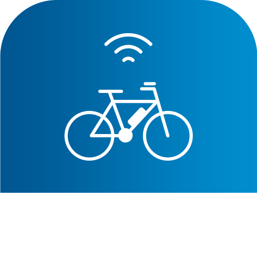

# IoBroker.bosch-ebike
**Tests:** 

## Bosch-E-Bike-Adapter für ioBroker
Adapter für Bosch E-Bike

## Anmeldeablauf
Die Bosch eBike Mail und Passwort eingeben.

## Steuern
bosch-ebike.0.id.remote auf true/false setzen steuert den jeweiligen Befehl

## Wächter
Dieser Adapter verwendet die Sentry-Bibliotheken, um Ausnahmen und Codefehler automatisch an die Entwickler zu melden. Weitere Details und Informationen zum Deaktivieren der Fehlerberichterstattung finden Sie in Abschnitt [Sentry-Plugin-Dokumentation](https://github.com/ioBroker/plugin-sentry#plugin-sentry)! Die Sentry-Berichterstattung wird ab js-controller 3.0 verwendet.

## Diskussion und Fragen
<https://forum.iobroker.net/topic/55902/test-adapter-bosch-ebik-connect-flow>

## Changelog
### 0.1.13 (2026-07-17)
- battery state added

### 0.1.12 (2025-01-14)

- fix for login use code url instead of captcha

### 0.1.11 (2025-01-03)

- fix for login. Deletion of the instance is necessary if the settings screen is not loading.

### 0.1.9 (2024-11-25)

- fix for login

### 0.1.5

- (TA2k) login fix

### 0.0.2

- (TA2k) initial release

## License

MIT License

Copyright (c) 2022-2026 TA2k <tombox2020@gmail.com>

Permission is hereby granted, free of charge, to any person obtaining a copy
of this software and associated documentation files (the "Software"), to deal
in the Software without restriction, including without limitation the rights
to use, copy, modify, merge, publish, distribute, sublicense, and/or sell
copies of the Software, and to permit persons to whom the Software is
furnished to do so, subject to the following conditions:

The above copyright notice and this permission notice shall be included in all
copies or substantial portions of the Software.

THE SOFTWARE IS PROVIDED "AS IS", WITHOUT WARRANTY OF ANY KIND, EXPRESS OR
IMPLIED, INCLUDING BUT NOT LIMITED TO THE WARRANTIES OF MERCHANTABILITY,
FITNESS FOR A PARTICULAR PURPOSE AND NONINFRINGEMENT. IN NO EVENT SHALL THE
AUTHORS OR COPYRIGHT HOLDERS BE LIABLE FOR ANY CLAIM, DAMAGES OR OTHER
LIABILITY, WHETHER IN AN ACTION OF CONTRACT, TORT OR OTHERWISE, ARISING FROM,
OUT OF OR IN CONNECTION WITH THE SOFTWARE OR THE USE OR OTHER DEALINGS IN THE
SOFTWARE.