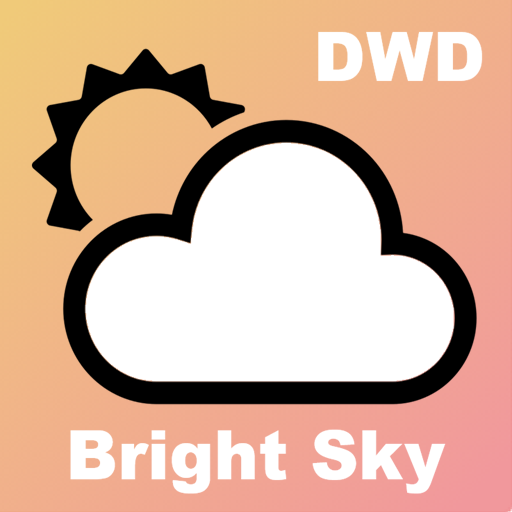

# ioBroker.brightsky

## BrightSky-Adapter für ioBroker

## Was ist die Bright Sky API?

Die Bright Sky API ist eine kostenlose, öffentliche API, die Wetterdaten des Deutschen Wetterdienstes (DWD) bereitstellt. Sie wurde entwickelt, um den Zugriff auf diese Daten zu vereinfachen, da die Originaldaten des DWD oft in schwer verständlichen Formaten vorliegen. Bright Sky konvertiert diese Daten in ein benutzerfreundliches JSON-Format und stellt sie über eine API zur Verfügung.

Hier folgt eine detailliertere Erklärung:

**Ziel:** Die Bright Sky API hat zum Ziel, Wetterdaten des Deutschen Wetterdienstes (DWD) für Entwickler und andere Interessierte leicht zugänglich zu machen.

**Datenquelle:** Die Daten stammen vom DWD und umfassen Wetterbeobachtungen von Stationen sowie Wettervorhersagen, wie beispielsweise die MOSMIX-Modelle.

**Format:** Die Bright Sky API stellt die Daten im JSON-Format bereit, was die Integration in Anwendungen und Websites erleichtert.

**Zugang:** Die API ist öffentlich und kann ohne API-Schlüssel genutzt werden, wodurch die Einstiegshürde niedrig bleibt.

**Open Source:** Das Projekt ist Open Source, das heißt, der Quellcode ist öffentlich verfügbar und kann von der Community weiterentwickelt werden.

**Vorteile:** Die Bright Sky API bietet eine einfache Möglichkeit, auf Wetterdaten zuzugreifen, die sonst schwer zu handhaben wären, und ist kostenlos, was sie zu einer attraktiven Option für viele Projekte macht.

---

## Welche Daten können im Vergleich zu anderen Adaptern verwendet werden?

Die aktuellen Wetterdaten werden vom Deutschen Wetterdienst (DWD) zweimal stündlich aktualisiert. Dabei werden die Daten der nächstgelegenen DWD-Wetterstation berücksichtigt. Sollten keine Wetterdaten verfügbar sein, werden diese automatisch durch Daten der zweit-, dritt- usw. entferntesten Wetterstation ersetzt. Die entsprechenden Ersatzdaten finden Sie im Adapter.

Neben der hohen Qualität der Daten sind insbesondere die Solardaten von Interesse:

  

Da die Werte aus dem Datenpunkt`brightsky.0.current.solar_60` Beispielsweise werden sie in kWh/m² angegeben und sind bereits als Energie pro Stunde ausgedrückt, der Wert`multiplied by 1000` kann auch in W/m² ausgedrückt werden.

Beispiel für die Globalstrahlung (W/m²)

---

## Adapter:

### Installation:

Im Gegensatz zu vielen anderen Adaptern ist kein Konto erforderlich.

Die Geokoordinaten für die Position können entweder direkt aus dem Browser oder von ioBroker importiert werden.

  

### Die Objektstruktur:

Die Daten lauten wie folgt:

- aktuell - das aktuelle Wetter (siehe auch: <https://brightsky.dev/docs/#/operations/getCurrentWeather> )
- täglich – die aktuelle Wettervorhersage für die nächsten konfigurierbaren Tage (siehe`forecastDays` Konfiguration (Standard: 7 Tage)
  - `daily.XX.hourly` - optionale verschachtelte Stundendaten unter dem jeweiligen Tag (gesteuert durch`hourlyForecastDays` (nur an den ersten N Tagen vorhanden; 0 = deaktiviert)
  - `daily.XX.day` /`daily.XX.night` - zusammengefasste Tages-/Nachtübersichten pro Tag
- stündlich – flache Liste der stündlichen Vorhersagen für die nächsten N Stunden (siehe`hours` Konfiguration; unabhängig von der verschachtelten`daily.XX.hourly` Funktion; siehe auch: <https://brightsky.dev/docs/#/operations/getWeather> )
- Radar – Niederschlagsradarvorhersage für die nächsten 2 Stunden in 5-Minuten-Intervallen mit Werten in mm pro 5 Minuten. Enthält Maximalwerte über alle Gitterzellen hinweg und kumulative Summen über alle Gitterbereiche (siehe auch: <https://brightsky.dev/docs/#/operations/getRadar> )

---

## Changelog
<!--
    Placeholder for the next version (at the beginning of the line):
    ### **WORK IN PROGRESS**
-->
### 1.2.1 (2026-08-10)
- (ticaki) Fixed: radar `max_precipitation_forecast.*_sum` cumulative values were inflated because precipitation was summed across whole grid columns and scaled with `radarDistance`; the cumulative forecast now accumulates each grid cell over time and reports the maximum single location
- (ticaki) Changed: radar precipitation forecasts now report `null` instead of `-1` when no radar data is available
- (ticaki) Fixed: temporary API failures are retried automatically, so short Bright Sky outages no longer leave the data stale
- (ticaki) Changed: temporary API problems (e.g. `500 Internal Server Error`) are logged as warnings instead of errors with a stack trace
- (ticaki) Changed: more precise sunrise/sunset times and solar yield estimate (suncalc 2.x)
- (ticaki) Fixed: days without sunrise or sunset (polar day/night) are handled correctly

### 1.2.0 (2026-06-02)
- (ticaki) Added `conditionUI` (translated condition text) to `current` and `hourly.NN`, matching the existing `daily.NN.conditionUI` [#110](https://github.com/ticaki/ioBroker.brightsky/issues/110)
- (ticaki) Added a config option to choose the language for weather texts independent of the ioBroker system language [#110](https://github.com/ticaki/ioBroker.brightsky/issues/110)
- (ticaki) Requires Node.js >= 22 now; repository checker fixes (i18n, docs, tooling)
- (ticaki) Fixed: `daily.NN.day` aggregations stayed null/zero when `position` was not a valid `latitude,longitude`; the adapter now logs a clear error instead of producing empty data

### 1.1.0 (2026-03-23)
- (ticaki) Fixed: DWD station ID was incorrectly logged as WMO station ID fixes [#91](https://github.com/ticaki/ioBroker.brightsky/issues/91)
- (cavernerg) Added nested hourly forecast data under `daily.XX.hourly.YY` (0 = disabled)
- (cavernerg) Added configurable number of forecast days (`forecastDays`, default 7)
- (cavernerg) Admin UI restructured into labeled sections (Location, Forecast, Current Weather, Radar)

### 1.0.1 (2026-02-20)
- (ticaki) sunrise and sunset fixed

### 1.0.0 (2026-01-10)
- (ticaki) fixed: states/timezone/translation
- (ticaki) Customisable update interval for Daily (expert)
- (ticaki) BREAKING: remove forHomoran states