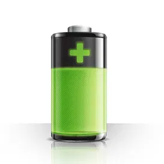

## Bydhvs-Adapter für ioBroker
BYD HVS Battery Poll-Daten

## Englisch:
## Einführung
Dieser Adapter nimmt Daten von einer byd PV-Batterie ( https://www.bydbatterybox.com/ ) und legt sie in Datenpunkte im Adapter ab. Leider gibt es keine offizielle API und keine Dokumentation, daher habe ich Wireshark und einen byd-hvs-Simulator verwendet, um zu versuchen, die Kommunikation zu verstehen. Mein Adapter simuliert die byd-App, sendet ähnliche Pakete an das Gerät und analysiert die Antworten.

## Vorsichtig sein
Es gibt zwei Schritte in der beConnect App, im ersten Schritt erhältst du die normalen Daten, im zweiten Schritt bekommst du Detail-Daten für alle Zellen (einzelne Zellentemperatur und -spannung und einige weitere Details) Um die Detail-Daten dort zu erhalten hat eine Verzögerung nach einem der Datenpakete sein, bis ich das Ergebnis erhalten kann. Ich glaube mittlerweile sind alle Zellen vermessen, bin mir aber nicht sicher. Daher habe ich die Häufigkeit des Lesens der Detaildaten begrenzt, es werden immer nur "n" Lesungen der normalen Daten durchgeführt, diese Einstellung können Sie ändern. Wenn Sie die Detaildaten nicht benötigen: Sie können diesen Teil abschalten.

## Hinweis für Systeme mit 5 Modulen
Personen mit 5 Modulen: Die Zellendetails werden nur für die ersten 4 Module gelesen - das Protokoll ist für 2-4 Module gleich. Ich würde es gerne um 5 Module erweitern, aber entweder kauft mir jemand die drei fehlenden Module ;-) damit ich das Protokoll analysieren kann oder ich bekomme ein Wireshark-Capture von einer funktionierenden Verbindung.

## Die Einstellungen
Intervall: Ganz einfach: wie oft (e) die Daten abgefragt werden sollen IP-Adresse: Das ist selbsterklärend. Entweder Sie verwenden die Standardadresse ( 192.168.16.254 ) und ändern das Routing zu Hause, z.B.: https://www.photovoltaikforum.com/thread/150898-byd-hvs-firmware-update/?postID=2215343#post2215343 . Der Vorteil ist: Die beConnect App funktioniert auch. Andere Möglichkeit: Du änderst die IP-Adresse der Box. Aber: Achtung: Der Text auf der Webseite ist verwirrend und wenn Sie sich nicht ganz sicher sind, was Sie tun: BITTE die Einstellungen nicht berühren. In den deutschen Foren lese ich von Leuten, die aus ihrem System ausgesperrt wurden und es keinen Weg zurück gibt, entweder schickt Dir byd eine Ersatz-HVU oder Du musst eine neue kaufen.
Batterie-Details: Wie oben erklärt: Benötigen Sie die Details der Batterie? Wenn ja: setze das checkobx.
Batterie-Details - alle ... Zyklen :Auch wie oben, sollte klar sein Testmodus - Daten im Fehlerprotokoll anzeigen: Wenn Sie dieses Kontrollkästchen aktivieren: Die gesendeten und empfangenen Daten werden im Fehlerprotokoll angezeigt, sodass Sie es einfach herunterladen können die Daten und schicke sie mir im Fehlerfall.

## Deutsche:
##Ein wenig Erklärungen:
Prinzipiell ist der Adapter durch Analyse der Datenpakete zwischen der BYD-App und dem BYD-Akku-System entstanden. Es werden im sterben Daten aus dem TAB System Info und aus dem TAB Diagnosis dargestellt. Offensichtlich sind die Daten für "System Info" sofort in der Batterie bereit zum Abholen, für die Diagnose-Daten sieht es so aus als wäre ein Messvorgang erforderlich, zwischen der Abfrage und den Werten muss ein Zeitintervall von gut 3 Sekunden eingehalten werden.

Daher lasse ich die Diagnose-Daten auch nicht bei jeder Abfrage der Daten mit ermitteln.

##Zu den Einstellungen:
Intervall: Zeitlicher Abstand zwischen den Abfragen des Adapters

IP-Adresse: Eigentlich logisch, damit ist die IP-Adresse des Adapters gemeint. Dafür gibt es zwei Möglichkeiten: Entweder hält man sich an die Anleitung von Becker3 aus dem Photovoltaik-Forum, ist hier verlinkt: https://www.photovoltaikforum.com/thread/150898-byd-hvs-firmware-update/?postID= 2215343#post2215343 . Das hat den Vorteil das auch die BYD-APP läuft und man mit dieser direkt an die Daten, auch zum Vergleich, herankommt. Oder man trägt "nur" die IP-Adresse die die BYD-Box per DHCP erhält hat ein. Ausdrücklich Waren möchte ich vor Änderungen an den IP-Einstellungen der BOX! Im Forum can man Berichte von Leuten lesen sterben Sich sterben Erreichbarkeit der Box dauerhaft ruiniert Haben.

Batterie-Details: Steuerung, ob die Details zu den Zellen gelesen werden sollen

Lesezyklen zu Batterie-Details: Anzahl der "Normal-Lese-Zyklen" bis wieder einmal die Diagnose-Daten gelesen werden. Hier sterben Warnung dazu: Ich habe keine Idee, ob man sich durch häufige Diagnose-Meldungen Nachteile einhandelt, daher empfehle ich den Wert möglichst hoch zu setzen. Ich wüsste auch nicht was man mit den Diagnose-Daten im Anfang der Umfrage beginnen sollte.

Zu den Batterie-Größen: Der Adapter funktioniert auch für Zelltemperaturen und ZellSpannungen bei 2,3 und 4 Batterie-Modulen. Bei einem System mit 5 Modulen werden nur die Zellspannungen der ersten 128 Zellen angezeigt. Für die Zellen 129 bis 160 ist mir nicht bekannt, wo die Daten gespeichert werden. Ich würde das gerne mit in den Adapter einbauen, benötige aber dafür einen Wireshark-Mittschnitt der Kommunikation zwischen der beConnect App und dem Speicher. Ich helfe auch gerne wenn jemand nicht weiß wie man den Mittschnitt machen kann, entweder per Teamviewer oder per Postings im Forum. Offensichtlich funktioniert die Kommunikation für die 5. Einheit anders als bei den ersten 4 Einheiten.

## Changelog
<!--
	Placeholder for the next version (at the beginning of the line):
	### __WORK IN PROGRESS__
-->
### 1.2.3 (2021-06-18)
*changed ratio of logo

### 1.2.2 (2021-06-14)
* bump to new patch-level (to get rid of the "-0")

### 1.2.2-0 (2021-05-30)
* Create States for Diagnose-Data only if necessary
* changes according review of the adapter

### 1.2.1 (2021-05-20)
* Power is now fixed with 2 number after the decimal point
* bug removed, cell voltage for cell 64 works now

### 1.2.0 (2021-05-15)
* preparation for being listed in official repository
* English part in readme.md
* removed State.ErrorNum totally in code, datapoint has to be deleted manually - I did not found a way to do it with JS
* hopefully works with HVM and HVS and possibly with HVL (only American market)
* redesign and more robust detection: number of cells for voltage and temperature
* New: inverter type
* New: type of battery 
* compatibility with new js-controller 3.3
* compatibility with nodejs 15
* compatibility with admin UI 5

###

## License
MIT License

Copyright (c) 2021 Christian <github@familie-herrmann.de>

Permission is hereby granted, free of charge, to any person obtaining a copy
of this software and associated documentation files (the "Software"), to deal
in the Software without restriction, including without limitation the rights
to use, copy, modify, merge, publish, distribute, sublicense, and/or sell
copies of the Software, and to permit persons to whom the Software is
furnished to do so, subject to the following conditions:

The above copyright notice and this permission notice shall be included in all
copies or substantial portions of the Software.

THE SOFTWARE IS PROVIDED "AS IS", WITHOUT WARRANTY OF ANY KIND, EXPRESS OR
IMPLIED, INCLUDING BUT NOT LIMITED TO THE WARRANTIES OF MERCHANTABILITY,
FITNESS FOR A PARTICULAR PURPOSE AND NONINFRINGEMENT. IN NO EVENT SHALL THE
AUTHORS OR COPYRIGHT HOLDERS BE LIABLE FOR ANY CLAIM, DAMAGES OR OTHER
LIABILITY, WHETHER IN AN ACTION OF CONTRACT, TORT OR OTHERWISE, ARISING FROM,
OUT OF OR IN CONNECTION WITH THE SOFTWARE OR THE USE OR OTHER DEALINGS IN THE
SOFTWARE.