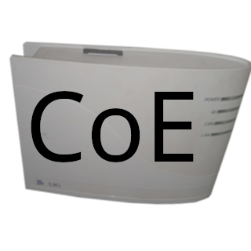

# ioBroker.cmicoe

## cmicoe-Adapter für ioBroker

Adapter zur Kommunikation mit dem [CMI durch Technische Alternative über CoE](https://www.ta.co.at/x2-bedienung-schnittstellen/cmi)

### HAFTUNGSAUSSCHLUSS

Diese Anwendung ist ein unabhängiges Produkt und steht in keiner Verbindung zu Technische Alternative. Sie wird weder von Technische Alternative unterstützt noch gesponsert. Alle Marken, Logos und Markennamen sind Eigentum ihrer jeweiligen Inhaber. Diese Anwendung ist für die Verwendung mit dem CMI konzipiert, jedoch kein offizielles Produkt von Technische Alternative. Die Kompatibilität mit allen Geräteversionen kann nicht garantiert werden.

## CMI einrichten

### CoE V2 aktivieren

Gehen Sie in der CMI-Weboberfläche zu Einstellungen > CAN und wählen Sie`CoE V2 (4byte)` als CoE-Version

### Ausgabe konfigurieren

Gehen Sie in der CMI-Weboberfläche zu Einstellungen > Ausgänge > CoE und fügen Sie einen analogen oder digitalen Ausgang mit folgenden Einstellungen hinzu:

#### IP

Geben Sie die IP-Adresse des iobroker-Servers ein.

#### Knotennummer / Netzwerkausgang

Geben Sie dieselbe Zahl ein, die Sie in den Eingangseinstellungen des Adapters angegeben haben.

## Setup-Adapter

### Einstellungen

#### Lokale IP-Adresse

Die IP-Adresse, über die iobroker auf CoE-Pakete des CMI wartet.

#### Lokaler Hafen

Der Port iobroker empfängt CoE-Pakete vom CMI.\
&#x20;Standardmäßig sendet das CMI alle CoEv2-Pakete über Port 5442.\
&#x20;**Dieser Adapter unterstützt nur CoE V2!**

#### CMI-IP-Adresse

Die IP-Adresse, an die iobroker die CoE-Pakete sendet

#### CMI-Port

Der Port iobroker sendet die CoE-Pakete an

#### Sendeintervall

Das Intervall in Sekunden, in dem alle Ausgaben an das CMI gesendet werden.

#### Wechselgeld senden

Wenn diese Option aktiviert ist, sendet der Adapter auch dann eine Ausgabe, wenn er sich ändert.

## Changelog
### 1.3.1 (2026-07-06)
* update dependencies

### 1.3.0 (2026-05-14)
* update dependencies
* (copilot) Adapter requires node.js >= 22 now

### 1.2.5 (2026-04-01)
* update dependencies

### 1.2.4 (2025-12-13)
* bump @types/node to 25.0.1
* bump @tsconfig/node20 to 20.0.8
* bump glob
* bump actions/checkout to 6
* more dependency updates

### 1.2.3 (2025-10-25)
* migrate to npm trusted publishing

[Older changelogs can be found there](https://github.com/FreDeko06/ioBroker.cmicoe/blob/main/CHANGELOG_OLD.md)

## License
MIT License

Copyright (c) 2025-2026 FreDeko <freddegenkolb@gmail.com>

Permission is hereby granted, free of charge, to any person obtaining a copy
of this software and associated documentation files (the "Software"), to deal
in the Software without restriction, including without limitation the rights
to use, copy, modify, merge, publish, distribute, sublicense, and/or sell
copies of the Software, and to permit persons to whom the Software is
furnished to do so, subject to the following conditions:

The above copyright notice and this permission notice shall be included in all
copies or substantial portions of the Software.

THE SOFTWARE IS PROVIDED "AS IS", WITHOUT WARRANTY OF ANY KIND, EXPRESS OR
IMPLIED, INCLUDING BUT NOT LIMITED TO THE WARRANTIES OF MERCHANTABILITY,
FITNESS FOR A PARTICULAR PURPOSE AND NONINFRINGEMENT. IN NO EVENT SHALL THE
AUTHORS OR COPYRIGHT HOLDERS BE LIABLE FOR ANY CLAIM, DAMAGES OR OTHER
LIABILITY, WHETHER IN AN ACTION OF CONTRACT, TORT OR OTHERWISE, ARISING FROM,
OUT OF OR IN CONNECTION WITH THE SOFTWARE OR THE USE OR OTHER DEALINGS IN THE
SOFTWARE.