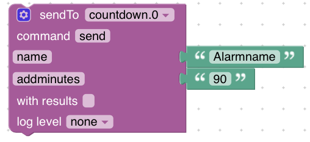

#ioBroker.countdown
 

**Dieser Adapter verwendet Sentry-Bibliotheken, um den Entwicklern automatisch Ausnahmen und Codefehler zu melden.** Weitere Details und Informationen zum Deaktivieren der Fehlerberichterstattung finden Sie unter [Dokumentation zum Sentry-Plugin](https://github.com/ioBroker/plugin-sentry#plugin-sentry)! Sentry Reporting wird ab js-controller 3.0 verwendet.

Countdown-Adapter für ioBroker ---------------------------------------------------------- --------------------------------

Das Ziel des Adapters ist es, Ihnen die Möglichkeit zu geben, Countdowns für zukünftige Ereignisse mit Jahren, Monaten, Tagen, Stunden und Minuten auszuführen. Es wird Ihnen jedes dieser Werte separat zur Verfügung stellen und auch zwei Zeichenfolgen mit einer kurzen und einer langen Version des Datums.

## Countdowns anzeigen
Der Adapter prowidet Ihnen automatisch eine Json-Tabelle. Sie müssen es nur mit der json-Tabelle verwenden. Bitte dort "Kein Header" ankreuzen. Es ist möglich, entweder den Kurztext oder den Langtext anzuzeigen.

## So erstellen Sie Countdowns
Es gibt zwei Möglichkeiten, Countdowns einzurichten:

* Einen Countdown können Sie in den Adaptereinstellungen im Reiter "Countdown erstellen" erstellen.
* Sie können im Gerät "Setup" einen manuellen Zustand erstellen. Der Name des Objekts ist der Alarmname, und der Wert ist das Datum. Das Datum muss das Format "DD.MM.YYYY HH:mm:ss" haben.
* Sie können mit sendto einen Alarm erstellen. Dort können Sie entweder die Komponenten (Minimum ist Jahr Monat Datum) oder eine Datumszeichenfolge senden. Für die Datumszeichenfolge können Sie das Format im Setup des Adapters anpassen.

* Sie können mit sendto Tage, Monate und Jahre zum heutigen Datum hinzufügen. Bitte senden Sie daher die Komponente "name" und entweder "addminutes", "addhours", "adddays", "addmonths" oder "addyears" als int-Wert.

## So löschen Sie Countdowns
Mit sendto können Sie einen Countdown löschen. Senden Sie daher nur den Namen mit sendto an den Adapter, und der Countdown wird automatisch gelöscht.

## Wiederholter Countdown
Wenn Sie möchten, dass sich ein Countdown in einem definierten Zeitraum wiederholt (z. B. können Sie nicht jedes Jahr einen Countdown für Ihren Hochzeitstag durchführen), können Sie dies auch mit diesem Adapter tun. Füllen Sie daher entweder das Feld „Wiederholungszeitraum“ in den Einstellungen des Adapters aus, oder fügen Sie beim Anlegen eines Countdowns vom Typ „Datum“ den Zeitraum nach dem Datum hinzu. So würde ein sendTo für einen Countdown aussehen, der am 1. April 2020 enden und sich jedes Jahr wiederholen soll:

sendTo("countdown.0", "send", { "name": 'Hochzeitstag', "date": '01.04.2020 00:01+1Y' });

Parameter hier sind:

* Y: Jahre
* M: Monate
* D: Tage
* H: Stunden
* m: Minuten

## Verfügbare Ausgänge
|Datentyp|Beschreibung|
|:---:|:---:|
|Minuten|Minuten bis Countdown-Ende (nicht insgesamt!)|
|hours|Stunden bis Countdown-Ende (nicht gesamt!)|
|days|Tage bis Countdown-Ende (nicht gesamt!)|
|Monate|Monate bis Countdown-Ende (nicht gesamt!)|
|Jahre|Jahre bis Countdown-Ende (nicht gesamt!)|
|name|Countdown-Name|
|endDate|Enddatum des Countdowns - formatiert wie im Setup definiert|
|inWordsShort|Kombinierter Wert aus Minuten, Stunden,... - z.B. 1J 5M 4D|
|inWordsLong|Kombinierter Wert aus Minuten, Stunden,... - z.B. 1 Jahr 5 Monate 4 Tage|
|totalHours|Gesamtanzahl der Stunden bis zum Enddatum|
|totalDays|Gesamtanzahl der Tage bis zum Enddatum|
|totalWeeks|Gesamtanzahl der Wochen bis zum Enddatum|
|reached|Boolesches Feld, das definiert, ob das Enddatum erreicht wurde oder nicht|
|repeatEvery|Countdown wird um diesen Zeitraum nach Erreichen des Enddatums wiederholt|

## Funktionen zum Hinzufügen
* Möglichkeit, ein Skript als Parameter hinzuzufügen und es zu starten, wenn der Countdown endet
* Möglichkeit, Plus und Minus in Addminutes und den anderen Add-Funktionen zu verwenden

## 1.2.5 (2021-06-16)
* (jack-blackson) Bugfix zum Löschen des Countdowns mit sendto

## 1.2.4 (2021-06-09)
* (jack-blackson) Kleine Bugfixes, Übersetzungen

## 1.2.3 (2021-05-27)
* (jack-blackson) Kleine Bugfixes, Übersetzungen

## 1.2.2 (2021-05-25)
* (jack-blackson) Kleine Bugfixes, Weblate für Übersetzungen hinzugefügt

## 1.2.1 (2021-05-09)
* (jack-blackson) Kleine Bugfixes

## 1.2.0 (2021-05-09)
* (jack-blackson) Aktualisierte Pakete, Sentry hinzugefügt
* (jack-blackson) Fixes für JS-Controller 3.3
* (jack-blackson) Fix, dass Countdowns sofort erstellt werden

## 1.1.0 (2020-04-02)
* (jack-blackson) Bugfix Read-Me-Link
* (jack-blackson) Bugfix repeatCycle

## 1.0.9 (2020-03-31)
* (jack-blackson) Bugfix-Log-Meldungen

## 1.0.8 (2020-03-31)
* (jack-blackson) Countdown in einem definierten Zeitraum wiederholen (z.B. jedes Jahr)

## 1.0.7 (2020-03-30)
* (jack-blackson) Neuer Datumstyp für Einstellungen hinzugefügt: JJJJ-MM-TT
* (jack-blackson) Countdown direkt in den Adaptereinstellungen hinzufügen

## 1.0.6 (2020-03-20)
* (DutchmanNL) Fester Adaptertyp

## 1.0.5 (2020-02-05)
* (jack-blackson) Bugfix für Alarm um Mitternacht -> danke an @Lueghi

## 1.0.4 (2019-08-25)
* (jack-blackson) Veröffentlichungsinfos neu geordnet

## 1.0.3 (2019-08-10)
* (jack-blackson) Änderungen für den Kompaktmodus
* (jack-blackson) Diverse Bugfixes
* (jack-blackson) Mehrere Instanzen des Adapters sind jetzt möglich

## 1.0.2 (2019-07-22)
* (jack-blackson) Release-Version

## 0.7.0 (2019-07-07)
* (jack-blackson) Bugfixes
* (jack-blackson) addminutes und addhours sind jetzt auch möglich
* (Jack-Blackson) Datenpunkt im Setup ist jetzt editierbar
* (jack-blackson) hinzugefügte Gesamtzahl von Wochen

## 0.6.0 (2019-07-06)
* (Jack-Blackson) einstellbares Datumsformat für Ein- und Ausgabe
* (jack-blackson) Countdowns mit sendto löschen
* (Jack-Blackson) Möglichkeit, Countdowns nach "Tagen/Monaten/Wochen ab jetzt hinzuzufügen)

## 0.5.0 (2019-07-04)
* (jack-blackson) passen Sie die Daten in der Tabelle an
* (jack-blackson) Bugfix-Datumsimport

### 0.4.0 (2019-06-04)
* (jack-blackson) Restrukturierung - Erstellen von Alarmen mit sendto oder manuell mit Datapoint ist jetzt möglich

### 0.3.0 (2019-05-24)
* (jack-blackson) hinzugefügte Gesamtzahl der Tage und Stunden

### 0.2.0 (2019-05-21)
* (jack-blackson) angepasste Pakete

### 0.1.0 (2019-04-29)
* (jack-blackson) erste Version

## Changelog

## License
The MIT License (MIT)

Copyright (c) 2019-2021 jack-blackson <blacksonj7@gmail.com>

Permission is hereby granted, free of charge, to any person obtaining a copy
of this software and associated documentation files (the "Software"), to deal
in the Software without restriction, including without limitation the rights
to use, copy, modify, merge, publish, distribute, sublicense, and/or sell
copies of the Software, and to permit persons to whom the Software is
furnished to do so, subject to the following conditions:

The above copyright notice and this permission notice shall be included in
all copies or substantial portions of the Software.

THE SOFTWARE IS PROVIDED "AS IS", WITHOUT WARRANTY OF ANY KIND, EXPRESS OR
IMPLIED, INCLUDING BUT NOT LIMITED TO THE WARRANTIES OF MERCHANTABILITY,
FITNESS FOR A PARTICULAR PURPOSE AND NONINFRINGEMENT. IN NO EVENT SHALL THE
AUTHORS OR COPYRIGHT HOLDERS BE LIABLE FOR ANY CLAIM, DAMAGES OR OTHER
LIABILITY, WHETHER IN AN ACTION OF CONTRACT, TORT OR OTHERWISE, ARISING FROM,
OUT OF OR IN CONNECTION WITH THE SOFTWARE OR THE USE OR OTHER DEALINGS IN
THE SOFTWARE.