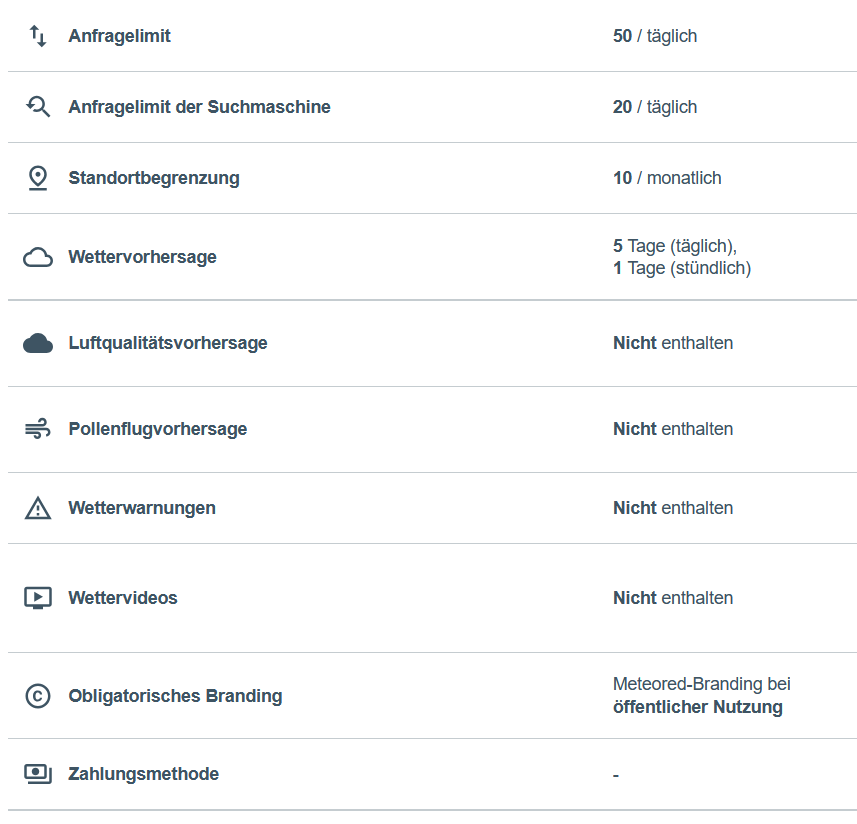

# ioBroker.DasWetter.

**Dieser Adapter nutzt die Sentry-Bibliotheken, um Ausnahmen und Codefehler automatisch an die Entwickler zu melden.** Weitere Details und Informationen zum Deaktivieren der Fehlerberichterstattung finden Sie in [der Sentry-Plugin-Dokumentation](https://github.com/ioBroker/plugin-sentry#plugin-sentry) ! Die Sentry-Berichterstattung wird ab js-controller 3.0 verwendet.

**Wenn es Ihnen gefällt, erwägen Sie bitte eine Spende:**

Dieser Adapter liest Wettervorhersagedaten von DasWetter.com.

## Update-Hinweis v4

Dieser Adapter v4 nutzt die neue API (2026). Die Datenstruktur unterscheidet sich nun von älteren Versionen. Alte Instanzen müssen gelöscht und eine neue Instanz erstellt werden. Jeder Benutzer muss die neue API auf der DasWetter-Website aktivieren. Ein API-Schlüssel wird bereitgestellt, der in den Adaptereinstellungen verwendet werden muss. Mit der neuen API können sich auch neue Benutzer auf der [DasWetter](https://dashboard.meteored.com/de/login) -Website registrieren.

## allgemeine Funktionalität

Der Benutzer muss zunächst die API auf dem Server von [DasWetter](https://dashboard.meteored.com/de/login) aktivieren. Mit API-Schlüssel, Postleitzahl und Stadtnamen in der Adapterkonfiguration kann der Adapter anschließend Wettervorhersagedaten vom Server abrufen. Nach dem Start des Adapters erfolgt zunächst eine Standortprüfung. Anhand der Postleitzahl wird versucht, die nächstgelegene Wetterstation zu ermitteln. Typischerweise antwortet der Server aufgrund ähnlicher Postleitzahlen mit Standorten aus verschiedenen Ländern. Der Adapter versucht dann, die richtige Wetterstation anhand des Stadtnamens zu finden. Wenn die nächstgelegene Station gefunden wurde, wird intern ein Standort-Hash gespeichert, der später zum Anfordern von Wettervorhersagedaten verwendet wird. Derzeit stehen nur zwei Pfade zur Verfügung.

- Tagesvorhersage Die Tagesvorhersage liefert allgemeine Wettervorhersagedaten für die nächsten 5 Tage

- Stündliche Vorhersage Die stündliche Vorhersage bietet eine detailliertere Prognose für die 24 Stunden des heutigen Tages

Wir versuchen, die Anzahl der Serveranfragen auf ein Minimum zu reduzieren. Jeder Nutzer sollte die Anzahl der Anfragen ebenfalls auf ein Minimum beschränken. Meteored stellt uns den Basistarif kostenlos zur Verfügung.

### Einschränkungen des kostenlosen Tarifs

### Alternativen

Soll die Vorhersage lediglich visualisiert werden, ist das [Widget](https://www.daswetter.com/users/de/widget) ebenfalls eine gute Alternative. Ein [Widget für Vis-2](https://github.com/rg-engineering/ioBroker.vis-2-widgets-weather-and-heating?tab=readme-ov-file#meteored-weather-widget) ist bereits verfügbar.

## Hinweise

## bekannte Probleme

- Bitte erstellt Issues auf [GitHub](https://github.com/rg-engineering/ioBroker.daswetter/issues) , wenn ihr Fehler findet oder neue Funktionen wünscht.

## Changelog

<!--
  Placeholder for the next version (at the beginning of the line):
  ### **WORK IN PROGRESS**
-->

### **WORK IN PROGRESS**
* (René) dependency updates
 
### 4.5.9 (2026-07-05)
* (René) dependency updates and translations

### 4.5.6 (2026-06-17)
* (René) see issue #574 and #571: state roles adapted

### 4.5.4 (2026-05-31)
* (copilot) Adapter requires node.js >= 22 now
* (René) see issue 534: bug fix for current hour: time ends at forecast period
* (René) see issue 515: decimal places for temperature adjusable between 0 and 2 in admin
* (René) see issue 515: add a datapoint to show last time when data was downloaded from server

### 4.5.3 (2026-03-08)
* (René) solved lint errors and warnings based on adapter checker
* (René) dependency updates and fixes based on adapter checker recommendations

### 4.5.1 (2026-02-01)
* (René) bug fix: wind url was not set if wind speed was zero
* (René) bug fix: save selected icon type (svg, png or gif) in admin

[Older changelogs can be found there](https://github.com/rg-engineering/ioBroker.daswetter/blob/master/CHANGELOG_OLD.md)

## License

MIT License

Copyright (c) 2017-2026 René G. <info@rg-engineering.eu>

Permission is hereby granted, free of charge, to any person obtaining a copy
of this software and associated documentation files (the "Software"), to deal
in the Software without restriction, including without limitation the rights
to use, copy, modify, merge, publish, distribute, sublicense, and/or sell
copies of the Software, and to permit persons to whom the Software is
furnished to do so, subject to the following conditions:

The above copyright notice and this permission notice shall be included in all
copies or substantial portions of the Software.

THE SOFTWARE IS PROVIDED "AS IS", WITHOUT WARRANTY OF ANY KIND, EXPRESS OR
IMPLIED, INCLUDING BUT NOT LIMITED TO THE WARRANTIES OF MERCHANTABILITY,
FITNESS FOR A PARTICULAR PURPOSE AND NONINFRINGEMENT. IN NO EVENT SHALL THE
AUTHORS OR COPYRIGHT HOLDERS BE LIABLE FOR ANY CLAIM, DAMAGES OR OTHER
LIABILITY, WHETHER IN AN ACTION OF CONTRACT, TORT OR OTHERWISE, ARISING FROM,
OUT OF OR IN CONNECTION WITH THE SOFTWARE OR THE USE OR OTHER DEALINGS IN THE
SOFTWARE.