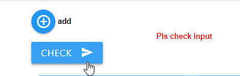

# IoBroker.device-reminder

## Deutsche Readme benötigt?  [deutsche Readme](https://github.com/Xenon-s/ioBroker.device-reminder/blob/master/README_GER.md)
 

# Adapter zur Überwachung von Gerätezuständen Version
Dieser Adapter kann mittels Messbuchsen erkennen, ob ein Gerät eingeschaltet, in Betrieb oder ausgeschaltet ist und darauf reagieren. Nachrichten können dann automatisch per Telegram, WhatsApp, Alexa, Sayit, Pushover und E-Mail verschickt werden (Mehrfachauswahl pro Gerät möglich). Es ist auch möglich, die Steckdose nach Abschluss des Vorgangs automatisch abzuschalten (auch zeitverzögert). Bei gegebener Laufzeit ist es möglich, pro Datenpunkt einen Alarm auszugeben (mit externem Skript liefert der Datenpunkt nur true/false oder als Anzeige in der Vis). Hierzu reicht es aus, die Pre-Gating-Zeit einfach in Minuten in den Datenpunkt „device-reminder.X.XXX.config.runtime max“ einzutragen.

# Was ist zu beachten?
Das Aktualisierungsintervall des „Live-Verbrauchswertes (wird als **„_Energie“** bezeichnet)“ sollte bei den meisten Geräten nicht mehr als 10 Sekunden betragen, da es sonst zu sehr verzögerten Meldungen kommen kann. Der Adapter selbst fragt die Werte alle 10 Sekunden ab und verwendet neue Werte ereignisbasiert. Das schont das System  Befehl in der Tasmota-Konsole: TelePeriod 10

# Was ist pro Gerät möglich?
- Benachrichtigung beim Gerätestart
- Benachrichtigung am Ende des Betriebs des jeweiligen Geräts
- Telegram-Benachrichtigung (mehrere IDs sind möglich)
- Alexa-Benachrichtigung (mehrere IDs sind möglich)
- WhatsApp-Benachrichtigung (mehrere IDs sind möglich)
- Pushover-Benachrichtigung (mehrere IDs sind möglich)
- E-Mail-Benachrichtigung (mehrere IDs sind möglich)
- Signalbenachrichtigung (mehrere IDs sind möglich)
- Matrix-Benachrichtigung (mehrere IDs sind möglich)
- Benachrichtigungen können frei erstellt oder durch ein externes Skript angegeben werden
- Datenpunkte mit aktuellem Status, Live-Verbrauch und zuletzt gesendeter Statusmeldung, um Werte dieses Adapters in anderen Skripten zu verwenden
- Geräte können bei Bedarf (auch zeitverzögert) ausgeschaltet werden, wenn der Prozess als abgeschlossen erkannt wurde
- Sprachassistenten können pro Datenpunkt vorübergehend deaktiviert werden
- Laufzeitüberwachung in Minuten: Bei Zeitüberschreitung wird ein Alarm an alle ausgewählten Messenger gesendet

# Anweisung
## Grundlegende Dinge vorab
Für jede Gerätegruppe, Alexa etc. gibt es einen Button „Eingabe prüfen“. Wird dieser Button angeklickt, werden die vorhandenen Eingaben auf Plausibilität geprüft und Sie erhalten sofort eine Antwort, ob alle Eingaben korrekt sind. Wenn Sie Änderungen vorgenommen haben, muss dieser Button immer angeklickt werden! Der Button muss immer angeklickt werden, wenn er erscheint!    

## Gerät erstellen

- **Gerätename**: Frei wählbarer Name
- **Gerätetyp**: Hier muss ausgewählt werden um welches Gerät es sich handelt, damit die Berechnungen im Adapter korrekt ausgeführt werden können
- **Verbrauch**: Durch Klick auf den Button mit den drei weißen Punkten öffnet sich Ihre Objektverwaltung. Sie müssen den Datenpunkt auswählen, der den **aktuellen Live-Verbrauch** anzeigt.
- **Ein-/Ausschalten**: Klicken Sie auf den Button mit den drei weißen Punkten, um Ihre Objektverwaltung zu öffnen. Sie müssen den Datenpunkt auswählen, der Ihre **Steckdose ein-/ausschaltet** (nicht zwingend erforderlich). Ist dies nicht ausgewählt, kann keine automatische Abschaltung erfolgen.
- **Starttext**: Benachrichtigung, die beim Starten des Geräts gesendet werden soll (auch Sonderzeichen sind möglich)
- Endtext**: Benachrichtigung, die gesendet wird, wenn das Gerät seinen Betrieb beendet hat (auch Sonderzeichen sind möglich)

Bei **Starttext** und **Endtext** können Sie auch eine Nachricht von einem externen Datenpunkt erhalten. Diese Nachricht wird mit einer Verzögerung von 1 Sekunde vom Datenpunkt gelesen, nachdem sich der Status des Geräts geändert hat. So können Sie eine Nachricht von einem externen Skript erhalten. Der Adapter erkennt automatisch, ob eine Nachricht von einem Datenpunkt stammt oder einfach manuell eingegeben wurde. Um einen Datenpunkt auszuwählen, klicken Sie einfach auf die Schaltfläche mit den drei weißen Punkten und wählen Sie dann den entsprechenden Datenpunkt aus. **Bitte beachten**: Es kann nur entweder ein Datenpunkt **oder** eine manuell eingegebene Nachricht verwendet werden! 

# Geräte konfigurieren

- **aktiv**: Ist standardmäßig aktiviert. Hier können Sie ein Gerät vorübergehend deaktivieren, sodass es keine Benachrichtigungen mehr sendet.
- Gerät**: wird automatisch erstellt
- **Alexa**: Alle bisher erstellten Alexas werden hier aufgelistet und können per Klick hinzugefügt werden
- **sayit**: Alle bisher erstellten sayit-Geräte werden hier aufgelistet und können per Klick hinzugefügt werden
- **Telegram**: Alle zuvor angelegten Telegram-Benutzer werden hier aufgelistet und können per Klick hinzugefügt werden
- **WhatsApp**: Alle zuvor erstellten WhatsApp-Benutzer werden hier aufgelistet und können durch Anklicken hinzugefügt werden
- **Pushover**: Alle bisher angelegten Pushover-Benutzer werden hier aufgelistet und können per Klick hinzugefügt werden
- **E-Mail**: Alle zuvor erstellten E-Mail-Benutzer werden hier aufgelistet und können durch Anklicken hinzugefügt werden
- **Signal**: Alle zuvor angelegten Signal-Benutzer werden hier aufgelistet und können durch Anklicken hinzugefügt werden
- **Matrix**: Alle bisher erstellten Matrix-Benutzer werden hier aufgelistet und können durch Anklicken hinzugefügt werden
- **Ausschaltverzögerung**: Hier können Sie optional eine Zeitüberschreitung in **Minuten** eingeben. Nach Ablauf des Timeouts wird die Steckdose ausgeschaltet *sofern Auto-Off aktiviert ist*. Die Endemeldung des Gerätes bleibt von einem Timeout unberührt! Nur nutzbar, wenn unter „Geräte“ auch ein Abschaltdatenpunkt hinterlegt wurde.
- **Erkennung abbrechen**: Wenn aktiviert, versucht der Adapter zu erkennen, ob ein Gerät vor der Benachrichtigung bereits manuell ausgeschaltet wurde und benachrichtigt dann nicht mehr.

Nach einem Klick auf „**Speichern und schließen**“ wird nun für jedes neu erstellte Gerät ein Ordner unter *Objekte -> Geräteerinnerung* erstellt, in dem

- Bitte nicht stören (falls aktiviert, werden keine Nachrichten per **Spracherinnerung** gesendet)
- Laufzeit max
- der aktuelle Zustand des Geräts
- Laufzeitalarm
- Durchschnittsverbrauch (kann als Hilfsmittel zur Ermittlung eigener Schwellenwerte verwendet werden)
- Der letzte läuft im JSON-Format
- die letzte Laufzeit in hh:mm:ss
- der aktuelle Live-Verbrauch
- die Botschaft an die Boten
- die aktuelle Laufzeit in hh:mm:ss
- die aktuelle Laufzeit in Millisekunden

wird angezeigt. 

## Erstellen Sie Alexa

- **Name**: Frei wählbarer Name, auch Sonderzeichen sind möglich.
- alexa2/../announcement'/'speak'**: Hier müssen Sie den Datenpunkt auswählen, der Ihre Alexa sprechen lässt. Um den Datenpunkt auszuwählen, klicken Sie einfach auf die Schaltfläche mit den drei kleinen weißen Punkten.
- **Lautstärke 0–100**: Lautstärke, mit der Ihre Alexa sprechen soll (von 0–100 %).

Mit den letzten 2 Feldern können Sie einen Zeitraum festlegen, in dem Ihre Alexa eine Sprachausgabe durchführen darf. Standardmäßig ist der Zeitraum von 00:00 – 23:59 Uhr aktiv.

- **aktiv ab**: Startzeitpunkt des Benachrichtigungszeitraums
- **aktiv bis**: Endzeit des Benachrichtigungszeitraums

## SayIt-Gerät erstellen

- **Name**: Frei wählbarer Name, auch Sonderzeichen sind möglich.
- **'sayit/../text'**: Wählen Sie den Datenpunkt „text“ im jeweiligen sayIt-Geräteordner aus. Hier wird die Textausgabe gesendet.
- **Lautstärke 0-100**: Lautstärke, mit der Ihr sayit-Gerät sprechen soll (von 0 - 100%)
- **aktiv ab**: Startzeitpunkt des Benachrichtigungszeitraums
- **inaktiv ab**: Endzeitpunkt des Benachrichtigungszeitraums

## Pushover-Benutzer erstellen

- **Name**: Frei wählbarer Name, auch Sonderzeichen sind möglich.
- **Pushover-Instanz**: die Instanz, an die die Nachricht gesendet werden soll
- **Betreff**: optionaler Betreff der Nachricht
- **Geräte-ID**: optionale Geräte-ID, an die die Nachricht gesendet werden soll
- **Priorität**: Die Priorität, mit der gesendet werden soll
- **Ton**: Der Ton, der abgespielt wird, wenn Pushover die Nachricht empfängt.

## E-Mail-Benutzer erstellen

- **Name**: Frei wählbarer Name, auch Sonderzeichen sind möglich.
- **Absenderadresse**: E-Mail-Adresse, von der die E-Mail gesendet wird
- **Empfängeradresse**: E-Mail-Adresse, die die Nachricht empfangen soll

## Signalbenutzer erstellen

- **Name**: Frei wählbarer Name, auch Sonderzeichen sind möglich.
- **Signalinstanz**: Die installierte Instanz, an die gesendet werden soll.
- **Telefon**: optional eine Mobiltelefonnummer

## Telegrammbenutzer erstellen

- **Gruppe**: Wenn diese Option aktiviert ist, muss eine Chat-ID angegeben werden, um sie an einen Gruppenchat zu senden
- **Name**: Frei wählbarer Name, auch Sonderzeichen sind möglich.
- **Telegram-Instanz**: Die installierte Instanz, an die gesendet werden soll.
- **Benutzername/Vorname**: Der im Telegram-Adapter gespeicherte Name
- **Chat-ID**: Muss nur ausgefüllt werden, wenn Sie an eine Gruppe senden möchten

## WhatsApp-Benutzer erstellen

- **Name**: Frei wählbarer Name, auch Sonderzeichen sind möglich.
- **'whatsapp-cmb/../sendMessage'**: Der Datenpunkt des Whatsapp-Adapters, an den die Nachricht gesendet werden soll.

# Standardgeräte
 Diese Werte wurden über einen Zeitraum von mehreren Monaten und mit Hilfe zahlreicher Tester ermittelt. Änderungen der Werte können dazu führen, dass Geräte nicht mehr korrekt erfasst werden und es zu falschen Meldungen kommt.

# Benutzerdefinierte Geräte
 Diese Werte können vom Benutzer angepasst und dann verwendet werden. Das Folgende ist die Erklärung:

- **Schwellenwert 'Start' (Watt)**: Startwert in Watt, der überschritten werden muss, damit das Gerät als gestartet erkannt wird.
- **Schwellenwert „Ende“ (Watt)**: Endwert in Watt, der unterschritten werden muss, damit das Gerät als beendet erkannt wird.
- **Schwellenwert „Standby“ (Watt)**: Schwellenwert, um das Gerät als „AUS“ oder „IN STANDBY“ anzuzeigen. Liegt der aktuell berechnete Wert unterhalb der **Standy**-Schwelle, wird das Gerät als ausgeschaltet erkannt.
- **Anzahl der Startwerte**: Hier wird angegeben, wie oft der „Startwert“ **nacheinander** überschritten werden muss. Eine einmalige Unterschreitung dieses Wertes führt zu einem Startabbruch. Der Durchschnitt dieser Werte muss über dem Startwert liegen, damit das Gerät als gestartet erkannt wird. 

*Beispiel: Der Wert soll 10W betragen und dreimal hintereinander überschritten werden. 1. 15W, 2. 1W, 15W => Startphase wurde abgebrochen, da der zweite Wert unter 10.* lag.

- **Anzahl der Endwerte**: Hier wird angegeben, wie viele Werte aufgezeichnet werden sollen, bevor berechnet wird, ob das Gerät bereit ist. Je weniger Werte vorliegen, desto ungenauer ist das Ergebnis und die Gefahr von Fehlalarmen steigt. Je höher der Wert, desto genauer ist die Aufzeichnung. Der Nachteil besteht jedoch darin, dass die fertige Nachricht mit einer starken Verzögerung versendet wird. Das Ende wird erst erkannt, wenn die „Anzahl der Endwerte“ erreicht ist und der durchschnittliche Verbrauch unter dem „Schwellenwert ‚Ende‘ (Watt)“ liegt.

*Kurze Beispielrechnung:* Verbrauchswerte kommen alle 10 Sekunden. **Schwelle &#39;Ende&#39; (Watt)** ist auf 50 eingestellt, **Anzahl der Endwerte** ist auf 100 gesetzt. Nachdem das Gerät als gestartet erkannt wurde, werden 100 Werte (*dauert 100Werte x 10 Sekunden = 1000 Sekunden *) erfasst und erst dann der Durchschnittswert gebildet. Liegt dieser unter 50, erfolgt nach ca. 16,5 Minuten (wir erinnern uns an **Anzahl der Endwerte** = 100 Werte) **fertig** wird erkannt und eine Meldung (falls konfiguriert) wird ausgegeben. Liegt der Wert über 50, passiert nichts, da das Gerät noch in Betrieb ist. Jeder weitere Wert ersetzt nun den ältesten und nach jedem neuen Wert wird ein neuer Durchschnitt berechnet. 

# Unterstützung
**Wenn Ihnen meine Arbeit gefällt :** 

  

## Changelog
<!--
	Placeholder for the next version (at the beginning of the line):
    ### __WORK IN PROGRESS__
-->
### 3.0.1 (2023-10-18)
* (xenon-s) Update testing: [issue #325](https://github.com/Xenon-s/ioBroker.device-reminder/issues/325)
* (xenon-s) bugfix: [issue #327](https://github.com/Xenon-s/ioBroker.device-reminder/issues/327)
* (xenon-s) bugfix: [issue #328](https://github.com/Xenon-s/ioBroker.device-reminder/issues/328)
* (xenon-s) bugfix: [issue #329](https://github.com/Xenon-s/ioBroker.device-reminder/issues/329)

### 3.0.0 (2023-10-18)
**Breaking Changes**
* Made basic changes to the adapter structure, because there were numerous problems with the new "js-Controller 5.x". It is mandatory to reinstall the adapter!
* Numerous bug fixes
* New messengers added
* Admin GUI fundamentally reworked
* Whatsapp and Telegram must now be created manually
* (xenon-s) Fixes for js-controller 5.*
* (xenon-s) bugfix: [issue #278](https://github.com/Xenon-s/ioBroker.device-reminder/issues/278)
* (xenon-s) bugfix: [issue #273](https://github.com/Xenon-s/ioBroker.device-reminder/issues/273)
* (xenon-s) bugfix: [issue #267](https://github.com/Xenon-s/ioBroker.device-reminder/issues/267)
* (xenon-s) bugfix: [issue #218](https://github.com/Xenon-s/ioBroker.device-reminder/issues/218)
* (xenon-s) bugfix: [issue #207](https://github.com/Xenon-s/ioBroker.device-reminder/issues/207)
* (xenon-s) GUI Fixes "devices" : switch may be empty, but then no longer selectable 
* (xenon-s) add: [issue #258: Signal Messenger added](https://github.com/Xenon-s/ioBroker.device-reminder/issues/258)
* (xenon-s) add: [issue #245: Matrix added](https://github.com/Xenon-s/ioBroker.device-reminder/issues/245)
* (xenon-s) add: [issue #185: pushover device id added](https://github.com/Xenon-s/ioBroker.device-reminder/issues/185)
* (xenon-s) bugfix [issue #210](https://github.com/Xenon-s/ioBroker.device-reminder/issues/210)
* (xenon-s) bugfix [issue #169](https://github.com/Xenon-s/ioBroker.device-reminder/issues/169)
* (xenon-s) bugfix [issue #297](https://github.com/Xenon-s/ioBroker.device-reminder/issues/297)

### 1.2.9 (2021-06-22)
* (xenon-s) bugfix: error catching JSON last operations doesn't work

### 1.2.4 (2021-06-13)
* (xenon-s) bugfix: incorrect JSON format

### 1.2.3 (2021-06-13)
* (xenon-s) bugfix: [issue #76](https://github.com/Xenon-s/ioBroker.device-reminder/issues/76) messages from datapoint were not displayed
* (xenon-s) bugfix: [issue #75](https://github.com/Xenon-s/ioBroker.device-reminder/issues/75) "undefined is not a valid state"

### 1.2.1 (2021-05-01)
* (xenon-s) Adapter structure redesigned to classes
* (xenon-s) Admin UI design and inputs made more user friendly
* (xenon-s) Telegram bug fixed
* (xenon-s) Fix for js-controller 3.3.*
* (xenon-s) new datapoints added (runtime max, last runs as JSON, last runtime, runtime max, runtime alert)
* (xenon-s) add: runtime-alert

### 1.0.0 (2021-01-05)
* (xenon-s) initial commit version 1.0

## License

MIT License

Copyright (c) 2023 xenon-s <ente_s@hotmail.de>

Permission is hereby granted, free of charge, to any person obtaining a copy
of this software and associated documentation files (the "Software"), to deal
in the Software without restriction, including without limitation the rights
to use, copy, modify, merge, publish, distribute, sublicense, and/or sell
copies of the Software, and to permit persons to whom the Software is
furnished to do so, subject to the following conditions:

The above copyright notice and this permission notice shall be included in all
copies or substantial portions of the Software.

THE SOFTWARE IS PROVIDED "AS IS", WITHOUT WARRANTY OF ANY KIND, EXPRESS OR
IMPLIED, INCLUDING BUT NOT LIMITED TO THE WARRANTIES OF MERCHANTABILITY,
FITNESS FOR A PARTICULAR PURPOSE AND NONINFRINGEMENT. IN NO EVENT SHALL THE
AUTHORS OR COPYRIGHT HOLDERS BE LIABLE FOR ANY CLAIM, DAMAGES OR OTHER
LIABILITY, WHETHER IN AN ACTION OF CONTRACT, TORT OR OTHERWISE, ARISING FROM,
OUT OF OR IN CONNECTION WITH THE SOFTWARE OR THE USE OR OTHER DEALINGS IN THE
SOFTWARE.