# ioBroker.device-reminder

## Deutsche Readme-Datei benötigt?  [deutsche Readme](/#/docs/adapterref/iobroker.device-reminder/README_GER.md)

 

# Adapter zur Überwachung von Gerätezuständen Version

Dieser Adapter erkennt mithilfe von Messbuchsen, ob ein Gerät eingeschaltet, in Betrieb oder ausgeschaltet ist, und reagiert entsprechend. Benachrichtigungen können dann automatisch über Telegram, WhatsApp, Alexa, SayIt, Pushover und E-Mail versendet werden (Mehrfachauswahl pro Gerät möglich). Die Steckdose kann nach Abschluss des Vorgangs automatisch abgeschaltet werden (auch zeitverzögert). Bei vorgegebener Laufzeit kann pro Datenpunkt ein Alarm ausgegeben werden (mit externem Skript liefert der Datenpunkt nur „wahr/falsch“ oder wird im Vis angezeigt). Dazu genügt es, die Vorlaufzeit in Minuten im Datenpunkt „device-reminder.X.XXX.config.runtime max“ einzugeben.

# Was sollte berücksichtigt werden?

Das Aktualisierungsintervall des „Live-Verbrauchswerts (genannt **„\_energy“** )“ sollte bei den meisten Geräten nicht mehr als 10 Sekunden betragen, da es sonst zu erheblichen Verzögerungen bei den Meldungen kommen kann. Der Adapter selbst fragt die Werte alle 10 Sekunden ab und verwendet neue Werte ereignisbasiert. Dies spart dem System Zeit.  Befehl in der Tasmota-Konsole: TelePeriod 10

# Was ist pro Gerät möglich?

- Benachrichtigung beim Gerätestart
- Benachrichtigung am Ende des Betriebs des jeweiligen Geräts
- Telegram-Benachrichtigung (mehrere IDs möglich)
- Alexa-Benachrichtigung (mehrere IDs sind möglich)
- WhatsApp-Benachrichtigung (mehrere IDs möglich)
- Pushover-Benachrichtigung (mehrere IDs möglich)
- E-Mail-Benachrichtigung (mehrere IDs möglich)
- Signalbenachrichtigung (mehrere IDs sind möglich)
- Matrixbenachrichtigung (mehrere IDs sind möglich)
- Benachrichtigungen können frei erstellt oder durch ein externes Skript festgelegt werden.
- Datenpunkte mit aktuellem Status, Live-Verbrauch und zuletzt gesendeter Statusmeldung zur Verwendung von Werten aus diesem Adapter in anderen Skripten.
- Geräte können bei Bedarf (auch zeitverzögert) abgeschaltet werden, sobald ein abgeschlossener Prozess erkannt wurde.
- Sprachassistenten können pro Datenpunkt vorübergehend deaktiviert werden.
- Laufzeitüberwachung in Minuten: Wird die Zeit überschritten, wird ein Alarm an alle ausgewählten Messenger gesendet.

# Anweisung

## Grundlegende Dinge im Voraus

Für jede Gerätegruppe (z. B. Alexa) gibt es eine Schaltfläche „Eingabe prüfen“. Wenn Sie diese Schaltfläche anklicken, werden die vorhandenen Eingaben auf Plausibilität geprüft und Sie erhalten sofort eine Antwort, ob alle Eingaben korrekt sind. Wenn Sie Änderungen vorgenommen haben, muss diese Schaltfläche immer angeklickt werden! Die Schaltfläche muss immer angeklickt werden, sobald sie erscheint!  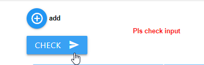 

## Gerät erstellen

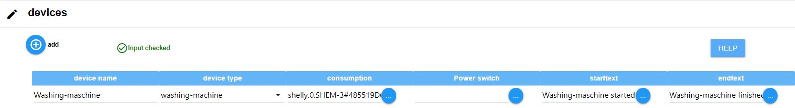

- **Gerätename** : Frei wählbarer Name
- **Gerätetyp** : Hier müssen Sie den Gerätetyp auswählen, damit die Berechnungen im Adapter korrekt ausgeführt werden können.
- **Verbrauch** : Durch Klicken auf die Schaltfläche mit den drei weißen Punkten öffnet sich Ihre Objektverwaltung. Wählen Sie den Datenpunkt aus, der den **aktuellen Live-Verbrauch** anzeigt.
- **Ein-/Ausschalten** : Klicken Sie auf die Schaltfläche mit den drei weißen Punkten, um die Objektverwaltung zu öffnen. Sie müssen den Datenpunkt auswählen, der Ihre **Steckdose ein-/ausschaltet** (optional). Wenn dieser nicht ausgewählt ist, kann keine automatische Abschaltung erfolgen.
- **Starttext** : Benachrichtigung, die beim Start des Geräts gesendet werden soll (auch Sonderzeichen sind möglich)
- Endtext\*\*: Benachrichtigung, die gesendet werden soll, wenn das Gerät seinen Vorgang abgeschlossen hat (Sonderzeichen sind ebenfalls möglich)

Bei **Starttext** und **Endtext** können Sie auch eine Nachricht von einem externen Datenpunkt abrufen. Diese Nachricht wird mit einer Sekunde Verzögerung vom Datenpunkt gelesen, nachdem sich der Gerätestatus geändert hat. So können Sie beispielsweise eine Nachricht von einem externen Skript empfangen. Der Adapter erkennt automatisch, ob eine Nachricht von einem Datenpunkt stammt oder manuell eingegeben wurde. Um einen Datenpunkt auszuwählen, klicken Sie einfach auf die Schaltfläche mit den drei weißen Punkten und wählen Sie anschließend den entsprechenden Datenpunkt aus. **Bitte beachten Sie** : Es kann entweder nur ein Datenpunkt **oder** eine manuell eingegebene Nachricht verwendet werden! 

# Geräte konfigurieren

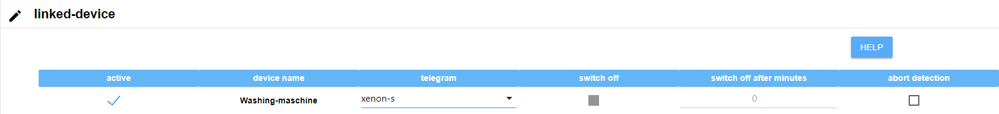

- **Aktiv** : Ist standardmäßig aktiviert. Hier können Sie ein Gerät vorübergehend deaktivieren, sodass es keine Benachrichtigungen mehr sendet.
- Gerät\*\*: wird automatisch erstellt
- **Alexa** : Alle bisher erstellten Alexas sind hier aufgelistet und können per Klick hinzugefügt werden.
- **sayit** : Alle zuvor erstellten sayit-Geräte sind hier aufgelistet und können per Klick hinzugefügt werden.
- **Telegram** : Alle bisher erstellten Telegram-Benutzer sind hier aufgelistet und können per Klick hinzugefügt werden.
- **WhatsApp** : Alle zuvor erstellten WhatsApp-Benutzer werden hier aufgelistet und können durch Anklicken hinzugefügt werden.
- **Pushover** : Alle zuvor erstellten Pushover-Benutzer sind hier aufgelistet und können per Klick hinzugefügt werden.
- **E-Mail** : Alle zuvor erstellten E-Mail-Benutzer werden hier aufgelistet und können durch Anklicken hinzugefügt werden.
- **Signal** : Alle zuvor erstellten Signal-Benutzer sind hier aufgelistet und können durch Anklicken hinzugefügt werden.
- **Matrix** : Alle zuvor erstellten Matrix-Benutzer sind hier aufgelistet und können durch Anklicken hinzugefügt werden.
- **Abschaltverzögerung** : Hier können Sie optional eine Wartezeit in **Minuten** eingeben. Nach Ablauf dieser Wartezeit schaltet sich die Steckdose ab, _sofern die automatische Abschaltung aktiviert ist_ . Die Geräteabschaltbenachrichtigung bleibt von der Wartezeit unberührt! Diese Option kann nur verwendet werden, wenn unter „Geräte“ auch ein Abschaltdatenpunkt hinterlegt wurde.
- **Erkennung abbrechen** : Wenn diese Funktion aktiviert ist, versucht der Adapter zu erkennen, ob ein Gerät vor der Benachrichtigung bereits manuell ausgeschaltet wurde, und sendet dann keine Benachrichtigungen mehr.

Nach dem Klicken auf „ **Speichern und schließen** “ wird nun für jedes neu erstellte Gerät ein Ordner unter _Objekte -> Geräteerinnerung_ erstellt, in dem

- Nicht stören (wenn aktiviert, werden keine Nachrichten per **Sprachbenachrichtigung** gesendet)
- maximale Laufzeit
- der aktuelle Zustand des Geräts
- Laufzeitalarm
- durchschnittlicher Verbrauch (kann als Hilfsmittel zur Bestimmung Ihrer eigenen Schwellenwerte verwendet werden)
- Die letzten Ausführungen erfolgen im JSON-Format.
- die letzte Laufzeit in hh:mm:ss
- der aktuelle Live-Verbrauch
- die Botschaft an die Boten
- die aktuelle Laufzeit in hh:mm:ss
- die aktuelle Laufzeit in Millisekunden

wird angezeigt. 

## Testbutton

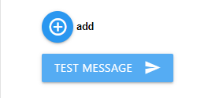

Jeder Messenger verfügt über eine Testschaltfläche. Durch Klicken darauf wird eine Testnachricht an den jeweiligen Messenger gesendet. Sollten Sie keine Nachricht erhalten, überprüfen Sie bitte die Konfiguration. Der Adapter selbst prüft nicht, ob die Nachricht angekommen ist!

## Zeigen Sie die Speicherschaltflächen an, falls diese nicht automatisch angezeigt werden.

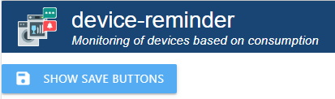

Da die Speicherschaltflächen gelegentlich nicht angezeigt werden, wurde eine Schaltfläche hinzugefügt, um dies zu erzwingen. Durch Drücken dieser Schaltfläche werden die Speicherschaltflächen angezeigt. Das Speichern erfolgt jedoch auf eigenes Risiko, da der Adapter die Eingabe nicht überprüft! Der Adapter kann abstürzen oder die Konfigurationsdaten können verloren gehen.

## Alexa erstellen

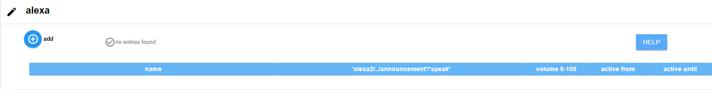

- **Name** : Frei wählbarer Name, Sonderzeichen sind ebenfalls möglich.
- alexa2/../announcement'/'speak'\*\*: Hier müssen Sie den Datenpunkt auswählen, der Alexa zum Sprechen bringt. Klicken Sie dazu einfach auf die Schaltfläche mit den drei kleinen weißen Punkten.
- **Lautstärke 0–100** : Die Lautstärke, mit der Alexa sprechen soll (von 0 bis 100 %). Mit den letzten beiden Feldern können Sie einen Zeitraum festlegen, in dem Alexa Sprachausgaben tätigen darf. Standardmäßig ist dieser Zeitraum von 00:00 bis 23:59 Uhr aktiv.
- **Aktiv ab** : Startzeitpunkt des Benachrichtigungszeitraums
- **Aktiv bis** : Endzeitpunkt des Benachrichtigungszeitraums

## SayIt-Gerät erstellen

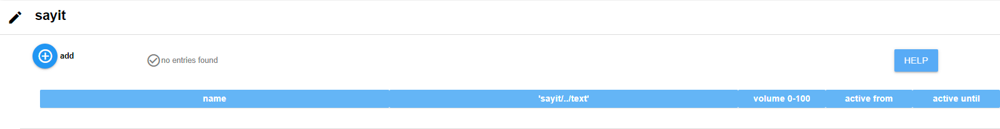

- **Name** : Frei wählbarer Name, Sonderzeichen sind ebenfalls möglich.
- **'sayit/../text'** : Wählen Sie den Datenpunkt „text“ im jeweiligen sayIt-Geräteordner aus. Hierhin wird die Textausgabe gesendet.
- **Lautstärke 0-100** : Lautstärke, mit der Ihr Sayit-Gerät sprechen soll (von 0 bis 100 %)
- **Aktiv ab** : Startzeitpunkt des Benachrichtigungszeitraums
- **Inaktiv ab** : Endzeitpunkt des Benachrichtigungszeitraums

## Erstelle einen leichtgläubigen Benutzer

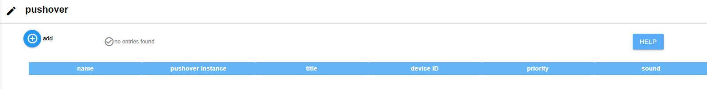

- **Name** : Frei wählbarer Name, Sonderzeichen sind ebenfalls möglich.
- **Pushover-Instanz** : die Instanz, an die die Nachricht gesendet werden soll.
- **Betreff** : Optionaler Betreff der Nachricht
- **Geräte-ID** : optionale Geräte-ID, an die die Nachricht gesendet werden soll.
- **Priorität** : Die Priorität, mit der gesendet werden soll
- **Ton** : Der Ton, der abgespielt werden soll, wenn Pushover die Nachricht empfängt
- **TTL** : Dauer, nach der eine Nachricht gelöscht werden soll (Sekunden)

## E-Mail-Benutzer erstellen

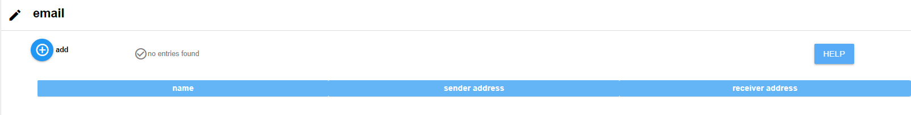

- **Name** : Frei wählbarer Name, Sonderzeichen sind ebenfalls möglich.
- **Absenderadresse** : E-Mail-Adresse, von der die E-Mail gesendet wurde
- **Empfängeradresse** : E-Mail-Adresse, an die die Nachricht gesendet werden soll.

## Signalbenutzer erstellen

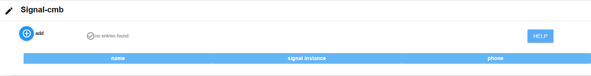

- **Name** : Frei wählbarer Name, Sonderzeichen sind ebenfalls möglich.
- **Signalinstanz** : Die installierte Instanz, an die gesendet werden soll

## Telegram-Benutzer erstellen

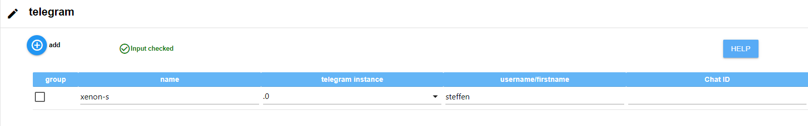

- **Name** : Frei wählbarer Name, Sonderzeichen sind ebenfalls möglich.
- **Telegram-Instanz** : Die installierte Instanz, an die gesendet werden soll
- **Benutzername/Vorname/Chat-ID auswählen** : Wählen Sie, ob die Nachricht an den Benutzernamen, den Vornamen oder die Chat-ID (empfohlen) gesendet werden soll. Die Daten werden in der Telegram-Instanz gespeichert. Bei Eingabe einer negativen Chat-ID wird die Nachricht an eine Gruppe gesendet.
- **Geben Sie Benutzernamen, Vorname oder Chat-ID ein** : Geben Sie je nach Auswahl den Benutzernamen, Vornamen oder die Chat-ID ein.

## WhatsApp-Nutzer erstellen

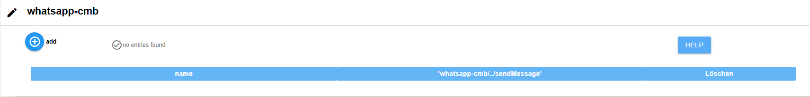

- **Name** : Frei wählbarer Name, Sonderzeichen sind ebenfalls möglich.
- **'whatsapp-cmb/../sendMessage'** : Der Datenpunkt des WhatsApp-Adapters, an den die Nachricht gesendet werden soll.

## Discord-Benutzer erstellen

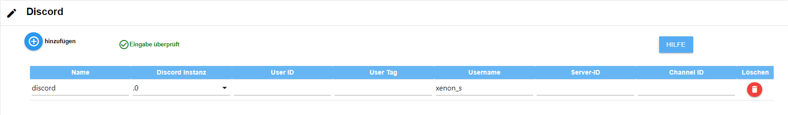

- **Name** : Frei wählbarer Name, Sonderzeichen sind ebenfalls möglich.
- **Discord-Instanz** : Die installierte Instanz, an die gesendet werden soll.
- **Benutzer-ID** : Die Discord-Benutzer-ID
- **Chat-Tag** : Der Discord-Benutzertag
- **Chatname** : Der Discord-Benutzername ( **Pflichtfeld** )
- **Server-ID** : Die Discord-Server-ID
- **Kanal-ID** : Die Discord-Kanal-ID

# Standardgeräte

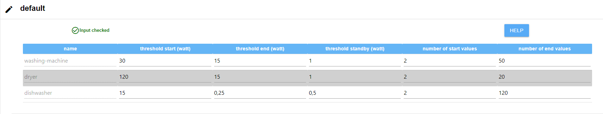 Diese Werte wurden über mehrere Monate und mithilfe zahlreicher Tester ermittelt. Änderungen der Werte können dazu führen, dass Geräte nicht mehr korrekt erfasst werden, was wiederum zu falschen Berichten führt.

# Kundenspezifische Geräte

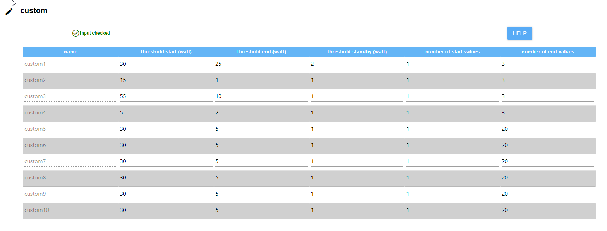 Diese Werte können vom Benutzer individuell angepasst und anschließend verwendet werden. Im Folgenden die Erklärung:

- **Schwellenwert 'Start' (Watt)** : Startwert in Watt, der überschritten werden muss, damit das Gerät als gestartet erkannt wird.
- **Schwellenwert 'Ende' (Watt)** : Endwert in Watt, der unterschritten werden muss, damit das Gerät als beendet erkannt wird.
- **Schwellenwert „Standby“ (Watt)** : Schwellenwert, ab dem das Gerät als „AUS“ oder „IM STANDBY“ angezeigt wird. Liegt der aktuell berechnete Wert unter dem **Standby-** Schwellenwert, wird das Gerät als ausgeschaltet erkannt.
- **Anzahl der Startwerte** : Hier legen Sie fest, wie oft der Startwert **nacheinander** überschritten werden muss. Wird dieser Wert einmal unterschritten, wird der Startvorgang abgebrochen. Der Durchschnitt dieser Werte muss über dem Startwert liegen, damit das Gerät als gestartet erkannt wird.  _Beispiel: Der Wert sollte 10 W betragen und wurde dreimal hintereinander überschritten. 1. 15 W, 2. 1 W, 15 W => Die Startphase wurde abgebrochen, da der zweite Wert unter 10 lag_ .
- **Anzahl der Endwerte** : Hier wird festgelegt, wie viele Werte erfasst werden sollen, bevor berechnet wird, ob das Gerät betriebsbereit ist. Je weniger Werte, desto ungenauer das Ergebnis und desto höher das Risiko von Fehlalarmen. Je höher der Wert, desto genauer die Erfassung. Der Nachteil besteht jedoch in der deutlichen Verzögerung beim Senden der Abschlussmeldung. Das Betriebsende wird erst erkannt, wenn die „Anzahl der Endwerte“ erreicht ist und der durchschnittliche Verbrauch unter dem „Schwellenwert ‚Ende‘ (Watt)“ liegt.

_Beispielrechnung:_ Die Verbrauchswerte werden alle 10 Sekunden erfasst. **Der Schwellenwert „Ende“ (Watt)** ist auf 50, **die Anzahl der Endwerte** auf 100 festgelegt. Sobald das Gerät als gestartet erkannt wurde, werden 100 Werte ( _100 Werte × 10 Sekunden = 1000 Sekunden_ ) aufgezeichnet und erst dann der Durchschnittswert berechnet. Liegt dieser unter 50, wird nach ca. 16,5 Minuten ( **Anzahl der Endwerte** = 100) das **Ende des Vorgangs** erkannt und eine Meldung ausgegeben (sofern konfiguriert). Liegt der Wert über 50, geschieht nichts, da das Gerät weiterhin in Betrieb ist. Jeder neue Wert ersetzt den ältesten, und nach jedem neuen Wert wird ein neuer Durchschnittswert berechnet. 

# Unterstützung

**Wenn Ihnen meine Arbeit gefällt:** 

  

## Changelog

<!--
	Placeholder for the next version (at the beginning of the line):
    ### __WORK IN PROGRESS__
-->

### 4.x

- (xenon-s) new Admin UI in jsonConfig

### 3.1.2 (2024-01-22)

- (xenon-s) bugfix: [issue #381](https://github.com/Xenon-s/ioBroker.device-reminder/issues/381)
- (xenon-s) bugfix: [issue #382](https://github.com/Xenon-s/ioBroker.device-reminder/issues/382)

### 3.1.1 (2024-01-20)

- (xenon-s) bugfix: [issue #380](https://github.com/Xenon-s/ioBroker.device-reminder/issues/380)

### 3.1.0 (2024-01-19)

**Attention! Check the Telegram settings after the update! You must now enter either the username, firstname or the ChatID!**

- (xenon-s) enhancement "Add comment field "Default / Custom values": [issue #337](https://github.com/Xenon-s/ioBroker.device-reminder/issues/337)
- (xenon-s) enhancement "Integrate Discord": [issue #341](https://github.com/Xenon-s/ioBroker.device-reminder/issues/341)
- (xenon-s) enhancement "Integrate Pushover TTL": [issue #342](https://github.com/Xenon-s/ioBroker.device-reminder/issues/342)
- (xenon-s) enhancement "Button to check the messenger configuration": [issue #379](https://github.com/Xenon-s/ioBroker.device-reminder/issues/379)
- (xenon-s) bugfix: [issue #344](https://github.com/Xenon-s/ioBroker.device-reminder/issues/344)
- (xenon-s) bugfix: [issue #345](https://github.com/Xenon-s/ioBroker.device-reminder/issues/345)
- (xenon-s) bugfix: [issue #346](https://github.com/Xenon-s/ioBroker.device-reminder/issues/346)
- (xenon-s) bugfix: [issue #363](https://github.com/Xenon-s/ioBroker.device-reminder/issues/363)
- (xenon-s) Optimization : MessageHandler revised

### 3.0.1 (2023-10-18)

- (xenon-s) Update testing: [issue #325](https://github.com/Xenon-s/ioBroker.device-reminder/issues/325)
- (xenon-s) bugfix: [issue #327](https://github.com/Xenon-s/ioBroker.device-reminder/issues/327)
- (xenon-s) bugfix: [issue #328](https://github.com/Xenon-s/ioBroker.device-reminder/issues/328)
- (xenon-s) bugfix: [issue #329](https://github.com/Xenon-s/ioBroker.device-reminder/issues/329)
- (xenon-s) bugfix: [issue #344](https://github.com/Xenon-s/ioBroker.device-reminder/issues/344)
- (xenon-s) bugfix: [issue #346](https://github.com/Xenon-s/ioBroker.device-reminder/issues/346)

### 3.0.0 (2023-10-18)

**Breaking Changes**

- Made basic changes to the adapter structure, because there were numerous problems with the new "js-Controller 5.x". It is mandatory to reinstall the adapter!
- Numerous bug fixes
- New messengers added
- Admin GUI fundamentally reworked
- Whatsapp and Telegram must now be created manually
- (xenon-s) Fixes for js-controller 5.\*
- (xenon-s) bugfix: [issue #278](https://github.com/Xenon-s/ioBroker.device-reminder/issues/278)
- (xenon-s) bugfix: [issue #273](https://github.com/Xenon-s/ioBroker.device-reminder/issues/273)
- (xenon-s) bugfix: [issue #267](https://github.com/Xenon-s/ioBroker.device-reminder/issues/267)
- (xenon-s) bugfix: [issue #218](https://github.com/Xenon-s/ioBroker.device-reminder/issues/218)
- (xenon-s) bugfix: [issue #207](https://github.com/Xenon-s/ioBroker.device-reminder/issues/207)
- (xenon-s) GUI Fixes "devices" : switch may be empty, but then no longer selectable
- (xenon-s) add: [issue #258: Signal Messenger added](https://github.com/Xenon-s/ioBroker.device-reminder/issues/258)
- (xenon-s) add: [issue #245: Matrix added](https://github.com/Xenon-s/ioBroker.device-reminder/issues/245)
- (xenon-s) add: [issue #185: pushover device id added](https://github.com/Xenon-s/ioBroker.device-reminder/issues/185)
- (xenon-s) bugfix [issue #210](https://github.com/Xenon-s/ioBroker.device-reminder/issues/210)
- (xenon-s) bugfix [issue #169](https://github.com/Xenon-s/ioBroker.device-reminder/issues/169)
- (xenon-s) bugfix [issue #297](https://github.com/Xenon-s/ioBroker.device-reminder/issues/297)

### 1.2.9 (2021-06-22)

- (xenon-s) bugfix: error catching JSON last operations doesn't work

### 1.2.4 (2021-06-13)

- (xenon-s) bugfix: incorrect JSON format

### 1.2.3 (2021-06-13)

- (xenon-s) bugfix: [issue #76](https://github.com/Xenon-s/ioBroker.device-reminder/issues/76) messages from datapoint were not displayed
- (xenon-s) bugfix: [issue #75](https://github.com/Xenon-s/ioBroker.device-reminder/issues/75) "undefined is not a valid state"

### 1.2.1 (2021-05-01)

- (xenon-s) Adapter structure redesigned to classes
- (xenon-s) Admin UI design and inputs made more user friendly
- (xenon-s) Telegram bug fixed
- (xenon-s) Fix for js-controller 3.3.\*
- (xenon-s) new datapoints added (runtime max, last runs as JSON, last runtime, runtime max, runtime alert)
- (xenon-s) add: runtime-alert

### 1.0.0 (2021-01-05)

- (xenon-s) initial commit version 1.0

## License

MIT License

Copyright (c) 2024 xenon-s <ente_s@hotmail.de>

Permission is hereby granted, free of charge, to any person obtaining a copy
of this software and associated documentation files (the "Software"), to deal
in the Software without restriction, including without limitation the rights
to use, copy, modify, merge, publish, distribute, sublicense, and/or sell
copies of the Software, and to permit persons to whom the Software is
furnished to do so, subject to the following conditions:

The above copyright notice and this permission notice shall be included in all
copies or substantial portions of the Software.

THE SOFTWARE IS PROVIDED "AS IS", WITHOUT WARRANTY OF ANY KIND, EXPRESS OR
IMPLIED, INCLUDING BUT NOT LIMITED TO THE WARRANTIES OF MERCHANTABILITY,
FITNESS FOR A PARTICULAR PURPOSE AND NONINFRINGEMENT. IN NO EVENT SHALL THE
AUTHORS OR COPYRIGHT HOLDERS BE LIABLE FOR ANY CLAIM, DAMAGES OR OTHER
LIABILITY, WHETHER IN AN ACTION OF CONTRACT, TORT OR OTHERWISE, ARISING FROM,
OUT OF OR IN CONNECTION WITH THE SOFTWARE OR THE USE OR OTHER DEALINGS IN THE
SOFTWARE.