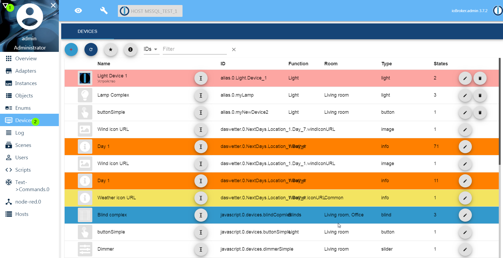

# IoBroker.devices
 

## Geräteadapter für ioBroker
Verwalten und erstellen Sie Geräte für die Verwendung in anderen Adaptern wie Material, IOT,...

**Wichtig: Registerkarte im Admin aktivieren, wie Protokoll und Skripte**

**Dieser Adapter verwendet Sentry-Bibliotheken, um den Entwicklern automatisch Ausnahmen und Codefehler zu melden.** Weitere Details und Informationen zum Deaktivieren der Fehlerberichterstattung finden Sie unter [Dokumentation zum Sentry-Plugin](https://github.com/ioBroker/plugin-sentry#plugin-sentry)! Sentry Reporting wird ab js-controller 3.0 verwendet.

## Machen
- Beschreibungen für Staaten hinzufügen

<!-- Platzhalter für die nächste Version (am Zeilenanfang):

### __ARBEITEN IN PROGRESS__ -->

## Changelog
### 1.0.7 (2021-06-30)
* (bluefox) Corrected creation the folders

### 1.0.6 (2021-06-27)
* (bluefox) Implemented the filters

### 1.0.5 (2021-06-26)
* (bluefox) Implemented the edit of `states` parameter

### 1.0.4 (2021-06-08)
* (bluefox) Fixed some GUI errors

### 1.0.1 (2021-06-07)
* (bluefox) Added sentry

### 1.0.0 (2021-06-07)
* (bluefox) Added new devices

### 0.3.16 (2021-03-11)
* (bluefox) Fixed the error for IDs with the strange characters 

### 0.3.15 (2020-12-13)
* (bluefox) Updated the select ID dialog

### 0.3.13 (2020-08-17)
* (bluefox) Fixed errors by optional states

### 0.3.12 (2020-08-16)
* (bluefox) added the vacuum cleaner

### 0.3.10 (2020-08-12)
* (bluefox) added the air conditioner

### 0.3.6 (2020-04-17)
* (Apollon77) Added Sentry error reporting for Frontend/React

### 0.3.5 (2020-04-17)
* (Apollon77) Fixed typo

### 0.3.4 (2020-03-24)
* (bluefox) Fixed error by device creation

### 0.3.2 (2020-02-09)
* (Apollon77) usage with all kinds of admin ports and reverse proxies optimized

### 0.3.1 (2020-02-09)
* (Apollon77) compatibility with Admin >4.0.0 added

### 0.2.0 (2019-12-20)
* (bluefox) Backend was removed

### 0.1.8 (2019-11-13)
* (bluefox) Allowed the clone of devices

### 0.1.7 (2019-09-15)
* (bluefox) work in progress

### 0.1.2 (2019-09-04)
* (bluefox) work in progress

### 0.1.0 (2019-08-31)
* (bluefox) initial release

## License
MIT License

Copyright (c) 2019-2021 bluefox <dogafox@gmail.com>

Permission is hereby granted, free of charge, to any person obtaining a copy
of this software and associated documentation files (the "Software"), to deal
in the Software without restriction, including without limitation the rights
to use, copy, modify, merge, publish, distribute, sublicense, and/or sell
copies of the Software, and to permit persons to whom the Software is
furnished to do so, subject to the following conditions:

The above copyright notice and this permission notice shall be included in all
copies or substantial portions of the Software.

THE SOFTWARE IS PROVIDED "AS IS", WITHOUT WARRANTY OF ANY KIND, EXPRESS OR
IMPLIED, INCLUDING BUT NOT LIMITED TO THE WARRANTIES OF MERCHANTABILITY,
FITNESS FOR A PARTICULAR PURPOSE AND NONINFRINGEMENT. IN NO EVENT SHALL THE
AUTHORS OR COPYRIGHT HOLDERS BE LIABLE FOR ANY CLAIM, DAMAGES OR OTHER
LIABILITY, WHETHER IN AN ACTION OF CONTRACT, TORT OR OTHERWISE, ARISING FROM,
OUT OF OR IN CONNECTION WITH THE SOFTWARE OR THE USE OR OTHER DEALINGS IN THE
SOFTWARE.