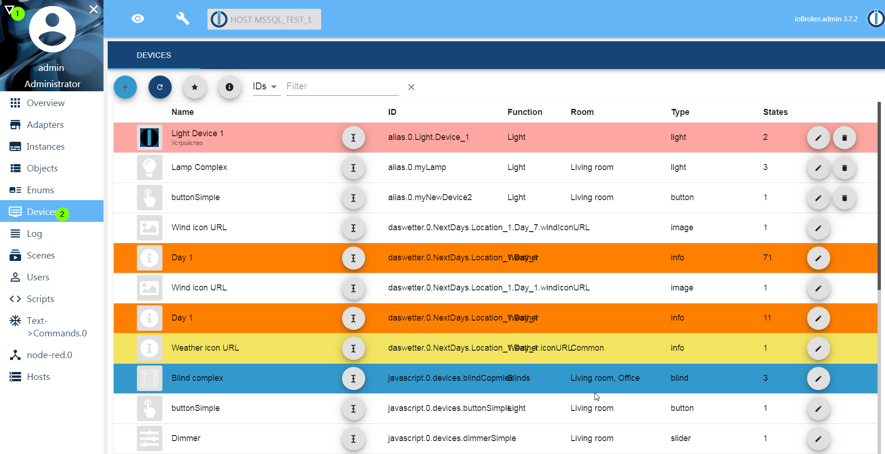

# IoBroker.devices
 

## Geräteadapter für ioBroker
Geräte verwalten und erstellen, um sie in anderen Adaptern wie Material, IoT, Matter usw. zu verwenden...

**Wichtig: Aktivieren Sie im Adminbereich die Registerkarten „Protokoll“ und „Skripte“.**

**Dieser Adapter verwendet Sentry-Bibliotheken, um Ausnahmen und Codefehler automatisch an die Entwickler zu melden.** Weitere Details und Informationen zum Deaktivieren der Fehlerberichterstattung finden Sie in Abschnitt [Sentry-Plugin-Dokumentation](https://github.com/ioBroker/plugin-sentry#plugin-sentry)! Die Sentry-Berichterstattung wird ab js-controller 3.0 verwendet.

## IoBroker.devices Adapter Benutzerhandbuch
### Übersicht
Der `ioBroker.devices`-Adapter ist eine Komponente der ioBroker Smart-Home-Plattform, die die Geräteverwaltung durch die Erstellung und Verwaltung virtueller Geräte vereinfachen soll.

Diese virtuellen Geräte bieten eine standardisierte Schnittstelle für physische Geräte und erleichtern so die Integration, Skripterstellung, Visualisierung und Steuerung von Geräten verschiedener Hersteller und Protokolle.

Der Adapter gewährleistet Konsistenz bei der Benennung und Strukturierung der Datenpunkte, wodurch der Bedarf an Änderungen an Skripten oder Visualisierungen bei Hardwareänderungen reduziert wird.

Es verpackt jede Sammlung von Zuständen in ioBroker (physisch **oder** virtuell) in wohlgeformte **Geräte** mit umfangreichen Informationen:

* `type`, `role`, `smartName`, `color`, `room`, `function`, `icon`, `unit` und mehr

Das Ergebnis wird von Dashboards (Material UI, VIS‑2), Sprachassistenten (Alexa/Google), dem Matter-Adapter, dem IoT/Cloud-Adapter und Skripten genutzt und bietet Ihnen so eine übersichtliche, zukunftssichere Objektstruktur.

**Hinweis:** Der Adapter fragt die Hardware **nicht** ab. Er läuft als reine Tab-basierte „Web“-Instanz → keine CPU-/RAM-Belastung.

### Zweck
Der `ioBroker.devices`-Adapter dient folgenden Zwecken:

- Standardisierung: Erzeugt virtuelle Geräte mit konsistenten Datenpunktstrukturen, unabhängig von der zugrunde liegenden Hardware oder dem Protokoll aus verschiedenen Datenpunkten.
- Vereinfachte Wartung: Ermöglicht Benutzern den Austausch physischer Geräte, ohne Skripte oder Visualisierungen aktualisieren zu müssen, indem Datenpunkte im Adapter neu zugeordnet werden.
- Verbesserte Kompatibilität: Lässt sich nahtlos in Visualisierungsadapter (z. B. Material UI, VIS) und IoT-Adapter (z. B. Alexa, Google Home) integrieren.
- Benutzerfreundlich: Vereinfacht die Geräteverwaltung für Einsteiger und bietet gleichzeitig Flexibilität für fortgeschrittene Benutzer.

#### Standardisierung
Viele Adapter wie MQTT, KNX oder ähnliche liefern Datenpunkte mit unterschiedlichen Namen und Strukturen. Dieser Adapter erstellt ein virtuelles Gerät mit einer einheitlichen Struktur, wodurch die Geräteverwaltung und -visualisierung vereinfacht wird. Er fügt den Zuständen automatisch Rollen, Einheiten und Namen hinzu.

#### Vereinfachte Wartung
Der Adapter `ioBroker.devices` ermöglicht es Benutzern, virtuelle Geräte zu erstellen, die sich problemlos verschiedenen physischen Geräten zuordnen lassen.
Das bedeutet: Wenn Sie ein physisches Gerät ändern, müssen Sie weder Ihre Skripte, Visualisierungen noch die Verlaufseinstellungen aktualisieren; Sie müssen lediglich die Datenpunkte im Adapter neu zuordnen.

#### Verbesserte Kompatibilität
Der Adapter weiß, wie die Geräte aussehen und wie sie verwendet werden. Er erstellt ein virtuelles Gerät mit der gleichen Struktur wie das physische Gerät, wodurch die Integration mit anderen Adaptern vereinfacht wird.

#### Benutzerfreundlich
Der `ioBroker.devices`-Adapter ist benutzerfreundlich gestaltet und somit sowohl für Einsteiger als auch für erfahrene Anwender geeignet. Dank der intuitiven Oberfläche können Benutzer virtuelle Geräte erstellen und verwalten, ohne über umfassende technische Kenntnisse verfügen zu müssen.

## Konfiguration
Nach der Installation konfigurieren Sie den Adapter über die Registerkarte „Geräte“ in der ioBroker-Administrationsoberfläche.

### Erstellen eines virtuellen Geräts
Öffnen Sie den Geräte-Tab im Adminbereich.

#### Gerät hinzufügen
- Klicken Sie auf die Schaltfläche "+", um ein neues virtuelles Gerät zu erstellen.
- Geben Sie einen Namen für das Gerät ein (z. B. "Wohnzimmerleuchte").
- Wählen Sie einen Gerätetyp (z. B. Licht, Schalter, Thermostat) aus der vordefinierten Liste aus.
- Optional kann der Organisation eine Kategorie (z. B. Beleuchtung, Heizung) zugewiesen werden.

Kartendatenpunkte:

Ordnen Sie für jede Funktion (z. B. Ein/Aus, Helligkeit) den Datenpunkt des virtuellen Geräts dem entsprechenden Zustand des physischen Geräts zu (z. B. `hm-rpc.0.12345.1.STATE` für einen Homematic-Schalter).

Über die Benutzeroberfläche können Sie Zustände anderer Adapter durchsuchen und auswählen.

Speichern: Klicken Sie auf „Speichern“, um das virtuelle Gerät zu erstellen. Es wird unter alias.0.<Gerätename> auf der Registerkarte „Objekte“ angezeigt.

#### Gerätetypen
Der `ioBroker.devices`-Adapter unterstützt drei Hauptansätze zur Geräteerstellung:

1. Automatisch erkannte Geräte

Einige Adapter (z. B. ioBroker.zigbee, ioBroker.hm-rpc) stellen bereits eine gültige Struktur für die Geräte bereit, sodass diese automatisch erkannt werden, **sofern eine Kategorie (Funktion oder Raum) zugewiesen ist**.
Ohne zugewiesene Kategorie wird das automatisch erkannte Gerät nicht verarbeitet.

2. Verbundene Geräte

Verknüpfte Geräte sind virtuelle Geräte, die manuell erstellt werden, um die Datenpunkte eines bestimmten physischen Geräts mit `ioBroker.linkeddevices` zu spiegeln.

Es wird empfohlen, den Zweig `ioBroker.devices` und `alias.0` anstelle des Zweigs `linkeddevices` zu verwenden.

3. Aliasnamen

Aliase sind leichtgewichtige virtuelle Geräte, die als Abkürzungen oder vereinfachte Verweise auf bestehende Zustände fungieren, ohne eine vollständige Gerätestruktur zu erzeugen.

Sie können ein neues virtuelles Gerät im Zweig `alias.0` erstellen. Wählen Sie den Gerätetyp aus und geben Sie alle erforderlichen Zustände (mit * gekennzeichnet) an. Optional können Sie weitere, nicht erforderliche Zustände hinzufügen (z. B. Luftfeuchtigkeit über einen Temperatursensor).
Für jeden erforderlichen und jeden ausgefüllten optionalen Zustand erstellt der Adapter eine Aliasstruktur.
Wenn Sie beispielsweise ein Temperaturgerät mit dem Namen `Temperature` erstellt und beide Zustände (Temperatur und Luftfeuchtigkeit) angegeben haben, finden Sie die folgenden Zustände und Kanäle im Zweig `alias.0`:

- `alias.0.Temperature` - Kanal
- `alias.0.Temperature.temperature` - Zustand mit der Einheit '°C'. Er sollte eine virtuelle Verknüpfung zu einem realen Zustand mit Temperaturangabe haben. Wenn Sie den Alias im `ioBroker.devices`-Adapter entfernen, bleibt dieser Zustand ohne Verknüpfung.
- `alias.0.Temperature.humidity` – Zustand mit der Einheit '%'. Dieser Zustand stellt eine virtuelle Verknüpfung zum realen Zustand her (z. B. zu `hm-rpc.0.JHAGHGJJJ.1.HUMIDITY`). Wenn Sie den Alias im Adapter `ioBroker.devices` entfernen, wird dieser Zustand gelöscht.

Nahezu jeder Gerätetyp könnte zusätzliche Statusanzeigen für Akku, Verbindung, Fehler und weitere Parameter aufweisen. Diese sind optional, können aber von einigen Adaptern (z. B. `material` oder `matter`) interpretiert werden.

Für jeden Bundesstaat können Sie alle Einstellungen angeben, die von Aliasen unterstützt werden:

- Unterschiedliche Zustände für Lesen und Schreiben
- Umrechnungsformel für Lesen und Schreiben

#### Geräteverwaltung
Gerät bearbeiten: Klicken Sie auf der Registerkarte „Geräte“ auf das Stiftsymbol neben einem Gerät, um dessen Namen, Typ, Kategorie, Farbe, Symbol oder Datenpunktzuordnungen zu ändern.

Gerät löschen: Klicken Sie auf das Papierkorbsymbol, um ein virtuelles Gerät zu entfernen. Dies hat keine Auswirkungen auf das physische Gerät oder dessen Adapter.

Geräte organisieren: Verwenden Sie Kategorien, um Geräte zu gruppieren (z. B. „Beleuchtung“, „Heizung“), um die Verwaltung in Visualisierungen zu vereinfachen.

## Gerätetypen
Dieser Adapter wurde mithilfe von `type-detector` erstellt. Alle möglichen Geräte konnten unter [Hier](https://github.com/ioBroker/ioBroker.type-detector/blob/master/DEVICES.md) gefunden werden.

## Video

## Changelog
<!--
	Placeholder for the next version (at the beginning of the line):
	### **WORK IN PROGRESS**
-->
### 2.0.7 (2026-04-09)
* (@GermanBluefox) Added new widgets

### 2.0.6 (2026-03-31)
* (@GermanBluefox) Corrected the layout for visualisation

### 2.0.5 (2026-03-26)
* (@GermanBluefox) Added many new widgets.

### 2.0.3 (2026-03-24)
* (@GermanBluefox) Added widgets' visualisation. Now it is possible to create a GUI within the adapter

### 1.2.14 (2026-02-06)
* (@GermanBluefox) Correcting the scrolling on the touch devices
* (@GermanBluefox) Fixing a problem with `ACTUAL` state
* (@GermanBluefox) Correcting the hover effect under safari

### 1.2.12 (2026-02-04)
* (@GermanBluefox) Show in color if fx is not empty
* (@GermanBluefox) Added for all text fields the clear button

### 1.2.9 (2025-09-08)
* (@GermanBluefox) Created for newly created states of devices the full name and not just last part, like `ACTUAL`

### 1.2.8 (2025-07-21)
* (@GermanBluefox) Corrected error in GUI

### 1.2.7 (2025-06-14)
* (@GermanBluefox) Replaced icon for the state import
* (@GermanBluefox) Corrected the edit dialog

### 1.2.6 (2025-04-29)
* (@GermanBluefox) Type-detector updated
* (@GermanBluefox) Execute the conversion formula on the current value
* (@GermanBluefox) Better categories selector
* (@GermanBluefox) Corrected device importer

### 1.2.4 (2025-04-27)
* (@GermanBluefox) Corrected many GUI issues

### 1.2.1 (2025-04-22)
* (@GermanBluefox) Updated logo
* (@GermanBluefox) Updated type-detector

### 1.2.0 (2025-04-20)
* (@GermanBluefox) Updated packages
* (@GermanBluefox) Used vite
* (@GermanBluefox) Used eslint-config of ioBroker
* (@GermanBluefox) Rewritten to TypeScript and corrected all known bugs (Except extension requests)

### 1.1.5 (2023-06-06)
* (Garfonso) fixed: problem with editing imported states
* (Garfonso) fixed: warning
* (Garfonso) fixed: enabling iot again (without setting a custom smartName)
* (Garfonso) fixed: possible crash / typo in 1.1.3.

### 1.1.4 (2023-06-06)
* (bluefox) Updated packages

### 1.1.3 (2023-05-16)
* (bluefox) Better behavior of category selection

### 1.1.2 (2022-11-09)
* (Garfonso) corrected the double states in light devices
* (Garfonso) added CIE color type as equivalent to `rgbSingle` type

### 1.1.1 (2022-11-03)
* (bluefox) Corrected delete dialog
* (bluefox) Added ukrainian translation

### 1.1.0 (2022-09-27)
* (bluefox) Migrated GUI to v5

### 1.0.12 (2022-06-09)
* (bluefox) Allowed to work with devices behind reverse proxy
* (bluefox) Replaced the function icon

### 1.0.11 (2022-06-08)
* (bluefox) Updated some libraries

### 1.0.10 (2022-02-13)
* (bluefox) Corrected edit of folders
* (bluefox) Updated some libraries

### 1.0.9 (2021-07-11)
* (bluefox) Implement the narrow rows

### 1.0.8 (2021-07-04)
* (bluefox) Corrected creation of the devices

### 1.0.7 (2021-06-30)
* (bluefox) Corrected creation the folders

### 1.0.6 (2021-06-27)
* (bluefox) Implemented the filters

### 1.0.5 (2021-06-26)
* (bluefox) Implemented the edit of `states` parameter

### 1.0.4 (2021-06-08)
* (bluefox) Fixed some GUI errors

### 1.0.1 (2021-06-07)
* (bluefox) Added sentry

### 1.0.0 (2021-06-07)
* (bluefox) Added new devices

### 0.3.16 (2021-03-11)
* (bluefox) Fixed the error for IDs with the strange characters

### 0.3.15 (2020-12-13)
* (bluefox) Updated the select ID dialog

### 0.3.13 (2020-08-17)
* (bluefox) Fixed errors by optional states

### 0.3.12 (2020-08-16)
* (bluefox) added the vacuum cleaner

### 0.3.10 (2020-08-12)
* (bluefox) added the air conditioner

### 0.3.6 (2020-04-17)
* (Apollon77) Added Sentry error reporting for Frontend/React

### 0.3.5 (2020-04-17)
* (Apollon77) Fixed typo

### 0.3.4 (2020-03-24)
* (bluefox) Fixed error by device creation

### 0.3.2 (2020-02-09)
* (Apollon77) usage with all kinds of admin ports and reverse proxies optimized

### 0.3.1 (2020-02-09)
* (Apollon77) compatibility with Admin >4.0.0 added

### 0.2.0 (2019-12-20)
* (bluefox) Backend was removed

### 0.1.8 (2019-11-13)
* (bluefox) Allowed the clone of devices

### 0.1.7 (2019-09-15)
* (bluefox) work in progress

### 0.1.2 (2019-09-04)
* (bluefox) work in progress

### 0.1.0 (2019-08-31)
* (bluefox) initial release

## License
MIT License

Copyright (c) 2019-2026 bluefox <dogafox@gmail.com>

Permission is hereby granted, free of charge, to any person obtaining a copy
of this software and associated documentation files (the "Software"), to deal
in the Software without restriction, including without limitation the rights
to use, copy, modify, merge, publish, distribute, sublicense, and/or sell
copies of the Software, and to permit persons to whom the Software is
furnished to do so, subject to the following conditions:

The above copyright notice and this permission notice shall be included in all
copies or substantial portions of the Software.

THE SOFTWARE IS PROVIDED "AS IS", WITHOUT WARRANTY OF ANY KIND, EXPRESS OR
IMPLIED, INCLUDING BUT NOT LIMITED TO THE WARRANTIES OF MERCHANTABILITY,
FITNESS FOR A PARTICULAR PURPOSE AND NONINFRINGEMENT. IN NO EVENT SHALL THE
AUTHORS OR COPYRIGHT HOLDERS BE LIABLE FOR ANY CLAIM, DAMAGES OR OTHER
LIABILITY, WHETHER IN AN ACTION OF CONTRACT, TORT OR OTHERWISE, ARISING FROM,
OUT OF OR IN CONNECTION WITH THE SOFTWARE OR THE USE OR OTHER DEALINGS IN THE
SOFTWARE.