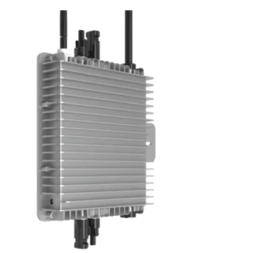

# IoBroker.deyeidc
**Tests:** 

## Deyeidc-Adapter für ioBroker
Datensammler vor Deye-kompatibler Wechselrichter

### Erste Schritte
Dieser Adapter ermöglicht das Auslesen von Daten eines Wechselrichters im lokalen Netzwerk. Dazu müssen lediglich die IP-Adresse des Wechselrichters und die Seriennummer des Datenloggers eingegeben werden. Weicht der Port vom Standardwert ab, kann dieser angepasst werden. Die Abtastrate ist auf 60 Sekunden voreingestellt und somit praktikabel.

Die Daten selbst werden über bekannte Modbus-Register abgerufen und in den Datenpunkten gespeichert. Dies wurde auf einem „Deye-kompatiblen“ Wechselrichter entwickelt und getestet. Die abzufragenden Register können daher bei anderen Modellen abweichen.

## Verwendung
Zur Inbetriebnahme des Adapters müssen die Registerbereiche und Spulen auf den folgenden Seiten in der GUI eingegeben werden. Beispielhafte Einträge für verschiedene Typen finden Sie bereits auf GitHub (z. B. https://github.com/raschy/ioBroker.deyeidc/blob/main/deyeidc.MI600.json).
Die Register müssen grundsätzlich der jeweiligen Dokumentation entnommen werden. Die Dekodierung erfolgt je nach Inhaltstyp über die „Regeln“.

Folgendes gilt hier:

| Regeln | Beschreibungen |
| ----- | ------------ |
| 0 | raw_signed |
| 1 | für 16-Bit-Werte ohne Vorzeichen |
| 2 | für 16-Bit-Werte mit Vorzeichen |
| 3 | für 32-Bit-Werte ohne Vorzeichen |
| 4 | für 32-Bit-Werte mit Vorzeichen |
| 5 | für Seriennummer |
| 6 | für Temperatur |
| 7 | für Versionsnummer |
| 8 | für Einzelbytes (MSB) |
| 9 | für Einzelbytes (LSB) |

Die Dokumentation gibt auch an, ob das Komma um eine oder zwei Stellen verschoben werden muss. Der Eintrag „Faktor“ dient diesem Zweck. Weitere sinnvolle Berechnungen sind damit nicht möglich.

Bestimmte Werte werden vom Inverter nicht bereitgestellt und müssen separat berechnet werden. Bis Version 0.3.2 waren hier nur zwei Werte möglich. Ab Version 0.4.0 können Ausdrücke mit mehreren Operanden und Operatoren – wie z. B. „A + B – C _ D“ – in der Tabelle „Berechnen“ für jedes Zielobjekt eingegeben und anschließend ausgewertet werden. Selbstverständlich wird die Standard-Rechenreihenfolge eingehalten (_ und / werden vor + und – ausgewertet) (danke an XHunter74). Klammerregeln werden weiterhin nicht unterstützt.

Ein typisches Beispiel ist die Leistung eines Solarmoduls. Diese muss anhand der Werte „DV1 * DC1“ berechnet werden, und das Ergebnis („PV1“) wird dann zusammen mit der entsprechenden Einheit im Datenbaum unter „Schlüssel“ gespeichert.

### HAFTUNGSAUSSCHLUSS
Alle Produkt- und Firmennamen sowie Logos sind Marken™ oder eingetragene® Marken ihrer jeweiligen Inhaber. Ihre Verwendung impliziert weder eine Zugehörigkeit zu noch eine Unterstützung durch diese oder verbundene Tochtergesellschaften! Dieses private Projekt wird in der Freizeit betrieben und verfolgt keine geschäftlichen Ziele. DEYE ist eine Marke der Ningbo Deye Technology Co., Ltd., Nr. 26 South Yongjiang Road, Beilun, Ningbo, Zhejiang, 315806 VR China. Copyright © 2023

## Changelog

<!--
	Placeholder for the next version (at the beginning of the line):
	### **WORK IN PROGRESS**
-->

### **WORK IN PROGRESS**

- (raschy) Compute module redesigned and expanded (PR XHunter74)

### 0.3.2 (2026-05-31)

- (raschy) Less restrictive serial number check
- (raschy) NodeJS >= 22.x is required
- (raschy) Any necessary adjustments for nodeJS 22.x
- (raschy) translations i18n-short

### 0.3.1 (2025-10-01)

- (raschy) Reduction of info-log output

### 0.3.0 (2025-08-29)

- (raschy) Reduction of devDependencies
- (raschy) The auxiliary functions chai and chai-as-promised have been tacked onto the executable version
- (raschy) Control codes have been added for Modbus RTU requests
- (raschy) Extended Debugging can be switched
- (raschy) Modified method for offlineReset

### 0.2.0 (2025-02-06)

- (raschy) Dependabot run tracked manually

### 0.1.4 (2025-01-11)

- (raschy) Error message corrected
- (raschy) Function nullable repaired

[Older changelogs can be found there](CHANGELOG_OLD.md)

## License

MIT License

Copyright (c) 2023-2026 raschy <raschy@gmx.de>

Permission is hereby granted, free of charge, to any person obtaining a copy
of this software and associated documentation files (the "Software"), to deal
in the Software without restriction, including without limitation the rights
to use, copy, modify, merge, publish, distribute, sublicense, and/or sell
copies of the Software, and to permit persons to whom the Software is
furnished to do so, subject to the following conditions:

The above copyright notice and this permission notice shall be included in all
copies or substantial portions of the Software.

THE SOFTWARE IS PROVIDED "AS IS", WITHOUT WARRANTY OF ANY KIND, EXPRESS OR
IMPLIED, INCLUDING BUT NOT LIMITED TO THE WARRANTIES OF MERCHANTABILITY,
FITNESS FOR A PARTICULAR PURPOSE AND NONINFRINGEMENT. IN NO EVENT SHALL THE
AUTHORS OR COPYRIGHT HOLDERS BE LIABLE FOR ANY CLAIM, DAMAGES OR OTHER
LIABILITY, WHETHER IN AN ACTION OF CONTRACT, TORT OR OTHERWISE, ARISING FROM,
OUT OF OR IN CONNECTION WITH THE SOFTWARE OR THE USE OR OTHER DEALINGS IN THE
SOFTWARE.