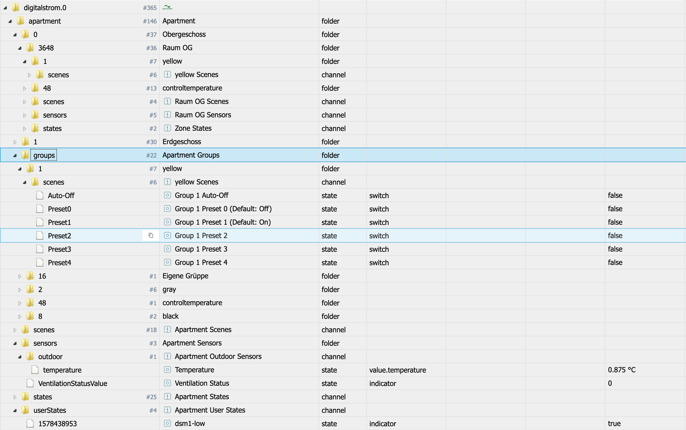
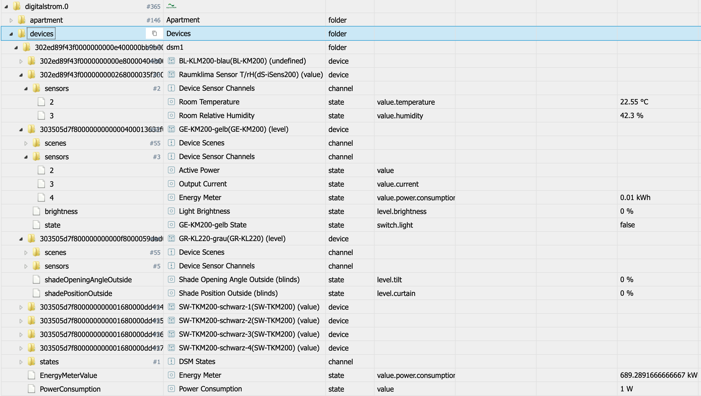

# ioBroker.digitalstrom

**Dieser Adapter nutzt die Sentry-Bibliotheken, um Ausnahmen und Codefehler automatisch an die Entwickler zu melden.** Weitere Details und Informationen zum Deaktivieren der Fehlerberichterstattung finden Sie in [der Sentry-Plugin-Dokumentation](https://github.com/ioBroker/plugin-sentry#plugin-sentry) ! Die Sentry-Berichterstattung wird ab js-controller 3.0 verwendet.

## Digitalstrom-Adapter für ioBroker

Unterstützung für Digitalstrom-Geräte über DSS

## Installation

Bitte installieren Sie den Adapter wie gewohnt über die Admin-Oberfläche.

Sobald der Adapter offiziell veröffentlicht ist, wird er im Repository verfügbar und einfach auswählbar sein.

Während der Testphase oder zum Testen neuerer Versionen (siehe entsprechende Forenbeiträge) können Sie den Adapter auch direkt von GitHub über die URL <https://github.com/ioBroker/ioBroker.digitalstrom> installieren. Verwenden Sie hierfür bitte die Option „Benutzerdefinierte Installation“ im Administratormenü.

## Verwendung

Nach der Installation des Adapters und der Erstellung einer Instanz erscheint der Administratordialog. Geben Sie zunächst Ihre DSS-IP-Adresse bzw. Ihren Hostnamen ein. Anschließend können Sie auswählen, ob Sie bereits manuell ein App-Token in der DSS-Weboberfläche erstellt haben. Falls Sie noch kein App-Token besitzen, geben Sie einfach Ihren Benutzernamen und Ihr Passwort ein, um automatisch ein App-Token zu erhalten.

Zusätzlich zu den Authentifizierungseinstellungen (siehe oben) können Sie die folgenden Einstellungen Ihren Bedürfnissen entsprechend bearbeiten:

- **Datenabfrageintervall** : Dies ist das Intervall, in dem die Daten des „Energiezählers“ von Ihren DSM-Geräten angefordert werden. Standardwert: 60 Sekunden. Sie können 0 eingeben, wenn Sie die Energiezählerdaten nicht abfragen möchten.
- **Szenenvoreinstellungen verwenden** : Das Digitalstrom-System ist nicht darauf ausgelegt, die tatsächlichen Ausgabewerte der Geräte permanent verfügbar zu haben und arbeitet hauptsächlich mit Szenen. Für Licht und Shader/Jalousien sind für viele der verfügbaren Szenen Ausgabewerte definiert. Der Adapter kennt diese Werte. Wenn diese Einstellung aktiviert ist, versucht der Adapter, diese Werte beim Auslösen einer Szene abzurufen und sie direkt den Zuständen zuzuweisen. Die tatsächlichen Werte werden verzögert angefordert. Diese Methode kann falsche Werte liefern, wenn lokale Prioritäten festgelegt/verwendet werden!
- **Geräteausgabewerte aktiv anfordern** : Der Adapter initialisiert alle Geräteausgabewerte beim Start und nach Szenen, die für ein Gerät gelten. Es gibt zwar eine Verzögerung, aber alle diese Meldungen werden über den Digitalstrom-Bus übertragen. Falls dies für Sie problematisch ist, können Sie diese Funktion deaktivieren.

Nach Eingabe eines App-Tokens und Speichern der Einstellungen wird der Adapter automatisch neu gestartet.

Sobald die Daten korrekt sind, liest der Adapter die Wohnungs- und Gerätestruktur aus und erstellt sie als ioBroker-Objekte. Dies kann einige Zeit dauern (abhängig von der Anzahl der Geräte und Etagen/Zonen/Gruppen sowie der Leistungsfähigkeit Ihres Systems einige Sekunden). Bitte haben Sie Geduld. Und das meine ich wirklich so … Hier können schnell mehrere tausend Objekte verarbeitet werden! Geben Sie dem Adapter bitte etwas Zeit!

Anschließend abonniert der Adapter mehrere DSS-Ereignisse, um über Aktionen im System benachrichtigt zu werden.

Die Statusanzeige des Adapters leuchtet grün und im Infoprotokoll wird „Abonnierte Zustände …“ angezeigt. Danach ist alles bereit und Sie können beispielsweise Folgendes tun:

- Szenen für Wohnungen, Zonen, Gruppen oder Geräte festlegen/rückgängig machen
- Status und Sensorwerte lesen; für Zonen ist es auch möglich, Sensorwerte zu übertragen.
- Siehe die Werte für Binäreingänge, Sensoren, Tasten und Ausgänge.

## Zustands- und Objektstruktur

Der Adapter stellt zwei Datenstrukturen bereit. Die Wohnungsstruktur mit Etagen, Zonen (Räumen) und Gruppen sowie zusätzlich die Struktur der Stromkreise/dSMs und der angeschlossenen Geräte mit ihren Detaildaten.

Die Strukturen enthalten verschiedene "Datentypen":

- Szenen: Szenen werden als Schalter implementiert. Der Wert „true“ sendet einen „callScene“-Befehl für diese Szene. Der Wert „false“ sendet einen „undoScene“-Befehl für diese Szene – der DSS-Server entscheidet, ob „undo“ ein gültiger Befehl ist! Wenn ein „callScene“- oder „undoScene“-Befehl vom DSS-Server als Ereignis ausgelöst wird, wird die entsprechende Szene mit ack=true auf „true“ oder „false“ gesetzt.
- Zustände: Es werden Systemzustände und benutzerdefinierte Zustände, die über das Add-on definiert wurden, angezeigt und sind schreibgeschützt.
- Sensorwerte werden ereignisgesteuert aktualisiert und können auch teilweise geändert werden – Änderungen werden per „pushSensorValue“-Nachricht an den Server gesendet, der dann entscheidet, ob er den Wert akzeptiert. Dies betrifft hauptsächlich Temperatur- und Feuchtigkeitswerte.
-

### Wohnungsobjekt und Zustände

Für die Wohnung wird eine Struktur mit der Bezeichnung „floor“."zone" erstellt, in der sich folgende Unterstrukturen befinden:

- Pro Gerätegruppe wird ein Unterordner erstellt, der die verfügbaren Gruppenszenen enthält.
- Szenen für diese Zone
- Staaten für diese Zone
- Sensorwerte für diese Zone

Auf Wohnungsebene sind alle Gerätegruppen mit ihren Szenen verfügbar.

Auf Wohnungsebene sind auch Sensoren (einschließlich Außenwerte), Zustände und Benutzerzustände enthalten.

### Geräteobjekte und Zustände

Die Geräte sind mit "circuit/dSM"."deviceID" strukturiert und die darin enthaltene Substruktur umfasst:

- Geräteszenen werden nur für dieses Gerät ausgelöst.
- Gerätesensoren, die vom System gemeldet werden. Daher können die Werte leer sein.
- Die Ausgabewerte (z. B. Status/Helligkeit bei Lampen und Position/Winkel bei Jalousien/Rollos) befinden sich direkt unterhalb des Geräts. Vorerst verfügen nur Lampen und Jalousien/Rollos über eine definierte Funktionalität.
- Tasten und Binäreingaben werden ebenfalls durch Zustände dargestellt und sind schreibgeschützt.

## Bekannte Probleme / Systemdesigneffekte

- Das DSS-System arbeitet hauptsächlich mit Szenen und nicht mit realen Gerätewerten; außerdem ist das Abrufen der realen Werte sehr langsam, da diese über den Bus abgerufen werden müssen.
- Die Werte können leer sein, wenn sie vom System nicht gemeldet wurden.
- Binäre Eingaben wurden momentan „blind“ implementiert, da ich keine entsprechenden Geräte besitze. Daher freue ich mich über Protokolle/Berichte mit binären Eingabegeräten :-)
- Das sinnvolle Lesen und Schreiben von Ausgabewerten ist nur für helle (gelbe) und dunkle/blinde (graue) Geräte implementiert.
- Ich hatte bisher keine Gelegenheit zu überprüfen, wie sich das System mit vDCs verhält. Daher benötige ich hier Protokolle und Details, um dies hinzuzufügen.
- Die Belüftungs- und Temperaturregelungssysteme sind ebenfalls noch nicht vollständig implementiert ... was ist hier sinnvoll?

## Wie man Probleme und Funktionswünsche meldet

Bitte nutzen Sie hierfür die GitHub-Issues.

Am besten stellen Sie den Adapter auf Debug-Log-Modus ein (Instanzen -> Expertenmodus -> Spaltenprotokollierung). Laden Sie anschließend die Logdatei von Ihrer Festplatte herunter (Unterverzeichnis „log“ im ioBroker-Installationsverzeichnis, nicht aus dem Admin-Bereich, da dieser die Zeilen abschneidet). Falls Sie die Datei nicht in einem GitHub-Issue bereitstellen möchten, können Sie sie mir auch per E-Mail senden ( <iobroker@fischer-ka.de> ). Bitte fügen Sie einen Verweis auf das entsprechende GitHub-Issue hinzu und beschreiben Sie, welche Einträge in der Logdatei zu welchem Zeitpunkt angezeigt werden.

## Changelog

### 2.3.0 (2021-08-01)
* (Apollon77) Add support for use defined properties on apartment level

### 2.2.1 (2021-07-26)
* (Apollon77) Optimize for js-controller 3.3
* (Apollon77) Optimize get/set Value handling for new devices

### 2.2.0 (2021-04-16)
* (Apollon77) Add support for integrated (IC) devices (SW, GE, GR)

### 2.1.0 (2021-04-13)
* (Apollon77) prevent crashes (Sentry IOBROKER-DIGITALSTROM-5)
* (Apollon77) Fix EnergyMeterValue
* (Apollon77) further optimizations and adding new outout channel types

### 2.0.5 (2020-03-14)
* (Apollon77) BREAKING: binaryInput are now numbers intead of booleans because it can have values other then true/false
* (Apollon77) BREAKING: Some states are converted to strings to allow all values to be passed
* (Apollon77) Fixes on some outputValues 
* (Apollon77) add new sunelevation and sunazimuth values 

### 1.0.2 (2020-02-10)
* (Apollon77) trigger buttons on scene calls also if scene is normally not allowed but came from the device
* (Apollon77) fix button logic
* (Apollon77) also add sensor type 255, but without name and unit because unknown
* (Apollon77) Switch Sentry to iobroker own instance hosted in germany
* (Apollon77) user states are optional now
* (Apollon77) add button states for devices wth more then 1 button

### 1.0.0 (2020-01-31)
* (Apollon77) bump version to 1.0.0
* (Apollon77) update dependecies
* (Apollon77) change default loglevel to info

### 0.5.5 (2020-01-29)
* (Apollon77) fix smaller errors
* (Apollon77) send Sentry reports to own server

### 0.5.0 (2020-01-19)
* (Apollon77) add buttons for more device types (also vDC) and try to detect button triggers

### 0.4.10 (2020-01-19)
* (Apollon77) state changes added
* (Apollon77) Fixed shade position control

### 0.4.9 (2020-01-18)
* (Apollon77) add unknown weather sensor "windgust"
* (Apollon77) change handling of Input types
* (Apollon77) Fix controlling of shaders 

### 0.4.7 (2020-01-17)
* (Apollon77) fix error when writing vdc output values

### 0.4.6 (2020-01-17)
* (Apollon77) fix missing datatypes for some states (mainly sensors and output values)

### 0.4.5 (2020-01-17)
* (Apollon77) fix error in sentry reporting

### 0.4.4 (2020-01-17)
* (Apollon77) fix error (Sentry IOBROKER-DIGITALSTROM-7)

### 0.4.2 (2020-01-16)
* (Apollon77) fix wrong scene state updates if same scene is triggered twice
* (Apollon77) also trigger scene update for all groups if scene was called on zone or to all zones and groups when done on apartment

### 0.4.1 (2020-01-16)
* (Apollon77) also add basic scenes to room groups

### 0.4.0 (2020-01-15)
* (Apollon77) add userActions as states and allow to trigger the actions

### 0.3.3 (2020-01-15)
* (Apollon77) fixes for scene lists
* (Apollon77) add some special szenes to more groups 

### 0.3.2 (2020-01-14)
* (Apollon77) fixes for adapter start

### 0.3.1 (2020-01-14)
* (Apollon77) fixes
* (Apollon77) make sure to initialize scenes, states and sensors really on startup - values will be overwritten if delivered with ack=true!
* (Apollon77) add all Presets (0-44) to Room/Zone and Group states 
* (Apollon77) also for unknown device types try to initialize output value IF only one is there (assuming it is offset/index 0!) Please check and report back!
* (Apollon77) make some initial processing async to block eventLoop less

### 0.3.0 (2020-01-14)
* (Apollon77) further optimize (lower) delays and timeouts, please give feedback!
* (Apollon77) add "stateId" State for each scenes folder with the scene number. This is updated with the scenes and also controllable.
* (Apollon77) scenes will not be cleared at the beginning and initialized with the "lastSceneId" returned from DSS; initialization may take some seconds longer!
* (Apollon77) update dependencies
* (Apollon77) increase loglevel of some "invalid cases" to warn to better see if they happen
* (Apollon77) fix handling of binaryInput events

### 0.2.2 (2020-01-13)
* (Apollon77) optimize event subscription logic and timeouts (should prevent "error 500 cases", now tries to resubscribe)

### 0.2.1 (2020-01-13)
* (Apollon77) optimize brightness handling
* (Apollon77) optimize error and reconnection handling

### 0.2.0 (2020-01-12)
* (Apollon77) initial official testing release (still GitHub)

### 0.1.x
* (Apollon77) initial release and finalization

## License
MIT License

Copyright (c) 2020-2021 Apollon77 <iobroker@fischer-ka.de>

Permission is hereby granted, free of charge, to any person obtaining a copy
of this software and associated documentation files (the "Software"), to deal
in the Software without restriction, including without limitation the rights
to use, copy, modify, merge, publish, distribute, sublicense, and/or sell
copies of the Software, and to permit persons to whom the Software is
furnished to do so, subject to the following conditions:

The above copyright notice and this permission notice shall be included in all
copies or substantial portions of the Software.

THE SOFTWARE IS PROVIDED "AS IS", WITHOUT WARRANTY OF ANY KIND, EXPRESS OR
IMPLIED, INCLUDING BUT NOT LIMITED TO THE WARRANTIES OF MERCHANTABILITY,
FITNESS FOR A PARTICULAR PURPOSE AND NONINFRINGEMENT. IN NO EVENT SHALL THE
AUTHORS OR COPYRIGHT HOLDERS BE LIABLE FOR ANY CLAIM, DAMAGES OR OTHER
LIABILITY, WHETHER IN AN ACTION OF CONTRACT, TORT OR OTHERWISE, ARISING FROM,
OUT OF OR IN CONNECTION WITH THE SOFTWARE OR THE USE OR OTHER DEALINGS IN THE
SOFTWARE.