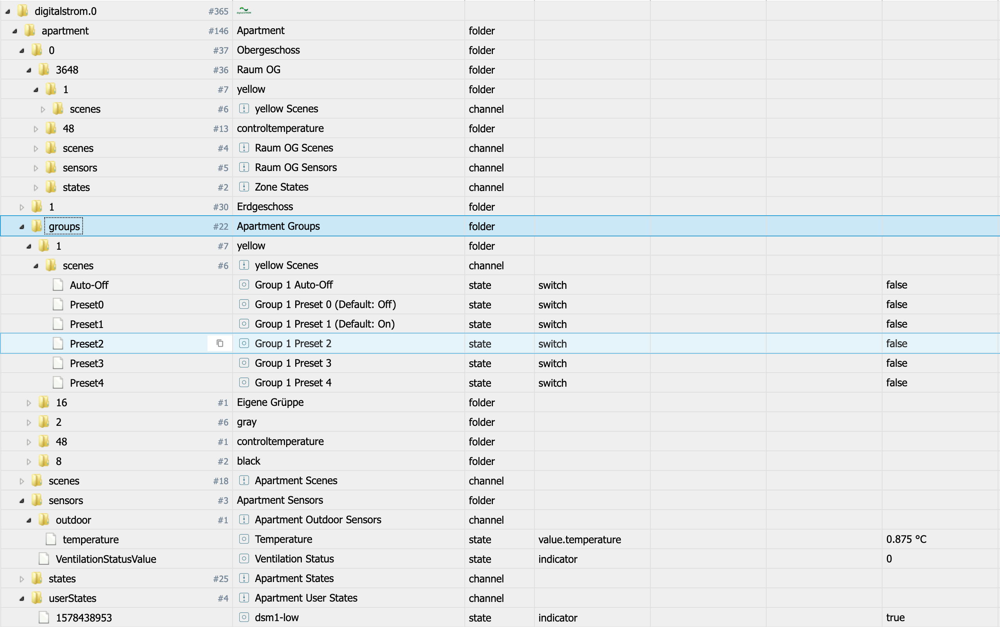
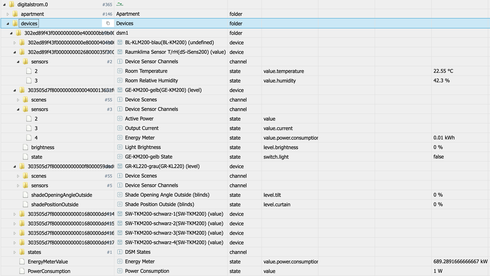

#ioBroker.digitalstrom
 

**Dieser Adapter verwendet Sentry-Bibliotheken, um den Entwicklern automatisch Ausnahmen und Codefehler zu melden.** Weitere Details und Informationen zum Deaktivieren der Fehlerberichterstattung finden Sie unter [Dokumentation zum Sentry-Plugin](https://github.com/ioBroker/plugin-sentry#plugin-sentry)! Sentry Reporting wird ab js-controller 3.0 verwendet.

## Digitalstrom-Adapter für ioBroker
Unterstützung für Digitalstrom-Geräte über DSS

## Installation
Bitte installieren Sie den Adapter wie gewohnt über die Admin-Benutzeroberfläche.

Sobald der Adapter offiziell freigegeben ist, ist er im Repo und einfach auswählbar.

Während der Testphase oder zum Testen neuerer Versionen (siehe entsprechende Forenthreads) können Sie den Adapter auch direkt von GitHub mit https://github.com/ioBroker/ioBroker.digitalstrom als URL installieren. Bitte verwenden Sie dazu die Admin-Option "Benutzerdefinierte Installation".

## Verwendung
Nach der Installation des Adapters und dem Erstellen einer Instanz erscheint der Admin-Dialog.
Zuerst müssen Sie Ihre DSS-IP/Ihren Hostnamen eingeben. Dann können Sie wählen, ob Sie im DSS Web-Interface bereits ein App Token manuell erstellt haben oder nicht.
Wenn Sie keinen App-Token haben, geben Sie einfach Ihren Benutzernamen und Ihr Passwort ein, um automatisch einen App-Token abzurufen.

Zusätzlich zu den Authentifizierungseinstellungen (siehe oben) können Sie die folgenden Einstellungen an Ihre Bedürfnisse anpassen:

* **Datenabfrageintervall**: Dies ist das Intervall, in dem die "Energiezähler"-Daten von Ihren DSM-Geräten angefordert werden. Standard 60s. Sie können 0 einstellen, wenn Sie die Engerymeter-Daten nicht abfragen möchten.
* **Szenen-Voreinstellungswerte verwenden**: Das Digitalstrom-System ist nicht wirklich darauf ausgelegt, die tatsächlichen Ausgangswerte der Geräte ständig verfügbar zu haben und arbeitet am meisten mit Szenen. Für Licht und Shader/Jalousie sind für viele der verfügbaren Szenen einige Ausgabewerte definiert. Der Adapter kennt sie und wenn diese Einstellung aktiv ist, versucht der Adapter, diese Werte beim Auslösen einer Szene zu suchen und diese Werte direkt auf die Zustände zu setzen. Die realen Werte werden verzögert abgefragt. Diese Methode kann falsche Werte liefern, wenn lokale Prioritäten gesetzt/verwendet werden!
* **Geräteausgabewerte aktiv anfordern**: Der Adapter initialisiert alle Geräteausgabewerte beim Start und auch nach Szenen, die für ein Gerät wirksam sind. Es gibt Verzögerungen, aber tatsächlich werden alle diese Nachrichten über den Digitalstrom-Bus gesendet. Wenn dies für Sie problematisch ist, können Sie versuchen, diese Funktion zu deaktivieren.

Nach Bereitstellung eines App-Tokens und Speichern der Einstellungen wird der Adapter automatisch neu gestartet.

Wenn die Daten korrekt sind, liest der Adapter die Wohnungs- und Gerätestruktur aus und erstellt sie als ioBroker-Objekte. Dies kann einige Zeit dauern (je nach Anzahl der Geräte und Etagen/Zonen/Gruppen und der Leistung Ihres Systems mehrere Sekunden). Bitte haben Sie Geduld. Und das meine ich wirklich so ... Mehrere tausend Objekte sind hier gut zu erreichen! Gib dem Adapter bitte Zeit!

Danach abonniert der Adapter mehrere DSS-Ereignisse, um über Aktionen im System benachrichtigt zu werden.

Die Statusleuchte des Adapters wird grün und Sie sehen "Zustände abonniert ..." als Infoprotokoll. Danach ist alles fertig und Sie können z.B.:

* Szenen für Wohnung, Zonen, Gruppen oder Geräte einstellen/rückgängig machen
* Status- und Sensorwerte lesen; für Zonen ist es auch möglich, Sensorwerte zu pushen
* siehe Werte für Binäreingänge, Sensoren, Tasten und Ausgänge

## Zustands- und Objektstruktur
Der Adapter stellt zwei Datenstrukturen bereit. Die Wohnungsstruktur mit Etagen, Zonen (Räume) und Gruppen und zusätzlich die Struktur der Stromkreise/dSMs und der angeschlossenen Geräte mit ihren Detaildaten.

In den Strukturen sind mehrere "Typen" von Daten enthalten:

* Szenen: Szenen sind als Schalter implementiert. Wenn Sie den Wert tro auf "true" setzen, wird ein "callScene"-Befehl für diese Szene gesendet. Ein Wert von "false" sendet einen "undoScene"-Befehl für diese Szene - es liegt am DSS-Server zu entscheiden, ob "undo" ein gültiger Befehl ist! Wenn eine callScene oder undoScene als Ereignis vom DSS-Server ausgelöst wird, wird die entsprechende Szene mit ack=true auf "true" oder "false" gesetzt
* Zustände: Zustände vom System und benutzerdefinierte Zustände über das Addon werden angezeigt und sind nur lesbar
* Sensorwerte werden bei Ereignisauslösung aktualisiert und können teilweise auch geändert werden - Änderungen werden mit einem "pushSensorValue" an den Server gesendet und es liegt am Server, ob der Wert akzeptiert wird! Dies ist hauptsächlich für Temperatur- oder Feuchtigkeitswerte relevant

*

### Wohnungsobjekt und Zustände

Für die Wohnung wird eine Struktur mit "Boden"."Zone" erstellt mit folgenden Unterstrukturen darin:

* pro Gerätegruppe wird ein Unterordner mit den verfügbaren Gruppenszenen erstellt
* Szenen für diese Zone
* Staaten für diese Zone
* Sensorwerte für diese Zone

Auf Wohnungsebene stehen alle Gerätegruppen mit ihren Szenen zur Verfügung.

Auf Wohnungsebene sind auch Sensoren (auch Außenwerte), Zustände und Benutzerzustände enthalten.

###Geräteobjekte und -zustände

Die Geräte sind mit "circuit/dSM"."deviceID" strukturiert und die Unterstruktur im Inneren umfasst:

* Geräteszenen, werden nur für dieses Gerät ausgelöst
* Gerätesensoren, wenn vom System gemeldet. Werte könnten also leer sein
* Ausgabewerte (z.B. Zustand/Helligkeit bei Licht und Position/Winkel bei Beschattung/Jalousie) befinden sich direkt unter dem Gerät. Vorerst haben nur Lichter und Schatten/Jalousie eine definierte Funktionalität.
* Schaltflächen und Binäreingänge werden auch durch Zustände dargestellt und sind schreibgeschützt

##Bekannte Probleme / Auswirkungen auf das Systemdesign
* Das DSS-System arbeitet hauptsächlich mit Szenen und nicht über reale Gerätewerte und auch das Abrufen der realen Werte ist sehr langsam, da sie über den Bus geholt werden müssen.
* Werte können leer sein, wenn sie nicht vom System gemeldet wurden
* Binäreingänge wurden "Blind" richtig umgesetzt, da ich so ein Gerät nicht besitze. Daher freue ich mich über einige Protokolle/Berichte mit binären Eingabegeräten :-)
* Sinnvolles Lesen und Schreiben von Ausgabewerten ist nur für Hell- (Gelb) und Beschattung/Jalousie (Grau) implementiert.
* Ich hatte bisher keine Möglichkeit zu überprüfen, wie sich das System mit vDCs verhält. Also brauche ich hier Protokolle und Details, um es hinzuzufügen
* Lüftungs- und Temperaturmanagement/Geräte sind ebenfalls nicht vollständig implementiert ... was macht hier Sinn?

## So melden Sie Probleme und Funktionsanfragen
Bitte verwenden Sie dafür GitHub-Probleme.

Am besten setzen Sie den Adapter in den Debug-Log-Modus (Instanzen -> Expertenmodus -> Spaltenprotokoll-Ebene). Dann holen Sie sich bitte die Logdatei von der Festplatte (Unterverzeichnis "log" im ioBroker-Installationsverzeichnis und nicht vom Admin, da Admin die Zeilen abschneidet). Wenn Sie es nicht in der GitHub-Ausgabe bereitstellen möchten, können Sie es mir auch per E-Mail (iobroker@fischer-ka.de) zusenden. Bitte fügen Sie einen Verweis auf das relevante GitHub-Problem hinzu UND beschreiben Sie auch, was ich zu welchem Zeitpunkt im Protokoll sehe.

## Changelog

### __WORK IN PROGRESS__
* (Apollon77) Optimize for js-controller 3.3
* (Apollon77) Optimize get/set Value handling for new devices

### 2.2.0 (2021-04-16)
* (Apollon77) Add support for integrated (IC) devices (SW, GE, GR)

### 2.1.0 (2021-04-13)
* (Apollon77) prevent crashes (Sentry IOBROKER-DIGITALSTROM-5)
* (Apollon77) Fix EnergyMeterValue
* (Apollon77) further optimizations and adding new outout channel types

### 2.0.5 (2020-03-14)
* (Apollon77) BREAKING: binaryInput are now numbers intead of booleans because it can have values other then true/false
* (Apollon77) BREAKING: Some states are converted to strings to allow all values to be passed
* (Apollon77) Fixes on some outputValues 
* (Apollon77) add new sunelevation and sunazimuth values 

### 1.0.2 (2020-02-10)
* (Apollon77) trigger buttons on scene calls also if scene is normally not allowed but came from the device
* (Apollon77) fix button logic
* (Apollon77) also add sensor type 255, but without name and unit because unknown
* (Apollon77) Switch Sentry to iobroker own instance hosted in germany
* (Apollon77) user states are optional now
* (Apollon77) add button states for devices wth more then 1 button

### 1.0.0 (2020-01-31)
* (Apollon77) bump version to 1.0.0
* (Apollon77) update dependecies
* (Apollon77) change default loglevel to info

### 0.5.5 (2020-01-29)
* (Apollon77) fix smaller errors
* (Apollon77) send Sentry reports to own server

### 0.5.0 (2020-01-19)
* (Apollon77) add buttons for more device types (also vDC) and try to detect button triggers

### 0.4.10 (2020-01-19)
* (Apollon77) state changes added
* (Apollon77) Fixed shade position control

### 0.4.9 (2020-01-18)
* (Apollon77) add unknown weather sensor "windgust"
* (Apollon77) change handling of Input types
* (Apollon77) Fix controlling of shaders 

### 0.4.7 (2020-01-17)
* (Apollon77) fix error when writing vdc output values

### 0.4.6 (2020-01-17)
* (Apollon77) fix missing datatypes for some states (mainly sensors and output values)

### 0.4.5 (2020-01-17)
* (Apollon77) fix error in sentry reporting

### 0.4.4 (2020-01-17)
* (Apollon77) fix error (Sentry IOBROKER-DIGITALSTROM-7)

### 0.4.2 (2020-01-16)
* (Apollon77) fix wrong scene state updates if same scene is triggered twice
* (Apollon77) also trigger scene update for all groups if scene was called on zone or to all zones and groups when done on apartment

### 0.4.1 (2020-01-16)
* (Apollon77) also add basic scenes to room groups

### 0.4.0 (2020-01-15)
* (Apollon77) add userActions as states and allow to trigger the actions

### 0.3.3 (2020-01-15)
* (Apollon77) fixes for scene lists
* (Apollon77) add some special szenes to more groups 

### 0.3.2 (2020-01-14)
* (Apollon77) fixes for adapter start

### 0.3.1 (2020-01-14)
* (Apollon77) fixes
* (Apollon77) make sure to initialize scenes, states and sensors really on startup - values will be overwritten if delivered with ack=true!
* (Apollon77) add all Presets (0-44) to Room/Zone and Group states 
* (Apollon77) also for unknown device types try to initialize output value IF only one is there (assuming it is offset/index 0!) Please check and report back!
* (Apollon77) make some initial processing async to block eventLoop less

### 0.3.0 (2020-01-14)
* (Apollon77) further optimize (lower) delays and timeouts, please give feedback!
* (Apollon77) add "stateId" State for each scenes folder with the scene number. This is updated with the scenes and also controllable.
* (Apollon77) scenes will not be cleared at the beginning and initialized with the "lastSceneId" returned from DSS; initialization may take some seconds longer!
* (Apollon77) update dependencies
* (Apollon77) increase loglevel of some "invalid cases" to warn to better see if they happen
* (Apollon77) fix handling of binaryInput events

### 0.2.2 (2020-01-13)
* (Apollon77) optimize event subscription logic and timeouts (should prevent "error 500 cases", now tries to resubscribe)

### 0.2.1 (2020-01-13)
* (Apollon77) optimize brightness handling
* (Apollon77) optimize error and reconnection handling

### 0.2.0 (2020-01-12)
* (Apollon77) initial official testing release (still GitHub)

### 0.1.x
* (Apollon77) initial release and finalization

## License
MIT License

Copyright (c) 2020-2021 Apollon77 <iobroker@fischer-ka.de>

Permission is hereby granted, free of charge, to any person obtaining a copy
of this software and associated documentation files (the "Software"), to deal
in the Software without restriction, including without limitation the rights
to use, copy, modify, merge, publish, distribute, sublicense, and/or sell
copies of the Software, and to permit persons to whom the Software is
furnished to do so, subject to the following conditions:

The above copyright notice and this permission notice shall be included in all
copies or substantial portions of the Software.

THE SOFTWARE IS PROVIDED "AS IS", WITHOUT WARRANTY OF ANY KIND, EXPRESS OR
IMPLIED, INCLUDING BUT NOT LIMITED TO THE WARRANTIES OF MERCHANTABILITY,
FITNESS FOR A PARTICULAR PURPOSE AND NONINFRINGEMENT. IN NO EVENT SHALL THE
AUTHORS OR COPYRIGHT HOLDERS BE LIABLE FOR ANY CLAIM, DAMAGES OR OTHER
LIABILITY, WHETHER IN AN ACTION OF CONTRACT, TORT OR OTHERWISE, ARISING FROM,
OUT OF OR IN CONNECTION WITH THE SOFTWARE OR THE USE OR OTHER DEALINGS IN THE
SOFTWARE.