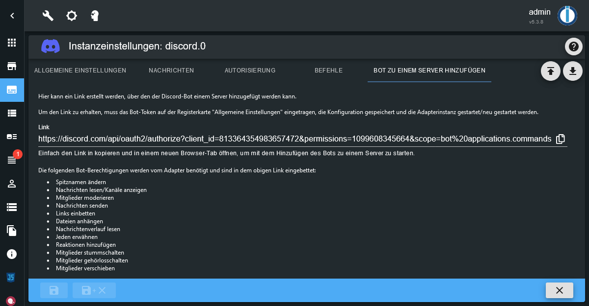
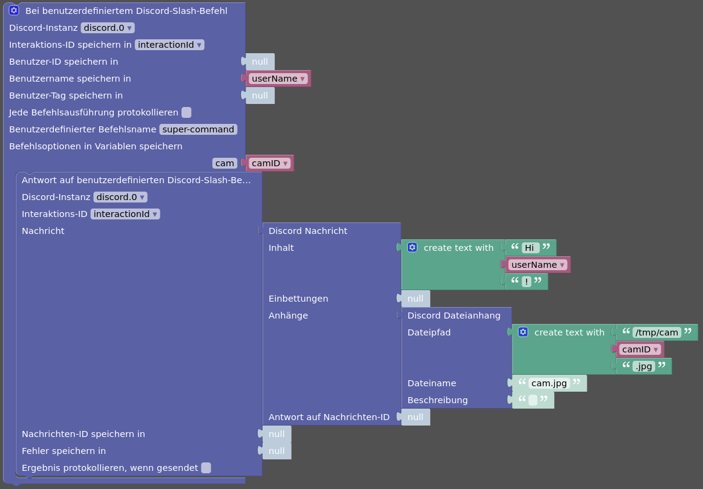

# ioBroker.discord


Dieser [ioBroker] Adapter integriert einen [Discord] Bot in ioBroker.

Der Adapter erstellt einen Objektbaum mit Objekten und Zuständen für die Server
und Kanäle, in denen der Bot vertreten ist.
Zudem wird ein Objektbaum für alle Benutzer, die vom Bot gesehen werden, erstellt.  
Über diese Zustände ist es dann möglich über Discord Nachrichten zu empfangen
und Nachrichten sowie Dateien zu versenden.

Zusätzlich kann der Adapter Discord Slash-Befehle registrieren.
Über diese ist es dann möglich, ioBroker-Zustände abzufragen oder festzulegen.

- [ioBroker.discord](#iobrokerdiscord)
  - [Funktionen](#funktionen)
  - [Erstellen eines Discord Bots](#erstellen-eines-discord-bots)
  - [Den Bot einem Server hinzufügen](#den-bot-einem-server-hinzufügen)
    - [Den Bot von einem Server entfernen](#den-bot-von-einem-server-entfernen)
  - [Zustände (States)](#zustände-states)
    - [discord.0.bot.\*](#discord0bot)
    - [discord.0.servers.\<server-id\>.\*](#discord0serversserver-id)
    - [discord.0.servers.\<server-id\>.channels.\<channel-id\>.\*](#discord0serversserver-idchannelschannel-id)
    - [discord.0.servers.\<server-id\>.members.\<user-id\>.\*](#discord0serversserver-idmembersuser-id)
    - [discord.0.users.\<user-id\>.\*](#discord0usersuser-id)
    - [discord.0.slashCommands.\<command-name\>.\*](#discord0slashcommandscommand-name)
    - [discord.0.raw.\*](#discord0raw)
  - [Autorisierung](#autorisierung)
  - [Nachrichten](#nachrichten)
    - [Nachrichten empfangen](#nachrichten-empfangen)
      - [Verwendung von text2command](#verwendung-von-text2command)
    - [Nachrichten senden](#nachrichten-senden)
      - [Senden einfacher Texte](#senden-einfacher-texte)
      - [Senden von Dateien](#senden-von-dateien)
      - [Senden von Reaktionen](#senden-von-reaktionen)
      - [Senden von Antworten](#senden-von-antworten)
      - [Senden von speziellen benutzerdefinierten Nachrichten](#senden-von-speziellen-benutzerdefinierten-nachrichten)
  - [Slash-Befehle](#slash-befehle)
    - [Zustände für Slash-Befehle konfigurieren](#zustände-für-slash-befehle-konfigurieren)
    - [Zustände abfragen](#zustände-abfragen)
    - [Zustände festlegen](#zustände-festlegen)
    - [Einen Überblick über Zustände mit Konfigurationen für Slash-Befehle erhalten](#einen-überblick-über-zustände-mit-konfigurationen-für-slash-befehle-erhalten)
    - [Benutzerdefinierte Slash-Befehle](#benutzerdefinierte-slash-befehle)
      - [Struktur eines json-Zustands von benutzerdefinierten Slash-Befehlen](#struktur-eines-json-zustands-von-benutzerdefinierten-slash-befehlen)
  - [Blockly](#blockly)
    - [Blockly Beispiel: Senden einer Nachricht an einen Benutzer und diese nach drei Sekunden bearbeiten](#blockly-beispiel-senden-einer-nachricht-an-einen-benutzer-und-diese-nach-drei-sekunden-bearbeiten)
    - [Blockly Beispiel: Senden einer zusammengesetzten Nachricht mit einer Einbettung und zwei Dateianhängen](#blockly-beispiel-senden-einer-zusammengesetzten-nachricht-mit-einer-einbettung-und-zwei-dateianhängen)
    - [Blockly Beispiel: Auf benutzerdefinierten Slash-Befehl reagieren und Bild der angefragten IP-Cam senden](#blockly-beispiel-auf-benutzerdefinierten-slash-befehl-reagieren-und-bild-der-angefragten-ip-cam-senden)
  - [Verwendung in Skripten](#verwendung-in-skripten)
    - [Senden einer Nachricht in einem Skript](#senden-einer-nachricht-in-einem-skript)
    - [Bearbeiten einer Nachricht in einem Skript](#bearbeiten-einer-nachricht-in-einem-skript)
    - [Löschen einer Nachricht in einem Skript](#löschen-einer-nachricht-in-einem-skript)
    - [Reaktions-Emoji zu einer Nachricht hinzufügen in einem Skript](#reaktions-emoji-zu-einer-nachricht-hinzufügen-in-einem-skript)
    - [Auf Reaktionen auf eine Nachricht warten in einem Skript](#auf-reaktionen-auf-eine-nachricht-warten-in-einem-skript)
    - [Auf benutzerdefinierte Slash-Befehle antworten in einem Skript](#auf-benutzerdefinierte-slash-befehle-antworten-in-einem-skript)
    - [Informationen zu einem Server in einem Script abfragen](#informationen-zu-einem-server-in-einem-script-abfragen)
    - [Informationen zu einem Serverkanal in einem Script abfragen](#informationen-zu-einem-serverkanal-in-einem-script-abfragen)
    - [Informationen zu einem Benutzer in einem Script abfragen](#informationen-zu-einem-benutzer-in-einem-script-abfragen)
    - [Informationen zu einem Servermitglied in einem Script abfragen](#informationen-zu-einem-servermitglied-in-einem-script-abfragen)
    - [Informationen zu einer vorherigen Nachricht in einem Script abfragen](#informationen-zu-einer-vorherigen-nachricht-in-einem-script-abfragen)

## Funktionen

* ioBroker-Zustände für alle Server des Bots zum Empfangen und Senden von Nachrichten
* ioBroker-Zustände für alle Benutzer, die vom Bot gesehen werden, zum Empfangen und Senden von Direktnachrichten
* Vereinfachtes Beitreten und Verlassen von Discord-Server für den Bot
* Festlegen des Bot-Status inklusive Aktionen
* Optional beobachten des Anwesenheitsstatus der Benutzer
* Optional beobachten des Voice-Status der Benutzer
* Voice-Aktionen für Servermitglieder (stumm, gehörlos, trennen)
* Behandlung aller Nachrichten, oder nur von Nachrichten mit Erwähnungen des Bots in Serverkanälen
* Behandlung von Direktnachrichten
* Optional automatisch mit einem Emoji auf Erwähnungen des Bots reagieren
* `.json`-Zustände für Kanal-, Benutzer- und Nachrichten-Daten
* Nachrichten, Dateien, Reaktionen (Emojis), Antworten, oder benutzerdefinierte Nachrichteninhalte mit JSON-Formatierung senden
* Auflistung der Server- und Kanalmitglieder inklusive der zugeteilten Rollen
* Unterstützung von Discord Slash-Befehlen zum Abfragen und Festlegen von Zustandswerten
* Unterstützung von benutzerdefinierten Discord Slash-Befehlen, auf die in eigenen Skripten (inkl. Blockly) reagiert werden kann
* Unterstützung von [text2command] (muss für jeden `.message`-Zustand einzeln aktiviert werden)
* Senden, bearbeiten und löschen von Nachrichten, Senden von und warten auf Reaktionen auf Nachrichten in eigenen Skripten
* Optional raw-Zustände für mehr Flexibilität in eigenen Skripten
* Unterstützung von Blockly mit eigenen Blöcken zum Senden und Bearbeiten von Nachrichten und zum handhaben von eigenen Slash-Befehlen

Was *nicht* unterstützt wird und auch *nicht* vorgesehen ist:

* Nachrichten in Threads
* Senden und Empfangen von Voice-Nachrichten

Es fehlt ein Feature? Erstelle einfach ein Feature-Request auf [GitHub][GitHub New Issue].

## Erstellen eines Discord Bots

Um diesen Adapter zu benutzen, muss eine Discord Bot Anwendung erstellt werden.

1. Gehe zum [Discord Developer Portal] und logge dich mit deinem Discord-Account ein, wenn nicht bereits eingeloggt.
2. In der _Applications_ Ansicht, klicke auf den Button _New Application_ oben rechts.  
[](../en/media/bot-creation-1.png)
3. Wähle einen Namen für die Applikation (das wird der Name des Bots) und klicke _Create_.  
[](../en/media/bot-creation-2.png)
4. (Optional) Lade ein _App Icon_ hoch, ändere den Namen (_Name_), Ändere die Beschreibung (_Description_), füge ein paar _Tags_ hinzu und speichere die Änderungen (_Save Changes_).  
[](../en/media/bot-creation-3.png)
5. Navigiere im linken Menü zu _Bot_ klicke den _Add Bot_ Button.  
[](../en/media/bot-creation-4.png)  
Im folgenden Dialog klicke _Yes, do it!_ um die Erstellung des Bots zu bestätigen.
6. Wenn der Bot erstellt ist, musst du einmalig auf den Button _Reset Token_ klicken, um das Bot-Token zu erhalten.  
[](../en/media/bot-creation-5.png)  
Da dies alle früheren Tokens für ungültig erklärt, musst du dies mit dem Button _Yes, do it!_ im aufpoppenden Dialog bestätigen.  
Danach wird das Bot-Token **einmalig** angezeigt und du solltest es an einen sicheren Ort kopieren (z.B. die Konfiguration der Adapterinstanz).
7. Scrolle auf der _Bot_-Seite ein Stück herunter zu _Privileged Gateway Intents_ und aktiviere _Presence Intent_, _Server Members Intent_ sowie _Message Content Intent_. Vergiss nicht die Änderungen zu speichern (_Save Changes_).  
[](../en/media/bot-creation-6.png)  
Hinweis: Sobald der Bot auf mehr als 100 Servern vertreten ist, werden diese Intents eine Verifikation und Genehmigung seitens Discord benötigen.
8. Jetzt ist alles bereit, um die Adapterinstanz zu starten und anschließend den Bot einem Discord-Server hinzuzufügen.

## Den Bot einem Server hinzufügen

Um den Bot einem Server hinzuzufügen, kann in der Konfiguration der
Adapterinstanz der Reiter _Bot zu einem Server hinzufügen_ genutzt werden.
Dort wird ein Link angezeigt, mit dem der Bot zu einem Server hinzugefügt werden
kann, wobei alle nötigen Berechtigungen und Anwendungsbereiche richtig gesetzt werden.

[](./media/bot-zu-server-hinzufuegen.png)

Die folgenden Bot-Berechtigungen werden vom Adapter benötigt:

* Spitznamen ändern
* Nachrichten lesen/Kanäle anzeigen
* Mitglieder moderieren
* Nachrichten senden
* Links einbetten
* Dateien anhängen
* Nachrichtenverlauf lesen
* Jeden erwähnen
* Reaktionen hinzufügen
* Mitglieder stummschalten
* Mitglieder gehörlosschalten
* Mitglieder verschieben

Zudem werden die folgenden Anwendungsbereiche benötigt:

* bot
* applications.commands

Wenn Berechtigungen oder Anwendungsbereiche fehlen, dann werden manche
Funktionen des Adapters nicht funktionieren.

### Den Bot von einem Server entfernen

Um den Bot wieder von einem Server zu entfernen, gibt es weiter unten auf der
gleichen Seite der Instanzkonfiguration des Adapters die Möglichkeit einen
Server auszuwählen und dann den Button _Server verlassen!_ zu klicken, um dem
Bot zu sagen, dass er den Server verlassen soll.

## Zustände (States)

Jeder Server, Kanal und Benutzer wird über dessen einmalige nummerische ID identifiziert.  
Da Namen sich ändern können, nutzt der vom Adapter erstellt Objektbaum diese IDs,
um eine zuverlässige Struktur zu erstellen.

Der gesamte Objektbaum wird auf Grundlage dessen erzeugt, was der Bot sehen kann.
Somit ist es beispielsweise möglich, dass es auf einem Server mehr Kanäle gibt,
als angezeigt werden.

### discord.0.bot.*

| Name | Beschreibung |
|---|---|
| `activityType` | Die Art der Bot-Aktivität. Mögliche Werte sind `Playing`, `Streaming`, `Listening`, `Watching`, `Competing` oder ein leerer String. |
| `activityName` | Der Name der Bot-Aktivität. Wird nur verwendet, wenn eine Art gesetzt ist. |
| `status` | Der Anwesenheitsstatus des Bots. Mögliche Werte sind `online`, `idle`, `dnd` und `invisible`. |

Diese Zustände werden verwendet, um den Anwesenheitsstatus und die Aktivität des
Bots festzulegen, wie es den Benutzern angezeigt werden soll.

### discord.0.servers.\<server-id\>.*

| Name | Beschreibung |
|---|---|
| `channels.*` | Kanäle des Servers. |
| `members.*` | Mitglieder des Servers. |

### discord.0.servers.\<server-id\>.channels.\<channel-id\>.*

| Name | Beschreibung |
|---|---|
| `channels.*` | Nur vorhanden, wenn der Kanal eine Kategorie ist. Die Struktur dahin ist dieselbe, wie für Serverkanäle. |
| `memberCount` | Anzahl der Mitglieder in diesem Kanal. |
| `members` | Mit Komma getrennte Liste der Mitglieder (Anzeigenamen) des Kanals. |
| `message` | Letzte empfangene Nachricht in diesem Kanal. |
| `messageId` | ID der letzten empfangenen Nachricht. |
| `messageAuthor` | Verfasser (einmaliger Benutzername oder Benutzer-Tag) der letzten empfangenen Nachricht. |
| `messageTimestamp` | Zeitstempel der letzten empfangenen Nachricht. |
| `messageJson` | JSON-Daten der letzten empfangenen Nachricht. |
| `send` | Senden von Texten oder JSON-formatierten Nachrichten. |
| `sendFile` | Senden einer Datei. |
| `sendReply` | Senden einer Antwort auf eine Nachricht. |
| `sendReaction` | Senden einer Reaktion (Emoji) auf eine Nachricht. |
| `json` | JSON-Daten der Kanalinformationen. |

Zu allen `message*` und `send*` Zuständen siehe den Abschnitt _Nachrichten_ weiter unten.

### discord.0.servers.\<server-id\>.members.\<user-id\>.*

| Name | Beschreibung |
|---|---|
| `tag` | Der eindeutige Tag des Benutzers in Discord. |
| `name` | Der Name des Benutzers in Discord. (einmalig, wenn `tag` mit `#0` endet) |
| `displayName` | Der Anzeigename des Benutzers auf dem Server. |
| `roles` | Mit Komma getrennte Liste der Rollen des Benutzers auf dem Server. |
| `joinedAt` | Zeitstempel, wann der Benutzer dem Server beigetreten ist. |
| `voiceChannel` | Sprachkanal mit dem der Benutzer momentan verbunden ist, oder ein leerer String, wenn nicht verbunden. |
| `voiceDisconnect` | Button um den Benutzer vom Sprachkanal zu trennen. |
| `voiceSelfDeaf` | Indikator, ob der Benutzer sich selbst gehörlos geschaltet hat. |
| `voiceSelfMute` | Indikator, ob der Benutzer sich selbst stumm geschaltet hat. |
| `voiceServerDeaf` | Indikator, ob der Benutzer vom Server gehörlos geschaltet wurde. Kann außerdem verwendet werden, um diesen Status zu ändern. |
| `voiceServerMute` | Indikator, ob der Benutzer vom Server stumm geschaltet wurde. Kann außerdem verwendet werden, um diesen Status zu ändern. |
| `json` | JSON-Daten der Benutzerinformationen. |

Damit die `voice*`-Zustände aktuell sind, muss die Option _Sprachchatstatus der Benutzer beobachten_ in der Instanzkonfiguration aktiviert sein.  
Für die Verwendung der Aktionen `voiceDisconnect`, `voiceServerDeaf` und `voiceServerMute`, muss der Bot die zugehörigen Berechtigungen auf dem Server haben.

### discord.0.users.\<user-id\>.*

| Name | Beschreibung |
|---|---|
| `tag` | Der eindeutige Tag des Benutzers in Discord. |
| `name` | Der Name des Benutzers in Discord. (einmalig, wenn `tag` mit `#0` endet) |
| `status` | Der Anwesenheitsstatus des Benutzers. Eins von `online`, `offline`, `idle`, `dnd` |
| `activityType` | Die Art der momentanen Aktivität des Benutzers. Eins von `Playing`, `Streaming`, `Listening`, `Watching`, `Competing`, `Custom` oder ein leerer String. |
| `activityName` | Der Name der momentanen Aktivität des Benutzers. Z.B. der Name eines Spiels während `Playing`. |
| `avatarUrl` | URL zum Avatar des Benutzers. |
| `bot` | Indikator, ob der Benutzer ein Bot ist. |
| `message` | Letzte empfangene Direktnachricht des Benutzers. |
| `messageId` | ID der letzten empfangenen Direktnachricht des Benutzers. |
| `messageTimestamp` | Zeitstempel der letzten empfangenen Direktnachricht des Benutzers. |
| `messageJson` | JSON-Daten der letzten empfangenen Direktnachricht des Benutzers. |
| `send` | Senden von Texten oder JSON-formatierten Nachrichten. |
| `sendFile` | Senden einer Datei. |
| `sendReply` | Senden einer Antwort auf eine Nachricht. |
| `sendReaction` | Senden einer Reaktion (Emoji) auf eine Nachricht. |
| `json` | JSON-Daten der Benutzerinformationen. |

Damit die `status`- und `activity*`-Zustände aktuell sind, muss die Option
_Anwesenheit der Benutzer beobachten_ in der Instanzkonfiguration aktiviert sein.

Zu allen `message*` und `send*` Zuständen siehe den Abschnitt _Nachrichten_ weiter unten.

### discord.0.slashCommands.\<command-name\>.*

Wenn benutzerdefinierte Befehle in der Instanzkonfiguration des Adapters
aktiviert sind, gibt es zusätzlich die folgenden Zustände.

Alle diese Zustände werden bei jedem Aufruf des des benutzerdefinierten Befehls
aktualisiert.

| Name | Beschreibung |
|---|---|
| `json` | JSON-Daten der letzten Nutzung des Befehls. Enthält einige zusätzliche Informationen, die nicht in den einzelnen Zuständen enthalten sind. |
| `interactionId` | ID der letzten Nutzung des Befehls. |
| `userId` | ID des Benutzers, der den Befehl aufgerufen hat. |
| `userTag` | Eindeutiger Tag des Benutzers, der den Befehl aufgerufen hat. |
| `userName` | Der Name des Benutzers, der den Befehl aufgerufen hat. (einmalig, wenn `userTag` mit `#0` endet) |
| `channelId` | ID des Kanals, in dem der Befehl aufgerufen wurde. |
| `serverId` | ID des Servers, in dem der Befehl aufgerufen wurde, oder `null` wenn der Befehl in einer Direktnachricht aufgerufen wurde. |
| `timestamp` | Zeitstempel der letzten Nutzung des Befehls. |
| `option-*` | Optionen die für den Befehl angegeben wurden. Für jede konfigurierte Option wird ein eigener Zustand erstellt. Wenn eine Option beim Aufruf des Befehls nicht angegeben wird, dann wird der zugehörige Zustand auf `null` gesetzt. |
| `option-*.value` | Der letzte Wert, der für die Option bei dem Befehlsaufruf angegeben wurde. Wenn eine Option nicht angegeben wird, dann wird der zugehörige Zustand auf `null` gesetzt. |
| `option-*.choices` | JSON-Array mit vordefinierten Auswahlmöglichkeiten für diese Option. Nur vorhanden bei Optionen vom Typ Text. Beispiel: `["Wert 1", "Wert 2", { "name": "Wert 3", "value": "w3" }]` |
| `sendReply` | Eine Antwort auf dem aufgerufenen Befehl senden. Wie bei den `.send`-Zuständen von Kanälen oder Benutzern, kann dies ein String oder ein JSON-Objekt sein. Siehe den Abschnitt _Nachrichten_ weiter unten. |

**Hinweis:** Es wird empfohlen, den `json`-Zustand in eigenen Skripten zu nutzen,
um Überschneidungen zu vermeiden.
Beispiel: Ein eigenes Skript ließt die einzelnen `option-*`-Zustände während ein
Benutzer den Befehl erneut aufruft und die Optionen aus ersten und zweiten
Aufruf des Befehls geraten durcheinander.

### discord.0.raw.*

Wenn die Rohzustände in der Instanzkonfiguration des Adapters aktiviert sind,
gibt es zusätzlich die folgenden Zustände.

**Hinweis:** Diese Zustände beinhalten Rohdaten ohne jegliche Prüfung, Filterung
oder Modifizierung durch den Adapter. Server werden als Guild bezeichnet.

| Name | Beschreibung |
|---|---|
| `messageJson` | Roh-JSON-Daten der letzten empfangen Nachricht. (Kanalnachrichten und Direktnachrichten) |
| `interactionJson` | Roh-JSON-Daten der letzten empfangenen Interaktion. (z.B. Slash-Befehle) |

## Autorisierung

Standardmäßig ist die Autorisierung aktiviert und nur autorisierte Benutzer
werden in der Lage sein, mit dem Adapter zu interagieren.

Die autorisierten Benutzer und Serverrollen können in der Instanzkonfiguration
des Adapters inklusive pro-Benutzer/Rolle-Berechtigungen festgelegt werden.  
Für Serverrollen werden die Berechtigungen nur auf dem jeweiligen Server
angewendet und nicht auf anderen Servern und nicht in Direktnachrichten.  
Wenn Berechtigungen pro Benutzer und Serverrolle vergeben wurden, dann werden
diese für den entsprechenden Server zusammengeführt.

Die Benutzer und Rollen werden dabei über deren interne ID identifiziert, sodass
selbst Änderungen des Benutzer-Tags, des Benutzernamens oder des Rollennamens
die Autorisierung nicht beeinträchtigen.

Es ist auch möglich die Autorisierung zu deaktivieren. Dies sollte jedoch nur
gemacht werden, wenn allen Benutzern auf allen Servern des Bots vertraut werden kann!

## Nachrichten

Der Adapter ist in der Lage, Nachrichten von Discord Textkanälen und Benutzern
zu empfangen und zu senden.

Standardmäßig werden in Kanälen nur Nachrichten mit Erwähnungen des Bots verarbeitet.
Damit auch Nachrichten ohne Erwähnungen verarbeitet werden, muss die Option
_Alle Nachrichten in Serverkanälen verarbeiten_ in der Instanzkonfiguration aktiviert werden.

Wenn eine Nachricht mit einer Erwähnung des Bots empfangen wird, dann reagiert
der Adapter auf diese Nachricht mit einem Emoji.
Dies kann in der Instanzkonfiguration des Adapters angepasst werden.  
Wenn die Autorisierung aktiviert ist, dann wird der Bot nur Erwähnungen von
autorisierten Benutzern reagieren.

### Nachrichten empfangen

Empfangene Nachrichten werden in den `.message*`-Zuständen des entsprechenden
Kanal-Objektes für Kanalnachrichten oder des Benutzer-Objektes für
Direktnachrichten abgelegt.

Wenn die Autorisierung aktiviert ist, werden standardmäßig nur Nachrichten von
autorisierten Benutzern abgelegt.
Dies kann über die Option _Nachrichten von nicht autorisierten Benutzern verarbeiten_
in der Instanzkonfiguration des Adapters angepasst werden, sodass auch
Nachrichten von nicht autorisierten Benutzern abgelegt werden.

Die zuletzt empfangene Nachricht pro Kanal/Benutzer ist immer im
`.message`-Zustand abgelegt.
Der Zeitstempel, der Verfasser und die ID der zuletzt empfangenen Nachricht sind
in den zugehörigen Zuständen abgelegt.  
Zusätzlich werden alle diese Informationen auch im JSON-Format im
`.messageJson`-Zustand abgelegt.

#### Verwendung von text2command

Um text2command zu nutzen, muss eine text2command-Instanz in der
Instanzkonfiguration des Adapters ausgewählt werden.

Für jeden `.message`-Zustand kann die benutzerdefinierte Einstellung
_text2command für diesen Zustand aktivieren_ aktiviert werden.  
Wenn aktiviert, dann werden empfangene Nachrichten an die ausgewählte
text2command-Instanz gesendet.

Die Antwort von text2command wird vom Adapter als Antwort, als normale Nachricht
oder gar nicht gesendet, abhängig von der Instanzkonfiguration des Adapters.

### Nachrichten senden

Um eine Nachricht zu senden, kann der Inhalt in die `.send*`-Zustände eines
Kanals oder Benutzers geschrieben werden.

#### Senden einfacher Texte

Zum Senden einfacher Texte schreibt man einfach den Text in den `.send`-Zustand
des gewünschten Ziels.  
Es kann [Discord Markdown] zur Formatierung des Textes verwendet werden,
genauso wie im Discord-Client.

Um einen Benutzer zu erwähnen, kann die Benutzer-ID in der Form `<@Benutzer-ID>`
verwendet werden.  
Für die Erwähnung von Gruppen kann `<@&Gruppen-ID>` und für Kanäle `<#Kanal-ID>`
genutzt werden.

Beispiele: `Dies ist meine Nachricht.`, `Dies ist _meine_ **formatierte** Nachricht.`, `Hey <@490222742801481728>!`

#### Senden von Dateien

Zum Senden einer Datei als Anhang schreibt man den Ort der Datei in den
`.sendFile`-Zustand des gewünschten Ziels.

Der Ort der Datei kann sein …

* Ein absoluter oder relativer Pfad zu einer lokalen Datei.  
  Relative Pfade sind relativ zum Adapterverzeichnis der ioBroker-Installation.  
  Der Pfad kann optional `file://` vorangestellt haben.
  Beispiele: `/home/user/image.png`, `../../iobroker-data/files/myfile.txt`, `file:///tmp/image.jpg`

* URL zu einer entfernten Datei.  
  Beispiel: `https://www.iobroker.dev/images/iobroker.png`

* Base64 kodierter Dateiinhalt.  
  Beispiel: `data:image/png;base64,iVBORw0KGgoAAAANSUhEUgAAABAAAAAQCAYAAAAf8/9hAAACzklEQVQ4y3WTy2tcdRTHP+d3753HncncmbaJiYvEhZrU+ii2urJgFCyCLnykpbQrsbR/gRQaXPUPUHBlH4ogUsRSqq7qLtlZrQpKg6Uu1OCkSWZ65859zfzucTExsYLf3Tl8zznf85JHZ5+cVuGcMebg0YXXHN/3UVVAqfk1VJV+HCMiAKRpyuXPr1hrixsCZ10VzgEnXMeRF+afJwgaFIUC0Go1UYVOp4OYUYIoivjiyjWszecUMMaYAyXPk7m5R8jznCjqk2YpjuMQhj1AcT2XLM3oR30GgyFB0KDkeWKMOeAeP7ZgDh16jizNeO/9Dwh7PR7ft5ejRxa49tXXvPnG6yRJzNWrX/LDjz8xMTHOu4tnKJXLLC0tG1OtViVoNKhWK9wLQ9pr6yRJwtTUJC/Oz3P9+jckccrk5APcXd+g3V6jUqkwiqmKKwKIMBrbCKpw585vvHNmkT17dvHQzAylUhkjZocnggi4I0+BAML9sEXBX+27XLj0MXGSMLR2h6cFKLh+zSdoNlHYXtW/oaq019a3bRGhPlYnaDbxaz5GVflHV7lcYlcrYJRH+V9s8VUVN4r6bG5ugginT52k2+ny/c2bADjGMDG+m073HlmWbyvq9XoURUEU9TGO4+C4DsPBgI31DZIkwVqLAs8+8zQnjh/j1Vdevq84Iriei+M4GABByLKMTz+7zMWPPuHBqSkGgwGdbpeZ6WmiXu+/g9nu0E2SRMMwJMty6rUa+596gsOHX+L8hUvEcUyp5PH7H38yMb4bgMbYGFmWE4YhSZKozO3b/7PruI/Nzj7MybffotVqYYwhjmPq9TpBo8Hq6iqFjkpmWcaH5y+ysnKboR3+4lpbfGdtvvfWrV+lUi5T8jyKoqBeq9FqBqiC7/sYM7qAnggrK7fJ8lyBG67AWQWstQeXlpd33lmhVt96535/60aENE0YWmuBbwUW/wZQx0cNXLu4ygAAAABJRU5ErkJggg==`

Zusätzlich kann eine Textnachricht zur Datei hinzugefügt werden. Dazu einfach
den Ort der Datei, gefolgt vom Pipe-Zeichen `|` und der Nachricht in den
`.sendFile`-Zustand schreiben.  
Beispiele: `/tmp/image.png|Dies ist meine Datei`, `https://www.iobroker.dev/images/iobroker.png|Das ioBroker Logo`

#### Senden von Reaktionen

Über den `.sendReaction`-Zustand kann mit einem Emoji auf vorherige Nachrichten
reagiert werden. Hierzu einfach den Emoji in den Zustand schreiben.

Standardmäßig wird die Reaktion zu der Nachricht gesendet, deren ID aktuell im
zugehörigen `.messageId`-Zustand enthalten ist.

Wenn auf eine bestimmte Nachricht reagiert werden soll, dann kann die
Nachrichten-ID, gefolgt vom Pipe-Zeichen `|` und dem Emoji in den
`.sendReaction`-Zustand geschrieben werden.

Beispiele: `👍`, `971032590515568660|👍`

#### Senden von Antworten

Über den `.sendReply`-Zustand kann auf vorherige Nachrichten geantwortet werden.
Hierzu einfach die Antwort in den Zustand schreiben.

Standardmäßig wird die Antwort zu der Nachricht gesendet, deren ID aktuell im
zugehörigen `.messageId`-Zustand enthalten ist.

Wenn auf eine bestimmte Nachricht geantwortet werden soll, dann kann die
Nachrichten-ID, gefolgt vom Pipe-Zeichen `|` und der Antwort in den
`.sendReply`-Zustand geschrieben werden.

Beispiele: `Dies ist eine Antwort.`, `971032590515568660|Dies ist eine Antwort.`

#### Senden von speziellen benutzerdefinierten Nachrichten

Es können auch spezielle benutzerdefinierte Nachrichten gesendet werden, indem
ein JSON-Nachrichten-Objekt in einen `.send`- oder `.sendReply`-Zustand geschrieben wird.

Das JSON-Object muss dabei vom Typ `MessageOptions` sein.
Für mehr Information dazu siehe die [discord.js MessageOptions Dokumentation][MessageOptions].

Beispiele:

Ein Bild senden:

```json
{
  "files": [
    {
      "attachment": "/tmp/image.jpg",
      "name": "image.jpg",
      "description": "Mein tolles Bild"
    }
  ]
}
```

Eingebetteten Inhalt senden:

```json
{
  "content": "Verwende das:",
  "embeds": [
    {
      "title": "ioBorker.discord",
      "description": "Discord Adapter für ioBroker",
      "color": "#5865f2",
      "url": "https://github.com/crycode-de/ioBroker.discord",
      "author": {
        "name": "Peter Müller",
        "url": "https://github.com/crycode-de"
      },
      "image": {
        "url": "https://github.com/crycode-de/ioBroker.discord/raw/main/admin/discord.png"
      },
      "footer": {
        "text": "❤👍"
      }
    }
  ]
}
```

Eingebettetes Bild von einer lokalen Quelle senden:

```json
{
  "embeds": [
    {
      "title": "IP-Cam Alarm",
      "description": "Schau dir das an:",
      "color": "#ff0000",
      "image": {
        "url": "attachment://cam.jpg"
      }
    }
  ],
  "files": [
    {
      "attachment": "http://192.168.1.50:8080/ip-cam.jpg",
      "name": "cam.jpg"
    }
  ]
}
```

## Slash-Befehle

Sofern in der Instanzkonfiguration des Adapters aktiviert, kann der Adapter mit
Discord-Slash-Befehlen arbeiten. Diese Befehle können genutzt werden, um
ioBroker-Zustände abzufragen oder festzulegen.

**Hinweis:** Die Zustände, die für Discord-Slash-Befehle verfügbar sein sollen,
müssen individuell konfiguriert werden. Siehe dazu weiter unten.

Discord-Slash-Befehle können vom Adapter als Server-Befehle (Standard) oder als
globale Befehle registriert werden. Dies kann in der Instanzkonfiguration des
Adapters eingestellt werden.  
Die Nutzung von Server-Befehlen hat den Vorteil, dass Änderungen an den Befehlen
(z.B. das Hinzufügen von Zuständen) sofort und ohne Verzögerung übernommen werden.
Jedoch können Server-Befehle nicht in Direktnachrichten zwischen einem Benutzer
und dem Bot verwendet werden.  
Globale Befehle können auch in Direktnachrichten verwendet werden, aber jede
Änderung an den Befehlen kann bis zu einer Stunde dauern, bis sie von Discord
übernommen wird. Dies ist eine Beschränkung von Discord und nicht vom Adapter.

Die standardmäßig verwendeten Slash-Befehle sind `/iob-get` und `/iob-set`.
Die Namen und Beschreibungen der Befehle können in der Instanzkonfiguration
des Adapters angepasst werden.

### Zustände für Slash-Befehle konfigurieren

Für jeden Zustand, der über Discord-Slash-Befehle verfügbar sein soll, muss dies
in den benutzerdefinierten Einstellungen des Zustands aktiviert werden.
Dazu einfach auf das _Benutzerdefinierte Einstellungen_ Zahnrad-Symbol in der
_Objekte_-Ansicht im Admin klicken, die Einstellungen für die Adapterinstanz
aktivieren und die Option _Discord-Befehle für diesen Zustand aktivieren_ aktivieren.

[](./media/slash-befehl-konfiguration-1.png)

[](./media/slash-befehl-konfiguration-2.png)

Es können ein _Name_ und ein _Alias_ für jeden Zustand für die Nutzung in
Discord definiert werden.
Der _Name_ wird bei der Autovervollständigung der Befehle und der _Alias_ als
interne Identifikation verwendet. Beides darf eine Länge von 100 Zeichen nicht
überschreiten.

Für jeden Zustand kann einzeln festgelegt werden, ob dieser zum Abfragen und/oder
zum Festlegen verfügbar sein soll.  
Zusätzlich kann aktiviert werden, dass beim Abfragen eine Information angezeigt
wird, wenn der jeweilige Zustand nicht bestätigt ist, oder das beim Setzen immer
mit Bestätigung gesetzt werden soll.

Für Zustände vom Datentyp `string` kann ausgewählt werden, dass der Wert als
Datei (Ort einer Datei) behandelt werden soll.  
Ist dies aktiviert, dann wird der aktuelle Wert des Zustands wie bei den
`.sendFile`-Zuständen gesendet.  
Damit ist es beispielsweise möglich Bilder über einen Abfragebefehl anzufordern.

Für Zustände vom Datentyp `number` kann die Anzahl an Dezimalstellen zum Runden
des Wertes bei Abfragebefehlen angegeben werden.

Für Zustände vom Datentyp `boolean` können benutzerdefinierte Werte für `true`
und `false` definiert werden, die dann bei Abfragebefehlen zur Anzeige und bei
Festlegebefehlen zur Erkennung genutzt werden.

### Zustände abfragen

Um einen Zustand abzufragen, rufe einfach `/iob-get Zustandsalias` im Discord-Client auf.  
Für `Zustandsalias` wird eine Autovervollständigung während der Eingabe des
Befehls angezeigt.

Jeder Wert wird für die Ausgabe so formatiert, wie im Zustandsobjekt und den
zugehörigen benutzerdefinierten Einstellungen festgelegt ist.
Optional wird eine Information bei fehlender Bestätigung des Zustands hinzugefügt.

### Zustände festlegen

Um einen Zustand abzufragen, rufe einfach `/iob-set Zustandsalias Neuer-Wert` im
Discord-Client auf.  
Für `Zustandsalias` wird eine Autovervollständigung während der Eingabe des
Befehls angezeigt.  
`Neuer-Wert` wird vom Adapter analysiert, wenn der Datentyp des Zustands
`boolean` oder `number` ist.

Je Zustand kann einzeln konfiguriert werden, ob der Wert mit oder ohne
Bestätigung gesetzt werden soll.

Für Zustände vom Datentyp `boolean` werden die Werte `true`, `on`, `yes`, `1`
und ihre zugehörigen Übersetzungen (`wahr`, `an`, `ja`), sowie der zum Zustand
konfigurierte _Wahre Wert_ als `true` interpretiert.
Jeder andere Wert wird als `false` interpretiert.

Für Zustände vom Datentyp `number` wird der angegebene Wert als Dezimalzahl interpretiert.  
Wenn die ioBroker-Installation so konfiguriert ist, dass ein Komma als
Dezimaltrenner verwendet werden soll, dann kann die Zahl mit Komma oder Punkt als
Dezimaltrenner angegeben werden. Andernfalls ist nur der Punkt als
Dezimaltrenner erlaubt.  
Wenn im Zustandsobjekt Werte für `min` und `max` festgelegt wird, dann werden
diese ebenfalls geprüft.

### Einen Überblick über Zustände mit Konfigurationen für Slash-Befehle erhalten

Um einen Überblick über alle Zustände mit aktiver Konfiguration für
Slash-Befehle zu erhalten, kann in der Instanzkonfiguration des Adapters der
Button _Für Befehle konfigurierte Zustandsobjekte protokollieren_ angeklickt
werden. Die Ausgabe erfolgt dann im Log der ioBroker-Installation.

### Benutzerdefinierte Slash-Befehle

In der Instanzkonfiguration des Adapters können eigene Slash-Befehle aktiviert
und konfiguriert werden.
Die konfigurierten eigenen Befehle werden dann zusammen mit den standardmäßigen
get- und set-Befehlen bei Discord registriert.

Zu jedem benutzerdefinierten Befehl können Optionen hinzugefügt werden.  
Diese Optionen werden dann im Discord-Client zu dem Befehl angezeigt.  
Wenn eine Option bei einem Befehlsaufruf nicht angegeben wird, dann enthält
diese Option den Wert `null`.  
Für Optionen des Typs _Text_ können dynamisch vordefinierte Auswahlmöglichkeiten
im zugehörigen `option-*.choices`-Zustand als JSON-Array angegeben werden.

Wenn ein benutzerdefinierte Befehl aufgerufen wird, dann werden die Daten dazu
in die zugehörigen Zustände geschrieben. Siehe die Beschreibung der Zustände im
Abschnitt _Zustände (States)_ weiter oben.

Alle Informationen inklusive der Optionen werden in den `.json`-Zustand des
Befehls geschrieben.  
Dieser Zustand sollte vorrangig genutzt werden, um die Befehlsdaten in Skripten
zu erhalten, da hier alle nötigen Informationen an einer Stelle abgelegt werden
und somit auch bei mehrere Befehlsaufrufen in kurzer Zeit nichts durcheinander
geraten kann.  
Für Optionen des Typs _Benutzer_, _Rolle_, _Kanal_ oder _Erwähnbar_ werden
zusätzliche Felder in den Options-Objekten befüllt.

**Hinweis:** Der Befehl muss selbst ausgewertet und dann eine Antwort auf den
Befehl gesendet werden. Dies geht beispielsweise mit einem eigenen Skript.
Eine Antwort muss innerhalb von 15 Minuten über den `.sendReply`-Zustand
oder die zugehörige `sendTo(...)`-Aktion gesendet werden.
Wenn innerhalb der Zeit keine Antwort gesendet wird, dann zeigt der
Discord-Client den Fehler _Die Anwendung reagiert nicht_ an.

**Hinweis:** Eine Antwort auf einen Befehlsaufruf kann mehrfach gesendet werden.
Dabei wird die Antwort editiert und mit dem neuen Inhalt überschrieben.

#### Struktur eines json-Zustands von benutzerdefinierten Slash-Befehlen

```js
{
  interactionId: string,
  commandName: string,
  user: {
    id: string,
    tag: string,
    name: string,
    displayName: string,
  },
  channelId: string,
  serverId: string | null,
  timestamp: number,
  options: {
    [string]: {
      value: string | number | boolean | null,
      type: 'String' | 'Number' | 'Boolean' | 'User' | 'Role' | 'Channel' | 'Mentionable' | null,
      user?: { // wenn type USER oder MENIONABLE ist
        id: string,
        tag: string,
        name: string,
        bot: boolean,
      },
      member?: { // wenn type USER oder MENIONABLE ist und der Befehl auf einem Server aufgerufen wurde
        id: string,
        tag: string,
        name: string,
        displayName: string,
        roles: { id: string, name: string }[],
      },
      role?: { // wenn type ROLE oder MENTIONABLE ist
        id: string,
        name: string,
      },
      channel?: { // wenn type CHANNEL ist
        id: string,
        name: string,
        type: 'GuildCategory' | 'GuildNews' | 'GuildStageVoice' | 'GuildStore' | 'GuildText' | 'GuildVoice',
        lastMessageId: string | null,
      },
    },
    // ...
  }
}
```

## Blockly

Der Adapter bringt eigene Blockly-Blöcke mit, zum ...

* Senden von Nachrichten an Benutzer oder Serverkanäle
* Bearbeiten von Nachrichten in Direktnachrichten oder Serverkanälen
* Hinzufügen von Emoji-Reaktionen zu Nachrichten
* Zusammensetzen von Nachrichteninhalten mit optionalen Einbettungen, Anhängen und Antwort-Referenzen
* Zusammensetzen von Nachrichteneinbettungen
* Zusammensetzen von Nachrichtenanhängen
* Reagieren auf benutzerdefinierte Slash-Befehle
* Antworten auf benutzerdefinierte Slash-Befehle

### Blockly Beispiel: Senden einer Nachricht an einen Benutzer und diese nach drei Sekunden bearbeiten

[](./media/blockly-1.png)

<details>
<summary>Blockly Code</summary>

```xml
<xml xmlns="https://developers.google.com/blockly/xml">
  <variables>
    <variable id="KIILW$,(eB?pT`;GDuMF">messageId</variable>
  </variables>
  <block type="discord_send_message_user" id="?xkCV};-Lk_-|Q`]%(Gt" x="163" y="38">
    <field name="instance">.0</field>
    <field name="logResultOk">FALSE</field>
    <value name="user">
      <shadow type="text" id="jXN@CluUy_M/ig@4[(Uk">
        <field name="TEXT">crycode</field>
      </shadow>
    </value>
    <value name="content">
      <shadow type="text" id="uLWu1CJ$;k}|VTyw1-8}">
        <field name="TEXT">Hallo!</field>
      </shadow>
    </value>
    <value name="varMessageId">
      <shadow type="logic_null" id="bJ2lJW0qOa@Zjv%(]mFU"></shadow>
      <block type="variables_get" id="xkJ(vH/;@7%)cDo0HU/~">
        <field name="VAR" id="KIILW$,(eB?pT`;GDuMF">messageId</field>
      </block>
    </value>
    <value name="varError">
      <shadow type="logic_null" id="H:f+1-:p9-YkmpehJoco"></shadow>
    </value>
    <next>
      <block type="timeouts_wait" id="OM8gv}Pl#_mHQ|)([mUe">
        <field name="DELAY">3</field>
        <field name="UNIT">sec</field>
        <next>
          <block type="discord_edit_message_user" id="|L3A+9{s_H8j`AF@,*VF">
            <field name="instance">.0</field>
            <field name="logResultOk">FALSE</field>
            <value name="user">
              <shadow type="text" id="voJ:{uuYtbBZ!Xe,rtV|">
                <field name="TEXT">crycode</field>
              </shadow>
            </value>
            <value name="messageId">
              <shadow type="text" id="64L=tOKvKwoqGHadRgDm">
                <field name="TEXT"></field>
              </shadow>
              <block type="variables_get" id="(M^6xk74LUEsPdH=LagL">
                <field name="VAR" id="KIILW$,(eB?pT`;GDuMF">messageId</field>
              </block>
            </value>
            <value name="content">
              <shadow type="text" id="rvnV^RF,g$M/3+(npHNC">
                <field name="TEXT">Moin!</field>
              </shadow>
            </value>
            <value name="varError">
              <shadow type="logic_null" id="{H4Q^vl400kxRKrffDz)"></shadow>
            </value>
          </block>
        </next>
      </block>
    </next>
  </block>
</xml>
```

</details>

### Blockly Beispiel: Senden einer zusammengesetzten Nachricht mit einer Einbettung und zwei Dateianhängen

[](./media/blockly-2.png)

<details>
<summary>Blockly Code</summary>

```xml
<xml xmlns="https://developers.google.com/blockly/xml">
  <block type="discord_send_message_server_channel" id="Mnc=pB-8%Dr/nsen|SC`" x="63" y="38">
    <field name="instance">.0</field>
    <field name="logResultOk">FALSE</field>
    <value name="serverId">
      <shadow type="text" id="PA4]t;7CuDrKtwa|oB?L">
        <field name="TEXT">813364154118963251</field>
      </shadow>
    </value>
    <value name="channelId">
      <shadow type="text" id="x^vm,CRT`z2AhDT#ZcUC">
        <field name="TEXT">813364154559102998</field>
      </shadow>
    </value>
    <value name="content">
      <shadow type="text" id="ebdEp~G?:_gInjN47g@f">
        <field name="TEXT"></field>
      </shadow>
      <block type="discord_create_content" id="kY,/zwmwkjo:U;cT?eN*">
        <value name="content">
          <shadow type="text" id="D|y(g`oE@H#gu+deGbv2">
            <field name="TEXT"></field>
          </shadow>
        </value>
        <value name="embeds">
          <shadow type="logic_null" id="Qt[pG25wLoI8+3/jN66C"></shadow>
          <block type="discord_create_embed" id="cXAWtP-36uYlAxLhIBhN">
            <value name="description">
              <shadow type="text" id="^D%m:ic9]AcUUQP8~U#6">
                <field name="TEXT">Eingebetteter Anhang</field>
              </shadow>
            </value>
            <value name="title">
              <shadow type="logic_null" id="_Wm.(^Ff6^u%K+gVz$^Z"></shadow>
            </value>
            <value name="url">
              <shadow type="logic_null" id="0,08A!7[kJ-nJPnPH$L5"></shadow>
            </value>
            <value name="color">
              <shadow type="colour_picker" id="V0}MlQJvN._LHFhG2K%@">
                <field name="COLOUR">#5865f2</field>
              </shadow>
            </value>
            <value name="imageUrl">
              <shadow type="logic_null" id="xXr:E++u0;@2#e]r;_`]"></shadow>
              <block type="text" id="76;;p-5{pls%KmrI!ar{">
                <field name="TEXT">attachment://datei1.jpg</field>
              </block>
            </value>
            <value name="footerText">
              <shadow type="logic_null" id="#BS`MgkNWbrQ@*m/kNdw"></shadow>
            </value>
          </block>
        </value>
        <value name="files">
          <shadow type="logic_null" id="4u@7^DXCI~J$r{Qx}1Ql"></shadow>
          <block type="lists_create_with" id="42g8r-+[xWw`|^.qOF!*">
            <mutation items="2"></mutation>
            <value name="ADD0">
              <block type="discord_create_file" id="EzK4NA^+bu4vChH/vj-b">
                <value name="attachment">
                  <shadow type="text" id="=OEkBZ:LFXvT2$S++21(">
                    <field name="TEXT">/tmp/datei1.jpg</field>
                  </shadow>
                </value>
                <value name="name">
                  <shadow type="text" id="zum#q*|`aD%A2s/N@/Ow">
                    <field name="TEXT">datei1.jpg</field>
                  </shadow>
                </value>
                <value name="description">
                  <shadow type="text" id="#ZZOq%3EHO/_GC+w.,-^">
                    <field name="TEXT"></field>
                  </shadow>
                </value>
              </block>
            </value>
            <value name="ADD1">
              <block type="discord_create_file" id="wIKo-2??SX@WcYc7e/5s">
                <value name="attachment">
                  <shadow type="text" id=")4lvYv.)IhU/p+~KUDym">
                    <field name="TEXT">/tmp/logdatei.txt</field>
                  </shadow>
                </value>
                <value name="name">
                  <shadow type="text" id="#)t#lK6{$RuZt34O;@Ag">
                    <field name="TEXT">log.txt</field>
                  </shadow>
                </value>
                <value name="description">
                  <shadow type="text" id="^UKzs+$TQ!tiE:`(=%}}">
                    <field name="TEXT"></field>
                  </shadow>
                </value>
              </block>
            </value>
          </block>
        </value>
        <value name="replyToId">
          <shadow type="logic_null" id="#1:[?d^x=)ZH.!uyxRI:"></shadow>
        </value>
      </block>
    </value>
    <value name="varMessageId">
      <shadow type="logic_null" id="@D^#9^84UknOfV|c$NK~"></shadow>
    </value>
    <value name="varError">
      <shadow type="logic_null" id="mJu{Fa9+]+Ml,{_OqIOh"></shadow>
    </value>
  </block>
</xml>
```

</details>

### Blockly Beispiel: Auf benutzerdefinierten Slash-Befehl reagieren und Bild der angefragten IP-Cam senden

[](./media/blockly-3.png)

<details>
<summary>Blockly Code</summary>

```xml
<xml xmlns="https://developers.google.com/blockly/xml">
  <variables>
    <variable id="Wcj[Gmy,vX]b,)s,O)`U">interactionId</variable>
    <variable id="{sXn[Mn@ZN#fWtTV6O^;">userName</variable>
    <variable id="ULmVI=-QcXLnD!e60KTV">camID</variable>
  </variables>
  <block type="discord_on_custom_cmd" id="GE,i32wKhz%KGlBhV$j=" x="63" y="13">
    <mutation xmlns="http://www.w3.org/1999/xhtml" options="cam"></mutation>
    <field name="instance">.0</field>
    <field name="varInteractionId" id="Wcj[Gmy,vX]b,)s,O)`U">interactionId</field>
    <field name="log">FALSE</field>
    <field name="commandName">super-command</field>
    <value name="varUserId">
      <shadow type="logic_null" id="/}0,E!Gq=C2U]C^.8m1@"></shadow>
    </value>
    <value name="varUserName">
      <block type="variables_get" id="Q=v?u?yU}Tw*@FH*|x7.">
        <field name="VAR" id="{sXn[Mn@ZN#fWtTV6O^;">userName</field>
      </block>
    </value>
    <value name="varUserTag">
      <shadow type="logic_null" id="+r2I4SpfhuW%9DE21,[c"></shadow>
    </value>
    <value name="option0">
      <shadow type="logic_null" id="hL^g}gJg-b.+SOH0s9m1"></shadow>
      <block type="variables_get" id="z/Lf|chD)~Ge0N~@EWG%">
        <field name="VAR" id="ULmVI=-QcXLnD!e60KTV">camID</field>
      </block>
    </value>
    <statement name="STATEMENT">
      <block type="discord_send_custom_command_reply" id="zJXF!F=|Xt4.kG/6ctl(">
        <field name="instance">.0</field>
        <field name="interactionId" id="Wcj[Gmy,vX]b,)s,O)`U">interactionId</field>
        <field name="logResultOk">FALSE</field>
        <value name="content">
          <shadow type="text" id="bdVm59S9_U*GFB(IBO6x">
            <field name="TEXT"></field>
          </shadow>
          <block type="discord_create_content" id="6m8gBtp;K@t8}{`9gPd1">
            <value name="content">
              <shadow type="text" id=".c}Z71nQ8LlQ@h}_Z?qR">
                <field name="TEXT"></field>
              </shadow>
              <block type="text_join" id="Z{wQ$[1g7z?KPMSHB],Y">
                <mutation items="3"></mutation>
                <value name="ADD0">
                  <block type="text" id="cuzUE7GB$#gC*;nOQ|Ke">
                    <field name="TEXT">Hi </field>
                  </block>
                </value>
                <value name="ADD1">
                  <block type="variables_get" id="|[[T@|n1Ro{EU56/jJ@P">
                    <field name="VAR" id="{sXn[Mn@ZN#fWtTV6O^;">userName</field>
                  </block>
                </value>
                <value name="ADD2">
                  <block type="text" id="LV$kS:Gzv#cJ#gXe/{4a">
                    <field name="TEXT">!</field>
                  </block>
                </value>
              </block>
            </value>
            <value name="embeds">
              <shadow type="logic_null" id="p8S?*FLv4a6aIJogCKU;"></shadow>
            </value>
            <value name="files">
              <shadow type="logic_null" id="y#a8q/mr^)Ymt*j)S:H/"></shadow>
              <block type="discord_create_file" id="vN%eoP74=*)f63CQiJ__">
                <value name="attachment">
                  <shadow type="text" id="2$9y5yj3.GHx.ms*:Ce2">
                    <field name="TEXT"></field>
                  </shadow>
                  <block type="text_join" id="K9zuKTz?-b8VT$8XUVQ8">
                    <mutation items="3"></mutation>
                    <value name="ADD0">
                      <block type="text" id="p3f^[{6t+UuDJN=49+#Z">
                        <field name="TEXT">/tmp/cam</field>
                      </block>
                    </value>
                    <value name="ADD1">
                      <block type="variables_get" id="oVmVHEX[iT(-X#]m=[U@">
                        <field name="VAR" id="ULmVI=-QcXLnD!e60KTV">camID</field>
                      </block>
                    </value>
                    <value name="ADD2">
                      <block type="text" id="wUXx)@u6*2,+9!q{W`n`">
                        <field name="TEXT">.jpg</field>
                      </block>
                    </value>
                  </block>
                </value>
                <value name="name">
                  <shadow type="text" id="L5fO_+by.^Z:se~6|xCj">
                    <field name="TEXT">cam.jpg</field>
                  </shadow>
                </value>
                <value name="description">
                  <shadow type="text" id="ku}h+v)9oY;1`[9Rr)w%">
                    <field name="TEXT"></field>
                  </shadow>
                </value>
              </block>
            </value>
            <value name="replyToId">
              <shadow type="logic_null" id="Ou%Gd6C*+2OaIPUxPp}t"></shadow>
            </value>
          </block>
        </value>
        <value name="varMessageId">
          <shadow type="logic_null" id="RUb!i][5`[t0*mzLwBvN"></shadow>
        </value>
        <value name="varError">
          <shadow type="logic_null" id="SLsj^+8=[Bp%/X8n]$?Z"></shadow>
        </value>
      </block>
    </statement>
  </block>
</xml>
```

</details>

## Verwendung in Skripten

In Skripten kann die Funktion `sendTo(...)` genutzt werden, um mit der
Adapterinstanz zu interagieren.

_Hinweis:_ Alle verwendeten IDs sind Strings.

### Senden einer Nachricht in einem Skript

Um eine Nachricht zu senden, können der `send` oder `sendMessage` Befehl
genutzt werden. Sie sind beide identisch.

Der `message` Teil von `sendTo(...)` muss ein Objekt mit dem zu sendenden
`content` und einem der folgenden Parameter zur Identifikation des Ziels sein:

* `userId`
* `userTag`
* `userName`
* `serverId` und `channelId`

Der `content` kann ein einfacher String oder ein [MessageOptions]-Objekt sein.

Der Rückgabewert im Callback von `sendTo(...)` ist ein Objekt, welches die
Nachrichtenparameter und einen `result`-String, sowie die `messageId` der
gesendeten Discord-Nachricht bei Erfolg oder eine `error`-Nachricht im
Falle eines Fehlers enthält.

Beispiele:

```js
// Senden einer Nachricht zu einem Benutzer bei Verwendung des einmaligen Benutzernamens
sendTo('discord.0', 'sendMessage', {
  userName: 'crycode',
  content: 'Hi!',
}, (ret) => {
  log(ret);
  // {'result':'Message sent to user crycode','userName':'crycode','content':'Hi!','messageId':'971779972052155891'}

  if (ret.error) {
    log(ret.error, 'error');
    return;
  }
  log(`Nachricht gesendet mit ID ${ret.messageId}`);
});

// Senden einer Nachricht zu einem Benutzer bei Verwendung des Benutzer-Tags
// (für Bots und Benutzer, die noch nicht zu einem einmaligen Benutzernamen migriert sind)
sendTo('discord.0', 'sendMessage', {
  userTag: 'cryCode#9911',
  content: 'Hi!',
}, (ret) => {
  log(ret);
  // {'result':'Message sent to user cryCode#9911','userTag':'cryCode#9911','content':'Hi!','messageId':'971779972052160552'}

  if (ret.error) {
    log(ret.error, 'error');
    return;
  }
  log(`Nachricht gesendet mit ID ${ret.messageId}`);
});

// Senden einer Antwort zu einem Benutzer
sendTo('discord.0', 'sendMessage', {
  userId: '490222742801481728',
  content: {
    content: 'Ok!',
    reply: {
      messageReference: '971779972052160552', // ID der Nachricht, auf die geantwortet werden soll
    },
  },
}, (ret) => {
  log(ret);
  // {'result':'Message sent to user crycode','userId':'490222742801481728','content':{'content':'Ok!','reply':{'messageReference':'971779972052160552'}},'messageId':'971786369401761832'}
});

// Senden einer Datei an einen Serverkanal
sendTo('discord.0', 'sendMessage', {
  serverId: '813364154118963251',
  channelId: '813364154559102998',
  content: {
    content: 'Schau dir das an:',
    files: [
      {
        attachment: "/tmp/image.jpg",
        name: "image.jpg",
        description: "Mein tolles Bild"
      },
    ],
  },
}, (ret) => {
  log(ret);
  // {'result':'Message sent to channel Allgemein','serverId':'813364154118963251','channelId':'813364154559102998','content':{'content':'Schau dir das an:','files':[{'attachment':'/tmp/image.jpg','name':'image.jpg','description':'Mein tolles Bild'}]},'messageId':'971780152759558234'}
});
```

### Bearbeiten einer Nachricht in einem Skript

Über den `editMessage` Befehl können vorherige Nachrichten bearbeitet werden.  
Natürlich können nur Nachrichten bearbeitet werden, die vom Bot gesendet wurden.

Der `message` Teil von `sendTo(...)` ist der gleiche wie bei `sendMessage` (siehe oben)
mit zusätzlich der `messageId` der Nachricht, die bearbeitet werden soll.

Der Rückgabewert ist der gleiche wie bei `sendMessage`.

Beispiele:

```js
// Eine Nachricht bearbeiten
sendTo('discord.0', 'editMessage', {
  userName: 'crycode',
  content: 'Hallo!',
  messageId: '971495175367049276',
}, (ret) => {
  log(ret);
  // {'result':'Message edited','userName':'crycode','content':'Hallo!','messageId':'971495175367049276'}
});

// Nachricht senden und nach fünf Sekunden bearbeiten
sendTo('discord.0', 'sendMessage', {
    userName: 'crycode',
    content: 'Es ist jetzt: ' + new Date().toLocaleString(),
}, (ret) => {
  if (ret.error) {
    log(ret.error, 'error');
    return;
  }
  setTimeout(() => {
    sendTo('discord.0', 'editMessage', {
      userName: 'crycode',
      content:  'Es ist jetzt: ' + new Date().toLocaleString(),
      messageId: ret.messageId,
    }, (ret2) => {
      log(ret2);
      // {'result':'Message edited','userName':'crycode','content':'Es ist jetzt: 5.5.2022, 16:25:38','messageId':'971779692166266920'}
    });
  }, 5000);
});
```

### Löschen einer Nachricht in einem Skript

Über den `deleteMessage` Befehl kann eine vorherige Nachrichte gelöscht werden.  
Natürlich können nur Nachrichten gelöscht werden, die vom Bot gesendet wurden.

Der `message` Teil von `sendTo(...)` ist der gleiche wie bei `sendMessage` (siehe oben),
jedoch ohne den `content`, aber dafür zusätzlich mit der `messageId` der
Nachricht, die gelöscht werden soll.

Der Rückgabewert ist der gleiche wie bei `sendMessage`.

Beispiel:

```js
// Löschen einer Nachricht
sendTo('discord.0', 'deleteMessage', {
  userName: 'crycode',
  messageId: '971495175367049276',
}, (ret) => {
  log(ret);
  // {'result':'Message deleted','userName':'crycode','messageId':'971495175367049276'}
});
```

### Reaktions-Emoji zu einer Nachricht hinzufügen in einem Skript

Über den `addReaction` Befehl kann einer vorherigen Nachricht eine Reaktion
(Emoji) hinzugefügt werden.

Der `message` Teil von `sendTo(...)` ist der gleiche wie bei `sendMessage` (siehe oben),
jedoch ohne den `content`, aber dafür zusätzlich mit der `messageId` der
Nachricht, auf die reagiert werden soll, und dem `emoji`.

Der Rückgabewert ist der gleiche wie bei `sendMessage`.

Beispiel:

```js
// Hinzufügen einer Reaktion auf eine Nachricht
sendTo('discord.0', 'addReaction', {
  userName: 'crycode',
  messageId: '971786369401761832',
  emoji: '😎',
}, (ret) => {
  log(ret);
  // {'result':'Reaction added to message','userName':'crycode','messageId':'971786369401761832','emoji':'😎'}
});
```

### Auf Reaktionen auf eine Nachricht warten in einem Skript

Es ist möglich mit dem `awaitMessageReaction` Befehl auf Reaktionen (Emojis)
zu einer vorherigen Nachricht zu warten.

Der `message` Teil von `sendTo(...)` ist der gleiche wie bei `editMessage` (siehe oben),
jedoch ohne den `content`, aber dafür zusätzlich mit einem `timeout` und einer
`max`-Anzahl.

Der `timeout` ist die maximale Wartezeit, um die Reaktionen zu sammeln in einem
Bereich von 100 bis 60000 ms.

Die `max`-Anzahl bestimmt, wie viele Reaktionen maximal gesammelt werden sollen.
Standard ist 1, wenn nicht angegeben.

Der Callback von `sendTo(...)` wird aufgerufen, wenn entweder die maximale
Wartezeit oder die angegebene Anzahl an Reaktionen erreicht ist.  
Der Rückgabewert ist ein Objekt mit den Nachrichtenparameters und einem
`reactions`-Array. Jede Reaktion ist ein Objekt aus `emoji`, `emojiId` und `users`,
wobei `users` ein Array von Objekten mit `id` und `tag` ist.  
Wenn eine Reaktion ein normales Emoji ist, dann ist die `emojiId` `null`.
Für benutzerdefinierte Emojis enthält `emoji` den Namen und `emojiId` die ID des
Emojis.

```js
sendTo('discord.0', 'awaitMessageReaction', {
  serverId: '813364154118963251',
  channelId: '813364154559102998',
  messageId: '970754574879162458',
  timeout: 10000,
  max: 3,
}, (ret) => {
  log(ret);
  // {'reactions':[{'emoji':'👍','emojiId':null,'users':[{'id':'490222742801481728', 'name': 'crycode','tag':'crycode#0'}]}],'serverId':'813364154118963251','channelId':'813364154559102998','messageId':'970754574879162458','timeout':10000,'max':3}
});
```

### Auf benutzerdefinierte Slash-Befehle antworten in einem Skript

Über den Befehl `sendCustomCommandReply` kann eine Antwort auf einen Aufruf
eines benutzerdefinierten Befehls gesendet werden.

Der `message` Teil von `sendTo(...)` muss ein Objekt mit dem zu sendenden
`content` und der `interactionId` des Befehlsaufrufs sein.

Der `content` kann ein einfacher String oder ein [MessageOptions]-Objekt sein
(wie bei `sendMessage`).

```js
on({ id: 'discord.0.slashCommands.iob-test.json', change: 'any', ack: true }, (obj) => {
  log(`Benutzerdefinierter Slash-Befehl ${obj.state.val}`);
  // Benutzerdefinierter Slash-Befehl {"interactionId":"977265764136517725","commandName":"iob-test","channelId":"813364154559102998","serverId":"813364154118963251","user":{"id":"490222742801481728", "name":"crycode","tag":"crycode#0","displayName":"Peter"},"timestamp":1653068714890,"options":{"myopt":{"value":"test","type":"String"}}}

  const data = JSON.parse(obj.state.val);

  let reply;
  if (data.options.myopt.value) {
    reply = {
      content: `Du hast mir "${data.options.myopt.value}" gegeben.`,
      embeds: [
        {
          title: 'Das ist großartig!',
          color: '#00AA00',
        },
      ],
    };
  } else {
    reply = `Du hast mir nichts gegeben. 🤨`;
  }

  sendTo('discord.0', 'sendCustomCommandReply', {
    interactionId: data.interactionId,
    content: reply,
  }, (ret) => {
    log(ret);
    // {'result':'Reply sent','interactionId':'977265764136517725','content':{'content':'Du hast mir \'test\' gegeben.','embeds':[{'title':'Das ist großartig!','color':'#00AA00'}]},'messageId':'977265765122183248'}
  });
});
```

### Informationen zu einem Server in einem Script abfragen

```js
sendTo('discord.0', 'getServerInfo', {
  serverId: '813364154118963251',
}, (ret) => {
  log(ret);
});
```

### Informationen zu einem Serverkanal in einem Script abfragen

```js
sendTo('discord.0', 'getChannelInfo', {
  serverId: '813364154118963251',
  channelId: '813364154559102998',
}, (ret) => {
  log(ret);
});
```

### Informationen zu einem Benutzer in einem Script abfragen

```js
sendTo('discord.0', 'getUserInfo', {
  userId: '490222742801481728',
}, (ret) => {
  log(ret);
});
```

```js
sendTo('discord.0', 'getUserInfo', {
  userTag: 'cryCode#9911',
}, (ret) => {
  log(ret);
});
```

### Informationen zu einem Servermitglied in einem Script abfragen

```js
sendTo('discord.0', 'getServerMemberInfo', {
  serverId: '813364154118963251',
  userId: '490222742801481728',
}, (ret) => {
  log(ret);
});
```

```js
sendTo('discord.0', 'getServerMemberInfo', {
  serverId: '813364154118963251',
  userTag: 'cryCode#9911',
}, (ret) => {
  log(ret);
});
```

### Informationen zu einer vorherigen Nachricht in einem Script abfragen

```js
sendTo('discord.0', 'getMessageInfo', {
  serverId: '813364154118963251',
  channelId: '813364154559102998',
  messageId: '978252795763359794',
}, (ret) => {
  log(ret);
});
```

```js
sendTo('discord.0', 'getMessageInfo', {
  userId: '490222742801481728',
  messageId: '976090572760694814',
}, (ret) => {
  log(ret);
});
```

```js
sendTo('discord.0', 'getMessageInfo', {
  userTag: 'cryCode#9911',
  messageId: '976090572760694814',
}, (ret) => {
  log(ret);
});
```

[ioBroker]: https://www.iobroker.net
[Discord]: https://discord.com
[text2command]: https://github.com/ioBroker/ioBroker.text2command
[GitHub New Issue]: https://github.com/crycode-de/ioBroker.discord/issues/new/choose
[Discord Developer Portal]: https://discord.com/developers/applications
[Discord Markdown]: https://support.discord.com/hc/en-us/articles/210298617-Markdown-Text-101-Chat-Formatting-Bold-Italic-Underline-
[MessageOptions]: https://discord.js.org/#/docs/discord.js/stable/typedef/MessageOptions

## Changelog

<!--
    Placeholder for the next version (at the beginning of the line):
    ### **WORK IN PROGRESS**
-->
### 2.2.1 (2024-04-13)

* (crycode-de) Fixed blockly target detection if user is provided by a variable (You may need to move a block to update the generated code)
* (crycode-de) Updated dependencies

### 2.2.0 (2023-11-07)

* (crycode-de) Optimized error handling - Network related errors should now be handled completely without adapter restarts and better logging
* (crycode-de) Fixed small issues in config UI
* (crycode-de) Updated dependencies

### 2.1.2 (2023-09-04)

* (crycode-de) Fixed response to notification-manager adapter

### 2.1.1 (2023-08-27)

* (crycode-de) Updated dependencies
* Updated translations

### 2.1.0 (2023-07-12)

* (crycode-de) Added support for unique user names
* (crycode-de) Detect possible DNS errors during login to prevent restart loops
* (crycode-de) Better handling for login errors, first 4 errors are now logged just as info

### 2.0.0 (2023-06-11)

* (crycode-de) Updated discord.js to v14
* (crycode-de) 💥 **Breaking:** Activity types and channel types are now in title case. Example: `PLAYING` is now `Playing`, `GUILD_TEXT` is now `GuildText`.
* (crycode-de) 💥 **Breaking:** In raw states all `type` field values are now numbers representing the internal enum values of the types.
* (crycode-de) Add support for messages from the notification-manager adapter
* (crycode-de) Updated dependencies
* (crycode-de) Added Ukrainian translations
* Updated translations

### 1.1.6 (2022-07-28)

* (crycode-de) Fixed voice channel member count/list

### 1.1.5 (2022-07-27)

* (crycode-de) Made token validation less strict

### 1.1.4 (2022-07-14)

* (crycode-de) Fixed crash if custom command choices name was empty

### 1.1.3 (2022-07-01)

* (crycode-de) Dependency updates

### 1.1.2 (2022-06-23)

* (crycode-de) Fixed adapter termination on discord errors to let the js-controller restart the adapter

### 1.1.1 (2022-06-08)

* (crycode-de) Added support for text messages in voice channels
* (crycode-de) Added support for custom slash commands
* (crycode-de) Added Blockly support with special custom blocks
* (crycode-de) Send error replies on slash commands as ephemeral
* (crycode-de) Added config option to send all slash command replies as ephemeral
* (crycode-de) Register get/set commands only if states are configured for this
* (crycode-de) Choices for commands are now handled as autocomplete which allows more choices, is more dynamic and shows the choices only to authorized users
* (crycode-de) Added command options to `raw.interactionJson` json content
* (crycode-de) Fixed command name checks
* (crycode-de) Fixed some crashes / stuck conditions when network is not available
* (crycode-de) Fixed several small bugs

### 1.0.2 (2022-05-16)

* (crycode-de) Fixed some small issues found on adapter review

### 1.0.1 (2022-05-15)

* (crycode-de) Added possibility to let the bot leave a Discord server
* (crycode-de) Fixed crash on server updates

### 1.0.0 (2022-05-13)

* (crycode-de) First release

## License

MIT License

Copyright (c) 2022-2024 Peter Müller <peter@crycode.de>

Permission is hereby granted, free of charge, to any person obtaining a copy
of this software and associated documentation files (the "Software"), to deal
in the Software without restriction, including without limitation the rights
to use, copy, modify, merge, publish, distribute, sublicense, and/or sell
copies of the Software, and to permit persons to whom the Software is
furnished to do so, subject to the following conditions:

The above copyright notice and this permission notice shall be included in all
copies or substantial portions of the Software.

THE SOFTWARE IS PROVIDED "AS IS", WITHOUT WARRANTY OF ANY KIND, EXPRESS OR
IMPLIED, INCLUDING BUT NOT LIMITED TO THE WARRANTIES OF MERCHANTABILITY,
FITNESS FOR A PARTICULAR PURPOSE AND NONINFRINGEMENT. IN NO EVENT SHALL THE
AUTHORS OR COPYRIGHT HOLDERS BE LIABLE FOR ANY CLAIM, DAMAGES OR OTHER
LIABILITY, WHETHER IN AN ACTION OF CONTRACT, TORT OR OTHERWISE, ARISING FROM,
OUT OF OR IN CONNECTION WITH THE SOFTWARE OR THE USE OR OTHER DEALINGS IN THE
SOFTWARE.