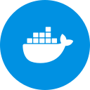

# IoBroker Docker Manager Adapter
 [](https://weblate.iobroker.net/engage/adapters/?utm_source=widget)

**Dieser Adapter verwendet Sentry-Bibliotheken, um Ausnahmen und Codefehler automatisch an die Entwickler zu melden.** Weitere Details und Informationen zum Deaktivieren der Fehlerberichterstattung finden Sie in Abschnitt [Sentry-Plugin-Dokumentation](https://github.com/ioBroker/plugin-sentry#plugin-sentry)! Die Sentry-Berichterstattung wird ab js-controller 3.0 verwendet.

## Einführung
Dieser Adapter ist eine grafische Benutzeroberfläche zur Verwaltung von Docker-Containern.
Er ermöglicht das einfache Erstellen, Starten, Stoppen und Löschen von Docker-Containern direkt über die ioBroker-Administrationsoberfläche.

Der Adapter bietet eine benutzerfreundliche Möglichkeit, Ihre Docker-Umgebung zu verwalten, ohne dass Sie Befehlszeilentools verwenden müssen.

### Erläuterung des Docker-Images und des Containers
Docker ist eine Open-Source-Plattform zur Automatisierung der Bereitstellung, Skalierung und Verwaltung von Anwendungen in Containern.
Container sind schlanke, isolierte Umgebungen, die alle notwendigen Komponenten wie Code, Laufzeitumgebung, Bibliotheken und Konfigurationen zum Ausführen einer Anwendung enthalten.
Mit Docker können Entwickler Anwendungen konsistent und portabel bereitstellen, unabhängig von der zugrunde liegenden Infrastruktur.
Dies erleichtert die Zusammenarbeit im Team, vereinfacht die Ausführung von Anwendungen auf verschiedenen Systemen und verbessert die Skalierbarkeit.

Ein Docker-Image ist ein schlankes, eigenständiges und ausführbares Softwarepaket, das alles enthält, was zum Ausführen einer Software benötigt wird, einschließlich Code, Laufzeitumgebung, Bibliotheken, Umgebungsvariablen und Konfigurationsdateien.
Man kann es sich als Momentaufnahme einer Anwendung und ihrer Abhängigkeiten zu einem bestimmten Zeitpunkt vorstellen.
In der ioBroker-Notation entspricht es einem Adapter.

Ein Docker-Container hingegen ist eine Laufzeitinstanz eines Docker-Images. Er stellt eine schlanke, isolierte Umgebung dar, die die im Docker-Image definierte Anwendung ausführt.
Beim Ausführen eines Docker-Images wird ein Container erstellt, der die Anwendung und ihre Abhängigkeiten kapselt und so einen konsistenten Betrieb in verschiedenen Umgebungen ermöglicht.
In der ioBroker-Notation entspricht er einer Adapterinstanz.

## Voraussetzungen
- Sie benötigen Docker, das auf Ihrem System installiert und ausgeführt wird.
Der Benutzer, der den ioBroker-Prozess ausführt, benötigt Zugriff auf den Docker-Daemon. Dies geschieht üblicherweise durch Hinzufügen des Benutzers zur Gruppe `docker`. Alternativ kann man `iob fix` aufrufen, um die Berechtigungen festzulegen.

## Wie installiert man Docker?
- Installationsanweisungen finden Sie in der offiziellen Docker-Dokumentation: https://docs.docker.com/get-docker/
Nach der Installation von Docker stellen Sie sicher, dass der Docker-Dienst ausgeführt wird. Sie können den Status des Docker-Dienstes mit folgendem Befehl überprüfen:
- Unter Linux: `systemctl status docker`
- Unter Windows und macOS sollte Docker Desktop ausgeführt werden.

## Verwendung der Docker-API
Der Adapter kann die Docker-API nutzen, um mit dem Docker-Daemon auf anderen Hosts zu kommunizieren. Um diese Funktion zu aktivieren, muss der Docker-Daemon so konfiguriert werden, dass er auf einem TCP-Socket lauscht.

### Docker-API unter Linux aktivieren
1. Öffnen Sie die Docker-Dienstkonfigurationsdatei. Der Speicherort dieser Datei kann je nach Ihrer Linux-Distribution variieren. Übliche Speicherorte sind:
- `/lib/systemd/system/docker.service`
- `/etc/docker/daemon.json`
- `/etc/systemd/system/docker.service`
2. Falls die Datei `/etc/docker/daemon.json` heißt, fügen Sie den Eintrag `hosts` hinzu oder ändern Sie ihn, um den TCP-Socket einzuschließen. Zum Beispiel:

```json
{
    "hosts": ["unix:///var/run/docker.sock", "tcp://0.0.0.0:2375"]
}
```

Handelt es sich bei der Datei um eine systemd-Dienstdatei (z. B. `/lib/systemd/system/docker.service`), ändern Sie die Zeile `ExecStart` so, dass sie die Option `-H tcp://0.0.0.0:2375` enthält. Zum Beispiel:

```
ExecStart=/usr/bin/dockerd -H fd:// -H unix:///var/run/docker.sock -H tcp://0.0.0.0:2375 --containerd=/run/containerd/containerd.sock
```

3. Speichern Sie die Änderungen und verlassen Sie den Editor.
4. Starten Sie den Docker-Dienst neu, um die Änderungen anzuwenden:

```bash
sudo systemctl daemon-reload
sudo systemctl restart docker
```

5. Überprüfen Sie, ob der Docker-Daemon auf dem TCP-Socket lauscht, indem Sie folgenden Befehl ausführen:

```bash
netstat -tuln | grep 2375
```

## Todo
- BackItUp sollte `/opt/iobroker/docker-volumes` unterstützen
- Überlegen Sie, ob der js-Controller Docker-Container entfernt, die nicht mehr verwendet werden, aber das Label haben.
- Docker-Installer: `iob docker <entfernen>`
- Fortschrittsanzeige: Bild hinzufügen/abrufen, Container erstellen

<!-- Platzhalter für die nächste Version (am Anfang der Zeile):

### **IN BEARBEITUNG** -->

## Changelog
### 0.1.3 (2025-10-15)

- (@GermanBluefox) Updated packages

### 0.1.2 (2025-10-09)

- (@GermanBluefox) Added volume browsing
- (@GermanBluefox) Added text file read from volume

### 0.1.1 (2025-09-26)

- (@GermanBluefox) Added network tab

### 0.0.3 (2025-09-17)

- (@GermanBluefox) Initial commit

## License

The MIT License (MIT)

Copyright (c) 2025 bluefox <dogafox@gmail.com>