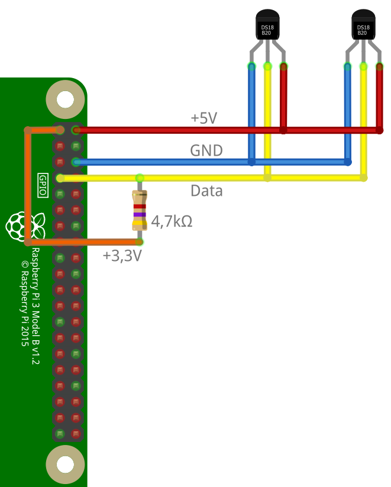

# ioBroker.ds18b20

Der Adapter `ds18b20` ermöglicht die direkte Einbindung von 1-Wire Temperatursensoren des Typs DS18B20 oder ähnlich in ioBroker.

Es wird eine entsprechende Hardware mit Unterstützung für den 1-Wire Bus benötigt (z.B. Raspberry Pi) und der 1-Wire Bus muss auf dem System funktionsfähig eingerichtet sein (Sensoren unter `/sys/bus/w1/devices/` aufgelistet).

Ein Beispiel für die Anbindung von DS18B20 Sensoren an einen Raspberry Pi ist weiter unten zu finden.

## Features

* Auslesen des aktuellen Temperaturwertes
* Automatische Erkennung der angeschlossenen Sensoren
* Fehlererkennung beim Abfragen der Sensoren (Checksumme, Kommunikationsfehler, Gerät getrennt)
* Abfrageintervall pro Sensor anpassbar
* Einzelne Sensoren können deaktiviert werden
* Rundung und Umrechnung des gemessenen Wertes pro Sensor anpassbar
* Unterstützung von Sensoren an entfernten Systemen über den _Remote Client_

## Installation

Der Adapter ist über das stable- und latest-Repository verfügbar.

Über die GitHub URL `https://github.com/crycode-de/ioBroker.ds18b20.git` kann zudem die jeweils letzte Entwicklungsversion installiert werden.  
Dies ist aber in den seltensten Fällen zu empfehlen!

## Konfiguration

In der Adapterkonfiguration kann der **Standardabfrageintervall** für alle Sensoren in Millisekunden festgelegt werden. Das Minimum ist 500.

Zudem kann der **Pfad der 1-Wire Geräte** bei Bedarf angepasst werden.  
Standard ist hier `/sys/bus/w1/devices`, wodurch Sensoren allen vorhandenen Bus-Mastern gefunden werden.  
Alternativ kann auch der direkte Pfad zu einem Bus-Master, z.B. `/sys/bus/w1/devices/w1_bus_master1`, angegeben werden, wodurch nur Sensoren dieses Bus-Masters gefunden werden.


In einer Tabelle können die einzelnen Sensoren händisch oder über **Suche nach Sensoren** hinzugefügt werden.


Die **Adresse** ist dabei die 1-Wire Adresse/ID des Sensors und bestimmt zugleich das die Objekt-ID.  
Ein Sensor mit der Adresse `28-0000077ba131` bekommt beispielsweise die Objekt-ID `ds18b20.0.sensors.28-0000077ba131`.

Die **Remote-System-ID** ist die bei direkt angeschlossenen Sensoren nicht gesetzt (leer) und bei Sensoren an einem Remote-System die ID des jeweiligen Systems.

Der **Name** ist zur Identifizierung des Sensors frei wählbar.

Es kann für jeden Sensor ein extra **Abfrageintervall** in Millisekunden festgelegt werden.  
Wird das Feld leer gelassen, so gilt der Standardabfrageintervall. Das Minimum ist 500.

Die **Einheit** bestimmt die im ioBroker-Objekt hinterlegte Einheit zu dem Wert.
Standardmäßig ist dies `°C`.

Über **Faktor** und **Offset** ist es möglich den vom Sensor gelesenen Wert nach der Formel `Wert = (Wert * Faktor) + Offset` anzupassen.

Die **Dezimalstellen** geben an, auf wie viele Stellen nach dem Komma der Wert gerundet wird.
Die Rundung erfolgt nach der Berechnung mit Faktor und Offset.

**Null bei Fehler** legt fest, wie mit Fehlern beim Lesen des Sensors verfahren werden soll.  
Ist die Option gesetzt, dann werden `null`-Werte bei Fehlern in den State des Sensors geschrieben.  
Ohne diese Option wird bei Fehlern der State nicht aktualisiert.

Über den **Aktiviert**-Haken können einzelne Sensoren separat deaktiviert werden.

Für ein Einbindung von Sensoren an einem entfernten System kann weiterhin der hierfür integrierte Server aktiviert und konfiguriert werden.


Der Verschlüsselungsschlüssel muss dabei allen Remote-System mitgeteilt werden. Über diesen wird die Kommunikation zwischen dem Server und den Clients verschlüsselt.

### Umrechnung von `°C` in `°F`

Damit die gemessenen Temperaturen vom Adapter in `°F` zurückgegeben werden, müssen als Faktor `1.8` und als Offset `32` verwendet werden.

## Aktionen

Über ein Schreiben in den State `ds18b20.0.actions.readNow` ist es möglich das sofortige Lesen von allen oder einem bestimmten Sensor anzustoßen.

Um ein sofortiges Lesen aller Sensors anzustoßen muss in den State das Schlüsselwort `all` geschrieben werden.

Soll nur ein bestimmter Sensor gelesen werden, so muss die Adresse oder die ioBroker Objekt-ID des Sensors in den State geschrieben werden.

## Verwendung in Skripten

Es ist möglich dem Adapter Befehle zum lesen der Sensordaten oder zum Suchen nach Sensoren zu senden.

### `read` / `readNow`

Über den `read` oder `readNow` Befehl können alle Sensoren, oder ein einzelner Sensor gelesen werden.

Wenn alle Sensoren angefragt werden, dann enthält die Antwort ein Objekt mit den Sensoradressen zu den aktuellen Werten.

Um einen einzelnen Sensor zu lesen, muss als Nachrichtenteil muss die Adresse oder ioBroker Objekt-ID des zu lesenden Sensors angegeben werden.
In diesem Fall wird dann der Wert direkt zurückgegeben.

```js
sendTo('ds18b20.0', 'read', null, (ret) => {
    log('ret: ' + JSON.stringify(ret));
    // ret: {"err":null,"value":{"28-0000077b9fea":21.94}}

    if (ret.err) {
        log(ret.err, 'warn');
    }
});

sendTo('ds18b20.0', 'read', '28-0000077ba131', (ret) => {
    log('ret: ' + JSON.stringify(ret));
    // ret: {"err":null,"value":21.94}

    if (ret.err) {
        log(ret.err, 'warn');
    }
});
```

### `search`

Der `search` Befehl führt eine Suche nach aktuell angeschlossenen 1-Wire Sensoren durch und gibt die Adressen der gefundenen Sensoren über eine Callback-Funktion zurück.

```js
sendTo('ds18b20.0', 'search', {}, (ret) => {
    log('ret: ' + JSON.stringify(ret));
    if (ret.err) {
        log(ret.err, 'warn');
    } else {
        for (let s of ret.sensors) {
            if (s.remoteSystemId) {
                log('Sensor: ' + s.address + '@' + s.remoteSystemId);
            } else {
                log('Sensor: ' + s.address);
            }
        }
    }
});
```

### `getRemoteSystems`

Über `getRemoteSystems` können die System-IDs der aktuell verbundenen entfernten Systeme abgefragt werden.

```js
sendTo('ds18b20.0', 'getRemoteSystems', {}, (ret) => {
    log('ret: ' + JSON.stringify(ret));
    log('Verbundene Systeme: ' + ret.join(', '));
});
```

## Adapter-Informationen

Über den `ds18b20.*.info.connection` State stellt jede Adapterinstanz eine Information bereit, ob alle konfigurierten Sensoren Daten liefern.  
Wenn das jeweils letzte Lesen von allen Sensoren erfolgreich war, ist dieser State `true`.
Sobald einer der Sensoren einen Fehler aufweist, ist dieser State `false`.  
Dieser State wird ebenso `false` sein, wenn Remote-Sensoren aktiviert sind und es ein Problem mit dem Remote-Server gibt.

Wenn Remote-Systeme aktiviert ist, dann ist im State `ds18b20.*.info.remotesConnected` eine Liste der aktuell verbundenen Remote-Systeme zu finden.

## DS18B20 am Raspberry Pi

Der Anschluss von DS18B20 Temperatursensoren an einen Raspberry Pi erfolgt wie in der folgenden Grafik dargestellt.
Zu beachten ist dabei, dass der Pullup-Widerstand an die +3,3V angeschlossen werden muss und nicht an +5V, da dies den GPIO beschädigen würde.
In diesem Beispiel wird der GPIO.04 (BCM) verwendet.



Zur Aktivierung des 1-Wire Bus auf dem Raspberry Pi muss in der Datei `/boot/config.txt` die folgende Zeile hinzugefügt und anschließend der Raspberry Pi neu gestartet werden.

```text
dtoverlay=w1-gpio,gpiopin=4
```

Wenn alles funktioniert sind die angeschlossenen Sensoren dann unter `/sys/bus/w1/devices/` sichtbar.

```sh
$ ls -l /sys/bus/w1/devices/
insgesamt 0
lrwxrwxrwx 1 root root 0 Nov  2 11:18 28-0000077b4592 -> ../../../devices/w1_bus_master1/28-0000077b4592
lrwxrwxrwx 1 root root 0 Nov  2 11:18 28-0000077b9fea -> ../../../devices/w1_bus_master1/28-0000077b9fea
lrwxrwxrwx 1 root root 0 Nov  2 10:49 w1_bus_master1 -> ../../../devices/w1_bus_master1
```

### Nutzung vieler Sensoren am Raspberry Pi

Die Anzahl an Sensoren, die an einem Raspberry Pi an einem Strang fehlerfrei betrieben werden können, ist begrenzt und abhängig von einigen technischen Gegebenheiten (z.B. Leitungslänge).  
Meistens treten ab etwa 10 Sensoren die ersten, teils zufälligen, Ausfälle auf.

Um dennnoch mehr Sensoren betreiben zu können, ist es möglich diese auf mehrere Stränge (also mehrere GPIOs) aufzuteilen.
Dabei benötigt dann jeder Strang einen eigenen Pullup-Widerstand.

Zur Aktivierung werden in der Datei `/boot/config.txt` dann einfach mehrere Einträge mit der entsprechenden GPIO-Nummer hinzugefügt:

```text
dtoverlay=w1-gpio,gpiopin=4
dtoverlay=w1-gpio,gpiopin=17
```

Jeder Eintrag erzeugt dann einen eigenen `w1_bus_masterX` im System.

### Kernel-Bug bei negativen Temperaturen

Im Kernel 5.10.y des Raspberry Pi gab es ab Mitte November 2020 einen Bug, wodurch negative Temperaturen als beispielsweise 4092 °C gelesen wurden. (siehe [GitHub Issue](https://github.com/raspberrypi/linux/issues/4124))  
Dieser Bug wurde im Kernel 5.10.14 am 08.02.2021 behoben. (siehe [GitHub Commit](https://github.com/Hexxeh/rpi-firmware/commit/115e3a5f77488d9ee30a33bcb5ac31eb587f60a8))  
Ein `rpi-update` sollte somit das Problem beheben.

Bei Adapterversionen bis einschließlich v1.2.2 werden diese offensichtlich falschen Werte in den ioBroker State übernommen.  
Ab v1.2.3 prüft der Adapter zusätzlich, ob der gelesene Wert plausibel ist (zwischen -80 und +150 °C) und verwirft unplausible Werte.

## Einbindung von Sensoren an einem entfernten System

Ab Version 1.4.0 von _ioBroker.ds18b20_ können Sensoren an entfernten Systemen direkt über den eigenen _ioBroker.ds18b20 Remote Client_ eingebunden werden. Hierfür ist auf dem entfernten System lediglich Node.js erforderlich.

In der Adapterkonfiguration muss der Haken für **Remote-Sensoren aktivieren** gesetzt sein. Der Adapter startet dann auf dem angegebenen Port einen TCP Server und nimmt Verbindungen der Clients entgegen.

Die Verbindung zwischen Server und Client ist über einen `aes-256-cbc` Algorithmus verschlüsselt.  
Hierfür muss bei den Clients der in der Adapterkonfiguration angezeigte Verschlüsselungsschlüssel gesetzt werden.

Der _ioBroker.ds18b20 Remote Client_ baut dann eine TCP Verbindung zum Adapter auf und wird in der Adapterkonfiguration unter **Verbundene entfernte Systeme** angezeigt.

### Installation des ioBroker.ds18b20 Remote Clients

Ein Setup für den _ioBroker.ds18b20 Remote Client_ wird über GitHub bereitgestellt.

Anweisungen zur Einrichtung sind in der Adapterkonfiguration zu finden.

## Changelog

<!--
    Placeholder for the next version (at the beginning of the line):
    ### **WORK IN PROGRESS**
-->
### 3.1.1 (2025-10-25)

* (crycode-de) Updated Sentry DSN

### 3.1.0 (2025-10-21)

* (crycode-de) Node.js >= 20, js-controller >= 6.0.11, Admin >= 7.6.17 required
* (crycode-de) Updated dependencies

### 3.0.1 (2024-11-16)

* (crycode-de) Added missing sizes to jsonConfig

### 3.0.0 (2024-10-16)

* (crycode-de) Node >= 18, js-controller >= 5.0.19 required
* (crycode-de) Fixed possible issue on sensor search
* (crycode-de) Small style fixes for jsonConfig
* (crycode-de) Updated dependencies
* (crycode-de) Refactored some code parts

### 2.0.5 (2023-10-29)

* (crycode-de) Fixed cosmetic issue in config UI

## License

Copyright (c) 2019-2025 Peter Müller <peter@crycode.de>

### MIT License

Permission is hereby granted, free of charge, to any person obtaining
a copy of this software and associated documentation files (the
"Software"), to deal in the Software without restriction, including
without limitation the rights to use, copy, modify, merge, publish,
distribute, sublicense, and/or sell copies of the Software, and to
permit persons to whom the Software is furnished to do so, subject to
the following conditions:

The above copyright notice and this permission notice shall be
included in all copies or substantial portions of the Software.

THE SOFTWARE IS PROVIDED "AS IS", WITHOUT WARRANTY OF ANY KIND,
EXPRESS OR IMPLIED, INCLUDING BUT NOT LIMITED TO THE WARRANTIES OF
MERCHANTABILITY, FITNESS FOR A PARTICULAR PURPOSE AND
NONINFRINGEMENT. IN NO EVENT SHALL THE AUTHORS OR COPYRIGHT HOLDERS BE
LIABLE FOR ANY CLAIM, DAMAGES OR OTHER LIABILITY, WHETHER IN AN ACTION
OF CONTRACT, TORT OR OTHERWISE, ARISING FROM, OUT OF OR IN CONNECTION
WITH THE SOFTWARE OR THE USE OR OTHER DEALINGS IN THE SOFTWARE.