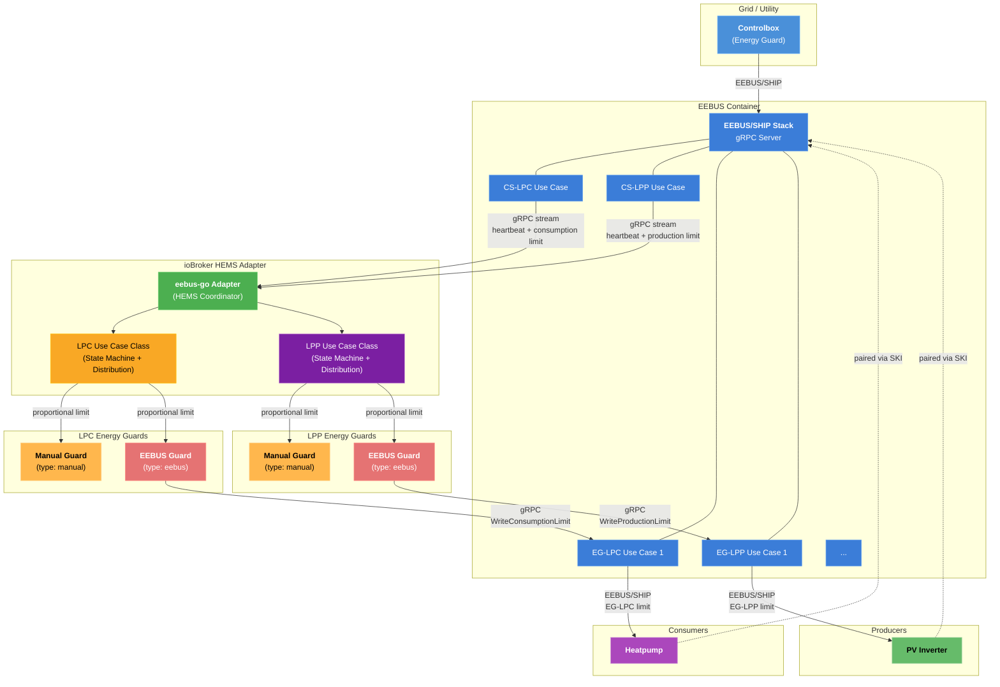

# Architekturszenario: Steuereinheit + EEBUS-Energiewächter + manuelle Energiewächter (LPC & LPP)



## Komponentenbeschreibung

| Komponente                   | Rolle                                                                                                                                                                                                                 |
| ---------------------------- | --------------------------------------------------------------------------------------------------------------------------------------------------------------------------------------------------------------------- |
| **Steuerkasten**             | Gerät des Netzbetreibers, das Verbrauchs- und/oder Produktionsgrenzen über das EEBUS/SHIP-Protokoll sendet.                                                                                                           |
| **EEBUS-Container**          | Docker-/Podman-Container, der den eebus-go SHIP-Stack ausführt. Übernimmt die gesamte EEBUS/SHIP-Netzwerkkommunikation, die mDNS-Erkennung und das SPINE-Datenmodell. Stellt dem Adapter eine gRPC-API zur Verfügung. |
| **CS-LPC-Anwendungsfall**    | Steuerbares System – Begrenzung des Stromverbrauchs (§14a EnWG). Empfängt Verbrauchsgrenzwerte von der Steuereinheit.                                                                                                 |
| **CS-LPP-Anwendungsfall**    | Steuerbares System – Begrenzung der Stromerzeugung (§9 EEG). Empfängt Produktionsgrenzen von der Steuereinheit.                                                                                                       |
| **EG-LPC-Anwendungsfall**    | Energy Guard – Begrenzung des Stromverbrauchs. Sendet Verbrauchsgrenzen an gekoppelte Endgeräte.                                                                                                                      |
| **EG-LPP-Anwendungsfall**    | Energy Guard – Begrenzung der Stromerzeugung. Sendet Produktionsgrenzen an gekoppelte Produktionsgeräte.                                                                                                              |
| **eebus-go Adapter**         | ioBroker-Adapter (HEMS-Koordinator), der über gRPC mit dem Container kommuniziert und an die LPC- und LPP-Anwendungsfallklassen delegiert.                                                                            |
| **LPC-Anwendungsfallklasse** | Implementiert CS-LPC-Zustände (init, unlimitedControlled, limited, failsafe, unlimitedAutonomous) und verteilt Verbrauchsgrenzen an LPC-Energiewächter.                                                               |
| **LPP-Anwendungsfallklasse** | Implementiert CS-LPP-Zustände (identische Zustandsmaschine) und verteilt Produktionsgrenzen an LPP-Energiewächter.                                                                                                    |
| **EEBUS Energy Guard**       | Leitet seinen Limitanteil über den EG-LPC- oder EG-LPP-gRPC-Endpunkt des Containers an ein gekoppeltes Gerät weiter. Akzeptiert außerdem manuelle Limits vom Operator (Gültigkeitsdauer: 60 Minuten).                 |
| **Manueller Energieschutz**  | Keine EEBUS-Verbindung. Das Limit wird manuell von einem Operator über ioBroker-Statusobjekte festgelegt.                                                                                                             |
| **Wärmepumpe**               | Das Endgerät ist über SKI mit dem Container gekoppelt. Es empfängt EG-LPC-Grenzwerte über EEBUS/SHIP.                                                                                                                 |
| **PV-Wechselrichter**        | Das Produktionsgerät ist über SKI mit dem Container gekoppelt. Es empfängt EG-LPP-Grenzwerte über EEBUS/SHIP.                                                                                                         |

## Datenfluss

### LPC (Verbrauchsbeschränkung)

1. Die **Controlbox** verbindet sich über das EEBUS/SHIP-Protokoll (mDNS-Erkennung, SKI-Vertrauen) mit dem **EEBUS-Container** .
2. Der **CS-LPC-Anwendungsfall** des Containers streamt Heartbeat- und Verbrauchslimit-Ereignisse über gRPC an den **Adapter** .
3. Die **LPC-Anwendungsfallklasse** wechselt ihren Zustandsautomaten basierend auf Heartbeat- und Limit-Nachrichten.
4. Wenn ein Verbrauchslimit aktiv ist, teilt die LPC-Klasse diesen prozentual auf die LPC-Energieschutzmodule auf.
5. Die **EEBUS Energy Guard-** Anrufe`WriteConsumptionLimit` auf dem **EG-LPC** gRPC-Endpunkt des Containers.
6. Der Container leitet den EG-LPC-Grenzwert über EEBUS/SHIP an die **Wärmepumpe** weiter.
7. Der **manuelle Energieschutz** setzt sein Limit auf Basis der Eingabe des Bedieners fest (ohne Beteiligung von EEBUS).
8. Der Bediener kann außerdem einen **manuellen Grenzwert** für den **EEBUS Energy Guard** festlegen (60 Minuten Dauer, Übertragung an die Wärmepumpe über den Container). Dieser wird zurückgesetzt, sobald der Grenzwert der Steuereinheit aktiv wird.

### LPP (Produktionsbeschränkung)

1. Die **Controlbox** sendet Produktionslimitvorgaben über EEBUS/SHIP an den **CS-LPP-Anwendungsfall** des Containers.
2. Der **CS-LPP-Anwendungsfall** des Containers streamt Heartbeat- und Produktionslimit-Ereignisse über gRPC an den **Adapter** .
3. Die **LPP-Anwendungsfallklasse** wechselt ihren Zustandsautomaten basierend auf Heartbeat- und Limit-Nachrichten.
4. Wenn eine Produktionsbegrenzung aktiv ist, teilt die LPP-Klasse diese prozentual auf die LPP-Energieschutzmodule auf.
5. Die **EEBUS Energy Guard-** Anrufe`WriteProductionLimit` auf dem **EG-LPP** gRPC-Endpunkt des Containers.
6. Der Container leitet den EG-LPP-Grenzwert über EEBUS/SHIP an den **PV-Wechselrichter** weiter.
7. Der **manuelle Energieschutz** wendet sein Produktionslimit basierend auf den Eingaben des Bedieners an.
8. Der Bediener kann außerdem ein **manuelles Produktionslimit** für den **EEBUS Energy Guard** festlegen (Dauer: 60 Minuten). Dieses wird zurückgesetzt, sobald das Produktionslimit der Steuereinheit aktiv wird.

## ioBroker-Objektbaum

```
eebus-go.0/
├── info/
│   ├── connection         (boolean)
│   ├── discoveredDevices  (JSON string)
│   └── ski                (string)
├── LPC/
│   ├── state              (string)
│   ├── limit              (number, W)
│   ├── limitDuration      (number, min)
│   ├── limitMinutesToday  (number, min)
│   └── EnergyGuards/
│       └── Guard_{name}/
│           ├── percentage, currentLimit, lastHeartbeat, failsafeLimit
│           ├── eebusConnected, manualLimit, confirmedLimit  (EEBUS only)
│           └── heartbeat, connected                         (manual only)
├── LPP/
│   ├── state              (string)
│   ├── limit              (number, W)
│   ├── limitDuration      (number, min)
│   ├── limitMinutesToday  (number, min)
│   └── EnergyGuards/
│       └── Guard_{name}/
│           ├── percentage, currentLimit, lastHeartbeat, failsafeLimit
│           ├── eebusConnected, manualLimit, confirmedLimit  (EEBUS only)
│           └── heartbeat, connected                         (manual only)
```