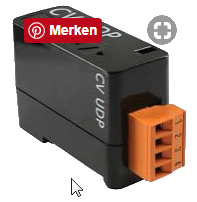

# IoBroker.ekey
 

Dieser Adapter für ioBroker verbindet sich mit einem ekey Connector UDP.

Implementiert wie beschrieben in:

- https://descargas.futurasmus-knxgroup.org/doc/en/ekey/13002/operating_instructions_ekey_converter_udp_rs485_id51.pdf
- NET-Protokoll: https://www.ekey.net/wp-content/dokumente/Betriebsanleitung_ekey_net_4.4_de_web_ID181_3006.pdf (Seite 189)

## Serielle Schnittstelle
Experimentelle Funktion zur Verbindung mit ekey über die serielle Schnittstelle. Dies ist noch nicht getestet.

Sie können den seriellen Anschluss aktivieren, um Daten über einen USB RS485- oder RS 232-Konverter zu empfangen.
Tatsächlich wird nur Finger-Hash unterstützt. Um weitere Daten vom Gerät zu entschlüsseln, öffnen Sie bitte das Problem mit den Daten, die Sie erhalten haben.

## Changelog
<!--
	### **WORK IN PROGRESS**
-->
### 1.2.3 (2022-11-22)
* (bluefox) Added `net` protocol support
* (bluefox) Added serial port support

### 1.1.0
* (bluefox) Added compact mode
* (bluefox) Own port is now configurable

### 1.0.0
* (bluefox) Configuration dialog under firefox was corrected

### 0.2.1
* (bluefox) tests were added

### 0.1.0
* (bluefox) initial release

## License

The MIT License (MIT)

Copyright (c) 2018-2022 ioBroker <dogafox@gmail.com>

Permission is hereby granted, free of charge, to any person obtaining a copy
of this software and associated documentation files (the "Software"), to deal
in the Software without restriction, including without limitation the rights
to use, copy, modify, merge, publish, distribute, sublicense, and/or sell
copies of the Software, and to permit persons to whom the Software is
furnished to do so, subject to the following conditions:

The above copyright notice and this permission notice shall be included in all
copies or substantial portions of the Software.

THE SOFTWARE IS PROVIDED "AS IS", WITHOUT WARRANTY OF ANY KIND, EXPRESS OR
IMPLIED, INCLUDING BUT NOT LIMITED TO THE WARRANTIES OF MERCHANTABILITY,
FITNESS FOR A PARTICULAR PURPOSE AND NONINFRINGEMENT. IN NO EVENT SHALL THE
AUTHORS OR COPYRIGHT HOLDERS BE LIABLE FOR ANY CLAIM, DAMAGES OR OTHER
LIABILITY, WHETHER IN AN ACTION OF CONTRACT, TORT OR OTHERWISE, ARISING FROM,
OUT OF OR IN CONNECTION WITH THE SOFTWARE OR THE USE OR OTHER DEALINGS IN THE
SOFTWARE.