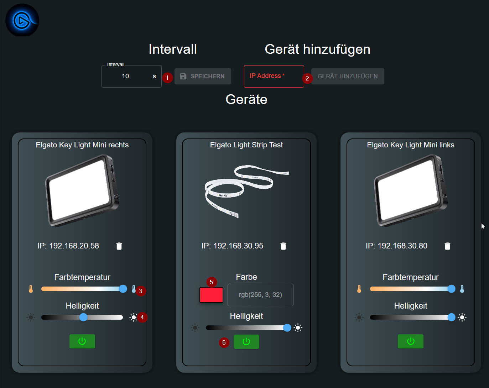
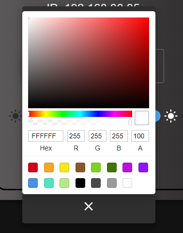
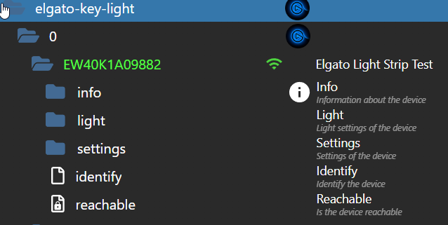
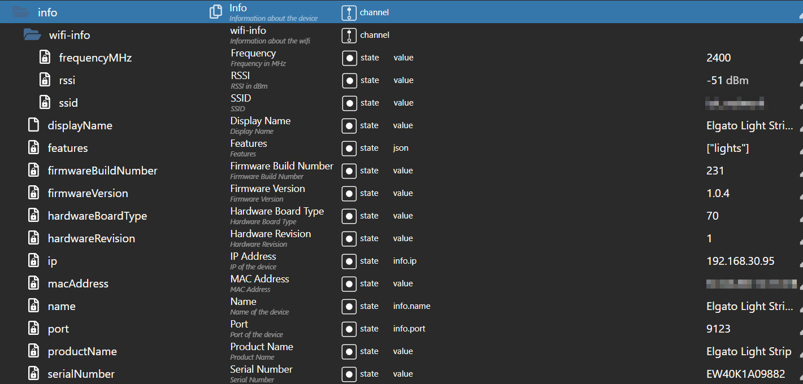
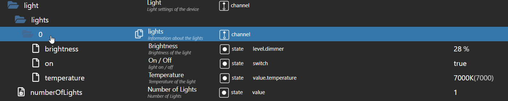
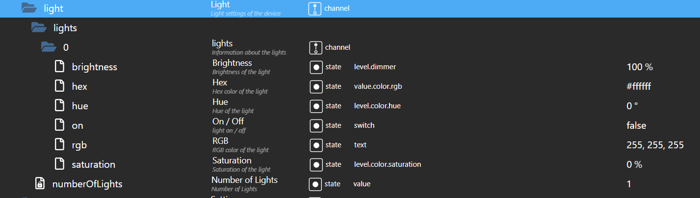
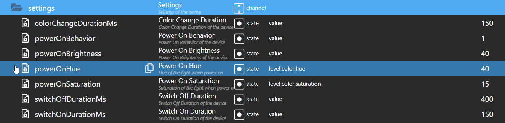

# IoBroker.elgato-key-light
**Tests:** 

## Elgato-key-light-Adapter für ioBroker
### HAFTUNGSAUSSCHLUSS
Alle Produkt- und Firmennamen oder Logos sind Trademarks™ oder eingetragene® Trademarks ihrer jeweiligen Eigentümer. Ihre Verwendung impliziert keine Zugehörigkeit oder Billigung durch sie oder verbundene Unternehmen! Dieses persönliche Projekt wird zu Freizeitzwecken betrieben und hat keine Geschäftsziele. **Elgato** ist eine Marke der **Corsair GmbH**.

### Wachposten
**Dieser Adapter verwendet Sentry-Bibliotheken, um den Entwicklern automatisch Ausnahmen und Codefehler zu melden.**\ Weitere Einzelheiten und Informationen zum Deaktivieren der Fehlerberichterstattung finden Sie unter.
[Sentry Plugin Dokumentation](https://github.com/ioBroker/plugin-sentry#plugin-sentry)! Sentry-Berichte werden ab js-controller 3.0 verwendet.

### Credits
Dieser Adapter wäre ohne die großartige Arbeit von @xXBJXx (https://github.com/xXBJXx) nicht möglich gewesen, der diesen Adapter erstellt hat und ihn hoffentlich auch in Zukunft pflegen wird.

### Beschreibung
Mit diesem Adapter können Sie [Elgato Tastenlichter](https://www.elgato.com/de/key-light) über ioBroker steuern.\ Der Adapter unterstützt folgende Funktionen:

* Ein-/Ausschalten.
* Helligkeit ⇨ (auf allen Hauptlichtern verfügbar).
* Farbtemperatur ⇨ (nur verfügbar mit [Elgato Key Light](https://www.elgato.com/de/key-light), [Elgato Key Light Air](https://www.elgato.com/de/key-light-air),

[Elgato Ringlicht](https://www.elgato.com/de/ring-light) und [Elgato Key Light mini](https://www.elgato.com/de/key-light-mini) verfügbar)

* Farbe ⇨ (nur verfügbar mit [Elgato Light Strip](https://www.elgato.com/de/light-strip))

### Adapter-Benutzeroberfläche
Eine klassische Adapter-UI unter Instanzen existiert nicht.\  

Was kann in der Benutzeroberfläche getan werden?

* Nr. 1 stellt das Abfrageintervall für den Adapter ein (Standard: 60 Sekunden).

Nach der Änderung des Intervalls muss der Adapter neu gestartet werden, dies erfolgt über die Schaltfläche Speichern.

* Nr. 2: Fügen Sie dem Adapter ein neues Gerät hinzu.
* Nr. 3: Farbtemperatur für alle Hauptlichter einstellen (2900K bis 7000K)
* Nr. 4 stellt die Helligkeit für alle Key Lights ein (0% bis 100%)
* Nr. 5 stellt die Farbe für die Lichtstreifen ein\

  

* Nr. 6 Licht ein- und ausschalten

**Beim Wechsel von Nr. 3, Nr. 4 und Nr. 5 wird der Wechsel nach 1,5 Sekunden ausgeführt.**

### Warnung
**Bitte greifen Sie nicht zu oft auf die Datenpunkte zu, da die Geräte sonst für einige Sekunden nicht erreichbar sind.**

### Datenpunkte
Die Datenpunkte werden automatisch erstellt, wenn ein neues Gerät gefunden wird.

#### Datenpunkte für alle Key Lights / Light Strips
\ Die Datenpunkte sind unterteilt in:

* **info** ⇨ Informationen zum Gerät\.

  

* **Licht** ⇨ Datenpunkte zur Steuerung des Gerätes, hierbei gibt es zwei unterschiedliche Arten von Datenpunkten:
* zur Steuerung von Helligkeit und Farbtemperatur.

    

* zur Steuerung der Farbe

    

* **Einstellungen** ⇨ Datenpunkte für Infos aus den Einstellungen des Gerätes

  

### Hinweise
* Die Datenpunkte für Farbe sind nur für die Lichtstreifen verfügbar.
* Die Datenpunkte für die Farbtemperatur sind nur für die Key Lights verfügbar.
* Die Datenpunkte für die Helligkeit sind für alle Key Lights und Light Strips verfügbar.
* Die Szenen der Light Strips werden nicht unterstützt. Da diese nicht über die API zugänglich sind.

## Changelog
<!--
    Placeholder for the next version (at the beginning of the line):
    ### **WORK IN PROGRESS**
-->
### 1.1.0 (2024-04-14)
* (mcm1957) Adapter requires node.js 18 and js-controller >= 5 now
* (mcm1957) Dependencies have been updated

### 1.0.1 (2024-01-18)
* (mcm1957) Writing states now requires ack flag to be false.
* (mcm1957) Small adaptions to solve review issues have been applied.

### 1.0.0 (2024-01-18)
* (mcm1957) Adapter requires node.js 18 or newer now
* (mcm1957) Adapter has been moved into iobroker-community-adapters area
* (mcm1957) Dependencies have been updated

### 0.2.0 (2023-02-26)
* (xXBJXx) updated dependencies
* (xXBJXx) Updating the UI to the new functions of the iobroker-react library

### 0.1.0 (2023-02-06)
* (xXBJXx) removed the Bonjour search, because it did not work properly
* (xXBJXx) Adding a delete function for devices
* (xXBJXx) Dependency updates
* (xXBJXx) feature request [#2](https://github.com/xXBJXx/ioBroker.elgato-key-light/issues/2) added

## License
MIT License

Copyright (c) 2024 iobroker-community-adapters <mcm57@gmx.at>
Copyright (c) 2023 xXBJXx <issi.dev.iobroker@gmail.com>

Permission is hereby granted, free of charge, to any person obtaining a copy
of this software and associated documentation files (the "Software"), to deal
in the Software without restriction, including without limitation the rights
to use, copy, modify, merge, publish, distribute, sublicense, and/or sell
copies of the Software, and to permit persons to whom the Software is
furnished to do so, subject to the following conditions:

The above copyright notice and this permission notice shall be included in all
copies or substantial portions of the Software.

THE SOFTWARE IS PROVIDED "AS IS", WITHOUT WARRANTY OF ANY KIND, EXPRESS OR
IMPLIED, INCLUDING BUT NOT LIMITED TO THE WARRANTIES OF MERCHANTABILITY,
FITNESS FOR A PARTICULAR PURPOSE AND NONINFRINGEMENT. IN NO EVENT SHALL THE
AUTHORS OR COPYRIGHT HOLDERS BE LIABLE FOR ANY CLAIM, DAMAGES OR OTHER
LIABILITY, WHETHER IN AN ACTION OF CONTRACT, TORT OR OTHERWISE, ARISING FROM,
OUT OF OR IN CONNECTION WITH THE SOFTWARE OR THE USE OR OTHER DEALINGS IN THE
SOFTWARE.