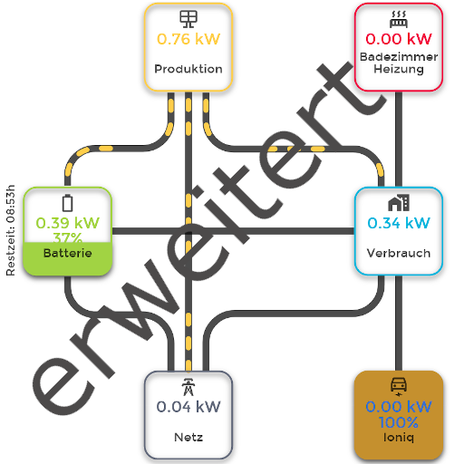

# ioBroker.energiefluss-erweitert

## energiefluss-erweitert Adapter für ioBroker

Dieser Adapter visualisiert dynamisch und animiert die Energieflüsse aller angeschlossenen Geräte in Ihrem Smart Home. Er unterstützt Energiequellen wie Photovoltaikanlagen, Speichersysteme (Batterien), den Haushaltsverbrauch, Netzeinspeisung/Netzeinspeisung, das Laden von Elektrofahrzeugen und andere energieverbrauchende oder -erzeugende Geräte. Jeder Fluss wird durch klare, bidirektionale Linien, animierte Punkte und Echtzeitwerte dargestellt, sodass Sie die Energieverteilung einfach überwachen und analysieren können. Sie können Symbole, Farben und Layout individuell anpassen und sogar Formeln zur Berechnung abgeleiteter Werte verwenden. So erhalten Sie ein flexibles und vollständig interaktives Energiemanagement-Dashboard.

## Dokumentation

- :book: [Forum-Thread](https://forum.iobroker.net/topic/64734/test-adapter-energiefluss-erweitert-v0-0-x-github-latest)
- :gb: [Englische Beschreibung](/#/docs/adapterref/iobroker.energiefluss-erweitert/docs/en/README.md)
- [Deutsche Beschreibung](https://github.com/SKB-CGN/ioBroker.energiefluss-erweitert/blob/main/docs/de/README.md)
- :eyeglasses: [Ansichten-Showcase](https://forum.iobroker.net/topic/74890/energiefluss-erweitert-ansichten/)
- :grey\_question: [Wiki](https://www.kreyenborg.koeln/wissensdatenbank/Kategorie/iobroker-energiefluss-erweitert/)

## Changelog
<!--
	Placeholder for the next version (at the beginning of the line):
	### **WORK IN PROGRESS**
-->
### 0.8.3 (2026-08-07)
- (copilot) Adapter requires node.js >= 22 now
- Added: Animation duration for 'Power-saving'-mode editable. Defaults to 1200ms.
- Added: Rectangels can now be rotated and have 4 more connection points in the corner, which appear when the element is rotated >0°
- Added: Faster and more accurate line-rendering
- FIX: Some small fixes and improvements

### 0.8.2 (2026-03-25)
- FIX: Adapter was appearing on welcome screen overview (should only be used for pro) (#429)
- FIX: Menubar has loading animation, when opening the workspace the first time while tour is displayed
- FIX: When using **Animation dependency** 'Dots' or 'Duration' the animation was to heavy - regulated to smoother blend
- FIX: **Animation dependency** 'Dots' once power is on the line, minimal one dot is displayed. The threshold can be used, to manage the appearance of the first dot.
- FIX: Fading out Context-menu on live view, if touch-move is detected
- Added: Improved 'Power-saving'-mode to not use static times instead of calculating possible animation Frames
- Added: Context-Menu on live view is now disabled by default - to enable it again, change it in settings area

### 0.8.1 (2025-10-21)
- FIX: Dialog for line animation overrides was not opening
- Added: VIS and VIS-2 widget added. Just drag the widget to VIS and set the adapter instance

### 0.8.0 (2025-10-21)
- FIX: Editing a datasource was not accepting the new choosen state (#374)
- FIX: When using **Animation dependency** 'Dots' or 'Duration' the animation could "jump" during recalculation (now the 'jump' is smoothly animated)
- FIX: 'Manual value change' of click actions now better detect the value type of the destination source
- FIX: Line was not hidden when 2 directions *and* display dependency are enabled
- Added: A new property 'Distance between the dot blocks' inside 'animation'-tab is available. This setting can be used, to define the distance between dot-blocks
- Added: Some more error handling for overrides. Now they are checked, if they have the correct format and/or syntax
- Added: 2 new override properties are available: "addClass" and "removeClass" which allow the user, to add or remove own defined CSS classes
- Added: The workspace will be centered itself to the current selected element
- Added: Better support for touch-devices including different modes for moving the workspace and editing elements
- Added: Few language and design corrections, code optimization
- Added: Right Clicking or long press on liveview opens a context menu, to easily switch between instances or display the configuration

### 0.7.8 (2025-06-18)
- Added: Convert a text element to a datasource element
- Added: Now supports Web-Adapter with socket.io adapter configured (#333)

[Older changelogs can be found there](https://github.com/SKB-CGN/ioBroker.energiefluss-erweitert/blob/main/CHANGELOG_OLD.md)

## License
MIT License

Copyright (c) 2025-2026 SKB <info@skb-web.de>

Permission is hereby granted, free of charge, to any person obtaining a copy
of this software and associated documentation files (the "Software"), to deal
in the Software without restriction, including without limitation the rights
to use, copy, modify, merge, publish, distribute, sublicense, and/or sell
copies of the Software, and to permit persons to whom the Software is
furnished to do so, subject to the following conditions:

The above copyright notice and this permission notice shall be included in all
copies or substantial portions of the Software.

THE SOFTWARE IS PROVIDED "AS IS", WITHOUT WARRANTY OF ANY KIND, EXPRESS OR
IMPLIED, INCLUDING BUT NOT LIMITED TO THE WARRANTIES OF MERCHANTABILITY,
FITNESS FOR A PARTICULAR PURPOSE AND NONINFRINGEMENT. IN NO EVENT SHALL THE
AUTHORS OR COPYRIGHT HOLDERS BE LIABLE FOR ANY CLAIM, DAMAGES OR OTHER
LIABILITY, WHETHER IN AN ACTION OF CONTRACT, TORT OR OTHERWISE, ARISING FROM,
OUT OF OR IN CONNECTION WITH THE SOFTWARE OR THE USE OR OTHER DEALINGS IN THE
SOFTWARE.