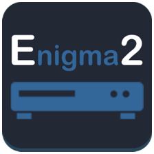
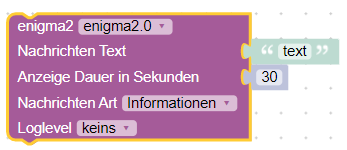
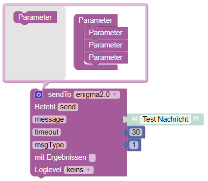

----

# IoBroker enigma2
- Adapter für ioBroker zum Abrufen von Informationen von einem Enigma2-Empfänger und zum Senden von Befehlen
- (Der Adapter läuft nur auf einem Host! Bei einer Client-Installation gibt es derzeit noch Probleme.)

----

### Funktionen
- BOX_IP
- NETZWERK
- CHANNEL_SERVICEREFERENCE
- CHANNEL_SERVICEREFERENCE_NAME
- KANAL
- VERANSTALTUNGSBESCHREIBUNG
- VERANSTALTUNGSDAUER
- EVENTDURATION_MIN
- VERBLEIBENDES EREIGNIS
- EVENTREMAINING_MIN
- EVENT_PROGRESS_PERCENT
- EVENT_TIME_START
- EVENT_TIME_END
- EVENT_TIME_PASSED
- HDD_CAPACITY
- HDD_FREE
- MESSAGE_ANSWER
- MODELL
- STUMMSCHALTET
- PROGRAMM
- PROGRAMM_INFO
- PROGRAMM_AFTER
- PROGRAMM_AFTER_INFO
- STEHEN ZU
- LAUTSTÄRKE
- WEB_IF_VERSION
- isRecording
- Timer_ist_eingestellt
- MOVIE_LIST (nur openwebif)
- TIMER_LIST
- CHANNEL_PICON (Picon-Pfad - nur openwebif)

----

### Hauptsächlich
- enigma2-CONNECTION

----

### Befehl
- Befehl.CHANNEL_DOWN
- Befehl.CHANNEL_UP
- Befehl.AB
- Befehl.UP
- command.EPG
- Befehl.EXIT
- Befehl.LINKS
- Befehl.MENÜ
- command.MUTE_TOGGLE
- Befehl.OK
- Befehl.PAUSE
- command.PLAY
- Befehl.RADIO
- Befehl.REC
- Befehl.FERNBEDIENUNG
- Befehl.RECHTS
- Befehl.SET_VOLUME
- Befehl.STANDBY_TOGGLE
- Befehl.STOP
- command.TV
- Befehl.UP
- Befehl.VOLUME_DOWN
- Befehl.VOLUME_UP
- command.ZAP = sendet eine ungültige Dienstreferenz

----

### Hauptbefehl
- main_command.DEEP_STANDBY = Deepstandby
- main_command.REBOOT = Neustart
- main_command.RESTART_GUI = Enigma2 (GUI) neu starten
- main_command.STANDBY = Standby
- main_command.WAKEUP_FROM_STANDBY = Aufwachen aus dem Standby-Modus

----

### Nachricht
- Message.Text = Text der Nachricht (Eingabe -> Senden)
- Message.Type = Zahl von 0 bis 3 (0= Ja/Nein ; 1= Info ; 2=Nachricht ; 3=Achtung)
- Message.Timeout = Timeout der Nachricht in Sekunden. Kann leer sein oder die Anzahl der Sekunden angeben, nach denen die Nachricht verschwinden soll.

----

### Alexa-Befehl
- Alexa_Command.Mute = Alexa-Befehl
- Alexa_Command.Standby = Alexa-Befehl

----

### SendTo
#### In Blockly
- Nachricht = Text der Nachricht
- msgType = Zahl von 0 bis 3 (0 = Ja/Nein; 1 = Info; 2 = Nachricht; 3 = Achtung)
- timeout = Zeitüberschreitung der Nachricht in Sekunden. Kann leer sein oder die Anzahl der Sekunden angeben, nach denen die Nachricht verschwinden soll.



### Oder 
[Blockly-Import <](admin/Blockly_Import.md)

#### In JavaScript
```js
sendTo('enigma2.0', 'send', {
    message: 'Test Messaget', /* Text of Message */
    timeout: 26,               /* timeout of Message in sec. (Can be empty or the Number of seconds the Message should disappear after.) */
    msgType: 1,                /* Number from 0 to 3 (0= Yes/No ; 1= Info ; 2=Message ; 3=Attention) */
});
```

## Changelog
<!--
    Placeholder for the next version (at the beginning of the line):
    ### **WORK IN PROGRESS**
-->
### 2.3.0 (2026-03-05)
- (mcm1957) Adapter requires node.js >= 20 now.
- (copilot) Adapter requires admin >= 7.7.22 now
- (copilot) Adapter requires js-controller >= 6.0.11 now
- (mcm1957) Dependencies have been updated.

### 2.2.3 (2024-12-22)
* (mcm1957) Adapter has been moigrated to @iobroker/eslint-config. [#266]

### 2.2.2 (2024-12-22)
* (mcm1957) States 'message.*' are writeable again now. [#273]
* (mcm1957) Dependencies have been updated.

### 2.2.1 (2024-11-13)
* (mcm1957) Adapter requires js-controller 5.0.19 and admin 6.17.14 now.
* (mcm1957) Message states have been added. [#229]
* (simatec) Adapter changed to meet Responsive Design rules.
* (mcm1957) Several issues reported by adapter checker have been fixed.
* (mcm1957) Dependencies have been updated.

### 2.1.1 (2024-06-09)
* (klein0r) Updated Blockly definitions

## License
MIT License

Copyright (c) 2023-2026 iobroker-community-adapters <iobroker-community-adapters@gmx.de>

Permission is hereby granted, free of charge, to any person obtaining a copy
of this software and associated documentation files (the "Software"), to deal
in the Software without restriction, including without limitation the rights
to use, copy, modify, merge, publish, distribute, sublicense, and/or sell
copies of the Software, and to permit persons to whom the Software is
furnished to do so, subject to the following conditions:

The above copyright notice and this permission notice shall be included in all
copies or substantial portions of the Software.

THE SOFTWARE IS PROVIDED "AS IS", WITHOUT WARRANTY OF ANY KIND, EXPRESS OR
IMPLIED, INCLUDING BUT NOT LIMITED TO THE WARRANTIES OF MERCHANTABILITY,
FITNESS FOR A PARTICULAR PURPOSE AND NONINFRINGEMENT. IN NO EVENT SHALL THE
AUTHORS OR COPYRIGHT HOLDERS BE LIABLE FOR ANY CLAIM, DAMAGES OR OTHER
LIABILITY, WHETHER IN AN ACTION OF CONTRACT, TORT OR OTHERWISE, ARISING FROM,
OUT OF OR IN CONNECTION WITH THE SOFTWARE OR THE USE OR OTHER DEALINGS IN THE
SOFTWARE.