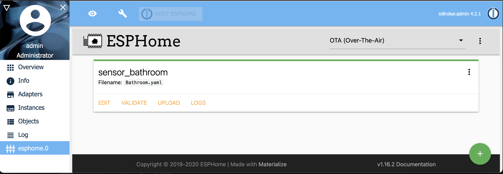
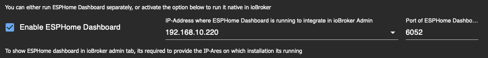
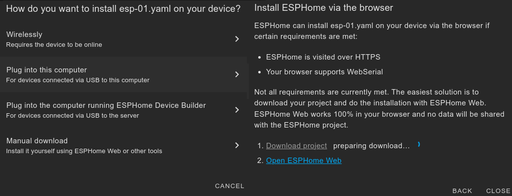
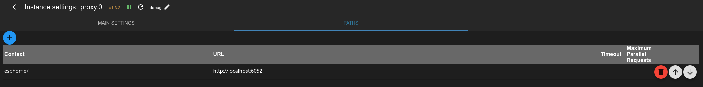
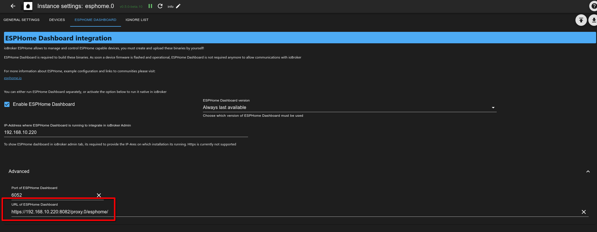
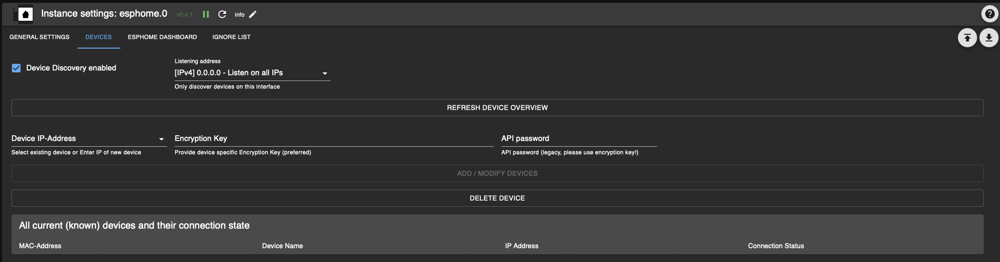
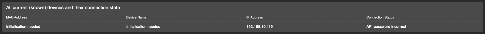
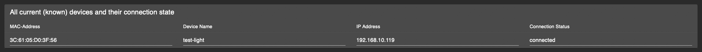
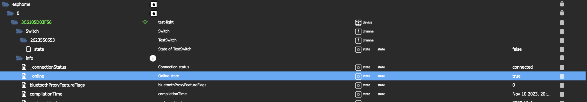

# IoBroker.esphome
[](https://weblate.iobroker.net/engage/adapters/?utm_source=widget)

**Tests:** 

**Dieser Adapter verwendet Sentry-Bibliotheken, um Ausnahmen und Codefehler automatisch an die Entwickler zu melden.** Weitere Details und Informationen zum Deaktivieren der Fehlerberichterstattung finden Sie in Abschnitt [Sentry-Plugin-Dokumentation](https://github.com/ioBroker/plugin-sentry#plugin-sentry)! Die Sentry-Berichterstattung wird ab js-controller 3.0 verwendet.

## ESPHome-Adapter für ioBroker
Steuern Sie Ihren ESP8266/ESP32 mit einfachen, aber leistungsstarken Konfigurationsdateien, die von ESPHome erstellt und verwaltet werden. Die native Integration von ESPHome-Geräten (inklusive Dashboard) über die native API gewährleistet die Synchronisierung aller Daten (Live-Ereignisverarbeitung, kein Daten-Polling!).



**Schnelllinks:**

- 📋 [FAQ - Häufig gestellte Fragen](#frequently-asked-questions-faq)
- ⚙️ [Voraussetzungen & Einrichtung](#prerequisites)
- 🎛️ [Dashboard-Integration](#esphome-dashboard-integration-optional)
- 📱 [Geräteverwaltung](#device-management)
- 🔧 [Konfigurationsbeispiele](#example-config)

Dieser Adapter verwendet [esphome-native-api](https://github.com/twocolors/esphome-native-api#readme) mit allen Credits an @twocolors zur Interaktion mit der [ESPHome API](https://esphome.io/components/api.html?highlight=api)!

## Häufig gestellte Fragen (FAQ)
### Worin besteht der Unterschied zwischen dem ioBroker ESPHome Adapter und dem ESPHome Dashboard?
**ioBroker ESPHome Adapter:**

- Integriert Ihre ESPHome-Geräte in ioBroker zur Steuerung der Hausautomation.
- Kommuniziert direkt mit ESP-Geräten über die native API von ESPHome.
- Erstellt ioBroker-Zustände/Objekte zur Gerätesteuerung und -überwachung
- Verarbeitet Echtzeit-Aktualisierungen des Gerätestatus (kein Polling erforderlich)
- Verwaltet die Gerätekonfiguration innerhalb von ioBroker

**ESPHome-Dashboard:**

- Eine Weboberfläche zum Erstellen, Bearbeiten und Verwalten von ESPHome-Gerätekonfigurationen
- Wird zum Schreiben von YAML-Konfigurationen, zum Kompilieren von Firmware und zum Flashen von Geräten verwendet.
- Kann als optionale Funktion in die Admin-Oberfläche von ioBroker integriert werden.
- Kann entweder in den Adapter integriert oder als externe Installation (Docker, Standalone) ausgeführt werden.

**Zusammenfassend:** Der Adapter steuert Ihre Geräte innerhalb von ioBroker, während das Dashboard Gerätekonfigurationen und Firmware verwaltet.

### Wie konfiguriere ich die IP-Auswahl im Dashboard?
Die Dashboard-IP-Einstellung in der Adapterkonfiguration dient verschiedenen Zwecken:

**Für den integrierten Dashboard-Tab in ioBroker Admin:**

1. Geben Sie die IP-Adresse und den Port ein, unter dem Ihr ESPHome Dashboard läuft.
2. **Integriertes Dashboard:** Verwenden Sie die IP-Adresse Ihres ioBroker-Hosts (z. B. `192.168.1.10:6052`).
**Wichtig:** Verwenden Sie NICHT `127.0.0.1:6052` (oder `localhost:6052`), wenn Sie von anderen Geräten auf ioBroker zugreifen – der iFrame versucht, 127.0.0.1 vom Browser des Clients aus zu erreichen, nicht den ioBroker-Server.
- Verwenden Sie `127.0.0.1:6052` nur dann, wenn Sie ausschließlich von demselben Rechner aus auf die ioBroker-Administration zugreifen, auf dem ioBroker ausgeführt wird.
3. **Externes Dashboard:** Verwenden Sie die IP:Port-Adresse Ihrer externen ESPHome-Installation (z. B. `192.168.1.100:6052`).
4. **HTTPS-Einrichtung:** Für HTTPS-Umgebungen beachten Sie bitte den unten stehenden Abschnitt zur detaillierten HTTPS-Konfiguration.

**Dashboard-IP-Beispiele:**

- Eingebaut (Zugriff über das Netzwerk): `192.168.1.10:6052` (ersetzen Sie dies durch die IP-Adresse Ihres ioBroker-Hosts)
- Eingebaut (nur lokal): `127.0.0.1:6052` (nur wenn der Administrator auf demselben Rechner zugreift)
- Externer Host: `esphome.local:6052` oder `192.168.1.100:6052`
- HTTPS-Proxy: `https://192.168.1.50:8082/proxy.0/esphome/`



**Hinweis:** Mit diesem Adapter können Sie ESPHome-Geräte steuern, ohne die Dashboard-IP konfigurieren zu müssen. Die Dashboard-IP wird nur benötigt, wenn Sie die ESPHome-Dashboard-Oberfläche in das Admin-Panel von ioBroker integrieren möchten.

### Benötige ich das ESPHome Dashboard, um diesen Adapter zu verwenden?
**Nein, das Dashboard ist optional.** Sie können diesen Adapter auf verschiedene Arten verwenden:

1. **Nur Adapter:** Steuern Sie vorkonfigurierte ESPHome-Geräte ohne Dashboard-Integration.
2. **Adapter + Externes Dashboard:** Nutzen Sie Ihre bestehende ESPHome-Installation (Docker, Standalone) und integrieren Sie diese optional in die ioBroker-Oberfläche.
3. **Adapter + Integriertes Dashboard:** Aktivieren Sie die integrierte ESPHome-Dashboard-Funktion für eine Komplettlösung.

Der Adapter funktioniert unabhängig und benötigt nur Geräte, bei denen die ESPHome API in der Konfiguration aktiviert ist.

### Wie füge ich Geräte zum Adapter hinzu?
1. **Stellen Sie sicher, dass die ESPHome-API in der YAML-Konfiguration Ihres Geräts aktiviert ist** (siehe Abschnitt Voraussetzungen).
2. **Öffnen Sie den Geräte-Tab des Adapters** in ioBroker Admin (der Adapter muss ausgeführt werden).
3. **Geräte manuell hinzufügen:** Geben Sie die IP-Adresse und die Anmeldeinformationen des Geräts ein.
4. **Automatische Erkennung:** Nutzen Sie die automatische Erkennungsfunktion, falls diese in den Adaptereinstellungen aktiviert ist.

Der Adapter stellt eine Verbindung her und erstellt alle notwendigen ioBroker-Objekte zur Gerätesteuerung.

Ich habe ein Gerät im ESPHome-Dashboard konfiguriert, aber es wird im Adapter nicht angezeigt.
**Wichtig:** Adapter und Dashboard sind vollständig separate Komponenten ohne automatische Integration. Der Adapter kann das Dashboard optional installieren und starten – dies dient lediglich der Vereinfachung. Auch hier gilt: Es besteht keine Integration zwischen den beiden Komponenten.

- **Dashboard:** Wird zum Erstellen/Bearbeiten von YAML-Konfigurationen, zum Kompilieren von Firmware und zum Flashen von Geräten verwendet.
- **Adapter:** Wird zur Steuerung von Geräten und zur Synchronisierung ihres Status mit ioBroker verwendet.

**So verwenden Sie den Adapter, um ein im Dashboard konfiguriertes Gerät zu nutzen:**

1. Flashen Sie das Gerät mit der Konfiguration vom Dashboard (stellen Sie sicher, dass die ESPHome API in YAML aktiviert ist).
2. Fügen Sie das Gerät manuell in den Adaptereinstellungen hinzu (Registerkarte „Gerät“). Geben Sie IP-Adresse/Hostname und Verschlüsselungsschlüssel (empfohlen) oder Passwort (ältere Version) ein.
3. Der Adapter verbindet sich dann über die native API von ESPHome mit dem Gerät.

**Hinweis:** Eine engere Integration zwischen Dashboard und Adapter ist zukünftig möglich (siehe Problem #228), aktuell arbeiten sie jedoch unabhängig voneinander.

Ich habe ein Gerät im Adapter konfiguriert, aber es wird im Dashboard nicht angezeigt.
**Dies ist das erwartete Verhalten** – Adapter und Dashboard synchronisieren die Gerätekonfigurationen nicht automatisch.

- Der **Adapter** verbindet sich über die native API von ESPHome mit Geräten zur Steuerung/Überwachung.
Das **Dashboard** verwaltet YAML-Konfigurationen und die Firmware-Kompilierung.

**Wenn Sie das Gerät im Dashboard anzeigen möchten:**

**Option 1:**

1. Das ESPHome-Dashboard kann Geräte im selben Netzwerk automatisch erkennen.
2. Im Dashboard werden gefundene Geräte mit einer Schaltfläche „ADOPT“ angezeigt.
3. Klicken Sie auf „ADOPT“, um sie Ihrem Dashboard für die Konfigurationsverwaltung hinzuzufügen.

**Option 2:**

- Erstellen Sie ein neues Gerät im Dashboard und kopieren Sie Ihre bestehende YAML-Datei dorthin.

**Hinweis:** Sie benötigen keine Geräte im Dashboard, wenn Sie diese ausschließlich über ioBroker steuern möchten. Das Dashboard wird nur zum Erstellen/Ändern von Gerätekonfigurationen benötigt.

### Wie installiere/aktualisiere ich Python?
Kurz gesagt: Das tust du nicht!

Der Adapter kümmert sich nicht um die Python-Installation Ihres Systems. Er installiert und erstellt ohnehin eine eigene Python-Umgebung mit den korrekten Versionen. Experimentieren Sie daher bitte nicht mit Python-Befehlen auf Ihrem System, wenn Sie nicht genau wissen, was Sie tun.

## [Dokumentation](https://DrozmotiX.github.io/languages/en/Adapter/ESPHome/)

## [Dokumentation](https://DrozmotiX.github.io/languages/en/Adapter/ESPHome/)
Unsere gesamte Adapterdokumentation finden Sie unter [Die DrozmotiX-Dokumentationsseite](https://DrozmotiX.github.io/languages/en/Adapter/ESPHome/) -->

## Voraussetzungen
* NodeJS >= 20.x
* Die API ist in YAML aktiviert.
* Für Admin-Registerkarten (optional)
Die IP-Adresse des ESPHome-Dashboards wird in den Instanzeinstellungen angegeben.

## ESPHome Dashboard-Integration (optional)
Dieser Adapter ermöglicht optional die Integration des ESPHome-Dashboards in die Administrationsoberfläche von ioBroker. Sie haben mehrere Möglichkeiten:

**Option 1: Integriertes Dashboard (Empfohlen für Anfänger)**

- Aktivieren Sie die Option „Native Integration des ESPHome Dashboards“ in den Adaptereinstellungen.
- Nutzt eine integrierte Python-Umgebung (keine externe Einrichtung erforderlich)
Das Dashboard läuft standardmäßig auf Port 6052.
- Legen Sie die Dashboard-IP für die Admin-Integration auf `127.0.0.1:6052` fest.

**Option 2: Externes Dashboard**

- Verwenden Sie eine bestehende ESPHome-Installation (Docker, Standalone usw.).
- Geben Sie die IP-Adresse und den Port des externen Dashboards in den Adaptereinstellungen ein.
- Beispiel: `192.168.1.100:6052` für einen Docker-Container

**Option 3: Keine Dashboard-Integration**

- Dashboard-Konfiguration komplett überspringen
- Verwenden Sie externe ESPHome-Tools zur Gerätekonfiguration
Der Adapter steuert die Geräte weiterhin normal.


> **💡 Siehe die oben stehenden FAQs** für detaillierte Erläuterungen zur Dashboard-IP-Konfiguration und zu den Unterschieden zwischen Adapter und Dashboard.

### Verwendung von HTTPS
Ein Grund für die Verwendung von HTTPS ist die Möglichkeit, Geräte, die an Ihren PC angeschlossen sind, direkt zu flashen, da ESPHome dies mit HTTP nicht zulässt (wahrscheinlich eine Browserbeschränkung bei WebSerial).



Die Nutzung des integrierten Dashboards erfordert derzeit einige zusätzliche Schritte, wenn iobroker HTTPS verwendet:

1. Installieren Sie – falls noch nicht geschehen – den Webadapter und konfigurieren Sie HTTPS. Weitere Informationen finden Sie in der Webdokumentation: [ioBroker.web](https://github.com/ioBroker/ioBroker.web)
2. Installieren Sie den [Proxy](https://github.com/ioBroker/ioBroker.proxy)-Adapter.
3. Konfigurieren Sie den Pfad in den Proxy-Adaptereinstellungen:
1. Kontext: `esphome/`
2. URL: `http://localhost:6052`



4. Konfigurieren Sie die vollständige Dashboard-URL im erweiterten Abschnitt der ESPHome-Adaptereinstellungen – ESPHome-Dashboard:
1. Beispiel: `https://<iobrokerIP>:<webAdapterPort>/proxy.0/esphome/`
2. wobei `<iobrokerIP>` die IP-Adresse des Hosts ist, auf dem Ihr iobroker ausgeführt wird (genau wie oben)
3. und `<webAdapterPort>` ist der Port des Webadapters (Standardwert ist 8082).
4. Es sollte ungefähr so aussehen:

   

5. Wenn Sie das Dashboard auf einem externen Host ausführen, können Sie hier auch die URL zu einer externen Dashboard-Instanz verwenden.

## So verwenden Sie diesen Adapter
### API in YAML aktivieren
> [!IMPORTANT] > ioBroker ESPHome ermöglicht die Integration von Geräten per Verschlüsselungsschlüssel (empfohlen) oder API-Passwort (ältere Version). > Sie müssen Ihre Authentifizierungseinstellungen entsprechend festlegen, > siehe [ESPHome-Dokumentation](https://esphome.io/components/api.html?highlight=api) > Bitte konfigurieren Sie nur den Verschlüsselungsschlüssel (bevorzugt) oder das API-Passwort (ältere Version).

#### Beispiel für einen Eintrag in der Konfiguration des Verschlüsselungsschlüssels
```
api:
  encryption:
    key: "DyDfEgDzmA9GlK6ZuLkj3qgFcjXiZUzUf4chnIcjQto="
```

#### Beispiel für einen API-Konfigurationseintrag
```
api:
  password: 'MyPassword'
```

## Geräteverwaltung
### ESPHome-Geräte zu ioBroker hinzufügen / ändern / entfernen
[!WICHTIG] Dieser Adapter ermöglicht die Kommunikation mit ESPHome-fähigen Geräten und (falls aktiviert) eine integrierte Version des ESPHome-Dashboards.

Sie müssen Ihre ESP-Konfiguration selbst konfigurieren und hochladen, entweder über das integrierte Dashboard oder eine externe Alternative (z. B. Docker), bevor diese in ioBroker integriert werden kann.

> **💡 Siehe die oben stehenden FAQs** für eine Schritt-für-Schritt-Anleitung zum Hinzufügen von Geräten zum Adapter.

Im Geräte-Tab werden alle aktuell bekannten Geräte angezeigt. Sie können entweder warten, bis Geräte automatisch erkannt werden (derzeit deaktiviert, siehe #175), oder sie manuell hinzufügen, indem Sie deren IP-Adresse und Zugangsdaten angeben.



[!HINWEIS] Die Schaltflächen zum Hinzufügen, Ändern und Entfernen von Geräten sowie zum Laden der Gerätetabelle sind nur verfügbar, wenn der Adapter läuft! Sie müssen die Gerätetabelle manuell aktualisieren, indem Sie auf „Geräteübersicht aktualisieren“ klicken. Anschließend werden alle Geräte und deren Verbindungsstatus angezeigt.

Bitte geben Sie die IP-Adresse ein (falls das Gerät bereits bekannt ist, können Sie es aus der Dropdown-Liste auswählen) und wählen Sie die gewünschten Aktionen aus:

- Geräte hinzufügen / ändern
- Sendet IP-Adresse und Anmeldeinformationen an den Backend-Server und versucht, eine Verbindung herzustellen
- Wenn ein Verschlüsselungsschlüssel angegeben wird, wird das API-Passwort ignoriert. Bitte stellen Sie eine korrekte YAML-Konfiguration sicher!

- Gerät löschen
- Es wird eine Nachricht an den Backend-Server gesendet, um dieses Gerät zu entfernen.

> [!WARNUNG] > Diese Aktion entfernt ein ausgewähltes Gerät und alle zugehörigen Zustände aus ioBroker!

> [!HINWEIS] > Nach dem Hinzufügen eines Geräts wird eine Meldung angezeigt, ob dies erfolgreich war oder ein Fehler aufgetreten ist. > Sie können die Tabelle aktualisieren, um die aktuellen Geräte und deren Verbindungsstatus anzuzeigen.

 

Bei erfolgreicher Verbindung wird das Gerät initialisiert und alle zugehörigen Zustände zur Steuerung seiner Attribute erstellt.
Bei Änderungen an Ihrer YAML-Konfiguration wird durch einen Neustart des ESP die Verbindung getrennt und eine neue Verbindung hergestellt. Dabei werden Zustände, die nicht mehr zur YAML-Konfiguration gehören, automatisch entfernt.



### YAML-Dateiverwaltung
Der Adapter bietet eine komfortable Schnittstelle zur direkten Verwaltung von YAML-Konfigurationsdateien über die Admin-Oberfläche. Mit dieser Funktion können Sie YAML-Dateien, die im ESPHome-Verzeichnis gespeichert sind und vom ESPHome-Dashboard verwendet werden können, hoch- und herunterladen sowie verwalten.

#### Merkmale
- **YAML-Dateien hochladen**: Fügen Sie Ihren YAML-Konfigurationsinhalt direkt in die Admin-Oberfläche ein und laden Sie ihn in das ESPHome-Verzeichnis hoch.
- **Dateiliste anzeigen**: Zeigt alle aktuell im ESPHome-Verzeichnis gespeicherten YAML-Dateien mit Dateigröße und Änderungsdatum an.
- **Dateien herunterladen**: Laden Sie den Inhalt beliebiger YAML-Dateien zum Bearbeiten oder Sichern herunter.
- **Dateien löschen**: Nicht mehr benötigte YAML-Dateien entfernen.

#### Anleitung zur Verwendung
1. **Navigieren Sie in der Adapterkonfiguration zum Tab "YAML-Dateien"**.
2. **Neue Datei hochladen**:
- Geben Sie einen Dateinamen ein (muss mit .yaml oder .yml enden)
- Fügen Sie Ihren YAML-Konfigurationsinhalt ein.
- Klicken Sie auf „Datei hochladen“
3. **Aktualisieren Sie die Dateiliste**, um alle verfügbaren YAML-Dateien anzuzeigen.
4. **Dateien herunterladen oder löschen**:
- Geben Sie den Dateinamen in das Feld „Datei auswählen“ ein.
Klicken Sie auf „Datei herunterladen“, um den Inhalt anzuzeigen, oder auf „Datei löschen“, um ihn zu entfernen.

> [!NOTE] > Dateien werden im ESPHome-Verzeichnis gespeichert: `/opt/iobroker/iobroker-data/esphome.<instance>/` > > Dies ist dasselbe Verzeichnis, das vom ESPHome-Dashboard verwendet wird, sodass über den Adapter hochgeladene Dateien sofort im Dashboard verfügbar sind und umgekehrt.

> [!TIPP] > Diese Funktion ist besonders nützlich, wenn: > - Sie Konfigurationen schnell bearbeiten möchten, ohne auf das Server-Dateisystem zuzugreifen > - Sie Gerätekonfigurationen sichern oder freigeben müssen > - Sie YAML-Dateien verwalten möchten, ohne das vollständige ESPHome-Dashboard auszuführen

### Beispielkonfiguration
Beispielkonfiguration, weitere Beispiele finden Sie in [Die DrozmotiX-Dokumentationsseite (https://DrozmotiX.github.io) oder die ESPHome-Dokumentation](https://esphome.io/index.html)

<details><summary>Beispielkonfiguration anzeigen</summary>

esphome: Name: sensor_badkamer Plattform: ESP32 Board: esp-wrover-kit

WLAN: use_address: 192.168.10.122 ssid: "xxxxx" password: "xxxxxx"

# ESPHome-API aktivieren
API: Passwort: 'MeinPasswort'

# Aktiviere den I2C-Bus i2c: sda: 21 scl: 22 scan: True id: bus_a
# Beispielkonfiguration für bh1750
Sensor:

- Plattform: bh1750

Name: "Hal_Illuminance" Adresse: 0x23 Messzeit: 69 Aktualisierungsintervall: 10s

# Beispielkonfiguration für einen GPIO-Ausgang
    Ausgabe:

- Plattform: GPIO

Pin: 12 invertiert: true ID: gpio_12

# Beispielkonfiguration zur Verknüpfung eines Schalters mit dem zuvor definierten Ausgang
    schalten:

- Plattform: Ausgabe

Name: "Generische Ausgabe" Ausgabe: 'gpio_12' </details>

## RGBW-Beleuchtung steuern
### RGB vs RGBW — Was ist der Unterschied?
**RGB-Lampen** nutzen drei Kanäle (Rot, Grün, Blau) zur Farberzeugung, einschließlich Weiß, indem alle drei maximal gemischt werden. **RGBW-Lampen** verfügen zusätzlich über einen vierten, dedizierten Weißkanal (`white`), der ein reineres, helleres Weiß als die RGB-Mischung liefert.

### Verfügbare Zustände für eine Lichtwesenheit
| Bundesland | Beschreibung |
|---|---|
| `colorHEX` | Beschreibbare Hexadezimal-Farbzeichenkette, z. B. `#ff6600`. Durch Schreiben hier werden Rot/Grün/Blau aktualisiert und der Befehl gesendet. |
| `white` | Dedizierter Weißkanal (0 – 255). Nur bei RGBW-fähigen Leuchten vorhanden. |
| `brightness` | Gesamthelligkeit (0 – 255). |
| `config.rgbAutoWhite` | **Nur RGBW** — Wenn auf `true` eingestellt, aktiviert das Schreiben von `#ffffff` bis `colorHEX` automatisch den Weißkanal und setzt RGB auf Null. Das Schreiben einer anderen Farbe deaktiviert den Weißkanal und verwendet RGB. |
| `config.rgbAutoWhite` | **Nur RGBW** — Wenn auf `true` gesetzt, aktiviert das Schreiben von `#ffffff` in `colorHEX` automatisch den Weißkanal und setzt RGB auf Null. Das Schreiben einer anderen Farbe deaktiviert den Weißkanal und verwendet RGB. |

### Automatische Weißkanalumschaltung (`rgbAutoWhite`)
Wird eine RGBW-fähige Leuchte erkannt (d. h. sie gibt den Zustand `white` aus), erstellt der Adapter automatisch einen beschreibbaren Umschaltzustand `config.rgbAutoWhite` für diese Leuchte. Standardmäßig ist dieser auf `false` (deaktiviert) eingestellt.

**Zum Aktivieren:**

1. Öffnen Sie die ioBroker **Objekte**-Ansicht und navigieren Sie zu Ihrer Lichtentität, z. B. `esphome.0.MyLight.Light.1.config.rgbAutoWhite`.
2. Setzen Sie den Wert auf `true`.

**Verhalten bei Aktivierung:**

| `colorHEX` Eingabe | Ergebnis |
| `#ffffff` | `white` → 1 (vollständig), `red` / `green` / `blue` → 0 |
| Jede andere Farbe | `white` → 0, RGB-Kanäle auf die Farbwerte gesetzt |
| Jede andere Farbe | `weiß` → 0, RGB-Kanäle auf die Farbwerte gesetzt |

**Verhalten bei Deaktivierung (Standardeinstellung):** Der Kanal `white` wird niemals automatisch angesteuert; Benutzer können ihn unabhängig steuern.

## Tasmota / ESPEasy Migration
Die Migration von früheren Sonoff Tasmota- oder ESPEasy-Installationen ist sehr einfach. Sie müssen lediglich ESPHome eine Binärdatei erstellen lassen und diese anschließend über die Weboberfläche hochladen.

Weitere Details finden Sie in unserem Abschnitt [Dokumentenseite](https://DrozmotiX.github.io/languages/en/Adapter/ESPHome/06.migration.html).

**_HINWEIS:_** Die generierten YAML-Dateien werden unter ```/opt/iobroker/iobroker-data/iobroker.esphome.>instance</>device<.yaml gespeichert.

## Unterstützt mich
Wenn Ihnen meine Arbeit gefällt, erwägen Sie bitte eine persönliche Spende (dies ist ein persönlicher Spendenlink für DutchmanNL, er steht in keiner Verbindung zum ioBroker-Projekt!). [](http://paypal.me/DutchmanNL)

## Changelog

<!--
    Placeholder for the next version (at the beginning of the line):
    ### __WORK IN PROGRESS__
    * (DutchmanNL) 
-->
### __WORK IN PROGRESS__
* (@copilot) **NEW**: Add `lib/dashboardApi.js` module exposing all ESPHome Dashboard API endpoints (`getDevices`, `getConfig`, `getEncryptionKey`, `compile`, `upload`) for tighter dashboard integration
* (@copilot) **FIXED**: Invalid jsonConfig warning on adapter install caused by `multiline` property not being allowed on `text` type; changed `uploadContent` to use `textarea` type (fixes #426)

### 0.7.0-beta.4 (2026-02-21)
* (DutchmanNL) **FIXED**: ESLint errors by code refactoring
* (@copilot) **FIXED**: Restore missing `configStates` option in admin UI to allow configuring whether configuration states are shown per entity
* (@copilot) **NEW**: Per-device `rgbAutoWhite` toggle in the light config channel for automatic white-channel routing on RGBW lights (see [Controlling RGBW Lights](#controlling-rgbw-lights))

### 0.7.0-beta.3 (2026-02-20)
* (@copilot) **NEW**: Added support for `colorBrightness`, `coldWhite`, `warmWhite`, and `colorMode` states for lights using the new ESPHome color mode API
* (@copilot) **FIXED**: RGB light control (brightness, color, white, colorTemperature) not working with newer ESPHome firmware that uses `supportedColorModesList` instead of deprecated legacy flags (#338)

### 0.7.0-beta.2 (2026-02-20) - add capability for fans & Lock entity
* (@SimonFischer04) improve README
* (@SimonFischer04) fix #394, actually fix #340, #356
* (DutchmanNL) **FIXED**: Fan component not working #205
* (@copilot) **NEW**: Allow customization of Pillow version used by ESPHome Dashboard, similar to ESPHome version selector
* (@copilot) **NEW**: Add "Clear Autopy Cache" button in ESPHome Dashboard configuration tab to resolve dashboard loading issues (#209)

### 0.7.0-beta.1 (2026-02-16) - Add support for Lock entity & improve dashboard testing
* (@copilot) **NEW**: Add support for Lock entity type - Lock devices now properly display state and control options #353
* (@copilot) **NEW**: YAML file management interface in admin UI for upload/download/delete operations (#369)
* (@SimonFischer04) improve dashboard testing
* (@SimonFischer04) improve logging for #201
* (@SimonFischer04) update pillow
* (@SimonFischer04) fix readme link to lib
* (@SimonFischer04) fix connection status #311
* (@SimonFischer04) remove unneeded node-fetch dependency
* (@SimonFischer04) automatic migration from versions prior to ESPHomeDashboardUrl introduction (pre v0.6.1)
* (@copilot) **FIXED**: Invalid jsonConfig schema - removed unsupported `doNotSave` property from table elements

### 0.6.3 (2025-09-16)
* (@DutchmanNL) Fixed an admin error related to `jsonConfig` validation. #287
* (@DutchmanNL) Various general fixes and dependency updates to improve stability.
* (@DutchmanNL) Improved responsive design for better usability across devices. #284
* (@DutchmanNL) Introduced GitHub Actions to automatically verify the ESPHome Dashboard. #290
* (@DutchmanNL) Added a comprehensive FAQ section to the README to help users with common questions. #286
* (@DutchmanNL) Updated the `esphome-native-api` library to V1.3.3, which may resolve connection issues. #201

## License
MIT License

Copyright (c) 2023-2026 DutchmanNL <rdrozda86@gmail.com>

Permission is hereby granted, free of charge, to any person obtaining a copy
of this software and associated documentation files (the "Software"), to deal
in the Software without restriction, including without limitation the rights
to use, copy, modify, merge, publish, distribute, sublicense, and/or sell
copies of the Software, and to permit persons to whom the Software is
furnished to do so, subject to the following conditions:

The above copyright notice and this permission notice shall be included in all
copies or substantial portions of the Software.

THE SOFTWARE IS PROVIDED "AS IS", WITHOUT WARRANTY OF ANY KIND, EXPRESS OR
IMPLIED, INCLUDING BUT NOT LIMITED TO THE WARRANTIES OF MERCHANTABILITY,
FITNESS FOR A PARTICULAR PURPOSE AND NONINFRINGEMENT. IN NO EVENT SHALL THE
AUTHORS OR COPYRIGHT HOLDERS BE LIABLE FOR ANY CLAIM, DAMAGES OR OTHER
LIABILITY, WHETHER IN AN ACTION OF CONTRACT, TORT OR OTHERWISE, ARISING FROM,
OUT OF OR IN CONNECTION WITH THE SOFTWARE OR THE USE OR OTHER DEALINGS IN THE
SOFTWARE.