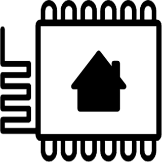
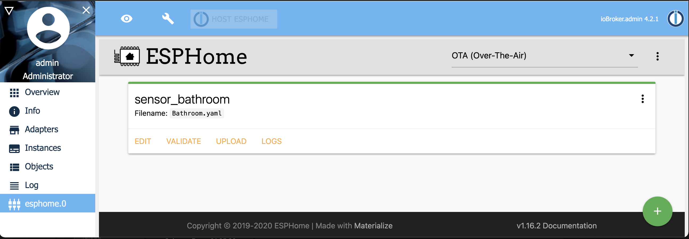
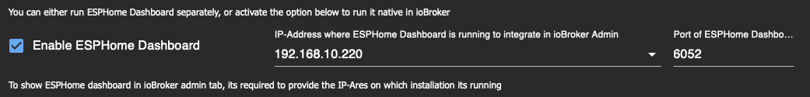
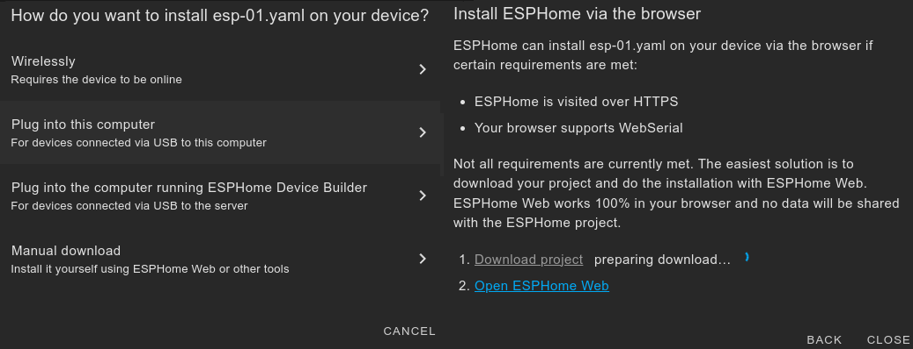
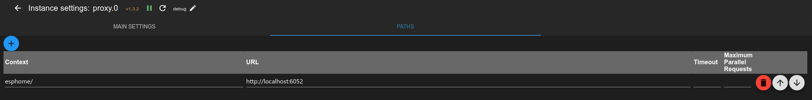
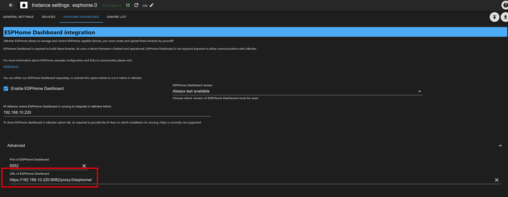
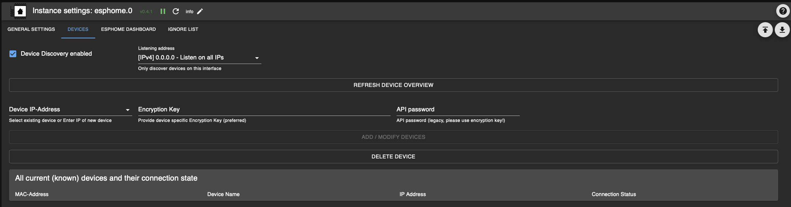
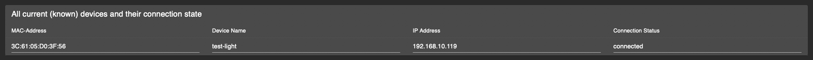
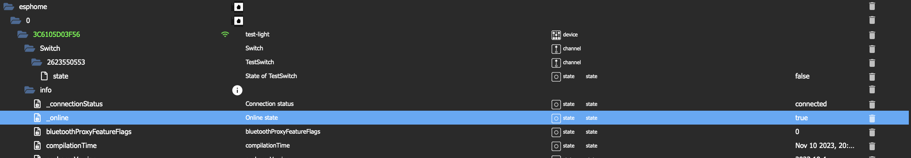

# ioBroker.esphome

**Dieser Adapter nutzt die Sentry-Bibliotheken, um Ausnahmen und Codefehler automatisch an die Entwickler zu melden.** Weitere Details und Informationen zum Deaktivieren der Fehlerberichterstattung finden Sie in [der Sentry-Plugin-Dokumentation](https://github.com/ioBroker/plugin-sentry#plugin-sentry) ! Die Sentry-Berichterstattung wird ab js-controller 3.0 verwendet.

## ESPHome-Adapter für ioBroker

Steuern Sie Ihren ESP8266/ESP32 mit einfachen, aber leistungsstarken Konfigurationsdateien, die von ESPHome erstellt und verwaltet werden. Die native Integration von ESPHome-Geräten (inklusive Dashboard) über die native API gewährleistet die Synchronisierung aller Daten (Live-Ereignisverarbeitung, kein Daten-Polling!).



**Schnelllinks:**

- 📋 [FAQ – Häufig gestellte Fragen](#frequently-asked-questions-faq)
- ⚙️ [Voraussetzungen & Einrichtung](#prerequisites)
- 🎛️ [Dashboard-Integration](#esphome-dashboard-integration-optional)
- 📱 [Geräteverwaltung](#device-management)
- 🔧 [Konfigurationsbeispiele](#example-config)

Dieser Adapter nutzt die [esphome-native-api,](https://github.com/twocolors/esphome-native-api#readme) wobei alle Anerkennung an @twocolors geht, um mit [der ESPHome-API](https://esphome.io/components/api.html?highlight=api) zu interagieren!

## Häufig gestellte Fragen (FAQ)

### Worin besteht der Unterschied zwischen dem ioBroker ESPHome Adapter und dem ESPHome Dashboard?

**ioBroker ESPHome Adapter:**

- Integriert Ihre ESPHome-Geräte in ioBroker zur Steuerung der Hausautomation.
- Kommuniziert direkt mit ESP-Geräten über die native API von ESPHome.
- Erstellt ioBroker-Zustände/Objekte zur Gerätesteuerung und -überwachung
- Verarbeitet Echtzeit-Aktualisierungen des Gerätestatus (keine Abfrage erforderlich)
- Verwaltet die Gerätekonfiguration innerhalb von ioBroker

**ESPHome-Dashboard:**

- Eine Weboberfläche zum Erstellen, Bearbeiten und Verwalten von ESPHome-Gerätekonfigurationen
- Wird zum Schreiben von YAML-Konfigurationen, zum Kompilieren von Firmware und zum Flashen von Geräten verwendet.
- Kann als optionale Funktion in die Admin-Oberfläche von ioBroker integriert werden.
- Kann entweder integriert mit diesem Adapter oder als externe Installation (Docker, Standalone) ausgeführt werden.

**Zusammenfassend:** Der Adapter steuert Ihre Geräte innerhalb von ioBroker, während das Dashboard Gerätekonfigurationen und Firmware verwaltet.

### Wie konfiguriere ich die IP-Auswahl im Dashboard?

Die Dashboard-IP-Einstellung in der Adapterkonfiguration dient verschiedenen Zwecken:

**Für den integrierten Dashboard-Tab in ioBroker Admin:**

1. Geben Sie die IP-Adresse und den Port ein, unter dem Ihr ESPHome Dashboard läuft.
2. **Integriertes Dashboard:** Verwenden Sie die IP-Adresse Ihres ioBroker-Hosts (z. B.`192.168.1.10:6052` )
   - **Wichtig:** NICHT verwenden`127.0.0.1:6052` (noch`localhost:6052` Wenn Sie von anderen Geräten auf ioBroker zugreifen, versucht der iFrame, die Adresse 127.0.0.1 vom Browser des Clients aus zu erreichen, nicht vom ioBroker-Server.
   - Nur verwenden`127.0.0.1:6052` wenn Sie NUR von demselben Rechner aus auf die ioBroker-Administration zugreifen, auf dem ioBroker ausgeführt wird.
3. **Externes Dashboard:** Verwenden Sie die IP-Adresse und den Port Ihrer externen ESPHome-Installation (z. B.`192.168.1.100:6052` )
4. **HTTPS-Einrichtung:** Ausführliche Informationen zur HTTPS-Konfiguration in HTTPS-Umgebungen finden Sie im folgenden Abschnitt.

**Dashboard-IP-Beispiele:**

- Integriert (Zugriff über das Netzwerk):`192.168.1.10:6052` (Ersetzen Sie dies durch die IP-Adresse Ihres ioBroker-Hosts)
- Eingebaut (nur lokal):`127.0.0.1:6052` (nur wenn der Administrator auf demselben Rechner zugreift)
- Externer Host:`esphome.local:6052` oder`192.168.1.100:6052`
- HTTPS-Proxy: `https://192.168.1.50:8082/proxy.0/esphome/`



**Hinweis:** Mit diesem Adapter können Sie ESPHome-Geräte steuern, ohne die Dashboard-IP konfigurieren zu müssen. Die Dashboard-IP wird nur benötigt, wenn Sie die ESPHome-Dashboard-Oberfläche in das Admin-Panel von ioBroker integrieren möchten.

### Benötige ich das ESPHome Dashboard, um diesen Adapter zu verwenden?

**Nein, das Dashboard ist optional.** Sie können diesen Adapter auf verschiedene Arten verwenden:

1. **Nur Adapter:** Steuern Sie vorkonfigurierte ESPHome-Geräte ohne Dashboard-Integration.
2. **Adapter + Externes Dashboard:** Nutzen Sie Ihre bestehende ESPHome-Installation (Docker, Standalone) und integrieren Sie diese optional in die ioBroker-Oberfläche.
3. **Adapter + Integriertes Dashboard:** Aktivieren Sie die integrierte ESPHome-Dashboard-Funktion für eine Komplettlösung.

Der Adapter funktioniert unabhängig und benötigt nur Geräte, bei denen die ESPHome API in der Konfiguration aktiviert ist.

### Wie füge ich Geräte zum Adapter hinzu?

1. **Stellen Sie sicher, dass die ESPHome API in der YAML-Konfiguration Ihres Geräts aktiviert ist** (siehe Abschnitt Voraussetzungen).
2. **Öffnen Sie den Geräte-Tab des Adapters** in ioBroker Admin (der Adapter muss ausgeführt werden).
3. **Geräte manuell hinzufügen:** Geräte-IP-Adresse und Anmeldeinformationen eingeben
4. **Automatische Erkennung:** Verwenden Sie die automatische Erkennungsfunktion, falls diese in den Adaptereinstellungen aktiviert ist.

Der Adapter stellt eine Verbindung her und erstellt alle notwendigen ioBroker-Objekte zur Gerätesteuerung.

### Ich habe ein Gerät im ESPHome-Dashboard konfiguriert, aber es wird im Adapter nicht angezeigt.

**Wichtig:** Adapter und Dashboard sind vollständig separate Komponenten ohne automatische Integration. Der Adapter kann das Dashboard optional installieren und starten – dies dient lediglich der Vereinfachung. Auch hier gilt: Es besteht keine Integration zwischen den beiden Komponenten.

- **Dashboard:** Dient zum Erstellen/Bearbeiten von YAML-Konfigurationen, zum Kompilieren von Firmware und zum Flashen von Geräten.
- **Adapter:** Wird zur Steuerung von Geräten und zur Synchronisierung ihres Zustands mit ioBroker verwendet.

**So funktioniert ein im Dashboard konfiguriertes Gerät mit dem Adapter:**

1. Flashen Sie das Gerät mit der Konfiguration vom Dashboard (stellen Sie sicher, dass die ESPHome-API in YAML aktiviert ist).
2. Fügen Sie das Gerät manuell in den Adaptereinstellungen (Registerkarte „Gerät“) hinzu. Geben Sie IP-Adresse/Hostname und Verschlüsselungsschlüssel (empfohlen) oder Passwort (ältere Version) ein.
3. Der Adapter verbindet sich dann über die native API von ESPHome mit dem Gerät.

**Hinweis:** Eine engere Integration zwischen Dashboard und Adapter ist in Zukunft möglich (siehe Problem #228), aktuell arbeiten sie jedoch unabhängig voneinander.

### Ich habe ein Gerät im Adapter konfiguriert, aber es wird im Dashboard nicht angezeigt.

**Dies ist das erwartete Verhalten** – Adapter und Dashboard synchronisieren die Gerätekonfigurationen nicht automatisch.

- Der **Adapter** verbindet sich über die native API von ESPHome mit Geräten zur Steuerung/Überwachung.
- Das **Dashboard** verwaltet YAML-Konfigurationen und die Firmware-Kompilierung.

**Wenn Sie das Gerät im Dashboard anzeigen möchten:**

**Option 1:**

1. Das ESPHome Dashboard kann Geräte im selben Netzwerk automatisch erkennen.
2. Im Dashboard werden gefundene Geräte mit einer Schaltfläche „ADOPT“ angezeigt.
3. Klicken Sie auf „ADOPT“, um sie Ihrem Dashboard für die Konfigurationsverwaltung hinzuzufügen.

**Option 2:**

- Erstellen Sie ein neues Gerät im Dashboard und kopieren Sie Ihre bestehende YAML-Datei dorthin.

**Hinweis:** Sie benötigen keine Geräte im Dashboard, wenn Sie diese ausschließlich über ioBroker steuern möchten. Das Dashboard wird nur zum Erstellen/Ändern von Gerätekonfigurationen benötigt.

### Wie installiere/aktualisiere ich Python?

Kurz gesagt: Das tust du nicht!

Der Adapter kümmert sich nicht um die Python-Installation Ihres Systems. Er installiert und erstellt ohnehin eine eigene Python-Umgebung mit den korrekten Versionen. Experimentieren Sie daher bitte nicht mit Python-Befehlen auf Ihrem System, wenn Sie nicht genau wissen, was Sie tun.

<!--
## [Documentation](https://DrozmotiX.github.io/languages/en/Adapter/ESPHome/)

All our adapter documentation can be found at [The DrozmotiX Docu Page](https://DrozmotiX.github.io/languages/en/Adapter/ESPHome/)
-->

## Voraussetzungen

```
* NodeJS >= 22.x
* API is activated in YAML
* For admin tabs (optional)
    * ESPHome Dashboard IP is provided in instance settings
```

## Testen von Vorabversionen

Vorabversionen werden auf npm unter dem Namen veröffentlicht.`next` Die dist-tag-Dateien werden **nicht** vom ioBroker-Repository bereitgestellt – sie müssen explizit installiert werden. Feedback zur Betaversion ist sehr willkommen; bitte melden Sie alle gefundenen Fehler im [Issue-Tracker](https://github.com/DrozmotiX/ioBroker.esphome/issues) .

Installieren Sie die aktuelle Vorabversion vom ioBroker-Host:

```bash
iobroker url iobroker.esphome@next
```

Oder installieren Sie eine bestimmte Version:

```bash
iobroker url iobroker.esphome@1.0.0-beta.1
```

Um anschließend zur veröffentlichten Version zurückzukehren:

```bash
iobroker url iobroker.esphome
```

Jede Vorabversion ist auch unter [„Releases“](https://github.com/DrozmotiX/ioBroker.esphome/releases) mit dem jeweiligen Änderungsprotokoll aufgeführt.

## ESPHome Dashboard-Integration (optional)

Dieser Adapter ermöglicht optional die Integration des ESPHome-Dashboards in die Administrationsoberfläche von ioBroker. Sie haben mehrere Optionen:

**Option 1: Integriertes Dashboard (Empfohlen für Anfänger)**

- Aktivieren Sie in den Adaptereinstellungen die Option „Native Integration des ESPHome-Dashboards“.
- Nutzt eine integrierte Python-Umgebung (keine externe Einrichtung erforderlich)
- Das Dashboard läuft standardmäßig auf Port 6052.
- Dashboard-IP festlegen`127.0.0.1:6052` für die Admin-Integration

**Option 2: Externes Dashboard**

- Verwenden Sie eine bestehende ESPHome-Installation (Docker, Standalone usw.).
- Geben Sie die IP-Adresse und den Port des externen Dashboards in den Adaptereinstellungen ein.
- Beispiel:`192.168.1.100:6052` für Docker-Container

**Option 3: Keine Dashboard-Integration**

- Die Dashboard-Konfiguration kann komplett übersprungen werden.
- Verwenden Sie externe ESPHome-Tools zur Gerätekonfiguration.
- Der Adapter steuert die Geräte weiterhin normal.


> **💡 Ausführliche Erläuterungen zur Dashboard-IP-Konfiguration und zu den Unterschieden zwischen Adapter und Dashboard finden Sie in den obenstehenden FAQs** .

### Verwendung von HTTPS

Ein Grund für die Verwendung von HTTPS ist die Möglichkeit, Geräte, die an Ihren PC angeschlossen sind, direkt zu flashen, da ESPHome dies mit HTTP nicht zulässt (wahrscheinlich eine Browserbeschränkung bei WebSerial).



Die Nutzung des integrierten Dashboards erfordert derzeit einige zusätzliche Schritte, wenn iobroker HTTPS verwendet:

1. Installieren Sie – falls noch nicht geschehen – den Webadapter und konfigurieren Sie HTTPS. Weitere Informationen finden Sie in der Webdokumentation: [ioBroker.web](https://github.com/ioBroker/ioBroker.web)
2. [Proxy-](https://github.com/ioBroker/ioBroker.proxy) Adapter installieren
3. Konfigurieren Sie den Pfad in den Proxy-Adaptereinstellungen:
   1. Kontext:`esphome/`
   2. URL:`http://localhost:6052`
4. Konfigurieren Sie die vollständige Dashboard-URL im erweiterten Abschnitt der ESPHome-Adaptereinstellungen – ESPHome-Dashboard:
   1. wie:`https://<iobrokerIP>:<webAdapterPort>/proxy.0/esphome/`
   2. Wo`<iobrokerIP>` ist die IP-Adresse des Hosts, auf dem Ihr iobroker ausgeführt wird (dieselbe wie oben).
   3. Und`<webAdapterPort>` ist der Port des Webadapters (Standard ist 8082).
   4. Es sollte ungefähr so aussehen:
   5. Wenn Sie das Dashboard auf einem externen Host ausführen, können Sie hier auch die URL zu einer externen Dashboard-Instanz verwenden.

## So verwenden Sie diesen Adapter

### API in YAML aktivieren

> \[!WICHTIG] ioBroker ESPHome ermöglicht die Integration von Geräten per Verschlüsselungsschlüssel (empfohlen) oder API-Passwort (ältere Version). Sie müssen Ihre Authentifizierungseinstellungen entsprechend festlegen. Siehe [ESPHome-Dokumentation.](https://esphome.io/components/api.html?highlight=api) Bitte konfigurieren Sie ausschließlich den Verschlüsselungsschlüssel (bevorzugt) oder das API-Passwort (ältere Version).

#### Beispiel für einen Konfigurationseintrag für den Verschlüsselungsschlüssel

```
api:
  encryption:
    key: "DyDfEgDzmA9GlK6ZuLkj3qgFcjXiZUzUf4chnIcjQto="
```

#### Beispiel für einen API-Konfigurationseintrag

```
api:
  password: 'MyPassword'
```

## Geräteverwaltung

### ESPHome-Geräte zu ioBroker hinzufügen/ändern/entfernen

> \[!WICHTIG] Dieser Adapter ermöglicht die Kommunikation mit ESPHome-fähigen Geräten und (falls aktiviert) mit einer integrierten Version des ESPHome-Dashboards. Sie müssen Ihre ESP-Konfiguration selbst konfigurieren und hochladen, entweder über das integrierte Dashboard oder eine externe Alternative (z. B. Docker), bevor diese in ioBroker integriert werden kann.

> **💡 Eine Schritt-für-Schritt-Anleitung zum Hinzufügen von Geräten zum Adapter finden Sie in den oben stehenden FAQs** .

Im Geräte-Tab werden alle aktuell bekannten Geräte angezeigt. Sie können entweder warten, bis Geräte automatisch erkannt werden (derzeit deaktiviert, siehe #175), oder sie manuell hinzufügen, indem Sie deren IP-Adresse und Zugangsdaten angeben.



> \[!HINWEIS] Die Schaltflächen zum Hinzufügen, Ändern und Entfernen von Geräten sowie zum Laden der Gerätetabelle sind nur verfügbar, wenn der Adapter in Betrieb ist! Sie müssen die Gerätetabelle manuell aktualisieren, indem Sie auf „Geräteübersicht aktualisieren“ klicken. Anschließend werden alle Geräte und deren Verbindungsstatus angezeigt.

Bitte geben Sie die IP-Adresse ein (falls das Gerät bereits bekannt ist, können Sie es aus der Dropdown-Liste auswählen) und wählen Sie die gewünschten Aktionen aus:

- Geräte hinzufügen / ändern
  - Sendet IP-Adresse und Anmeldeinformationen an den Backend-Server und versucht, eine Verbindung herzustellen.
  - Wenn ein Verschlüsselungsschlüssel angegeben wird, wird das API-Passwort ignoriert. Bitte stellen Sie eine korrekte YAML-Konfiguration sicher!

- Gerät löschen
  - Es wird eine Nachricht an den Backend-Server gesendet, um dieses Gerät zu entfernen.

> \[!WARNUNG] Diese Aktion entfernt ein ausgewähltes Gerät und alle zugehörigen Zustände aus ioBroker!

> \[!HINWEIS] Nach dem Hinzufügen eines Geräts wird eine Erfolgs- oder Fehlermeldung angezeigt. Sie können die Tabelle aktualisieren, um die aktuell verfügbaren Geräte und deren Verbindungsstatus anzuzeigen.



Wenn die Verbindung erfolgreich hergestellt wurde, wird das Gerät initialisiert und alle zugehörigen Zustände werden erstellt, um seine Attribute zu steuern.\
&#x20;Bei jeder Änderung Ihrer YAML-Konfiguration wird durch einen Neustart des ESP die Verbindung getrennt und eine neue Verbindung hergestellt.\
&#x20;Während dieses Prozesses werden Zustände, die nicht mehr Teil der YAML-Konfiguration sind, automatisch entfernt.



### YAML-Dateiverwaltung

Der Adapter bietet eine komfortable Schnittstelle zur direkten Verwaltung von YAML-Konfigurationsdateien über die Admin-Oberfläche. Mit dieser Funktion können Sie YAML-Dateien, die im ESPHome-Verzeichnis gespeichert sind und vom ESPHome-Dashboard verwendet werden können, hoch- und herunterladen sowie verwalten.

#### Merkmale

- **YAML-Dateien hochladen** : Fügen Sie Ihren YAML-Konfigurationsinhalt direkt in die Admin-Oberfläche ein und laden Sie ihn in das ESPHome-Verzeichnis hoch.
- **Dateiliste anzeigen** : Alle aktuell im ESPHome-Verzeichnis gespeicherten YAML-Dateien mit Dateigröße und Änderungsdatum anzeigen.
- **Dateien herunterladen** : Laden Sie den Inhalt beliebiger YAML-Dateien zum Bearbeiten oder Sichern herunter.
- **Dateien löschen** : Entfernen Sie nicht mehr benötigte YAML-Dateien.

#### Anleitung zur Verwendung

1. **Navigieren Sie in der Adapterkonfiguration zum Tab „YAML-Dateien“.**
2. **Neue Datei hochladen** :
   - Geben Sie einen Dateinamen ein (muss mit .yaml oder .yml enden).
   - Fügen Sie Ihren YAML-Konfigurationsinhalt ein.
   - Klicken Sie auf „Datei hochladen“.
3. **Aktualisieren Sie die Dateiliste** , um alle verfügbaren YAML-Dateien anzuzeigen.
4. **Dateien herunterladen oder löschen** :
   - Geben Sie den Dateinamen in das Feld „Datei auswählen“ ein.
   - Klicken Sie auf „Datei herunterladen“, um den Inhalt anzuzeigen, oder auf „Datei löschen“, um ihn zu entfernen.

> \[!NOTE] Dateien werden im ESPHome-Verzeichnis gespeichert:`/opt/iobroker/iobroker-data/esphome.<instance>/`
>
> Dies ist dasselbe Verzeichnis, das auch vom ESPHome Dashboard verwendet wird, sodass über den Adapter hochgeladene Dateien sofort im Dashboard verfügbar sind und umgekehrt.

> \[!TIPP] Diese Funktion ist besonders nützlich, wenn:
>
> - Sie möchten Konfigurationen schnell bearbeiten, ohne auf das Serverdateisystem zugreifen zu müssen.
> - Sie müssen Gerätekonfigurationen sichern oder freigeben.
> - Sie möchten YAML-Dateien verwalten, ohne das vollständige ESPHome-Dashboard auszuführen.

### Beispielkonfiguration

Beispielkonfiguration; weitere Beispiele finden Sie [auf der DrozmotiX-Dokumentationsseite](https://DrozmotiX.github.io) oder [in der ESPHome-Dokumentation.](https://esphome.io/index.html)

<details><summary>Show example config
</summary>

```
esphome:
  name: sensor_badkamer
  platform: ESP32
  board: esp-wrover-kit

wifi:
  use_address: 192.168.10.122
  ssid: "xxxxx"
  password: "xxxxxx"

# Enable ESPHome API
api:
    password: 'MyPassword'
# Activate i2c bus
i2c:
  sda: 21
  scl: 22
  scan: True
  id: bus_a

# Example configuration for bh1750
sensor:
  - platform: bh1750
    name: "Hal_Illuminance"
    address: 0x23
    measurement_time: 69
    update_interval: 10s

# Example configuration for an GPIO output
output:
  - platform: gpio
    pin: 12
    inverted: true
    id: gpio_12

# Example configuration linking a switch to the previous defined output
switch:
  - platform: output
    name: "Generic Output"
    output: 'gpio_12'
```

</details>

## RGBW-Beleuchtung steuern

### RGB vs RGBW — Was ist der Unterschied?

**RGB-Leuchten** nutzen drei Kanäle (Rot, Grün, Blau) zur Farberzeugung, einschließlich Weiß, indem alle drei maximal gemischt werden. **RGBW-Leuchten** fügen einen dedizierten vierten Weißkanal hinzu (`white` ) das ein saubereres, helleres Weiß liefert als die Mischung von RGB.

### Verfügbare Zustände für eine Lichtwesenheit

| Zustand                | Beschreibung                                                                                                                                                                                                              |
| ---------------------- | ------------------------------------------------------------------------------------------------------------------------------------------------------------------------------------------------------------------------- |
| `colorHEX`             | Schreibbarer Hexadezimalfarbstring, z.B.`#ff6600` Durch Schreiben an dieser Stelle werden die Rot-/Grün-/Blauwerte aktualisiert und der Befehl gesendet.                                                                  |
| `red` /`green` /`blue` | Einzelne Farbkanäle (0 – 255).                                                                                                                                                                                            |
| `white`                | Dedizierter Weißkanal (0 – 255). Nur bei RGBW-fähigen Leuchten vorhanden.                                                                                                                                                 |
| `brightness`           | Gesamthelligkeit (0 – 255).                                                                                                                                                                                               |
| `config.rgbAutoWhite`  | **RGBW-Nur** — wenn eingestellt auf`true` , Schreiben`#ffffff` Zu`colorHEX` Aktiviert automatisch den Weißkanal und setzt RGB auf Null. Bei Eingabe einer anderen Farbe wird der Weißkanal deaktiviert und RGB verwendet. |

### Automatische Weißkanalumschaltung (`rgbAutoWhite` )

Wenn eine RGBW-fähige Lichtquelle erkannt wird (d. h. sie belichtet ein`white` Der Adapter erstellt automatisch einen beschreibbaren Zustand (Zustand), der durch den Adapter automatisch einen beschreibbaren Zustand erzeugt wird.`config.rgbAutoWhite` Schaltet den Status dieser Entität um. Standardmäßig ist er aktiv.`false` (deaktiviert).

**Zum Aktivieren:**

1. Öffnen Sie die ioBroker **-Objektansicht** und navigieren Sie zu Ihrer Light-Entität, z. B.`esphome.0.MyLight.Light.1.config.rgbAutoWhite` Die
2. Setzen Sie den Wert auf`true` Die

**Verhalten bei Aktivierung:**

| `colorHEX` Eingang | Ergebnis                                              |
| ------------------ | ----------------------------------------------------- |
| `#ffffff`          | `white` → 1 (vollständig),`red` /`green` /`blue` → 0  |
| Jede andere Farbe  | `white` → 0, RGB-Kanäle auf die Farbwerte eingestellt |

**Verhalten bei Deaktivierung (Standardeinstellung):** die`white` Der Kanal wird niemals automatisch bedient; er wird von den Benutzern unabhängig gesteuert.

## Tasmota / ESPEasy Migration

Die Migration von früheren Sonoff Tasmota- oder ESPEasy-Installationen ist sehr einfach. Sie müssen lediglich ESPHome eine Binärdatei erstellen lassen und diese anschließend über die Weboberfläche hochladen.\
&#x20;Weitere Details finden Sie auf unserer [Dokumentenseite.](https://DrozmotiX.github.io/languages/en/Adapter/ESPHome/06.migration.html)

**_HINWEIS:_** Die generierten YAML-Dateien werden unter \`\`\`/opt/iobroker/iobroker-data/iobroker.esphome.>instance\</>device<.yaml gespeichert.

## Unterstützt mich

Wenn Ihnen meine Arbeit gefällt, erwägen Sie bitte eine persönliche Spende.\
&#x20;(Dies ist ein persönlicher Spendenlink für DutchmanNL und steht in keiner Verbindung zum ioBroker-Projekt!)\
[](http://paypal.me/DutchmanNL)

## Changelog

<!--
    Placeholder for the next version (at the beginning of the line):
    ### __WORK IN PROGRESS__
    * (DutchmanNL)
-->

### 1.0.0-beta.2 (2026-07-30)

- (@SimonFischer04) **FIXED**: ESPHome Dashboard 2026.6.5 and Pillow 12.2.0 are used instead of the latest available release, the 2026.7.x releases currently fail to install (#463)
- (@SimonFischer04) **FIXED**: Installations still set to "Always last available" are migrated to those versions once, so an update no longer leaves behind a dashboard that cannot be installed (#463)
- (@SimonFischer04) **NEW**: Selecting "Always last available" again is respected, the migration runs only once and such a setup only gets a warning at startup (#463)
- (@DutchmanNL) **FIXED**: Falling back to the latest ESPHome or Pillow release no longer aborts the dashboard setup, the requirement was passed to pip without a version specifier
- (@DutchmanNL) **FIXED**: Added the missing "pingInterval" and "pingAttempts" defaults to io-package.json, they were only defined in the admin configuration
- (@DutchmanNL) **ENHANCED**: "npm run check" is free of type errors, so type regressions are visible again

### 1.0.0-beta.1 (2026-07-28)

- (@DutchmanNL) **FIXED**: Restored a green CI matrix, the dashboard integration tests no longer hang the test runner
- (@DutchmanNL) **FIXED**: Corrected the changelog entry in io-package.json so it matches the published version
- (@DutchmanNL) **FIXED**: Admin configuration is fully translated again, 29 texts were only available in English
- (@DutchmanNL) **FIXED**: YAML upload field renders as a proper multi-line text area again
- (@DutchmanNL) **ENHANCED**: Timers are now managed by the adapter, so they are always cleaned up on unload
- (@DutchmanNL) **ENHANCED**: Pre-releases are published under the npm "beta" tag instead of "latest"
- (@DutchmanNL) **ENHANCED**: Removed the obsolete admin/words.js and added prettier formatting scripts
- (@dependabot) **ENHANCED**: Updated @iobroker/testing to 5.3.0 and the GitHub actions used in CI

### 1.0.0-beta.0 - Stable version release candidate

- (@copilot) **NEW**: Promoted ioBroker.esphome to stable **v1.0.0**
- (@copilot) **NEW**: Brings ESPHome devices into ioBroker with live state updates and direct control
- (@copilot) **NEW**: Supports a wide range of device types including lights, switches, sensors, fans, covers, locks, and text entities
- (@copilot) **ENHANCED**: Includes optional ESPHome Dashboard integration plus built-in helpers for discovery and YAML-based device management
- (@arteck) **FIXED**: Improved disconnect handling and diagnostics so reconnects recover more cleanly when device connections are destroyed
- (@copilot) **ENHANCED**: Establishes a stable baseline for future ESPHome adapter development in ioBroker

### 0.7.0 (2026-05-17)

- (@SimonFischer04) **FIXED** copilot hallucinations
- (@SimonFischer04) **NEW** 'Always last available' for pillow version
- (@copilot) **FIXED**: Invalid jsonConfig warning on adapter installation
- (DutchmanNL) **FIXED**: ESLint errors by code refactoring

### 0.7.0-beta.4 (2026-02-21)

- (DutchmanNL) **FIXED**: ESLint errors by code refactoring
- (@copilot) **FIXED**: Restore missing `configStates` option in admin UI to allow configuring whether configuration states are shown per entity
- (@copilot) **NEW**: Per-device `rgbAutoWhite` toggle in the light config channel for automatic white-channel routing on RGBW lights (see [Controlling RGBW Lights](#controlling-rgbw-lights))

[Older changelogs can be found there](https://github.com/DrozmotiX/ioBroker.esphome/blob/main/CHANGELOG_OLD.md)

## License

MIT License

Copyright (c) 2023-2026 DutchmanNL <rdrozda86@gmail.com>

Permission is hereby granted, free of charge, to any person obtaining a copy
of this software and associated documentation files (the "Software"), to deal
in the Software without restriction, including without limitation the rights
to use, copy, modify, merge, publish, distribute, sublicense, and/or sell
copies of the Software, and to permit persons to whom the Software is
furnished to do so, subject to the following conditions:

The above copyright notice and this permission notice shall be included in all
copies or substantial portions of the Software.

THE SOFTWARE IS PROVIDED "AS IS", WITHOUT WARRANTY OF ANY KIND, EXPRESS OR
IMPLIED, INCLUDING BUT NOT LIMITED TO THE WARRANTIES OF MERCHANTABILITY,
FITNESS FOR A PARTICULAR PURPOSE AND NONINFRINGEMENT. IN NO EVENT SHALL THE
AUTHORS OR COPYRIGHT HOLDERS BE LIABLE FOR ANY CLAIM, DAMAGES OR OTHER
LIABILITY, WHETHER IN AN ACTION OF CONTRACT, TORT OR OTHERWISE, ARISING FROM,
OUT OF OR IN CONNECTION WITH THE SOFTWARE OR THE USE OR OTHER DEALINGS IN THE
SOFTWARE.