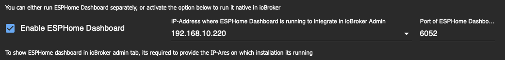
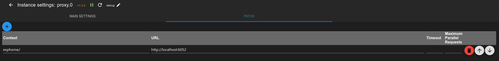

# IoBroker.esphome
[](https://weblate.iobroker.net/engage/adapters/?utm_source=widget)

**Tests:** 

**Dieser Adapter verwendet Sentry-Bibliotheken, um den Entwicklern automatisch Ausnahmen und Codefehler zu melden.** Weitere Einzelheiten und Informationen zum Deaktivieren der Fehlerberichterstattung finden Sie unter [Sentry-Plugin Dokumentation](https://github.com/ioBroker/plugin-sentry#plugin-sentry)! Die Sentry-Berichterstattung wird ab js-controller 3.0 verwendet.

## ESPHome-Adapter für ioBroker
Steuern Sie Ihren ESP8266/ESP32 mit einfachen, aber leistungsstarken Konfigurationsdateien, die von ESPHome erstellt und verwaltet werden.

Die native Integration des von ESPHome verwalteten Geräts (einschließlich Dashboard) über die native API stellt sicher, dass alle Daten synchronisiert sind (Live-Event-Handling, kein Daten-Polling! :)


**Schnelllinks:**

- 📋 [FAQ – Häufig gestellte Fragen](#frequently-asked-questions-faq)
- ⚙️ [Voraussetzungen und Einrichtung](#prerequisites)
- 🎛️ [Dashboard-Integration](#esphome-dashboard-integration-optional)
- 📱 [Geräteverwaltung](#device-management)
- 🔧 [Konfigurationsbeispiele](#example-config)

Dieser Adapter verwendet [esphome-native-api](https://github.com/Nafaya/esphome-native-api#readme) mit allen Credits an @Nafaya zur Interaktion mit [ESPHome API](https://esphome.io/components/api.html?highlight=api)!

## Häufig gestellte Fragen (FAQ)
### Was ist der Unterschied zwischen dem ioBroker ESPHome-Adapter und dem ESPHome-Dashboard?
**ioBroker ESPHome-Adapter:**

- Integriert Ihre ESPHome-Geräte in ioBroker zur Steuerung der Heimautomatisierung
- Kommuniziert direkt mit ESP-Geräten über die native API von ESPHome
- Erstellt ioBroker-Zustände/Objekte zur Gerätesteuerung und -überwachung
- Verarbeitet Gerätestatusaktualisierungen in Echtzeit (keine Abfrage erforderlich)
- Verwaltet die Gerätekonfiguration innerhalb von ioBroker

**ESPHome-Dashboard:**

- Eine Weboberfläche zum Erstellen, Bearbeiten und Verwalten von ESPHome-Gerätekonfigurationen
- Wird zum Schreiben von YAML-Konfigurationen, Kompilieren von Firmware und Flashen von Geräten verwendet
- Kann als optionale Funktion in die Admin-Oberfläche von ioBroker integriert werden
- Kann entweder integriert mit diesem Adapter oder als externe Installation (Docker, Standalone) ausgeführt werden

**Zusammenfassung:** Der Adapter steuert Ihre Geräte innerhalb von ioBroker, während das Dashboard die Gerätekonfigurationen und die Firmware verwaltet.

### Wie konfiguriere ich den Dashboard-IP-Selektor?
Die Dashboard-IP-Einstellung in der Adapterkonfiguration dient verschiedenen Zwecken:

**Für die Registerkarte „Integriertes Dashboard“ im ioBroker-Admin:**

1. Geben Sie die IP-Adresse und den Port ein, auf dem Ihr ESPHome Dashboard läuft
2. **Integriertes Dashboard:** Verwenden Sie `127.0.0.1:6052` (Standard für integriertes Dashboard)
3. **Externes Dashboard:** Verwenden Sie die IP:Port Ihrer externen ESPHome-Installation (z. B. Docker-Container)
4. **HTTPS-Setup:** Informationen zu HTTPS-Umgebungen finden Sie im ausführlichen Abschnitt zur HTTPS-Konfiguration weiter unten.

**Dashboard-IP-Beispiele:**

- Eingebaut: `127.0.0.1:6052`
- Externer Docker: `192.168.1.100:6052`
- Externer Host: `esphome.local:6052`
- HTTPS-Proxy: `https://192.168.1.50:8082/proxy.0/esphome/`



**Hinweis:** Sie können diesen Adapter verwenden, um ESPHome-Geräte zu steuern, ohne die Dashboard-IP zu konfigurieren. Die Dashboard-IP wird nur benötigt, wenn Sie die ESPHome-Dashboard-Schnittstelle in das Admin-Panel von ioBroker integrieren möchten.

### Benötige ich das ESPHome Dashboard, um diesen Adapter zu verwenden?
**Nein, das Dashboard ist optional.** Sie können diesen Adapter auf verschiedene Arten verwenden:

1. **Nur Adapter:** Steuern Sie vorkonfigurierte ESPHome-Geräte ohne Dashboard-Integration
2. **Adapter + Externes Dashboard:** Nutzen Sie Ihre vorhandene ESPHome-Installation (Docker, Standalone) und integrieren Sie diese optional in die ioBroker-Oberfläche
3. **Adapter + integriertes Dashboard:** Aktivieren Sie die integrierte ESPHome Dashboard-Funktion für eine Komplettlösung

Der Adapter funktioniert unabhängig und erfordert nur Geräte, bei denen die ESPHome-API in der Konfiguration aktiviert ist.

### Wie füge ich dem Adapter Geräte hinzu?
1. **Stellen Sie sicher, dass die ESPHome-API aktiviert ist** in der YAML-Konfiguration Ihres Geräts (siehe Abschnitt „Voraussetzungen“)
2. **Öffnen Sie die Geräteregisterkarte des Adapters** in ioBroker Admin (Adapter muss ausgeführt werden)
3. **Geräte manuell hinzufügen:** Geben Sie die IP-Adresse und die Authentifizierungsdaten des Geräts ein
4. **Automatische Erkennung:** Derzeit deaktiviert (siehe Problem Nr. 175)

Der Adapter stellt eine Verbindung her und erstellt alle erforderlichen ioBroker-Objekte zur Gerätesteuerung.

## [Dokumentation](https://DrozmotiX.github.io/languages/en/Adapter/ESPHome/)

## [Dokumentation](https://DrozmotiX.github.io/languages/en/Adapter/ESPHome/)
Unsere gesamte Adapterdokumentation finden Sie unter [Die DrozmotiX-Doku-Seite](https://DrozmotiX.github.io/languages/en/Adapter/ESPHome/) -->

## Voraussetzungen
* NodeJS >= 18.x
* API ist in YAML aktiviert
* Für Admin-Registerkarten (optional)
* Die IP des ESPHome-Dashboards wird in den Instanzeinstellungen bereitgestellt

## ESPHome Dashboard-Integration (optional)
Dieser Adapter kann optional das ESPHome Dashboard in die Admin-Oberfläche von ioBroker integrieren. Sie haben mehrere Möglichkeiten:

**Option 1: Integriertes Dashboard (Empfohlen für Anfänger)**

- Aktivieren Sie "Native Integration von ESPHome Dashboard" in den Adaptereinstellungen
- Verwendet eine integrierte Python-Umgebung (keine externe Einrichtung erforderlich)
- Dashboard läuft standardmäßig auf Port 6052
- Setzen Sie die Dashboard-IP für die Admin-Integration auf „127.0.0.1:6052“

**Option 2: Externes Dashboard**

- Vorhandene ESPHome-Installation verwenden (Docker, Standalone usw.)
- Geben Sie die IP:Port des externen Dashboards in den Adaptereinstellungen ein
- Beispiel: `192.168.1.100:6052` für Docker-Container

**Option 3: Keine Dashboard-Integration**

- Überspringen Sie die Dashboard-Konfiguration vollständig
- Verwenden Sie externe ESPHome-Tools zur Gerätekonfiguration
- Adapter steuert Geräte weiterhin normal


> **💡 Siehe FAQ oben** für detaillierte Erklärungen zur Dashboard-IP-Konfiguration und den Unterschieden zwischen Adapter und Dashboard.

### Verwenden von HTTPS
Ein Grund für die Verwendung von HTTPS besteht darin, dass Sie direkt auf an Ihren PC angeschlossene Geräte flashen können, da esphome dies mit http nicht zulässt (wahrscheinlich Browserbeschränkung mit WebSerial).


Die Verwendung des integrierten Dashboards, wenn der iobroker https verwendet, erfordert derzeit einige weitere Schritte:

1. Installieren Sie – falls noch nicht geschehen – den Webadapter und konfigurieren Sie https. Weitere Informationen finden Sie in der Webdokumentation: [ioBroker.web](https://github.com/ioBroker/ioBroker.web)
2. Installieren Sie den [Proxy](https://github.com/ioBroker/ioBroker.proxy)-Adapter
3. Konfigurieren Sie den Pfad in den Proxy-Adapter-Einstellungen:
1. Kontext: `esphome/`
2. URL: `http://localhost:6052`



4. Konfigurieren Sie die vollständige Dashboard-URL im erweiterten Abschnitt der Esphome-Adaptereinstellungen – Esphome-Dashboard:
1. wie: `https://<iobrokerIP>:<webAdapterPort>/proxy.0/esphome/`
2. wobei „<iobrokerIP>“ die IP des Hosts ist, auf dem Ihr iobroker ausgeführt wird (wie oben)
3. und „<webAdapterPort>“ ist der Port des Webadapters (Standard ist 8082)
4. Es sollte ungefähr so aussehen:

   

5. Wenn Sie das Dashboard auf einem externen Host ausführen, können Sie hier auch die URL zu einer externen Dashboard-Instanz verwenden

## So verwenden Sie diesen Adapter
### API in YAML aktivieren
> [!WICHTIG] > ioBroker ESPHome ermöglicht die Integration von Geräten per Verschlüsselungsschlüssel (empfohlen) oder API-Passwort (alt), > Sie müssen Ihre Authentifizierungseinstellungen entsprechend angeben, > siehe [ESPHome-Dokumentation](https://esphome.io/components/api.html?highlight=api) > Bitte konfigurieren Sie nur den Verschlüsselungsschlüssel (bevorzugt) oder das API-Passwort (alt)

#### Beispiel für einen Konfigurationseintrag für den Verschlüsselungsschlüssel
```
api:
  encryption:
    key: "DyDfEgDzmA9GlK6ZuLkj3qgFcjXiZUzUf4chnIcjQto="
```

#### Beispiel für einen API-Konfigurationseintrag
```
api:
  password: 'MyPassword'
```

## Geräteverwaltung
### ESPHome-Geräte zu ioBroker hinzufügen / ändern / entfernen
> [!WICHTIG] > Dieser Adapter integriert die Kommunikation mit ESPHome-fähigen Geräten und (falls aktiviert) eine integrierte Version des ESPHome-Dashboards.
> Sie müssen Ihre ESP-Konfiguration selbst konfigurieren und hochladen, entweder über das integrierte Dashboard oder eine externe Alternative (z. B. Docker), bevor sie in ioBroker integriert werden kann.

> **💡 Siehe FAQ oben** für eine Schritt-für-Schritt-Anleitung zum Hinzufügen von Geräten zum Adapter.

Auf der Registerkarte „Geräte“ werden alle aktuell bekannten Geräte angezeigt. Sie können entweder warten, bis die Geräte automatisch erkannt werden (derzeit deaktiviert, siehe Nr. 175), oder sie manuell hinzufügen, indem Sie ihre IP-Adresse und Anmeldeinformationen angeben.


> [!HINWEIS] > Schaltflächen zum Hinzufügen/Ändern/Entfernen von Geräten und Laden der Gerätetabelle sind nur verfügbar, wenn der Adapter läuft! > Sie müssen die Gerätetabelle manuell aktualisieren, indem Sie auf „Geräteübersicht aktualisieren“ klicken. Alle Geräte und ihr Verbindungsstatus werden angezeigt

Bitte geben Sie die IP-Adresse ein (wenn ein Gerät bereits bekannt ist, können Sie es aus der Dropdown-Liste auswählen) und wählen Sie die entsprechenden Aktionen:

- Geräte HINZUFÜGEN / Ändern
- Sendet IP-Adresse und Anmeldeinformationen an das Backend und versucht, eine Verbindung herzustellen
- Wenn ein Verschlüsselungsschlüssel angegeben wird, wird das API-Passwort ignoriert. Bitte stellen Sie eine ordnungsgemäße YAML-Konfiguration sicher!

- Gerät löschen
- Sendet eine Nachricht an das Backend, um dieses Gerät zu entfernen

> [!WARNING] > Diese Aktion entfernt ein ausgewähltes Gerät und alle zugehörigen Zustände aus ioBroker!

> [!NOTE] > Nachdem ein Gerät hinzugefügt wurde, wird eine Meldung angezeigt, ob es erfolgreich war oder ein Fehler aufgetreten ist. > Sie können die Tabelle aktualisieren, um die aktuellen Geräte und ihren Verbindungsstatus anzuzeigen

 

Bei erfolgreicher Verbindung wird das Gerät initialisiert und alle zugehörigen Zustände zur Steuerung der zugehörigen Attribute erstellt.
Wenn Sie Änderungen an Ihrer YAML-Konfiguration vornehmen, wird durch einen Neustart des ESP die Verbindung getrennt und eine neue hergestellt.
Dabei werden Zustände, die nicht mehr Teil der YAML-Konfiguration sind, automatisch entfernt.


### Beispielkonfiguration
Beispielkonfiguration, weitere Beispiele siehe [Die DrozmotiX-Dokumentationsseite](https://DrozmotiX.github.io) oder [ESPHome-Dokumentation](https://esphome.io/index.html)

<details><summary>Beispielkonfiguration anzeigen</summary>

esphome: Name: sensor_badkamer Plattform: ESP32 Board: esp-wrover-kit

WLAN: use_address: 192.168.10.122 SSID: „xxxxx“ Passwort: „xxxxxx“

# ESPHome-API aktivieren
API: Passwort: „MeinPasswort“

# I2C-Bus aktivieren i2c: sda: 21 scl: 22 scan: True id: bus_a
# Beispielkonfiguration für bh1750
Sensor:

- Plattform: bh1750

Name: "Hal_Illuminance" Adresse: 0x23 Messzeit: 69 Aktualisierungsintervall: 10s

# Beispielkonfiguration für einen GPIO-Ausgang
    Ausgabe:

Plattform: GPIO

Pin: 12 invertiert: true ID: gpio_12

# Beispielkonfiguration, die einen Schalter mit dem zuvor definierten Ausgang verbindet
    schalten:

- Plattform: Ausgabe

Name: „Allgemeine Ausgabe“ Ausgabe: „gpio_12“ </details>

## Tasmota / ESPEasy-Migration
Die Migration von vorherigen Sonoff Tasmota- oder ESPEasy-Setups ist ganz einfach. ESPHome erstellt einfach eine Binärdatei und lädt diese anschließend in die Weboberfläche hoch.
Weitere Informationen finden Sie in unserem [Doku-Seite](https://DrozmotiX.github.io/languages/en/Adapter/ESPHome/06.migration.html)

**_HINWEIS:_** Generierte YAML-Dateien werden unter ```/opt/iobroker/iobroker-data/iobroker.esphome.>instance</>device<.yaml gespeichert

## Unterstütze mich
Wenn Ihnen meine Arbeit gefällt, denken Sie bitte über eine persönliche Spende nach (dies ist ein persönlicher Spendenlink für DutchmanNL, keine Verbindung zum ioBroker-Projekt!) [](http://paypal.me/DutchmanNL)

## Changelog

<!--
    Placeholder for the next version (at the beginning of the line):
    ### __WORK IN PROGRESS__
    * (DutchmanNL) 
-->
### 0.6.3 (2025-09-16)
* (@DutchmanNL) Fixed an admin error related to `jsonConfig` validation. #287
* (@DutchmanNL) Various general fixes and dependency updates to improve stability.
* (@DutchmanNL) Improved responsive design for better usability across devices. #284
* (@DutchmanNL) Introduced GitHub Actions to automatically verify the ESPHome Dashboard. #290
* (@DutchmanNL) Added a comprehensive FAQ section to the README to help users with common questions. #286
* (@DutchmanNL) Updated the `esphome-native-api` library to V1.3.3, which may resolve connection issues. #201

### 0.6.2 (2025-08-08)
* (@SimonFischer04) add support for text device type #141, displays #103
* (@SimonFischer04) fix cover device type #156
* (@SimonFischer04) workaround: downgrade python for now. fixes #259

### 0.6.1 (2025-05-24)
* (@SimonFischer04) Update esphome
* (@ticaki) Optimize admin configuration interface
* (@DutchmanNL) Optimize backend handling of device discovery
* (@DutchmanNL) Capability to select ESPHome Dashboard version added, resolves #118

### 0.5.0-beta.8 (2023-11-24)
* (DutchmanNL) Capability to automatically detect new devices added
* (DutchmanNL) Ensures a compatible pillow version is used (10.0.1)
* (SimonFischer04) Add pillow python package by default, resolves #188

### 0.5.0-beta.4 (2023-11-15)
* (DutchmanNL) Refactor memory caching of device data, resolves #189

## License
MIT License

Copyright (c) 2023-2025 DutchmanNL <rdrozda86@gmail.com>

Permission is hereby granted, free of charge, to any person obtaining a copy
of this software and associated documentation files (the "Software"), to deal
in the Software without restriction, including without limitation the rights
to use, copy, modify, merge, publish, distribute, sublicense, and/or sell
copies of the Software, and to permit persons to whom the Software is
furnished to do so, subject to the following conditions:

The above copyright notice and this permission notice shall be included in all
copies or substantial portions of the Software.

THE SOFTWARE IS PROVIDED "AS IS", WITHOUT WARRANTY OF ANY KIND, EXPRESS OR
IMPLIED, INCLUDING BUT NOT LIMITED TO THE WARRANTIES OF MERCHANTABILITY,
FITNESS FOR A PARTICULAR PURPOSE AND NONINFRINGEMENT. IN NO EVENT SHALL THE
AUTHORS OR COPYRIGHT HOLDERS BE LIABLE FOR ANY CLAIM, DAMAGES OR OTHER
LIABILITY, WHETHER IN AN ACTION OF CONTRACT, TORT OR OTHERWISE, ARISING FROM,
OUT OF OR IN CONNECTION WITH THE SOFTWARE OR THE USE OR OTHER DEALINGS IN THE
SOFTWARE.