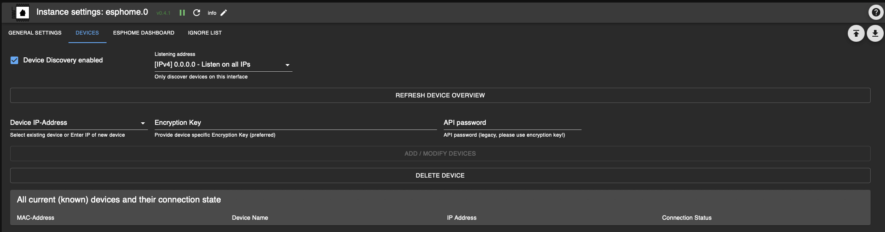

# IoBroker.esphome
[](https://weblate.iobroker.net/engage/adapters/?utm_source=widget)

**Tests:** 

**Dieser Adapter verwendet Sentry-Bibliotheken, um Ausnahmen und Codefehler automatisch an die Entwickler zu melden.** Weitere Details und Informationen zum Deaktivieren der Fehlerberichterstattung finden Sie unter [Sentry-Plugin-Dokumentation](https://github.com/ioBroker/plugin-sentry#plugin-sentry)! Sentry Reporting wird ab js-controller 3.0 verwendet.

## ESPHome-Adapter für ioBroker
Steuern Sie Ihren ESP8266/ESP32 mit einfachen, aber leistungsstarken Konfigurationsdateien, die von ESPHome erstellt und verwaltet werden.
Native Integration des von ESPHome verwalteten Geräts (einschließlich Dashboard) über seine native API und stellt sicher, dass alle Daten synchronisiert sind (Live-Event-Verarbeitung, keine Datenabfrage! :)


Dieser Adapter nutzt die [esphome-native-api](https://github.com/Nafaya/esphome-native-api#readme) mit allen Dank an @Nafaya für die Interaktion mit der [ESPHome-API](https://esphome.io/components/api.html?highlight=api)!

## [Dokumentation](https://DrozmotiX.github.io/languages/en/Adapter/ESPHome/)

## [Dokumentation](https://DrozmotiX.github.io/linguals/en/Adapter/ESPHome/)
Unsere gesamte Adapterdokumentation finden Sie unter [Die DrozmotiX-Dokuseite](https://DrozmotiX.github.io/languages/en/Adapter/ESPHome/) -->

## Voraussetzungen
    * NodeJS >= 18.x
    * API ist in YAML aktiviert
    * Für Admin-Registerkarten (optional)
        * Die ESPHome Dashboard-IP wird in den Instanzeinstellungen bereitgestellt

## Verwenden des integrierten ESPHome-Dashboards
Sie können entweder eine externe Installation von ESPHome (wie Docker) verwenden oder den in diesem Adapter enthaltenen ESPHome Dashboard-Prozess aktivieren.
In jedem Fall ist es möglich, das Dashboard in die Admin-Oberfläche von ioBroker zu integrieren. Dazu müssen Sie die IP angeben, auf der das Dashboard ausgeführt wird


> [!IMPORTANT] > Es ist derzeit nicht möglich, das in ioBroker integrierte ESPHome DashBoard anzuzeigen, wenn https aktiviert ist, siehe [#159](https://github.com/DrozmotiX/ioBroker.esphome/issues/159)

## So verwenden Sie diesen Adapter
### API in YAML aktivieren
> [!IMPORTANT] > ioBroker ESPHome ermöglicht die Integration von Geräten per Verschlüsselungsschlüssel (empfohlen) oder API-Passwort (alt), > Sie müssen Ihre Authentifizierungseinstellungen entsprechend angeben, > siehe [ESPHome-Dokumentation](https://esphome.io/components/api.html?highlight=api) > Bitte konfigurieren Sie nur den Verschlüsselungsschlüssel (vorzugsweise). ) oder API-Passwort (Legacy)

#### Beispiel für einen Verschlüsselungsschlüssel-Konfigurationseintrag
```
api:
  encryption:
    key: "DyDfEgDzmA9GlK6ZuLkj3qgFcjXiZUzUf4chnIcjQto="
```

#### Beispiel-API-Konfigurationseintrag
```
api:
  password: 'MyPassword'
```

### ESPHome-Geräte zu ioBroker hinzufügen/ändern/entfernen
> [!IMPORTANT] > Dieser Adapter integriert die Kommunikation mit ESPHome-fähigen Geräten und > (falls aktiviert) eine integrierte Version des ESPHome Dashboards.
> Sie müssen Ihre ESP-Konfiguration selbst konfigurieren und hochladen, > entweder über das integrierte Dashboard oder eine externe Alternative > (wie Docker), bevor sie in ioBroker integriert werden können

Auf der Registerkarte „Geräte“ werden alle derzeit bekannten Geräte angezeigt. Sie können entweder warten, bis die Geräte automatisch erkannt werden (derzeit deaktiviert, siehe Nr. 175) oder sie manuell hinzufügen, indem Sie ihre IP-Adresse und Anmeldeinformationen angeben



> [!NOTE] > Schaltflächen zum Hinzufügen/Ändern/Entfernen von Geräten und zum Laden der Gerätetabelle sind nur verfügbar, wenn der Adapter ausgeführt wird! > Sie müssen die Gerätetabelle manuell aktualisieren, indem Sie auf „Geräteübersicht aktualisieren“ klicken. Alle Geräte und deren Verbindungsstatus werden angezeigt

Bitte geben Sie die IP-Adresse ein (wenn ein Gerät bereits bekannt ist, können Sie es aus der Dropdown-Liste auswählen) und wählen Sie die entsprechenden Aktionen aus:

- Geräte hinzufügen/ändern
  - Sendet IP-Adresse und Anmeldeinformationen an das Backend und versucht, eine Verbindung herzustellen
  - Wenn ein Verschlüsselungsschlüssel bereitgestellt wird, wird das API-Passwort ignoriert. Bitte stellen Sie sicher, dass die YAML-Konfiguration korrekt ist!

- Gerät löschen
  – Sendet eine Nachricht an das Backend, um dieses Gerät zu entfernen

> [!WARNING] > Diese Aktion entfernt ein ausgewähltes Gerät und alle damit verbundenen Zustände aus ioBroker!

> [!NOTE] > Nachdem ein Gerät hinzugefügt wurde, wird bei Erfolg oder Fehler eine Meldung angezeigt. > Sie können die Tabelle aktualisieren, um aktuelle Geräte und ihren Verbindungsstatus anzuzeigen

 

Wenn die Verbindung erfolgreich war, wird das Gerät initiiert und alle zugehörigen Zustände erstellt, um seine Attribute zu steuern.
Wenn Sie Änderungen an Ihrer YAML-Konfiguration vornehmen, wird durch einen Neustart des ESP die Verbindung getrennt und eine neue Verbindung hergestellt.
Während dieses Vorgangs werden Status, die nicht mehr Teil der YAML-Konfiguration sind, automatisch entfernt.


### Beispielkonfiguration
Beispielkonfiguration, weitere Beispiele finden Sie unter [Die DrozmotiX-Dokumentationsseite](https://DrozmotiX.github.io) oder [ESPHome-Dokumentation](https://esphome.io/index.html)

<details><summary>Beispielkonfiguration anzeigen</summary>

esphome: Name: sensor_badkamer Plattform: ESP32-Board: esp-wrover-kit

WLAN: use_address: 192.168.10.122 SSID: „xxxxx“ Passwort: „xxxxxx“

    # Aktivieren Sie die ESPHome-API
API: Passwort: 'MyPassword'

# I2c-Bus aktivieren i2c: sda: 21 scl: 22 scan: True id: bus_a
    # Beispielkonfiguration für bh1750
    Sensor:

      - Plattform: bh1750

Name: „Hal_Illuminance“ Adresse: 0x23 Messzeit: 69 Aktualisierungsintervall: 10s

    # Beispielkonfiguration für einen GPIO-Ausgang
    Ausgabe:

      - Plattform: GPIO

Pin: 12 invertiert: wahr ID: gpio_12

    # Beispielkonfiguration, die einen Schalter mit dem zuvor definierten Ausgang verknüpft
    schalten:

      - Plattform: Ausgabe

Name: „Generische Ausgabe“ Ausgabe: „gpio_12“ </details>

## Tasmota / ESPEinfache Migration
Die Migration von früheren Sonoff Tasmota- oder ESPEasy-Setups ist sehr einfach. Sie müssen lediglich ESPHome eine Binärdatei für Sie erstellen lassen und diese dann in die Weboberfläche hochladen.
Weitere Einzelheiten finden Sie in unseren [Doku-Seite](https://DrozmotiX.github.io/languages/en/Adapter/ESPHome/06.migration.html)

**_HINWEIS:_** Generierte Yaml-Dateien werden unter „/opt/iobroker/iobroker-data/iobroker.esphome.>instance</>device<.yaml“ gespeichert

## Unterstütze mich
Wenn Ihnen meine Arbeit gefällt, ziehen Sie bitte eine persönliche Spende in Betracht (dies ist ein persönlicher Spendenlink für DutchmanNL, kein Bezug zum ioBroker-Projekt!) [](http://paypal.me/DutchmanNL)

## Changelog

<!--
    Placeholder for the next version (at the beginning of the line):
    ### __WORK IN PROGRESS__
    * (DutchmanNL) 
-->
### 0.5.0-beta.8 (2023-11-24)
* (DutchmanNL) Capability to automatically detect new devices added
* (DutchmanNL) Ensures a compatible pillow version is used (10.0.1)
* (SimonFischer04) Add pillow python package by default, resolves #188

### 0.5.0-beta.4 (2023-11-15)
* (DutchmanNL) Refactor memory caching of device data, resolves #189

### 0.5.0-beta.1 (2023-11-12)
* (DutchmanNL) Only show error messages once for unreachable devices

### 0.5.0-beta.0 (2023-11-12) - Rebuild Admin Interface & Connection handler
* (DutchmanNL) Admin interface redesigned to JSON-Config relates #171
* (DutchmanNL) Backend massages implemented to Add/Modify/Delete devices
* (DutchmanNL) Device connection handling and visibility of devices improved
* (DutchmanNL) Auto device discovery temporary disabled due to external bug, relates #175
* (DutchmanNL) Possibility added to exclude IP-Addresses from device discovery, relates #175
* (DutchmanNL) Allow Selection to listen on specific interface or all for device discovery resolves #67
* (DutchmanNL) State implemented to show current connection status (unreachable/disconnected/connected) to improve management of devices
* (DutchmanNL) Several bugfixes, resolves #181 resolves #

### 0.4.1 (2023-11-05)
* (DutchmanNL) Bugfix: Password / connection issues in previous beta resolves #179
* (DutchmanNL) Bugfix: Allow individual API password or encryption keys for devices, resolves #174
* (DutchmanNL) Support ESPHome device Encryption Key (you should migrate from API password to Encryption Key ! resolves #152)

## License
MIT License

Copyright (c) 2023 DutchmanNL <rdrozda86@gmail.com>

Permission is hereby granted, free of charge, to any person obtaining a copy
of this software and associated documentation files (the "Software"), to deal
in the Software without restriction, including without limitation the rights
to use, copy, modify, merge, publish, distribute, sublicense, and/or sell
copies of the Software, and to permit persons to whom the Software is
furnished to do so, subject to the following conditions:

The above copyright notice and this permission notice shall be included in all
copies or substantial portions of the Software.

THE SOFTWARE IS PROVIDED "AS IS", WITHOUT WARRANTY OF ANY KIND, EXPRESS OR
IMPLIED, INCLUDING BUT NOT LIMITED TO THE WARRANTIES OF MERCHANTABILITY,
FITNESS FOR A PARTICULAR PURPOSE AND NONINFRINGEMENT. IN NO EVENT SHALL THE
AUTHORS OR COPYRIGHT HOLDERS BE LIABLE FOR ANY CLAIM, DAMAGES OR OTHER
LIABILITY, WHETHER IN AN ACTION OF CONTRACT, TORT OR OTHERWISE, ARISING FROM,
OUT OF OR IN CONNECTION WITH THE SOFTWARE OR THE USE OR OTHER DEALINGS IN THE
SOFTWARE.