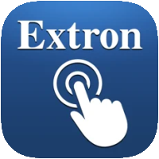

# IoBroker.extron

## Referenzen
Extron®, CrossPoint®, DTP®, NetPA®, XPA®, XTP® sind eingetragene Marken von RGB Systems, Incorporated. Siehe [www.extron.com](https://www.extron.com/article/termsprivacy)

Das Logo stammt aus der Extron Control App von Extron.

Dante® ist eine Marke von [Audinate](https://www.audinate.com/)

## Extron-Adapter für ioBroker
Extron SIS-Adapter

Steuergeräte von Extron.
Dieser Adapter dient zur Steuerung einiger Extron-Audio-/Videoprodukte über das **S**imple **I**nstruction **S**et-Protokoll.
Der Funktionsumfang der Geräte ist enorm. Nicht alle Funktionen werden mit diesem Adapter und der Interaktion mit iobroker unterstützt.

**Bitte beachten Sie:** Sobald der Gerätetyp in der Adapterkonfiguration ausgewählt wurde, kann er später nicht mehr geändert werden!

In einer iobroker-Installation können mehrere Instanzen dieses Adapters, sowohl vom gleichen als auch vom gleichen Typ, vorhanden sein. Für zukünftige Versionen müssen Sie für jede Instanz eine gültige Lizenz in der Adapterkonfiguration hinzufügen.
Wenn Sie eine nichtkommerzielle Organisation sind oder den Adapter privat nutzen, können Sie eine kostenlose Lizenz erhalten. Bitte kontaktieren Sie den Autor.

### Unterstützte Geräte
- 8x2 Präsentationsmatrix-Switcher (DTP2 CrossPoint 82)
- H.264 Streaming Media Player und Decoder (SMD 202)
- Streaming Media Encoder (SME 211)
- 6x4 ProDSP-Prozessor mit AEC und Dante (DMP 64 Plus C AT)
- 12x8 ProDSP-Prozessor mit Dante (DMP 128 Plus AT)
- 12x8 ProDSP-Prozessor mit AEC, VoIP und Dante (DMP 128 Plus C V AT)
- Dante Audio Matrix Prozessor mit AEC (XMP 240 C AT)

## Aufgaben
Der Gerätetyp wird zu Beginn des Gesprächs überprüft. Dies schlägt gelegentlich fehl. Es muss ein zuverlässigerer Mechanismus eingeführt werden.
- Eine detailliertere Auswahl der verwendeten Ein- und Ausgänge zur Reduzierung der Datenbankgröße an DSP-Geräten vornehmen
- weitere Befehle und deren Implementierung auf der Datenbankseite hinzufügen
- Verbesserung des Netzwerk-Wiederverbindungsmechanismus

## Changelog

<!--
    Placeholder for the next version (at the beginning of the line):
    ### **WORK IN PROGRESS**
-->

### **WORK IN PROGRESS**

- (Bannsaenger) updated dependencies and issues from repository checker

### 0.3.0 (2025-10-28)

- (Bannsaenger) updated dependencies and issues from repository checker
- (Bannsaenger) migrate to NPM Trusted Publishing
- (Bannsaenger) updated to adapter-dev and release script
- (Bannsaenger) introducing jsonConfig
- (mschlgl) add more DSP SIS commands
- (mschlgl) enhanced network reconnect functionality, added DANTE remote commands, additional devices
- (Bannsaenger) updated dependencies and issues from repository checker

### 0.2.15 (2024-06-12)

- (mschlgl) fixed typo in io-package.json

### 0.2.14 (2024-06-10)

- (mschlgl) changed function createDatabase to use setObj()

### 0.2.13 (2024-06-06)

- (mschlgl) corrected instance.comon.titleLang to be set at startup, updated role definitions, added audiofile transfer functionality for DMPxxx

### 0.2.12

- (mschlgl) added instance.comon.title / .titleLang to be set at startup

## License

Attribution-NonCommercial 4.0 International (CC BY-NC 4.0)

Copyright (c) 2021-2026 Bannsaenger, https://github.com/bannsaenger <bannsaenger@gmx.de>

This work is licensed under a Creative Commons Attribution-NonCommercial 4.0 International License
http://creativecommons.org/licenses/by-nc/4.0/

Short content:
This is a human-readable summary of (and not a substitute for) the license. Disclaimer.
You are free to:

Share — copy and redistribute the material in any medium or format
Adapt — remix, transform, and build upon the material

The licensor cannot revoke these freedoms as long as you follow the license terms.

Under the following terms:

Attribution — You must give appropriate credit, provide a link to the license, and indicate if changes were made. You may do so in any reasonable manner, but not in any way that suggests the licensor endorses you or your use.

NonCommercial — You may not use the material for commercial purposes.

No additional restrictions — You may not apply legal terms or technological measures that legally restrict others from doing anything the license permits.

The above copyright notice and this permission notice shall be included in
all copies or substantial portions of the Software.

THE SOFTWARE IS PROVIDED "AS IS", WITHOUT WARRANTY OF ANY KIND, EXPRESS OR
IMPLIED, INCLUDING BUT NOT LIMITED TO THE WARRANTIES OF MERCHANTABILITY,
FITNESS FOR A PARTICULAR PURPOSE AND NONINFRINGEMENT. IN NO EVENT SHALL THE
AUTHORS OR COPYRIGHT HOLDERS BE LIABLE FOR ANY CLAIM, DAMAGES OR OTHER
LIABILITY, WHETHER IN AN ACTION OF CONTRACT, TORT OR OTHERWISE, ARISING FROM,
OUT OF OR IN CONNECTION WITH THE SOFTWARE OR THE USE OR OTHER DEALINGS IN
THE SOFTWARE.