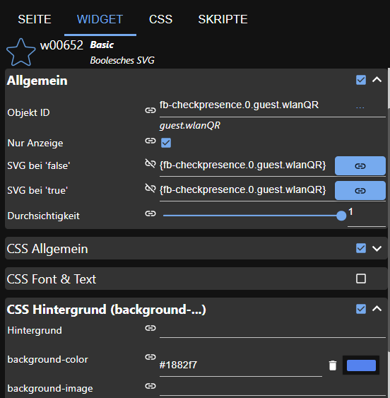

# IoBroker.fb-checkpresence
**Tests:** 

## Fb-checkpresence-Adapter für ioBroker
Der Adapter prüft die Anwesenheit von Familienmitgliedern über die Fritzbox.

Sie müssen den Namen des Familienmitglieds und die Mac-Adresse (oder IP-Adresse) des verwendeten Geräts eingeben.

Der Kommentar ist optional und Sie können das Familienmitglied aktivieren oder deaktivieren.

Der Datenpunkt basiert auf dem Mitgliedsnamen.

### Verwendeter Open-Source-Code
#### Npm Datumsformat v4.5.3
(c) 2007-2009 Steven Levithan <stevenlevithan.com> npm: https://www.npmjs.com/package/dateformat github: https://github.com/felixge/node-dateformat Lizenz: MIT

### Adaptervoraussetzungen
Für die korrekte Funktion muss ein History-Adapter installiert werden. Zur Auswahl stehen folgende Adapter:

* Geschichte
* SQL
* InfluxDB

## Gebrauchtes Gerät
Für diesen Adapter wird die AVM Fritzbox verwendet. Informationen zur Fritzbox finden Sie hier https://avm.de/produkte/fritzbox/.
Die Fritzbox-Dienste werden über das TR-064-Protokoll genutzt.

### Fritzbox Bedingungen
Die verwendete TR-064 Schnittstelle der Fritzbox ist hier beschrieben: https://avm.de/service/schnittstellen/.
Folgende TR-064 Dienste und Aktionen werden verwendet:

* Hosts:1 - X_AVM-DE_GetHostListPath (unterstützt seit 09.01.2017)
* Hosts:1 - X_AVM-DE_GetMeshListPath
* Hosts:1 - GetSpecificHostEntry
* Hosts:1 - X_AVM-DE_GetSpecificHostEntryByIP (unterstützt seit 18.05.2016)
* Geräteinfo:1 - GetSecurityPort
* Geräteinfo:1 - GetInfo
* WANPPPConnection:1 - GetInfo
* WANIPConnection:1 - GetInfo
* WLANConfiguration3 - SetEnable
* WLANConfiguration3 - GetInfo
* WLANConfiguration3 - GetSecurityKeys
* X_AVM-DE_HostFilter - DisallowWANAccessByIP
* X_AVM-DE_HostFilter - GetWANAccessByIP
* DeviceConfig:1 - Neustart
* LANConfigSecurity1 - X_AVM-DE_GetCurrentUser

Standardmäßig ist die Schnittstelle TR-064 nicht aktiviert. Dies lässt sich jedoch ganz einfach über die Weboberfläche der FritzBox ändern. Logge dich dazu in deine FritzBox ein und stelle sicher, dass die Expertenansicht aktiviert ist.
Anschließend findest du unter „Heimnetz » Heimnetzübersicht » Netzwerkeinstellungen“ den Punkt „Zugriff für Anwendungen erlauben“. Dort musst du die Checkbox aktivieren und anschließend die FritzBox einmal neu starten.

Hinweis: Nach dem Ändern der Optionen den Neustart der Fritzbox nicht vergessen!

## Konfigurationsdialog
### Allgemein
Die Konfigurationswerte werden validiert und nur korrekte Werte können gespeichert werden. Andernfalls ist die Schaltfläche „Speichern“ deaktiviert.

### Fritzbox IP-Adresse, Benutzer und Passwort
Die Konfiguration von IP-Adresse, Benutzer und Passwort ist notwendig, um die Gerätedaten von der Fritzbox zu erhalten.
Dazu muss in der Fritzbox ein Benutzer angelegt werden. Dies ist bei neueren Firmwareversionen (>= 7.25) der Fritzbox erforderlich. Informationen hierzu finden Sie hier: https://avm.de/fileadmin/user_upload/Global/Service/Schnittstellen/Empfehlungen%20zur%20Benutzerfu%CC%88hrung%20bei%20der%20Anmeldung%20an%20einer%20FRITZ%21Box_v1.1.pdf Das Passwort ist verschlüsselt und wird nicht im Klartext gespeichert. Benutzername und Passwort dürfen maximal 32 Zeichen lang sein. Weitere Informationen finden Sie unter: https://service.avm.de/help/de/FRITZ-Box-Fon-WLAN-7490/014/hilfe_zeichen_fuer_kennwoerter#:~:text=Namen%20f%C3%BCr%20Benutzer,Kennwortfeld%20darf%20nicht%20leer%20sein.
Hinweis: In einigen Fällen kann es sein, dass die Fritzbox den Benutzer gesperrt hat, wenn das Passwort nicht korrekt eingegeben wurde.
Oft erscheint eine Timeout-Meldung im Protokoll. Bitte überprüfen Sie dann, ob Sie den richtigen Benutzernamen und das richtige Passwort eingegeben haben. Anschließend müssen Sie die Fritzbox neu starten.

### SSL-Option
In manchen Fällen konnte der Adapter keine Verbindung zur Fritzbox herstellen. Es kann hilfreich sein, diese Option zu deaktivieren.
In diesem Fall versucht der Adapter, eine Verbindung ohne https herzustellen.

### Intervall
Sie haben separate Intervalle für Familienmitglieder und Fritzbox-Geräte.
Das Intervall für Fritzbox-Geräte kann von 10 s bis 3600 s konfiguriert werden. Normalerweise ist ein Wert zwischen 60 und 300 Sekunden ein optimales Intervall zum Lesen der Fritzbox-Daten. Für Familienmitglieder kann ein Wert von 10 s bis 600 s konfiguriert werden. Jeder neue Zyklus beginnt, wenn der vorherige Zyklus abgeschlossen ist.

### Filterzeit
Wenn die Filterzeit größer als 0s ist, wird der Status eines Familienmitglieds zweimal (nach der Filterzeit) überprüft, ob der Status auf false wechselt. Wenn der Status true ist, wird der Status sofort gesetzt.

### Verlaufsadapter
Über den History-Adapter werden einige Werte berechnet. Dabei kann gewählt werden, ob für diese Berechnungen der History-, der SQL- oder der InfluxDB-Adapter verwendet wird. Der History-Adapter muss vorab installiert werden und kann dann im Konfigurationsdialog ausgewählt werden.

Wenn die History-Konfiguration deaktiviert ist, können einige Werte nicht berechnet werden.

### Datumsformat
Die Optionen der Datumsformatmaske werden auf dieser Webseite beschrieben: https://www.npmjs.com/package/dateformat.
Die Formatmaske wird zum Formatieren der HTML- und JSON-Tabellenobjekte verwendet.

### Erstellung von FB-Geräten
Wenn diese Option aktiviert ist, werden die Objekte für jedes Gerät in der Fritzbox-Geräteliste erstellt.
Wenn diese Option deaktiviert ist, werden auch die Mesh-Informationen deaktiviert.

### Resynchronisierung von FB-Geräteobjekten
Wenn diese Option aktiviert ist, wird das FB-Geräteobjekt neu mit der Geräteliste der Fritzbox synchronisiert.

### Erstellung von Mesh-Informationen
Diese Option kann aktiviert werden, wenn die Erstellung von FB-Geräten erlaubt ist. Ist diese Option aktiviert, werden die Mesh-Objekte für jedes Gerät in der Fritzbox-Geräteliste erstellt.

### Gäste Information
Wenn diese Option aktiviert ist, werden die Status für Gäste erstellt.

### QR-Code-Generierung
Wenn diese Option aktiviert ist, wird der QR-Code vom Gast-WLAN generiert. Diesen QR-Code können Sie mit dem Widget &quot;Basic Boolesches SVG&quot; in Ihrem VIS anzeigen. Bitte verwenden Sie folgende Einstellungen:

### Einstellungen für Familienmitglieder
Für ein konfiguriertes Familienmitglied sollten Sie den Mitgliedsnamen, den Hostnamen, die Mac- und IP-Adresse sowie einen Kommentar eingeben und das Mitglied aktivieren oder deaktivieren. Eine Gruppe ist optional.
Wenn Sie die Gruppe leer lassen und das Kompatibilitätsflag auf „true“ setzen, verhält sich das Adapter wie bei einer älteren Version. Sie können den Anwesenheitsstatus des Familienmitglieds oder den Status verwenden, der direkt dem Namen des Familienmitglieds zugeordnet ist. In einer zukünftigen Version müssen Sie den Anwesenheitsstatus verwenden. Dieses Verhalten kann mit dem Kompatibilitäts-Kontrollkästchen ein- und ausgeschaltet werden: -> Kompatibilität = „true“: Verhalten wie bei einer älteren Version mit leerer Gruppe.
-> Kompatibilität = „true“ und Gruppe nicht leer: neues Verhalten. Alle Status unterhalb des Ordners „Familienmitglieder“.
-> Kompatibilität = „false“: neues Verhalten. Alle Status unterhalb des Ordners „Familienmitglieder“.

Für jedes Mitglied erstellt der Adapter einen Anwesenheitsstatus und prüft, ob das Mitglied anwesend oder abwesend ist. Der Status wurde geändert, wenn sich der Anwesenheitsstatus geändert hat.
Sie können die Filterung für ein Mitglied auch aktivieren. Wenn der Status wahr ist, ändert sich der Status sofort auf wahr. Wenn er falsch ist, wird der Wert nach der Filterzeit erneut geprüft.
Wenn der Status in beiden Fällen falsch ist, ändert sich der Status auf falsch. Andernfalls ändert er sich nicht.

Um die Geschwindigkeitsinformationen in den Objekten zu erhalten, müssen Sie die Option „FB-Geräte“ auswählen.

### Anwesenheit manuell auslösen
In JavaScript können Sie die Anwesenheit manuell auslösen. Wenn Sie die Nachricht an den Adapter senden, wird jede neue Nachricht 10 Sekunden lang blockiert. Sie erhalten ein negatives Ergebnis (false), wenn die Nachricht blockiert wird.
True, wenn die Nachricht vom Adapter empfangen wird.
` sendTo('fb-checkpresence.0', 'triggerPresence', {} , function (result) { log(result, 'info'); }); `

### Whitelist-Einstellungen
In die Whitelist können Sie alle bekannten Geräte eintragen. Alle unbekannten Geräte werden im Blacklist-Objekt gelistet.
Wenn Sie das Kontrollkästchen in der Überschrift der Tabelle aktivieren, werden alle Geräte ausgewählt.

## Merkmale
### AVM Supportcheck
Die Funktion prüft die Verfügbarkeit der verwendeten Fritzbox-Features. Die Verfügbarkeit wird als Info protokolliert. Bei Problemen schaue nach, ob alle Features auf true gesetzt sind. Außerdem werden die Zugriffsrechte des Benutzers geprüft und das Feature wird auf false gesetzt, wenn das Zugriffsrecht nicht stimmt.

### Gast-WLAN ein-/ausschalten
Unter dem Ordner „Guest“ kann man den Status WLAN auf „true“ oder „false“ setzen und dann das Gast-WLAN ein- bzw. ausschalten.

### QR-Code des Gast-WLAN
Der QR-Code des Gast-WLANs wird im Status wlanQR im Gastordner gespeichert. Der QR-Code kann in vis im Basic-Bool-SVG-Widget angezeigt werden.

### Internetzugang von Fritzbox-Geräten ein-/ausschalten
Unter dem Ordner FB-Geräte können Sie den Deaktiviert-Zustand auf True oder False setzen und schon wird der Internetzugriff dieses Gerätes in der Fritzbox gesperrt.

### Gäste abrufen, schwarze Liste
In dieser Funktion wird geprüft, ob ein Benutzer als Gast angemeldet ist. Außerdem wird geprüft, ob ein Gerät nicht in der Whitelist aufgeführt ist.
Diese Geräte werden zur Blacklist hinzugefügt.

### Aktiv werden
Für jedes Familienmitglied werden die Anwesenheit, das Kommen- und Gehendatum und zahlreiche weitere Informationen berechnet und im Mitgliedsobjekt gespeichert, sofern ein Verlaufsadapter ausgewählt ist.

### Hostnummer, aktive Geräte
Die Anzahl der Geräte und deren aktive Anzahl werden von der Fritzbox ermittelt.

## Objekte
### ObjektpräsenzAlle
Wenn alle Familienmitglieder anwesend sind, ist das Objekt wahr.

### Objektpräsenz
Wenn ein Familienmitglied anwesend ist, ist das Objekt wahr.

### Objektgeräte
Dies sind alle aufgelisteten Geräte in der Fritzbox

### Objekt activeDevices
Dies ist die Anzahl aller aktiven Geräte in der Fritzbox

### Objekt html, json
Bei diesen Objekten handelt es sich um Tabellen (JSON und HTML), die die Kommen- und Gehen-Informationen aller Familienmitglieder enthalten.

### Objektinfo
Hier werden Informationen zum letzten Update und dem Verbindungsstatus des Adapters aufgelistet.

### Objekt Gast
Hier werden Informationen über die Anzahl der aktiven Gäste und Tabellenobjekte mit den darin enthaltenen Geräteinformationen aufgelistet.

### Objekt-Blacklist
Hier werden Informationen über die Anzahl unbekannter Geräte und Tabellenobjekte mit den darin enthaltenen Informationen zu unbekannten Geräten aufgelistet.

### Objektmitglied.vorhanden
Hier erhalten Sie Informationen zur Anwesenheit eines Mitglieds am aktuellen Tag und wie lange sich das Mitglied seit der letzten Änderung im Status „true“ befindet.

### Objektmitglied.abwesend
Hier erhalten Sie Informationen zur Abwesenheit eines Mitglieds am aktuellen Tag und wie lange sich das Mitglied seit der letzten Änderung im Status false befand.

### Objekt member.comming, member.going
Hier finden Sie Informationen zur Ankunft bzw. Abreise des Familienmitglieds.

### Objekt member.history, member.historyHtml
Hier finden Sie Informationen zur Geschichte des aktuellen Tages.

## Changelog
### **WORK IN PROGRESS**
* (afuerhoff) new filter function implemented
* (afuerhoff) node >=18
* (afuerhoff) dependencies updated

### 1.2.4 (2024-02-09)
* (afuerhoff) test code deleted [#257](https://github.com/afuerhoff/ioBroker.fb-checkpresence/issues/257)
* (afuerhoff) dependencies updated

### 1.2.3 (2024-01-18)
* (afuerhoff) Readme updated
* (afuerhoff) function jsontables optimized
* (afuerhoff) non existent members set to false [#253](https://github.com/afuerhoff/ioBroker.fb-checkpresence/issues/253)
* (afuerhoff) optimization of log message [#240](https://github.com/afuerhoff/ioBroker.fb-checkpresence/issues/240)

### 1.2.2 (2023-07-28)
* (afuerhoff) bug fixed json tables [#215](https://github.com/afuerhoff/ioBroker.fb-checkpresence/issues/215)
* (afuerhoff) link feature optimized. See #206

### 1.2.1 (2023-07-14)
* (afuerhoff) bug fixed property link

### 1.2.0 (2023-07-13)
* (afuerhoff) dependencies updated
* (afuerhoff) mesh link added to family members [#206](https://github.com/afuerhoff/ioBroker.fb-checkpresence/issues/206)

## License
MIT License

Copyright (c) 2019-2024 Achim Fürhoff <achim.fuerhoff@outlook.de>

Permission is hereby granted, free of charge, to any person obtaining a copy
of this software and associated documentation files (the "Software"), to deal
in the Software without restriction, including without limitation the rights
to use, copy, modify, merge, publish, distribute, sublicense, and/or sell
copies of the Software, and to permit persons to whom the Software is
furnished to do so, subject to the following conditions:

The above copyright notice and this permission notice shall be included in all
copies or substantial portions of the Software.

THE SOFTWARE IS PROVIDED "AS IS", WITHOUT WARRANTY OF ANY KIND, EXPRESS OR
IMPLIED, INCLUDING BUT NOT LIMITED TO THE WARRANTIES OF MERCHANTABILITY,
FITNESS FOR A PARTICULAR PURPOSE AND NONINFRINGEMENT. IN NO EVENT SHALL THE
AUTHORS OR COPYRIGHT HOLDERS BE LIABLE FOR ANY CLAIM, DAMAGES OR OTHER
LIABILITY, WHETHER IN AN ACTION OF CONTRACT, TORT OR OTHERWISE, ARISING FROM,
OUT OF OR IN CONNECTION WITH THE SOFTWARE OR THE USE OR OTHER DEALINGS IN THE
SOFTWARE.