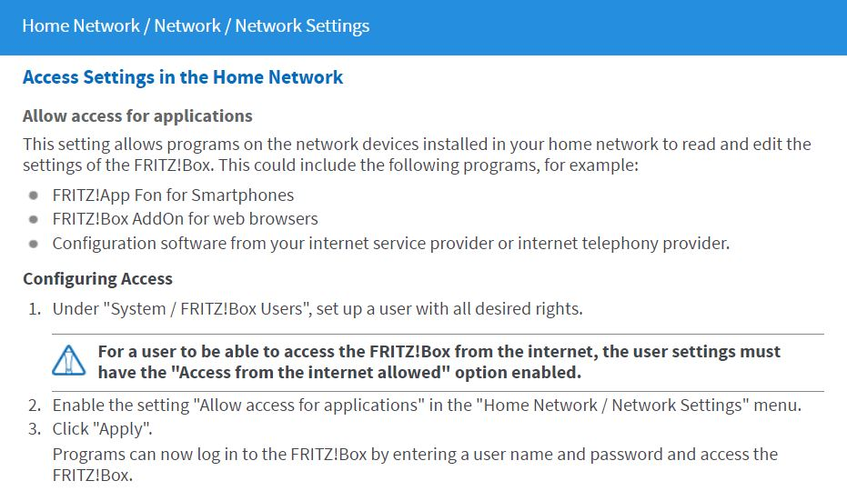

# IoBroker.fb-checkpresence
**Tests:** 

## Fb-checkpresence-Adapter für ioBroker
Der Adapter prüft die Anwesenheit von Familienmitgliedern über die Fritzbox.
Sie müssen den Namen des Familienmitglieds und die MAC-Adresse (oder IP-Adresse) des verwendeten Geräts eingeben.
Der Kommentar ist optional und Sie können das Familienmitglied aktivieren oder deaktivieren.
Der Datenpunkt basiert auf dem Mitgliedsnamen.

### Verwendeter Open-Source-Code
#### Npm dateformat v4.5.3
(c) 2007-2009 Steven Levithan <stevenlevithan.com> npm: https://www.npmjs.com/package/dateformat github: https://github.com/felixge/node-dateformat Lizenz: MIT

### Adaptervoraussetzungen
Für die korrekte Funktion ist die Installation eines History-Adapters erforderlich. Zur Auswahl stehen folgende Adapter:

* Geschichte
* SQL
* InfluxDB

## Gebrauchtes Gerät
Für diesen Adapter wird die AVM Fritzbox verwendet. Informationen zur Fritzbox finden Sie hier: https://avm.de/produkte/fritzbox/.
Die Fritzbox-Dienste werden über das TR-064-Protokoll genutzt.

### Fritzbox-Bedingungen
Die verwendete TR-064-Schnittstelle der Fritzbox ist hier beschrieben: https://avm.de/service/schnittstellen/.
Folgende TR-064-Dienste und -Aktionen werden verwendet:

* Hosts:1 - X_AVM-DE_GetHostListPath (unterstützt seit 09.01.2017)
* Hosts:1 - X_AVM-DE_GetMeshListPath
* Hosts:1 - GetSpecificHostEntry
* Hosts:1 - X_AVM-DE_GetSpecificHostEntryByIP (unterstützt seit 18.05.2016)
* Geräteinfo:1 - GetSecurityPort
* Geräteinfo:1 - Informationen abrufen
* WANPPPConnection:1 - GetInfo
* WANIPConnection:1 - GetInfo
* WLANConfiguration3 - SetEnable
* WLANConfiguration3 - GetInfo
* WLANConfiguration3 - GetSecurityKeys
* X_AVM-DE_HostFilter - DisallowWANAccessByIP
* X_AVM-DE_HostFilter - GetWANAccessByIP
* DeviceConfig:1 - Neustart
* LANConfigSecurity1 - X_AVM-DE_GetCurrentUser

Standardmäßig ist die TR-064-Schnittstelle nicht aktiviert. Dies lässt sich jedoch ganz einfach über die Weboberfläche der FritzBox ändern. Loggen Sie sich dazu in Ihre FritzBox ein und stellen Sie sicher, dass die Expertenansicht aktiviert ist. Anschließend finden Sie unter „Heimnetz » Heimnetzübersicht » Netzwerkeinstellungen“ den Punkt „Zugriff für Anwendungen erlauben“. Aktivieren Sie dort das Kontrollkästchen und starten Sie die FritzBox anschließend einmal neu.

Hinweis: Nach dem Ändern der Optionen den Neustart der Fritzbox nicht vergessen!

## Konfigurationsdialog
### Allgemein
Die Konfigurationswerte werden validiert und nur korrekte Werte können gespeichert werden. Andernfalls ist die Schaltfläche „Speichern“ deaktiviert.

### Fritzbox IP-Adresse, Benutzer und Passwort
Die Konfiguration von IP-Adresse, Benutzer und Passwort ist notwendig, um die Gerätedaten von der Fritzbox abzurufen.
Dazu muss in der Fritzbox ein Benutzer angelegt werden. Dies ist ab einer neueren Firmware-Version (>= 7.25) der Fritzbox erforderlich. Weitere Informationen finden Sie hier: https://avm.de/fileadmin/user_upload/Global/Service/Schnittstellen/Empfehlungen%20zur%20Benutzerfu%CC%88hrung%20bei%20der%20Anmeldung%20an%20einer%20FRITZ%21Box_v1.1.pdf Das Passwort ist verschlüsselt und wird nicht im Klartext gespeichert. Benutzername und Passwort dürfen maximal 32 Zeichen lang sein. Weitere Informationen finden Sie unter: https://service.avm.de/help/de/FRITZ-Box-Fon-WLAN-7490/014/hilfe_zeichen_fuer_kennwoerter#:~:text=Namen%20f%C3%BCr%20Benutzer,Kennwortfeld%20darf%20nicht%20leer%20sein.
Hinweis: In manchen Fällen kann die Fritzbox den Benutzer gesperrt haben, wenn das Passwort nicht korrekt eingegeben wurde.
Oft erscheint eine Timeout-Meldung im Protokoll. Bitte überprüfen Sie anschließend, ob Sie den korrekten Benutzernamen und das korrekte Passwort eingegeben haben. Starten Sie die Fritzbox anschließend neu.

### SSL-Option
In manchen Fällen konnte der Adapter keine Verbindung zur Fritzbox herstellen. Es kann hilfreich sein, diese Option zu deaktivieren.
In diesem Fall versucht der Adapter, eine Verbindung ohne HTTPS herzustellen.

### Intervall
Für Familienmitglieder und Fritzbox-Geräte stehen separate Intervalle zur Verfügung.
Das Intervall für Fritzbox-Geräte kann zwischen 10 und 3600 Sekunden eingestellt werden. Ein optimaler Wert zum Auslesen der Fritzbox-Daten ist normalerweise ein Wert zwischen 60 und 300 Sekunden. Für Familienmitglieder können Intervalle zwischen 10 und 600 Sekunden eingestellt werden. Jeder neue Zyklus startet, sobald der vorherige abgeschlossen ist.

### Filterzeit
Wenn die Filterzeit größer als 0s ist, wird der Status eines Familienmitglieds zweimal (nach der Filterzeit) überprüft, ob der Status auf „false“ wechselt. Wenn der Status „true“ ist, wird der Status sofort gesetzt.

### Verlaufsadapter
Über den Verlaufsadapter werden einige Werte berechnet. Sie können wählen, ob der Verlaufs-, SQL- oder InfluxDB-Adapter für diese Berechnungen verwendet werden soll. Der Verlaufsadapter muss vorab installiert werden und kann anschließend im Konfigurationsdialog ausgewählt werden.

Ist die Verlaufskonfiguration deaktiviert, können einige Werte nicht berechnet werden.

### Datumsformat
Die Optionen der Datumsformatmaske werden auf dieser Webseite beschrieben: https://www.npmjs.com/package/dateformat.
Die Formatmaske wird zum Formatieren der HTML- und JSON-Tabellenobjekte verwendet.

### Erstellung von FB-Geräten
Ist diese Option aktiviert, werden die Objekte für jedes Gerät in der Fritzbox-Geräteliste erstellt.
Ist diese Option deaktiviert, werden auch die Mesh-Informationen deaktiviert.

### Resynchronisierung von FB-Geräteobjekten
Wenn diese Option aktiviert ist, wird das FB-Geräteobjekt erneut mit der Geräteliste der Fritzbox synchronisiert.

### Erstellung von Mesh-Informationen
Diese Option kann aktiviert werden, wenn die Erstellung von FB-Geräten erlaubt ist. Ist diese Option aktiviert, werden die Mesh-Objekte für jedes Gerät in der Fritzbox-Geräteliste erstellt.

### Gästeinformationen
Wenn diese Option aktiviert ist, werden die Zustände für Gäste erstellt.

### QR-Code-Generierung
Wenn diese Option aktiviert ist, wird der QR-Code vom Gäste-WLAN generiert. Sie können diesen QR-Code mit dem Widget &quot;Basic Boolesches SVG&quot; in Ihrem VIS anzeigen. Bitte verwenden Sie folgende Einstellungen:

### Einstellungen für Familienmitglieder
Für ein konfiguriertes Familienmitglied geben Sie den Namen, den Hostnamen, die MAC- und IP-Adresse sowie einen Kommentar ein. Anschließend können Sie das Mitglied aktivieren oder deaktivieren. Die Angabe einer Gruppe ist optional.

Wenn Sie die Gruppe leer lassen und das Kompatibilitätsflag auf „true“ setzen, verhält sich der Adapter wie eine ältere Version. Sie können den Anwesenheitsstatus des Familienmitglieds oder den direkt dem Namen des Familienmitglieds zugeordneten Status verwenden. In zukünftigen Versionen müssen Sie den Anwesenheitsstatus verwenden. Dieses Verhalten kann über das Kontrollkästchen „Kompatibilität“ ein- und ausgeschaltet werden: -> Kompatibilität = „true“: Verhalten wie eine ältere Version mit leerer Gruppe.
-> Kompatibilität = „true“ und nicht leere Gruppe: neues Verhalten. Alle Status befinden sich im Ordner „Familienmitglieder“.
-> Kompatibilität = „false“: neues Verhalten. Alle Status befinden sich im Ordner „Familienmitglieder“.

Der Adapter erstellt für jedes Mitglied einen Anwesenheitsstatus und prüft, ob das Mitglied anwesend oder abwesend ist. Der Status wurde geändert, wenn sich der Anwesenheitsstatus geändert hat.
Sie können die Filterung für ein Mitglied aktivieren. Ist der Status „true“, ändert er sich sofort. Ist er „false“, wird der Wert nach der Filterzeit erneut geprüft.
Ist der Status in beiden Fällen „false“, ändert er sich ebenfalls auf „false“. Andernfalls ändert er sich nicht.

Um die Geschwindigkeitsinformationen in den Objekten zu erhalten, müssen Sie die Option „fb-devices“ auswählen.

### Anwesenheit manuell auslösen
In JavaScript können Sie die Anwesenheit manuell auslösen. Wenn Sie die Nachricht an den Adapter senden, wird jede neue Nachricht 10 Sekunden lang blockiert. Sie erhalten ein negatives Ergebnis (false), wenn die Nachricht blockiert wird.
True, wenn die Nachricht vom Adapter empfangen wird.
` sendTo('fb-checkpresence.0', 'triggerPresence', {} , function (result) { log(result, 'info'); }); `

### Whitelist-Einstellungen
In die Whitelist können Sie alle bekannten Geräte eintragen. Unbekannte Geräte werden in der Blacklist aufgeführt.
Wenn Sie das Kontrollkästchen in der Tabellenüberschrift aktivieren, werden alle Geräte ausgewählt.

Per Javascript können Sie einen Eintrag an die Whitelist senden.
Die gesendeten Daten (Hostname, MAC-Adresse) werden mit der Geräteliste der Fritzbox verglichen. Ist der Eintrag vorhanden, wird geprüft, ob er bereits in der Whitelist gespeichert ist. Ist dies nicht der Fall, wird er in der Whitelist-Konfigurationstabelle gespeichert.

sendTo('fb-checkpresence.0', 'addDeviceToWhitelist', { Hostname: 'Gerätename', Mac: '00:00:00:00:00:00' } , Funktion (Ergebnis) { log(Ergebnis, 'Info'); });

## Merkmale
### AVM-Support-Check
Die Funktion prüft die Verfügbarkeit der genutzten Fritzbox-Funktionen. Die Verfügbarkeit wird als Info protokolliert. Bei Problemen prüfen Sie, ob alle Funktionen auf „true“ gesetzt sind. Außerdem werden die Zugriffsrechte des Benutzers geprüft und die Funktion bei fehlerhaften Zugriffsrechten auf „false“ gesetzt.

### Gast-WLAN ein-/ausschalten
Unter dem Ordner guest kann man den state wlan auf true oder false setzen und dann das Gast-WLAN ein- bzw. ausschalten.

### QR-Code des Gäste-WLAN
Der QR-Code des Gast-WLANs wird im Status wlanQR im Gastordner gespeichert. Der QR-Code kann im Basic-Bool-SVG-Widget angezeigt werden.

### Internetzugang von Fritzbox-Geräten ein-/ausschalten
Unter dem Ordner FB-Geräte können Sie den deaktivierten Status auf „true“ oder „false“ setzen und der Internetzugang dieses Geräts in der Fritzbox wird blockiert.

### Gäste holen, schwarze Liste
In dieser Funktion wird geprüft, ob ein Benutzer als Gast angemeldet ist. Außerdem wird geprüft, ob ein Gerät nicht auf der Whitelist steht. Diese Geräte werden der Blacklist hinzugefügt.

### Werde aktiv
Für jedes Familienmitglied werden die Anwesenheit, die Kommen- und Gehendaten und verschiedene andere Informationen berechnet und im Mitgliedsobjekt gespeichert, wenn ein Verlaufsadapter ausgewählt ist.

### Hostnummer, aktive Geräte
Die Anzahl der Geräte und deren Aktivität werden von der Fritzbox ermittelt.

## Objekte
### ObjektpräsenzAlle
Wenn alle Familienmitglieder anwesend sind, ist das Objekt wahr.

### Objektpräsenz
Wenn ein Familienmitglied anwesend ist, ist das Objekt wahr.

### Objektgeräte
Dies sind alle aufgelisteten Geräte in der Fritzbox

### Objekt activeDevices
Dies ist die Anzahl aller aktiven Geräte in der Fritzbox

### Objekt html, json
Bei diesen Objekten handelt es sich um Tabellen (JSON und HTML), die die Kommen- und Gehen-Informationen aller Familienmitglieder enthalten.

### Objektinfo
Hier werden Informationen zum letzten Update und dem Verbindungsstatus des Adapters aufgelistet.

### Objekt Gast
Hier sind Informationen über die Anzahl der aktiven Gäste und Tabellenobjekte mit den darin enthaltenen Geräteinformationen aufgelistet.

### Objekt-Blacklist
Hier sind Informationen über die Anzahl der unbekannten Geräte und Tabellenobjekte mit den darin enthaltenen Informationen zu unbekannten Geräten aufgeführt.

### Objektmitglied.vorhanden
Hier finden Sie Informationen zur Anwesenheit eines Mitglieds am aktuellen Tag und wie lange das Mitglied seit der letzten Änderung den Status „true“ innehatte.

### Objektmitglied.abwesend
Hier finden Sie Informationen zur Abwesenheit eines Mitglieds am aktuellen Tag und wie lange sich das Mitglied seit der letzten Änderung im Status „false“ befand.

### Objekt Mitglied.kommen, Mitglied.gehen
Hier finden Sie Informationen zur Ankunft bzw. Abreise des Familienmitglieds.

### Objekt member.history, member.historyHtml
Hier finden Sie Informationen zur Geschichte des aktuellen Tages.

## Changelog
### 1.4.0 (2025-05-28)
* (afuerhoff) dependencies updated
* (afuerhoff) error handling optimized
* (afuerhoff) enhancement  [#336](https://github.com/afuerhoff/ioBroker.fb-checkpresence/issues/336)
* (afuerhoff) issue [#337](https://github.com/afuerhoff/ioBroker.fb-checkpresence/issues/337)
* (afuerhoff) issue [#335](https://github.com/afuerhoff/ioBroker.fb-checkpresence/issues/335)

### 1.3.1 (2025-03-02)
* (afuerhoff) dependencies updated
* (afuerhoff) bug fixed [#333](https://github.com/afuerhoff/ioBroker.fb-checkpresence/issues/333)
* (afuerhoff) bug fixed [#305](https://github.com/afuerhoff/ioBroker.fb-checkpresence/issues/305)

### 1.3.0 (2025-02-14)
* (afuerhoff) dependencies updated
* (afuerhoff) eslint setup changed
* (afuerhoff) ipv6 ip-address and prefix added

### 1.2.8 (2024-11-20)
* (afuerhoff) bugfix configuration
* (afuerhoff) dependencies updated

### 1.2.7 (2024-11-18)
* (afuerhoff) bugfix [#319](https://github.com/afuerhoff/ioBroker.fb-checkpresence/issues/319)

## License
MIT License

Copyright (c) 2019-2025 Achim Fürhoff <achim.fuerhoff@outlook.de>

Permission is hereby granted, free of charge, to any person obtaining a copy
of this software and associated documentation files (the "Software"), to deal
in the Software without restriction, including without limitation the rights
to use, copy, modify, merge, publish, distribute, sublicense, and/or sell
copies of the Software, and to permit persons to whom the Software is
furnished to do so, subject to the following conditions:

The above copyright notice and this permission notice shall be included in all
copies or substantial portions of the Software.

THE SOFTWARE IS PROVIDED "AS IS", WITHOUT WARRANTY OF ANY KIND, EXPRESS OR
IMPLIED, INCLUDING BUT NOT LIMITED TO THE WARRANTIES OF MERCHANTABILITY,
FITNESS FOR A PARTICULAR PURPOSE AND NONINFRINGEMENT. IN NO EVENT SHALL THE
AUTHORS OR COPYRIGHT HOLDERS BE LIABLE FOR ANY CLAIM, DAMAGES OR OTHER
LIABILITY, WHETHER IN AN ACTION OF CONTRACT, TORT OR OTHERWISE, ARISING FROM,
OUT OF OR IN CONNECTION WITH THE SOFTWARE OR THE USE OR OTHER DEALINGS IN THE
SOFTWARE.