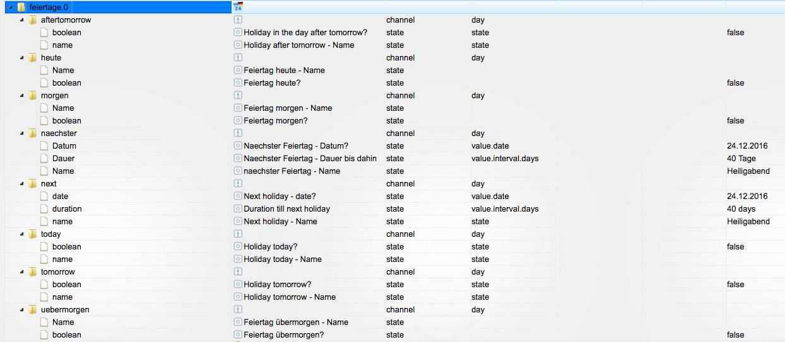
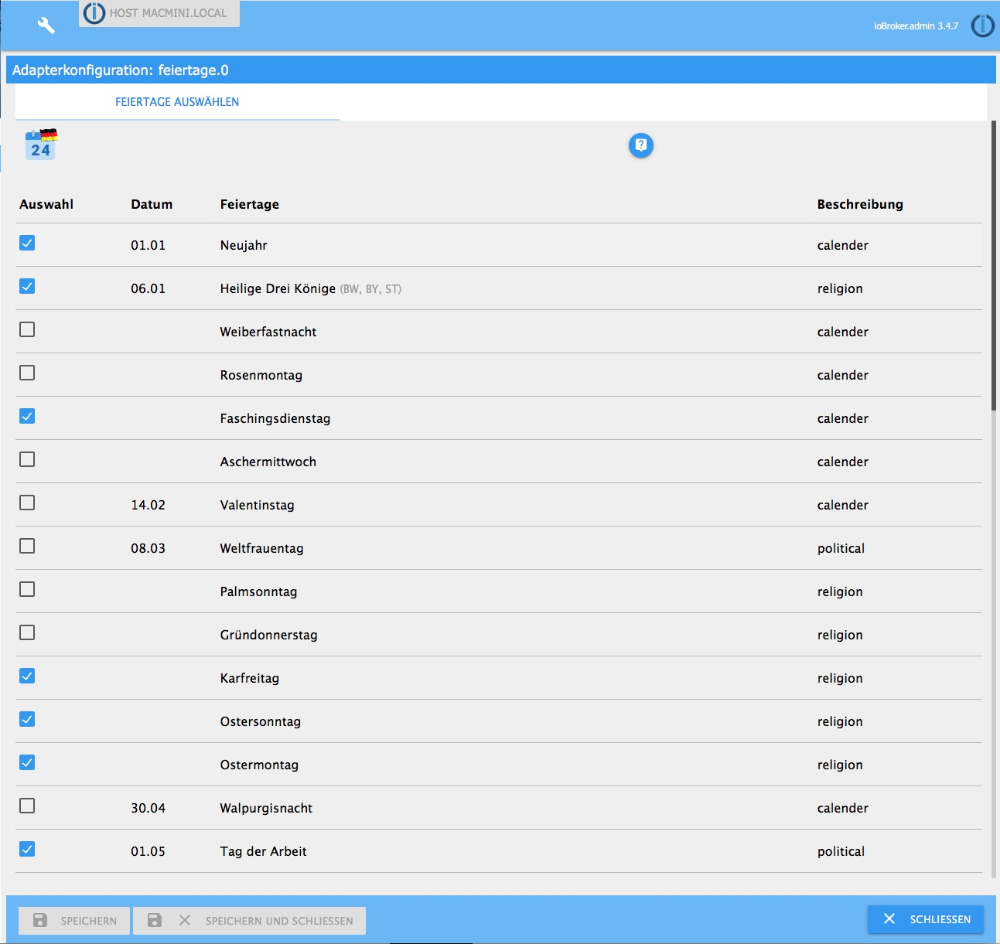

# ioBroker.feiertage

## Beschreibung
Dieser Adapter liefert das Datum, die Dauer bis zu diesem Datum in Tagen und den Namen des nächsten deutschen Feiertages und gibt Auskunft, ob heute, morgen oder übermorgen ein Feiertag ist.

Brückentage, die jährlich fest am Freitag nach einem Feiertag stattfinden sind auswählbar.

##  Datenpunkte

## Einstellungen
Feiertage, die bei der Befüllung der Datenpunkte berücksichtigt werden sollen, können ausgewählt werden.

## Aktivierung
Der Adapter startet jeden Tag um Mitternacht. Ein häufigeres Starten ist nicht erforderlich.

## Sonstiges
Es können natürlich weitere Instanzen des Adapters mit abweichenden Feiertagsauswahlen angelegt werden. So kann man z.B. die unterschiedlichen Anforderungen bei Feiertagsarbeitern abdecken. Eine Beispielanwendung ist der [Shuttercontrol Adapter](https://github.com/simatec/ioBroker.shuttercontrol/blob/master/docs/de/shuttercontrol.md#extra-einstellungen)

## Changelog
<!--
    Placeholder for the next version (at the beginning of the line):
    ### **WORK IN PROGRESS**
-->

### **WORK IN PROGRESS**
- (copilot) Adapter requires admin >= 7.7.22 now

### 1.3.0 (2026-02-16)
- (mcm1957) Adapter requires node.js >= 20 now
- (copilot) Adapter requires js-controller >= 6.0.11 now
- (copilot) Adapter requires admin >= 7.6.17 now
- (mcm1957) Dependencies have been updated

### 1.2.1 (2025-01-04)
* (Diginix) 2.1. has been incorrectly considered to be an holiday. This has been fixed. [#289, #132]
* (mcm1957) Dependencies have been updated

### 1.2.0 (2024-04-05)
* (mcm1957) Adapter requires node.js 18 and js-controller >= 5 now
* (mcm1957) Dependencies have been updated

### 1.1.4 (2023-09-07)
* (Quarkmax) Fixed description for Saxony from SA to SN

### 1.1.3 (2023-08-13)
* (mcm1957) changed: missing translations have been added
* (mcm1957) changed: Swiss national holiday has been corrected (# 164)
* (mcm1957) changed: Adapter required node 16 now
* (mcm1957) changed: Testing has been changed to support node 16, 18 and 20
* (mcm1957) changed: Dependencies have been updated
* (klein0r) Dependencies updated

## License

Copyright (c) 2016-2026 iobroker-community-adapters <iobroker-community-adapters@gmx.de>

The MIT License (MIT)

Permission is hereby granted, free of charge, to any person obtaining a copy
of this software and associated documentation files (the "Software"), to deal
in the Software without restriction, including without limitation the rights
to use, copy, modify, merge, publish, distribute, sublicense, and/or sell
copies of the Software, and to permit persons to whom the Software is
furnished to do so, subject to the following conditions:

The above copyright notice and this permission notice shall be included in all
copies or substantial portions of the Software.

THE SOFTWARE IS PROVIDED "AS IS", WITHOUT WARRANTY OF ANY KIND, EXPRESS OR
IMPLIED, INCLUDING BUT NOT LIMITED TO THE WARRANTIES OF MERCHANTABILITY,
FITNESS FOR A PARTICULAR PURPOSE AND NONINFRINGEMENT. IN NO EVENT SHALL THE
AUTHORS OR COPYRIGHT HOLDERS BE LIABLE FOR ANY CLAIM, DAMAGES OR OTHER
LIABILITY, WHETHER IN AN ACTION OF CONTRACT, TORT OR OTHERWISE, ARISING FROM,
OUT OF OR IN CONNECTION WITH THE SOFTWARE OR THE USE OR OTHER DEALINGS IN THE
SOFTWARE.

---
*Logo is crafted by CHALLENGER*

*Thanks to paul53 for the inspiration and thanks to jens-maus for his support!*